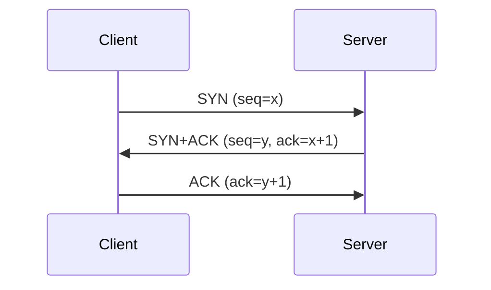
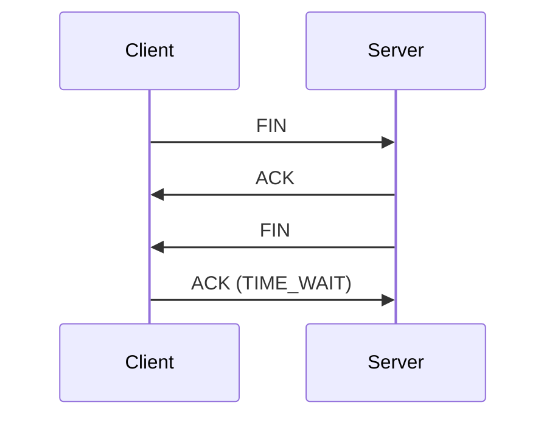

# TCP 3-way Handshake와 4-way Handshake

## 1. 개요

### 가. 정의
> **TCP**는 연결지향·신뢰성 전송 프로토콜로, 연결 **수립은 3-way**, 연결 **해제는 4-way** 핸드셰이크를 사용해 양방향 통신을 신뢰성 있게 관리한다.

### 나. 목적
- 연결 전 **양방향 준비·시퀀스 동기화**, 신뢰성(순서·재전송) 기반 마련

## 2. 연결 수립 — 3-way Handshake

| 단계 | 내용 | 상태 |
|---|---|---|
| **1. SYN** | 클라이언트 연결 요청(초기 시퀀스 x) | SYN_SENT |
| **2. SYN+ACK** | 서버 수락 + 자신의 시퀀스(y) | SYN_RECEIVED |
| **3. ACK** | 클라이언트 확인 → **연결 성립** | ESTABLISHED |

## 3. 연결 해제 — 4-way Handshake

| 단계 | 내용 |
|---|---|
| **1. FIN** | 종료 요청(능동 종료 측) |
| **2. ACK** | 수신 확인(수신 측, 잔여 데이터 전송 가능) |
| **3. FIN** | 수신 측도 종료 요청 |
| **4. ACK** | 확인 후 **TIME_WAIT** → 종료 |

- 3-way가 아닌 4-way인 이유: 수신 측이 **남은 데이터 전송**을 위해 ACK와 FIN을 분리

## 4. 관련 개념·보안

| 개념 | 설명 |
|---|---|
| **TIME_WAIT** | 지연 패킷 처리·포트 재사용 방지 대기(2MSL) |
| **SYN Flooding** | 3-way 취약점 악용 DoS → **SYN 쿠키**로 대응 |
| **시퀀스 번호** | 순서 보장·재전송 기준 |

## 5. 시사점
- TCP의 신뢰성은 핸드셰이크·흐름/혼잡 제어에 기반
- 지연 민감 서비스는 QUIC(UDP 기반, 0-RTT)로 핸드셰이크 비용 절감

---

> **한 줄 요약**: TCP는 *SYN→SYN+ACK→ACK의 3-way로 연결을 수립* 하고 *FIN→ACK→FIN→ACK의 4-way로 연결을 해제* 하는 신뢰성 프로토콜로, TIME_WAIT·SYN 쿠키 등으로 안정성과 보안을 보완한다.
