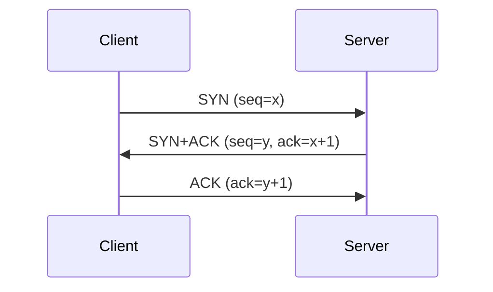
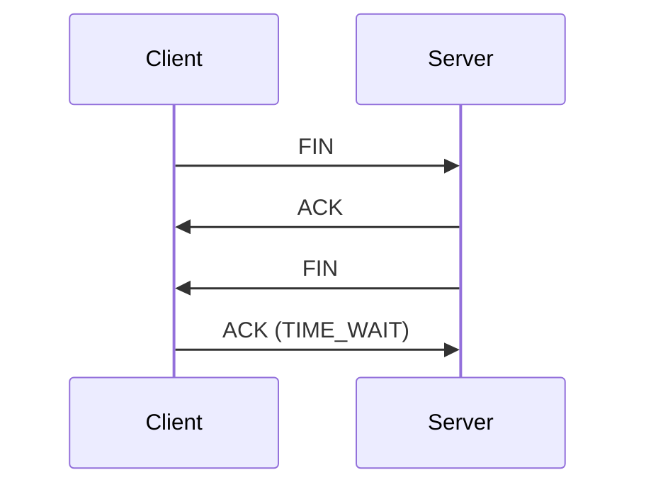

# TCP 3-way Handshake와 4-way Handshake

## 1. 개요
> **TCP**는 연결지향·신뢰성 전송 프로토콜로, 연결 **수립은 3-way**, 연결 **해제는 4-way** 핸드셰이크를 사용한다.

## 2. 연결 수립 — 3-way Handshake

| 단계 | 내용 |
|---|---|
| **1. SYN** | 클라이언트가 연결 요청(초기 시퀀스 x) |
| **2. SYN+ACK** | 서버가 수락+자신의 시퀀스(y) 전송 |
| **3. ACK** | 클라이언트 확인 → **연결 성립(ESTABLISHED)** |

## 3. 연결 해제 — 4-way Handshake

| 단계 | 내용 |
|---|---|
| **1. FIN** | 종료 요청(능동 종료 측) |
| **2. ACK** | 수신 확인(수신 측, 잔여 전송 가능) |
| **3. FIN** | 수신 측도 종료 요청 |
| **4. ACK** | 확인 후 **TIME_WAIT** → 종료 |

## 4. 관련 개념
- **TIME_WAIT**: 지연 패킷 처리·재사용 방지 대기
- **SYN Flooding**: 3-way 취약점 이용 DoS → SYN 쿠키로 대응

---

> **한 줄 요약**: TCP는 *SYN→SYN+ACK→ACK의 3-way로 연결을 수립* 하고, *FIN→ACK→FIN→ACK의 4-way로 연결을 해제* 하는 신뢰성 프로토콜이다.
