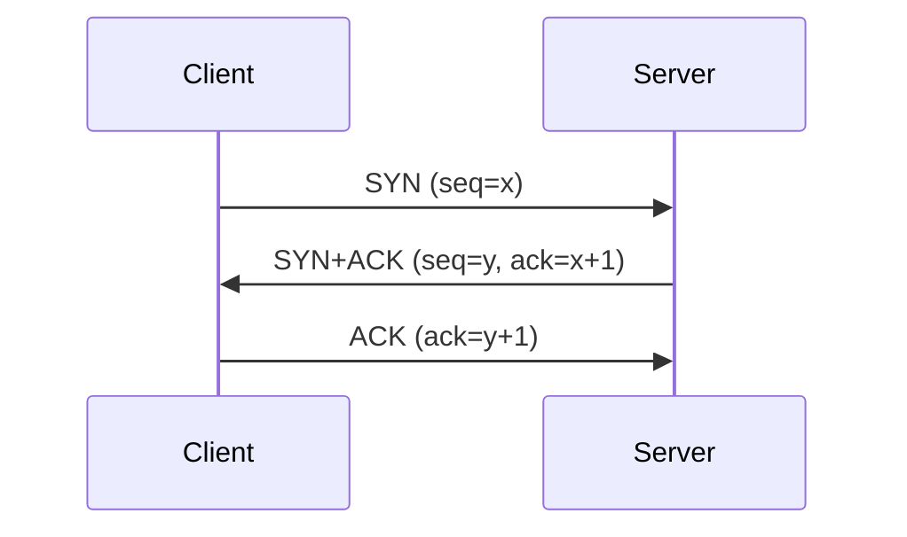
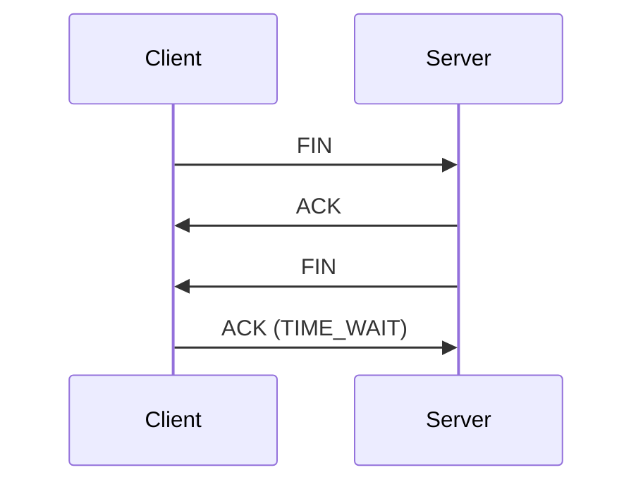

# TCP 3-way Handshake와 4-way Handshake

## 1. 개요

### 가. 정의
> **TCP**는 연결지향·신뢰성 전송 프로토콜로, 연결 **수립은 3-way**, 연결 **해제는 4-way** 핸드셰이크를 사용해 양방향 통신을 신뢰성 있게 관리한다.

TCP가 핸드셰이크를 두는 근본 이유는, IP가 순서·도착을 보장하지 않는 비신뢰 네트워크 위에서 **신뢰성 있는 양방향 스트림**을 만들어야 하기 때문이다. 데이터를 보내기 전에 양쪽이 "나 준비됐고, 어느 번호부터 세겠다"를 서로 확인해야, 이후 순서 재조립·중복 제거·재전송이 가능해진다. 즉 핸드셰이크는 통신의 인사가 아니라 **신뢰성의 초기 계약**이다.

### 나. 목적
연결 수립 과정의 목표는 두 가지다. 첫째, 양방향 각각의 송수신 준비 상태를 확인한다. 클라이언트→서버 방향만이 아니라 서버→클라이언트 방향도 열려 있어야 하므로 양쪽의 SYN이 모두 필요하다. 둘째, 각 방향의 **초기 시퀀스 번호(ISN)를 교환·동기화**한다. 시퀀스 번호는 이후 모든 바이트의 순서와 재전송 기준이 되며, 예측 불가능한 값으로 시작해 오래된 연결의 패킷이 섞이거나 위조되는 것을 막는다.

## 2. 연결 수립 — 3-way Handshake

수립이 왜 **정확히 3단계**인지가 핵심이다. 각 방향을 열려면 "SYN(내 시작 번호 알림)"과 그에 대한 "ACK(확인)"가 필요하니 원래는 4개의 메시지가 필요하다. 그런데 서버가 클라이언트의 SYN을 확인하는 ACK와 서버 자신의 SYN을 **하나의 패킷(SYN+ACK)으로 합칠 수 있어** 3단계로 줄어든다. ① 클라이언트가 SYN으로 자신의 초기 시퀀스 x를 알리고, ② 서버가 x를 확인(ack=x+1)하면서 자신의 시퀀스 y를 함께 보내며, ③ 클라이언트가 y를 확인(ack=y+1)하면 양방향 시퀀스가 모두 합의되어 연결이 성립(ESTABLISHED)한다. 2단계로는 서버 방향의 확인이 없어 부족하고, 4단계는 불필요한 것이다.

| 단계 | 내용 | 상태 |
|---|---|---|
| 1. SYN | 클라이언트 연결 요청(초기 시퀀스 x) | SYN_SENT |
| 2. SYN+ACK | 서버 수락 + 자신의 시퀀스(y), x 확인 | SYN_RECEIVED |
| 3. ACK | 클라이언트가 y 확인 → 연결 성립 | ESTABLISHED |

## 3. 연결 해제 — 4-way Handshake

해제가 수립보다 한 단계 많은 4-way인 이유는 TCP 연결이 **방향별로 독립적인 두 개의 스트림**이기 때문이다. 한쪽이 "나는 보낼 게 끝났다(FIN)"고 해도 상대는 아직 보낼 데이터가 남아 있을 수 있다. 그래서 상대는 우선 FIN을 확인(ACK)만 하고 **자신의 남은 데이터를 마저 전송한 뒤**, 다 끝나면 그때 자신의 FIN을 따로 보낸다(이 상태를 절반만 닫힌 CLOSE_WAIT/half-close라 한다). 수립 때 SYN+ACK로 합쳐졌던 확인과 종료 신호가, 해제 때는 "남은 데이터 전송"이라는 시간차 때문에 ACK와 FIN으로 **분리**되므로 단계가 하나 늘어난다. 마지막 ACK를 보낸 능동 종료 측은 곧바로 닫지 않고 TIME_WAIT 상태로 잠시 대기한다.

| 단계 | 내용 |
|---|---|
| 1. FIN | 능동 종료 측이 종료 요청 |
| 2. ACK | 수신 측이 확인(잔여 데이터 전송 가능, half-close) |
| 3. FIN | 수신 측도 전송 완료 후 종료 요청 |
| 4. ACK | 능동 종료 측 확인 → TIME_WAIT → 종료 |

## 4. 관련 개념 및 보안

핸드셰이크는 편리한 만큼 취약점도 만든다. 종료 후 **TIME_WAIT**는 낭비처럼 보이지만, 네트워크에 지연된 옛 패킷이 새로 열린 같은 포트의 연결로 잘못 섞여 들어가는 것을 막고 마지막 ACK 유실 시 상대의 재전송을 받아주기 위한 것으로, 통상 2MSL 동안 유지된다. **SYN Flooding**은 공격자가 SYN만 잔뜩 보내고 마지막 ACK를 보내지 않아, 서버의 절반 열린 연결 큐(backlog)를 고갈시키는 DoS다. 이에 대응하는 **SYN 쿠키**는 서버가 연결 상태를 큐에 저장하지 않고 시퀀스 번호 안에 암호학적으로 인코딩해 두었다가, 진짜 ACK가 오면 그 값으로 상태를 복원하는 기법이다.

| 개념 | 설명 |
|---|---|
| TIME_WAIT | 지연 패킷 혼입 방지·마지막 ACK 재전송 대비(2MSL) |
| SYN Flooding | 미완성 연결로 backlog 고갈시키는 DoS |
| SYN 쿠키 | 상태를 시퀀스 번호에 인코딩해 큐 없이 방어 |
| 시퀀스 번호(ISN) | 순서 보장·재전송 기준, 예측불가로 위조 방지 |

## 5. 고려사항 및 시사점
- **신뢰성의 대가는 지연**: 3-way는 데이터 전송 전에 최소 1 RTT를 소비한다. 짧은 요청이 많은 웹에서는 이 초기 비용이 체감 성능을 좌우한다.
- **QUIC으로의 진화**: HTTP/3의 기반인 QUIC은 UDP 위에서 전송 연결과 TLS 협상을 합치고 0-RTT를 지원해, 핸드셰이크 지연을 크게 줄인다. TCP의 신뢰성 개념을 계승하되 수립 비용을 개선한 흐름이다.
- **운영 관점**: 대규모 서버에서 TIME_WAIT 소켓이 포트를 점유해 고갈될 수 있어, 연결 재사용(keep-alive)·커널 파라미터 튜닝으로 관리해야 한다.

---

> **한 줄 요약**: TCP는 *SYN→SYN+ACK→ACK의 3-way로 시퀀스를 동기화해 연결을 수립* 하고, 방향별 half-close 때문에 *FIN→ACK→FIN→ACK의 4-way로 해제* 하는 신뢰성 프로토콜로, TIME_WAIT·SYN 쿠키로 안정성·보안을 보완하며 QUIC이 그 지연을 개선한다.
