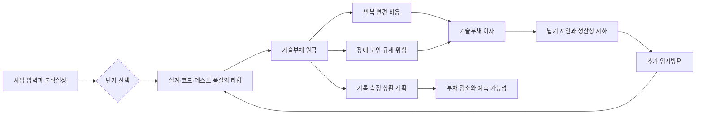
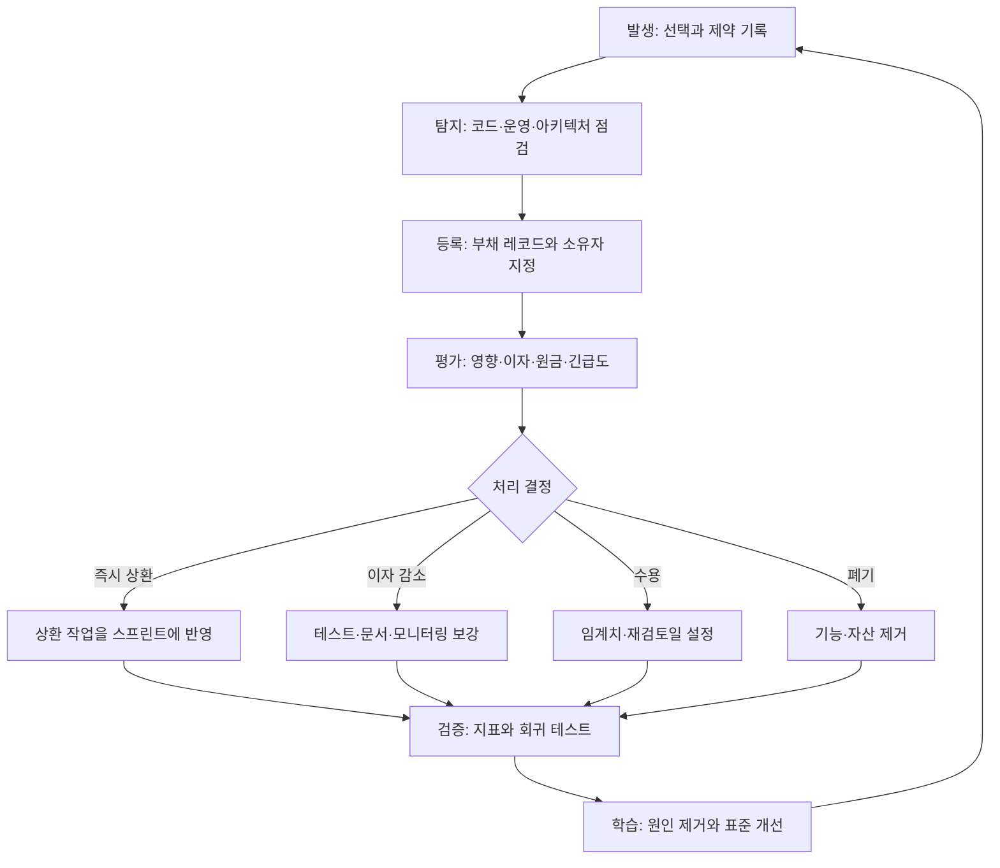

# 기술부채(Technical Debt) 관리와 상환 전략

## 1. 개요

### 가. 정의

> 기술부채(Technical Debt)는 단기적인 납기·비용·시장 대응을 위해 설계·코드·테스트·운영의 품질을 일부 희생함으로써 미래에 추가로 부담하게 되는 변경 비용과 위험의 누적분이다.

기술부채는 단순히 코드가 더럽거나 오래되었다는 뜻이 아니다.
의도적으로 빠른 선택을 했든 무심코 품질을 놓쳤든, 현재의 선택이 미래의 변경 비용을 높인다면 부채가 된다.
금융부채가 원금과 이자를 갖는 것처럼 기술부채도 지금 미루는 작업이라는 원금과, 그 결과로 반복해서 발생하는 지연·장애·인지부하라는 이자를 갖는다.
따라서 기술부채는 제거해야 할 결함 목록이 아니라 사업 목표와 위험을 함께 고려해 관리해야 할 포트폴리오이다.

기술부채가 존재한다고 해서 나쁜 개발을 했다는 의미는 아니다.
검증되지 않은 시장에서 최소 기능을 먼저 출시하거나, 장애 상황에서 임시 우회책으로 서비스를 복구하는 것은 합리적인 부채가 될 수 있다.
문제는 부채를 기록하지 않고, 상환 시점을 정하지 않으며, 이자가 얼마나 커지는지 관찰하지 않는 경우이다.
그때 부채는 팀의 생산성을 잠식하고 신규 기능의 납기를 예측할 수 없게 만든다.

### 나. 등장 배경과 필요성

첫째, 시장의 불확실성 때문에 모든 품질 요구를 출시 전에 완성하기 어렵다.
초기 제품은 고객 반응을 빠르게 확인해야 하므로 범용화된 아키텍처나 완벽한 자동화를 뒤로 미룰 수 있다.
이 선택은 학습을 앞당기는 대신 향후 확장 비용을 만든다.
부채를 가시화하면 빠른 학습이라는 편익과 향후 상환 비용을 같은 의사결정 안에서 비교할 수 있다.

둘째, 시스템은 시간이 지나면서 주변 조건이 변한다.
운영체제·라이브러리·클라우드 API·보안 요구사항·조직 구조가 바뀌면 과거에는 적절했던 설계가 현재의 제약과 맞지 않을 수 있다.
그러므로 기술부채는 오래된 코드에만 고정되는 것이 아니라 환경 변화와 함께 재평가되어야 한다.

셋째, 부채는 누적 효과를 가진다.
한 번의 임시 처리 자체는 작아 보여도 같은 규칙이 여러 서비스와 데이터베이스에 복제되면 변경 지점이 늘어난다.
변경 지점이 늘면 테스트 범위와 배포 위험도 커지고, 위험을 줄이기 위한 수동 승인과 회의가 증가한다.
결국 기능 개발에 쓸 수 있는 시간이 줄어드는 악순환이 생긴다.

넷째, 기술부채의 책임은 특정 개발자에게만 있지 않다.
요구사항의 불확실성, 납기 압력, 예산, 의사결정 구조, 운영 권한이 모두 부채의 원인이 될 수 있다.
관리자는 부채를 숨기도록 유도하는 평가보다, 합리적인 부채를 선택하고 투명하게 상환하는 문화를 만들어야 한다.

### 다. 관리 목표

기술부채 관리의 첫 번째 목표는 부채를 0으로 만드는 것이 아니라 위험을 수용 가능한 수준으로 유지하는 것이다.
모든 코드를 최신화하면 상환 비용이 제품 가치보다 커질 수 있고, 반대로 모든 부채를 방치하면 시스템이 사업 변화를 따라가지 못한다.
따라서 부채별로 발생 원인, 영향 범위, 이자, 상환 비용, 상환 시점을 설명할 수 있어야 한다.

두 번째 목표는 부채의 이자를 낮추는 것이다.
상환을 당장 하지 못하더라도 문서화, 테스트 보강, 모니터링, 경계면 고정과 같은 조치로 추가 비용의 증가를 늦출 수 있다.
세 번째 목표는 신규 부채의 유입을 통제하는 것이다.
완료 정의, 코드 리뷰, 자동화 테스트, 아키텍처 결정 기록을 통해 부채가 무기록으로 생성되지 않게 해야 한다.

## 2. 기술부채의 구조와 발생 원인

### 가. 부채의 경제적 구조

기술부채는 다음과 같이 원금과 이자의 관계로 설명할 수 있다.
원금은 현재 상태를 정상적인 품질 수준으로 되돌리는 일회성 작업량이다.
이자는 부채 때문에 매번 추가로 발생하는 분석·테스트·운영·변경 비용이다.

원금이 작아도 이자가 크면 우선순위가 높다.
예를 들어 자주 변경되는 결제 모듈의 테스트 부재는 매 릴리스마다 수동 검증을 요구하므로 이자가 높다.
반면 거의 변경되지 않는 내부 배치의 오래된 라이브러리는 원금이 크더라도 사업 영향과 이자가 낮을 수 있다.
이처럼 부채를 코드의 미관만으로 평가하면 실제 위험과 우선순위를 잘못 판단한다.

부채의 경제성은 현재가치 관점에서도 볼 수 있다.
상환 비용을 R, 기간별 이자를 I_t, 할인율을 d라고 하면 단순화한 총비용은 R과 각 기간 이자의 현재가치 합으로 생각할 수 있다.
정확한 재무 계산이 목적은 아니지만, 상환을 미룰수록 비용이 증가하는지와 지금 투자할 가치가 있는지를 비교하는 틀을 제공한다.
다만 기술부채의 이자는 장애 확률이나 고객 신뢰 하락처럼 정량화하기 어려운 손실도 포함하므로 숫자를 과도하게 정밀한 사실처럼 사용해서는 안 된다.

### 나. 발생 원인

의도적 부채는 사업 학습과 속도를 위해 선택된다.
MVP에서 단일 테넌트 구조를 먼저 사용하거나, 검증 전에는 수동 운영으로 시장 반응을 확인하는 경우가 이에 해당한다.
이 선택은 상환 조건과 종료 기준이 문서화되어 있을 때만 합리적이다.
“나중에 고친다”는 말만 있고 언제 어떤 신호에서 고칠지 없으면 의도적 부채도 방치 부채로 변한다.

무지로 인한 부채는 팀이 문제를 알지 못하거나 해결 방법을 모르는 상태에서 생긴다.
도메인 규칙을 코드에 중복하거나 트랜잭션 경계를 잘못 잡는 사례가 대표적이다.
교육·멘토링·설계 검토·표준 패턴 도입이 예방책이지만, 이미 발생한 부채는 기록과 실험을 통해 원인을 밝혀야 한다.

압박으로 인한 부채는 일정, 예산, 인력, 장애 대응 같은 외부 제약으로 품질 활동이 축소될 때 생긴다.
개발자가 품질을 중시해도 운영 장애를 우선 처리해야 하면 테스트와 리팩터링이 밀릴 수 있다.
이 유형은 개인의 노력만으로 해결되지 않으므로 계획에 품질 용량을 확보하고, 임시 조치의 종료 조건을 제품·운영 책임자와 합의해야 한다.

노후화 부채는 의존 기술과 운영 환경의 변화에서 생긴다.
지원 종료된 런타임, 취약한 암호 라이브러리, 더 이상 관측되지 않는 배치 작업은 기능 결함이 없어도 위험을 높인다.
노후화 부채는 정기적인 자산 목록과 취약점·지원 기간·호환성 점검을 통해 조기에 발견해야 한다.

### 다. 부채의 주요 유형

부채의 유형은 책임자를 찾기 위한 분류가 아니라 상환 방법을 선택하기 위한 분류이다.
코드 부채는 중복·복잡한 조건·낮은 응집도처럼 구현 내부에 나타난다.
설계 부채는 모듈 경계, 의존 방향, 데이터 소유권이 잘못 잡혀 기능 변경의 영향 범위를 키운다.

테스트 부채는 자동 검증이 부족해 작은 변경도 수동 회귀 검증을 요구하는 상태이다.
문서 부채는 운영 절차와 설계 결정이 기록되지 않아 특정 인력의 기억에 의존하는 상태이다.
인프라 부채는 수동 배포, 오래된 이미지, 단일 장애점, 불충분한 용량 계획처럼 실행 환경에 존재한다.
데이터 부채는 표준·품질·계보·보존 정책이 불완전해 분석과 서비스 변경을 어렵게 만든다.

| 유형 | 관찰되는 징후 | 주요 이자 | 대표 상환 수단 |
|---|---|---|---|
| 코드 부채 | 중복, 긴 함수, 복잡한 조건 | 수정 시간 증가, 결함 유입 | 리팩터링, 정적 분석 |
| 설계 부채 | 순환 의존, 경계 불명확 | 영향도 확대, 병렬 개발 저하 | 모듈 경계 재설계, ADR |
| 테스트 부채 | 낮은 자동화, 불안정한 테스트 | 수동 검증, 배포 지연 | 특성 테스트, 회귀 자동화 |
| 문서 부채 | 최신 런북·결정 기록 부재 | 온보딩 지연, 장애 대응 지연 | 문서 갱신, 지식 공유 |
| 인프라 부채 | 수동 배포, 단일 장애점 | 복구 실패, 운영 위험 | IaC, 이중화, 자동화 |
| 데이터 부채 | 중복·결측·계보 부재 | 분석 오류, 재처리 비용 | 표준화, 품질 규칙, 카탈로그 |

표의 유형은 서로 독립적이지 않다.
예를 들어 데이터 소유권이 불명확하면 설계 부채와 데이터 부채가 동시에 커지고, 테스트 부채가 있으면 코드 부채를 안전하게 상환하기 어렵다.
따라서 백로그를 유형별로 따로 관리하더라도 영향 분석에서는 하나의 가치 흐름으로 연결해야 한다.

## 3. 식별·측정·우선순위화

### 가. 식별 방법

부채 식별은 개발자 개인의 느낌을 수집하는 방식에서 시작할 수 있지만, 최종적으로는 재현 가능한 증거가 필요하다.
코드 검색과 정적 분석으로 중복·복잡도·취약 의존성을 찾고, 테스트 결과와 배포 지표로 검증 비용을 확인한다.
운영에서는 반복 장애, 수동 작업, 경보의 오탐, 복구 단계의 병목을 기록한다.

아키텍처 워크숍에서는 변경 시나리오를 질문한다.
“새로운 결제 수단을 추가하면 어느 서비스와 테이블을 수정하는가”와 같은 질문에 여러 팀이 서로 다른 답을 한다면 경계와 문서에 부채가 있을 가능성이 높다.
데이터 흐름과 권한 흐름을 그려 보았을 때 담당자를 특정하기 어렵거나 임시 변환이 반복되면 데이터 부채의 증거가 된다.

부채 레코드는 최소한 다음 정보를 포함해야 한다.
발견 위치와 현상, 발생 배경, 영향을 받는 사용자·서비스, 이자 징후, 예상 원금, 위험도, 상환 조건, 담당자, 재검토 날짜를 남긴다.
티켓 제목에 “리팩터링 필요”만 적으면 의사결정에 필요한 맥락이 사라지므로, 부채가 발생시키는 비용과 하지 않았을 때의 결과를 함께 적어야 한다.

### 나. 측정 지표

원금 측정은 작업량 추정으로 시작한다.
스토리 포인트, 개발자-일, 변경 파일 수를 사용할 수 있지만, 지표 자체가 목적이 되면 안 된다.
여러 팀의 숫자를 단순 비교하기보다 같은 팀에서 상환 전후의 추세를 관찰하는 것이 안전하다.

이자 측정에는 변경 리드타임, 배포 실패율, 복구시간, 결함 재발률, 수동 운영시간, 코드 리뷰 대기시간을 활용할 수 있다.
이 지표들은 기술부채만으로 결정되지 않으므로, 배포 빈도·팀 규모·제품 단계와 함께 해석해야 한다.
예를 들어 배포 실패율이 높아도 원인이 테스트 부채인지 외부 API 불안정인지 분리하지 않으면 잘못된 상환 작업을 하게 된다.

| 측정 관점 | 예시 지표 | 해석 시 유의점 |
|---|---|---|
| 변경성 | 리드타임, 변경 영향 파일 수 | 기능 규모와 팀 구조를 함께 본다 |
| 안정성 | 변경 실패율, MTTR, 재발 장애 | 장애 원인과 탐지 품질을 분리한다 |
| 검증성 | 자동화 테스트 비율, flaky 비율 | 숫자보다 핵심 경로의 검증력을 본다 |
| 보안성 | 취약 의존성, 패치 지연일 | 심각도와 노출 가능성을 결합한다 |
| 운영성 | 수동 작업시간, 경보 오탐률 | 반복 작업의 자동화 가능성을 확인한다 |
| 이해가능성 | 온보딩 시간, ADR 최신도 | 문서 존재보다 실제 활용 여부를 본다 |

정량 지표와 정성 판단을 함께 사용해야 한다.
보안 패치 지연은 작업량이 작아도 규제·침해 위험 때문에 높은 우선순위가 될 수 있다.
반대로 복잡도가 높아도 변경이 거의 없는 안정된 알고리즘은 당장 상환할 이유가 약할 수 있다.

### 다. 우선순위화 기준

우선순위는 사업 영향, 발생 가능성, 이자 증가율, 상환 비용, 실행 가능성을 기준으로 정한다.
간단한 위험 점수는 영향도에 가능성을 곱하고, 여기에 이자 증가율을 가중하는 방식으로 만들 수 있다.
이 점수는 팀 간 대화를 돕는 보조 수단이며, 계산 결과가 보안·법규·안전 관련 판단을 대체해서는 안 된다.

첫 번째로 즉시 상환을 검토할 대상은 안전·보안·법규를 직접 위협하는 부채이다.
두 번째는 자주 변경되는 핵심 흐름에서 리드타임과 장애율을 높이는 부채이다.
세 번째는 상환 비용이 작고 자동화로 빠르게 줄일 수 있는 부채이다.
사용 빈도가 낮고 격리되어 있으며 이자도 작은 부채는 폐기나 현상 유지가 더 합리적일 수 있다.

## 4. 관리 수명주기와 상환 방식

### 가. 관리 수명주기

발생 단계에서는 선택을 숨기지 않는다.
임시 구현을 선택했다면 왜 필요한지, 어떤 조건에서 교체할지, 어떤 위험을 감수하는지를 ADR이나 이슈에 기록한다.
이 기록은 나중에 책임을 묻기 위한 것이 아니라 상환 후보를 잊지 않기 위한 장치이다.

탐지 단계는 정기 점검과 사건 기반 점검을 함께 운영한다.
분기별 아키텍처 리뷰만으로는 배포 과정에서 생기는 부채를 놓칠 수 있으므로, 장애 회고·대규모 기능 완료·의존성 변경 뒤에도 부채를 재평가한다.
발견한 항목은 하나의 소유자와 다음 재검토 날짜를 가져야 한다.

평가 단계에서는 상환, 이자 감소, 수용, 폐기의 네 가지 결정을 구분한다.
상환은 원금을 제거하는 것이고, 이자 감소는 당장 구조를 바꾸지 않고 테스트·관측성·문서로 위험의 증가 속도를 낮추는 것이다.
수용은 위험과 비용을 알고 일정 기간 유지하는 결정이며, 폐기는 사용하지 않는 기능과 인프라를 제거해 부채 자체를 없애는 결정이다.

### 나. 상환 방식

전면 재작성은 기존 시스템을 한 번에 교체하는 방식이다.
구조적 결함이 너무 깊거나 기술 수명이 끝난 경우 매력적이지만, 요구사항과 숨은 운영 규칙을 잃을 위험이 크다.
재작성 기간 동안 고객 가치가 멈추고 두 시스템을 병행해야 할 수도 있으므로, 명확한 경계와 단계별 검증 없이는 선택하지 않는 것이 좋다.

점진적 리팩터링은 작은 변경과 회귀 테스트를 반복하며 구조를 개선한다.
외부 계약을 먼저 고정하고 내부 구현을 바꾸는 방식은 고객 영향을 낮출 수 있다.
이 방식은 즉각적인 효과가 작아 보여도 배포 가능한 단위로 위험을 나누고, 학습을 다음 단계에 반영할 수 있다는 장점이 있다.

스트랭글러 피그 패턴은 기존 기능 앞에 경계를 만들고, 새 구현으로 기능을 하나씩 옮긴 뒤 오래된 부분을 제거한다.
라우팅·데이터 동기화·일관성 검증이 핵심이며, 이전 기간이 길어지면 두 시스템의 이중 운영 부채가 생기므로 종료 기준을 관리해야 한다.

자동화 상환은 수동 배포, 수동 데이터 검증, 반복적인 환경 설정을 코드와 파이프라인으로 바꾸는 방식이다.
자동화는 사람의 실수를 줄이는 동시에 시스템의 상태를 재현 가능하게 만든다.
다만 자동화된 잘못된 절차는 오류를 빠르게 확산시킬 수 있으므로 승인 단계, 롤백, 감사 로그를 함께 설계해야 한다.

### 다. 개발 흐름에 내재화

부채 상환을 별도 기간의 “정리 주간”에만 맡기면 사업 일정이 밀릴 때 가장 먼저 사라진다.
제품 백로그에 부채를 정식 항목으로 등록하고, 기능 변경과 함께 관련 부채를 일부 상환하는 방식을 적용해야 한다.
예를 들어 결제 수단을 추가하는 스토리에 결제 모듈의 계약 테스트 보강을 포함하면 상환의 맥락과 효과가 분명해진다.

완료 정의에는 핵심 경로 테스트, 운영 문서 갱신, 관측성 추가, 보안 패치와 같은 품질 조건을 포함한다.
코드 리뷰는 스타일만 확인하는 시간이 아니라 부채 유입을 확인하는 설계 검토 지점이어야 한다.
CI에서는 정적 분석·의존성 점검·테스트·빌드 재현성을 자동 검증하고, 임계치를 넘는 경우 예외 승인과 만료일을 남긴다.

## 5. 비교와 사례

### 가. 기술부채와 결함의 비교

결함은 요구된 동작과 실제 동작의 차이로, 현재 사용자에게 잘못된 결과를 주는 문제이다.
기술부채는 현재 동작이 요구사항을 만족하더라도 미래 변경 비용과 위험을 키우는 상태일 수 있다.
따라서 결함을 모두 고치면 부채가 자동으로 사라지는 것은 아니며, 부채가 반드시 즉시 결함으로 나타나는 것도 아니다.

| 구분 | 결함 | 기술부채 |
|---|---|---|
| 기준 | 현재 요구 동작의 위반 | 미래 변경·운영 비용과 위험 |
| 증상 | 오류 결과, 장애, 기능 실패 | 지연, 반복 작업, 확장 어려움 |
| 처리 | 수정과 회귀 검증 | 상환·이자 감소·수용·폐기 |
| 우선순위 | 사용자 영향과 긴급도 중심 | 영향, 이자, 원금, 전략 적합성 종합 |
| 예시 | 주문 금액을 잘못 계산 | 주문 규칙이 여러 서비스에 중복됨 |

이 구분은 티켓의 담당 조직을 나누기 위한 것이 아니라 대응 전략을 바꾸기 위해 필요하다.
현재 장애를 먼저 복구한 후, 장애를 반복시키는 구조적 원인이 기술부채라면 별도의 상환 항목으로 연결해야 한다.

### 나. 가상 사례: 주문 시스템의 점진적 상환

다음은 원리를 설명하기 위한 가상의 사례이다.
한 온라인 주문 서비스가 출시 속도를 높이기 위해 주문·재고·결제를 하나의 애플리케이션과 공유 데이터베이스에 구현했다고 가정한다.
초기에는 배포가 단순하고 기능 검증이 빨랐지만, 세 팀이 동시에 변경하면서 배포 대기와 회귀 테스트가 증가했다.

팀은 변경 실패율, 평균 복구시간, 수동 회귀 시간을 네 주 동안 측정했다.
수동 회귀가 릴리스당 12시간이고, 결제 변경이 재고 모듈의 테스트까지 요구된다는 사실이 드러났다.
팀은 전면 재작성 대신 API 계약 테스트를 먼저 추가하고, 주문 핵심 규칙을 도메인 모듈로 이동하며, 재고 조회와 결제 승인 경계를 분리했다.

첫 단계에서는 외부 API의 입력·출력 계약을 고정했다.
둘째 단계에서는 기존 데이터베이스를 그대로 사용하되 새 모듈이 직접 접근하는 테이블을 제한했다.
셋째 단계에서는 트래픽의 일부만 새 경로로 보내고, 오류율과 지연시간을 비교한 뒤 범위를 넓혔다.
마지막에는 사용하지 않는 구 경로와 임시 변환 코드를 제거하고, ADR에 상환 결과를 기록했다.

이 사례의 핵심은 “마이크로서비스로 분리했다”는 기술 용어가 아니다.
변경 경계를 먼저 검증하고, 작은 단위로 위험을 줄이며, 지표로 상환 효과를 확인했다는 점이다.
만약 분리 후에도 데이터 소유권과 배포 책임이 불명확했다면 분산 시스템이라는 새로운 부채만 추가되었을 것이다.

### 다. 의사결정 예시

| 선택지 | 단기 효과 | 장기 위험 | 적합 조건 |
|---|---|---|---|
| 그대로 유지 | 비용과 일정 안정 | 이자 증가 가능 | 변경 빈도와 영향이 낮음 |
| 부분 리팩터링 | 위험과 비용을 분할 | 효과가 점진적 | 테스트와 경계를 확보할 수 있음 |
| 전면 재작성 | 구조를 빠르게 바꿈 | 요구·운영 지식 손실 | 수명 종료와 명확한 전환 계획 |
| 기능 폐기 | 운영 비용 즉시 감소 | 일부 고객 가치 감소 | 사용률 낮고 대체 경로 존재 |

표의 선택은 시스템의 기술적 우수성보다 사업의 시간 지평과 위험 허용도에 의해 달라진다.
운영 중인 핵심 결제 경로는 안정적인 점진 개선이 우선일 수 있고, 실험용 내부 도구는 짧은 수명의 부채를 허용할 수 있다.

## 6. 심화: 현대 개발·운영에서의 기술부채

클라우드와 DevOps 환경에서는 배포 속도가 빨라진 만큼 부채의 생성과 확산도 빨라진다.
컨테이너 이미지가 오래되거나, IaC 모듈이 복제되거나, 파이프라인 예외가 누적되면 인프라 부채가 코드와 같은 방식으로 축적된다.
따라서 애플리케이션 저장소뿐 아니라 파이프라인·클라우드 계정·대시보드·런북도 부채 관리 범위에 포함해야 한다.

AI 시스템은 데이터·모델·프롬프트·평가셋·추론 인프라가 함께 변한다.
학습 데이터의 계보가 없거나 평가 기준이 고정되지 않으면 모델을 개선할수록 결과를 비교하기 어려운 데이터·모델 부채가 생긴다.
모델 버전, 데이터 스냅샷, 평가 지표, 승인 기록을 연결하는 것이 상환의 출발점이다.
생성형 AI를 적용할 때는 검색 근거, 안전 필터, 비용, 지연시간, 인간 검토 절차도 부채 레코드에 포함해야 한다.

아키텍처 부채는 품질속성 시나리오로 다루는 것이 효과적이다.
“피크 시간에 주문 요청의 99퍼센트를 2초 안에 처리한다”처럼 자극·환경·응답·측정 기준을 구체화하면 설계 선택과 부채의 영향을 검증할 수 있다.
단순히 “확장성이 나쁘다”라고 쓰는 것보다, 어떤 부하에서 어떤 응답이 악화되는지 정의해야 상환 작업과 검증 방법이 연결된다.

조직 차원에서는 부채를 제품 포트폴리오처럼 관리한다.
서비스별 부채 원장, 위험 등급, 상환 예산, 예외 승인, 만료일을 운영하고 분기별로 경영진과 공유한다.
다만 부채의 총 개수나 티켓 수를 성과지표로 삼으면 팀이 작은 항목을 양산할 수 있으므로, 변경 리드타임·안정성·상환 효과와 연계해서 본다.

## 7. 고려사항 및 시사점

### 가. 사업 가치와 품질의 균형

기술부채 상환은 기술팀의 취향을 관철하는 활동이 아니라 제품의 지속 가능한 가치 창출을 위한 투자이다.
상환 요청에는 고객 영향, 납기 개선, 위험 감소, 운영비 절감과 같은 사업 언어를 함께 제시해야 한다.
시장 검증이 우선인 영역에서는 제한된 부채를 허용하되, 학습 결과가 나온 뒤 상환 여부를 재결정한다.

### 나. 상환 우선순위의 투명성

부채 목록을 비공개로 관리하면 우선순위가 개인의 목소리 크기에 좌우된다.
공통 템플릿으로 원인·영향·이자·비용·담당자를 기록하고, 제품·개발·보안·운영이 함께 평가해야 한다.
보안·안전·법규 항목은 일반 기능 일정과 경쟁시키기보다 별도의 최소 기준과 예외 승인 체계를 둔다.

### 다. 과도한 리팩터링 방지

리팩터링 자체가 목적이 되면 안정된 시스템을 불필요하게 흔들 수 있다.
상환 전에는 변경 빈도, 테스트 가능성, 운영 영향, 대체 가능성을 확인하고, 상환 후 어떤 지표가 개선되어야 하는지 정의한다.
효과가 측정되지 않는 대규모 구조 변경은 또 다른 부채가 될 수 있으므로 단계적 실험과 롤백 계획을 둔다.

### 라. 자동화와 가드레일

CI/CD와 정책 자동화는 부채의 유입을 줄이지만, 임계치의 의미를 이해하지 못하면 형식적인 통과 절차가 된다.
정적 분석 경고는 심각도와 소유자를 연결하고, 예외에는 만료일을 둔다.
자동화 실패가 배포를 막는 경우에도 긴급 변경 경로와 사후 검증을 마련해 안전성과 대응 속도를 함께 확보한다.

### 마. 운영·보안·데이터의 통합 관리

애플리케이션 코드만 리팩터링해도 오래된 권한, 취약 이미지, 품질 낮은 데이터가 남으면 실제 위험은 줄지 않는다.
부채 레코드에 서비스·데이터·인프라·보안 의존성을 연결하고, 변경 영향 분석에 운영 담당자와 데이터 담당자를 참여시킨다.
특히 규제 데이터는 상환보다 보존·접근·삭제 정책의 준수가 선행되어야 한다.

### 바. 조직 학습과 재발 방지

상환 완료만 기록하면 동일한 부채가 다른 팀에서 반복된다.
회고에서는 왜 부채가 만들어졌는지, 어떤 의사결정과 인센티브가 영향을 주었는지, 어떤 표준·교육·플랫폼 지원이 필요한지를 확인한다.
개선 결과를 완료 정의, 템플릿, 개발자 플랫폼, 아키텍처 원칙에 반영해야 부채의 유입률을 낮출 수 있다.

## 8. 결론

기술부채는 빠른 실행과 미래의 변경 비용 사이에 존재하는 선택의 결과이다.
합리적인 부채는 사업 가설을 검증하고 시장에 학습을 전달하지만, 기록되지 않은 부채는 이자를 숨긴 채 팀의 속도와 신뢰성을 떨어뜨린다.
기술사 관점에서는 부채를 코드 품질 문제로 축소하지 말고, 아키텍처·데이터·보안·인프라·조직 의사결정을 포함하는 전사 위험으로 관리해야 한다.

실행 순서는 발견과 기록, 영향·이자·원금 평가, 상환 또는 이자 감소 선택, 자동 검증, 지표 기반 학습으로 이어져야 한다.
전면 재작성보다 경계 고정과 점진적 전환을 우선하되, 수명 종료·규제·안전 위험에는 명확한 투자와 종료 조건을 둔다.
결국 좋은 조직은 부채가 없는 조직이 아니라, 부채를 의식적으로 선택하고 비용을 공개하며 지속적으로 상환하는 조직이다.

## 참고자료

- Martin Fowler, “Technical Debt” — https://martinfowler.com/bliki/TechnicalDebt.html
- Ward Cunningham, “The WyCash Portfolio Management System” — https://wiki.c2.com/?WardCunningham

---

> **한 줄 요약**: 기술부채는 없애야 할 낙인이 아니라 원금·이자·위험을 측정하고 상환 조건을 운영하는 지속가능성 관리 대상이다.
