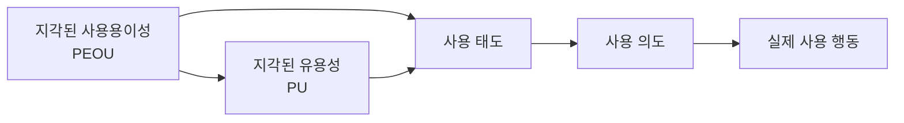

# 기술수용모델(TAM, Technology Acceptance Model)

## 1. 개요

### 가. 정의
> Davis(1989)가 제시한, 사용자가 **새로운 정보기술을 수용·사용**하는 행동을 설명·예측하는 이론 모델. 합리적 행동이론(TRA)에 기반.

### 나. 목적
- 신기술 도입의 **사용자 수용 요인** 분석 → 성공적 정보화 추진

## 2. 주요 구성요소

| 구성요소 | 설명 |
|---|---|
| **지각된 유용성(PU)** | 그 기술이 업무 성과를 높인다는 믿음 |
| **지각된 사용용이성(PEOU)** | 그 기술을 쉽게 쓸 수 있다는 믿음 |
| **사용 태도(Attitude)** | 사용에 대한 긍정·부정 평가 |
| **행동 의도(BI)** | 사용하려는 의향 |
| **실제 사용(Actual Use)** | 최종 사용 행동 |

## 3. 확장 및 시사점
- **외부변수**(교육·시스템 품질)가 PU·PEOU에 영향
- 확장모델 **TAM2·UTAUT**(사회적 영향·촉진조건 추가)
- 사용자 관점의 **UX·교육·변화관리** 설계에 활용

---

> **한 줄 요약**: TAM은 *지각된 유용성(PU)과 사용용이성(PEOU)* 이 태도·사용의도를 거쳐 실제 기술 사용으로 이어진다고 설명하는 기술 수용 예측 모델이다.
