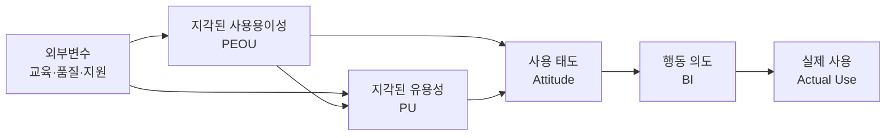

# 기술수용모델(TAM, Technology Acceptance Model)

## 1. 개요

### 가. 정의
> Davis(1989)가 제시한, 사용자가 **새로운 정보기술을 수용하고 실제로 사용하는 행동을 설명·예측**하는 이론 모델. 심리학의 합리적 행동이론(TRA)을 정보기술 맥락에 맞게 특화한 것으로, **지각된 유용성(PU)** 과 **지각된 사용용이성(PEOU)** 이라는 두 신념을 핵심 변수로 삼는다.

TAM의 통찰은 "기술의 실제 성능"이 아니라 "**사용자가 그 기술을 어떻게 지각하는가(perception)**"가 수용을 좌우한다는 데 있다. 아무리 뛰어난 시스템도 사용자가 유용하지 않거나 쓰기 어렵다고 '느끼면' 외면받는다. 기술 도입의 성패를 기술 그 자체가 아니라 **사용자의 인식**이라는 심리 변수로 설명한 점이 이 모델의 이론적 기여다.

### 나. 등장 배경 및 필요성
1980년대 기업들이 정보시스템에 대규모 투자를 했음에도, 정작 현업 사용자가 시스템을 외면해 투자가 무산되는 **수용 실패**가 빈번했다. 값비싼 시스템이 왜 안 쓰이는지를 설명·예측할 이론이 필요했고, TAM은 이를 두 개의 측정 가능한 변수로 간명하게 설명해 큰 반향을 얻었다. 실무적으로는 신기술·정보화 사업 도입 전에 **수용 저해 요인을 진단**하고, 교육·UX 개선·변화관리 등 대응 전략을 세우는 근거를 제공한다는 점에서 필요성이 크다.

## 2. 주요 구성요소

이 인과 경로에서 주목할 두 지점이 있다. 첫째, **사용용이성(PEOU)이 유용성(PU)에 영향을 준다**는 화살표다. 쓰기 쉬운 시스템일수록 사용자가 그 기능을 온전히 활용해 성과를 내므로 유용하다고 느끼게 되기 때문이다. 둘째, 외부변수는 두 신념을 **거쳐서만** 태도·행동에 영향을 준다 — 즉 교육이나 시스템 품질은 그 자체로 사용을 늘리는 게 아니라, 사용자의 지각(PU·PEOU)을 바꿔야 비로소 효과를 낸다.

- **외부변수(External Variables)**: 교육·훈련, 시스템 품질, 사회적 영향, 조직 지원 등 개입 가능한 요인으로, 두 지각 변수에 영향을 주는 **레버(지렛대)** 다.
- **지각된 유용성(PU)**: "이 기술을 쓰면 내 업무 성과가 높아질 것"이라는 믿음. 수용을 결정하는 가장 강력한 변수로 알려져 있다.
- **지각된 사용용이성(PEOU)**: "이 기술을 큰 노력 없이 쉽게 쓸 수 있을 것"이라는 믿음. 직접 태도에 영향을 주는 동시에 PU를 끌어올린다.
- **사용 태도(Attitude)**: 사용에 대한 긍정·부정의 종합 평가.
- **행동 의도(BI)**: 실제로 사용하려는 의향으로, 실제 사용을 가장 잘 예측하는 선행 변수다.
- **실제 사용(Actual Use)**: 최종 사용 행동으로, 모델의 종속변수다.

| 구성요소 | 설명 | 역할 |
|---|---|---|
| **외부변수** | 교육·품질·사회적 영향 | 지각의 선행 요인 |
| **지각된 유용성(PU)** | 성과 향상 믿음 | 최강 예측 변수 |
| **지각된 사용용이성(PEOU)** | 쉬운 사용 믿음 | PU·태도에 영향 |
| **사용 태도** | 긍·부정 평가 | 의도 형성 |
| **행동 의도(BI)** | 사용 의향 | 사용 예측 |
| **실제 사용** | 최종 행동 | 종속변수 |

## 3. 확장 모델

기본 TAM은 간명하지만 "왜 유용하다고 느끼는가"의 사회·조직적 배경을 설명하지 못했다. 이를 보완하기 위해 확장 모델이 나왔다. **TAM2**(Venkatesh & Davis, 2000)는 PU의 선행 요인으로 **주관적 규범(주변의 기대)·이미지·직무 관련성·결과 품질** 등 사회적·인지적 요인을 추가했다. **UTAUT**(2003)는 그간의 여러 수용 이론을 통합해 **성과기대·노력기대·사회적 영향·촉진조건** 4대 결정요인과 성별·연령 등 조절변수를 제시함으로써 설명력을 크게 높였다.

| 모델 | 추가·통합 요소 | 의의 |
|---|---|---|
| **TAM2** | 주관적 규범·이미지·직무관련성 등 | PU의 사회적 원인 규명 |
| **UTAUT** | 성과기대·노력기대·사회적영향·촉진조건 + 조절변수 | 이론 통합, 설명력 향상 |

## 4. 활용 사례 및 한계

예를 들어 어느 병원이 전자의무기록(EMR)을 도입할 때, 의료진의 **PEOU가 낮으면**(입력이 번거로움) 아무리 시스템이 우수해도 사용 의도가 떨어진다. TAM으로 사전 설문을 돌려 PEOU가 병목임을 진단하면, 화면 간소화·단축키·현장 교육이라는 처방을 내릴 수 있다. 이처럼 TAM은 **도입 전 수용도를 예측하고 설계·교육에 반영**하는 실천 도구가 된다.

다만 한계도 분명하다. TAM은 사용자의 주관적 응답(설문)에 의존해 상황·문화에 따라 결과가 달라지고, 실제 사용 성과보다 '지각'에 초점을 두어 강제적 사용 환경(의무 시스템)에서는 설명력이 약해진다. 따라서 정량 설문을 정성 인터뷰로 보완하는 것이 바람직하다.

## 5. 고려사항 및 시사점
- **사용자 중심 접근**: 기술 자체의 우수성보다 **유용성·용이성에 대한 사용자 지각**이 도입 성패를 좌우하므로, 기획 단계부터 UX와 현업 참여를 설계에 반영해야 한다.
- **변화관리와 연계**: TAM 진단 결과는 **변화관리(Change Management)** 의 교육·소통·인센티브 전략으로 이어져 저항을 최소화하는 데 활용된다.
- **트레이드오프·전망**: 사용용이성을 높이려 기능을 단순화하면 전문 사용자의 유용성이 떨어질 수 있어 균형이 필요하다. 최근 **AI·클라우드·디지털 전환** 신기술의 조직 정착 전략에서 TAM/UTAUT는 여전히 수용도를 계량·예측하는 이론적 근거로 널리 쓰인다.

---

> **한 줄 요약**: TAM은 *지각된 유용성(PU)과 사용용이성(PEOU)* 이라는 두 신념이 태도·행동의도를 거쳐 실제 기술 사용으로 이어진다고 설명하는 모델로, 외부변수는 지각을 통해서만 작동하며 TAM2·UTAUT로 확장되어 신기술 수용 전략의 근거가 된다.
