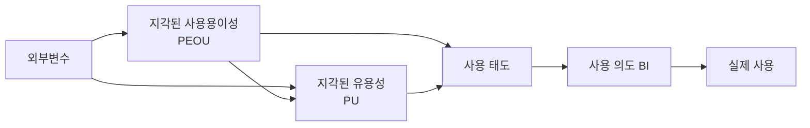

# 기술수용모델(TAM, Technology Acceptance Model)

## 1. 개요

### 가. 정의
> Davis(1989)가 제시한, 사용자가 **새로운 정보기술을 수용·사용**하는 행동을 설명·예측하는 이론 모델. 합리적 행동이론(TRA)에 기반.

### 나. 필요성
- 신기술·정보화 도입 시 **사용자 수용 실패** 방지
- 수용 저해 요인 진단 → 교육·UX·변화관리 전략 수립

## 2. 주요 구성요소

| 구성요소 | 설명 |
|---|---|
| **외부변수** | 교육·시스템 품질·사회적 영향 등 |
| **지각된 유용성(PU)** | 그 기술이 업무 성과를 높인다는 믿음 |
| **지각된 사용용이성(PEOU)** | 그 기술을 쉽게 쓸 수 있다는 믿음 |
| **사용 태도(Attitude)** | 사용에 대한 긍정·부정 평가 |
| **행동 의도(BI)** | 사용하려는 의향 |
| **실제 사용** | 최종 사용 행동 |

## 3. 확장 모델

| 모델 | 추가 요소 |
|---|---|
| **TAM2** | 사회적 영향(주관적 규범), 인지적 도구 요인 |
| **UTAUT** | 성과기대·노력기대·사회적 영향·촉진조건 통합 |

## 4. 활용 및 고려사항
- 신규 시스템 도입 전 **수용도 조사·설계 반영**(UX·교육)
- 설문 기반 실증 분석 → **주관성·상황 의존성** 한계 유의
- 변화관리(Change Management)와 연계해 저항 최소화

## 5. 시사점
- 기술 자체보다 **사용자 관점(유용성·용이성)** 이 도입 성패 좌우
- 디지털 전환·신기술(AI·클라우드) 도입 정착 전략의 이론적 근거

---

> **한 줄 요약**: TAM은 *지각된 유용성(PU)과 사용용이성(PEOU)* 이 태도·사용의도를 거쳐 실제 기술 사용으로 이어진다고 설명하는 모델로, TAM2·UTAUT로 확장되며 신기술 수용 전략의 근거가 된다.
