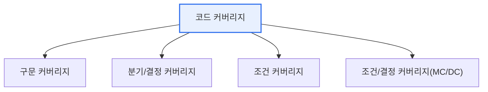

# 테스트 커버리지와 코드 커버리지

## 1. 개요

### 가. 정의
> **테스트 커버리지(Test Coverage)** 는 테스트가 **요구사항·기능을 얼마나 검증했는지**를 나타내는 넓은 척도이고, **코드 커버리지(Code Coverage)** 는 테스트 실행 시 **소스 코드가 얼마나 실행(수행)되었는지**를 정량 측정한 척도다. 코드 커버리지는 테스트 커버리지의 한 부분이다.

두 개념을 구분하는 핵심은 '**무엇을 기준으로 충분함을 재는가**'이다. 테스트 커버리지는 "테스트해야 할 대상(요구사항·기능·리스크)을 얼마나 다뤘는가"라는 넓은 관점으로, 기능 커버리지·요구사항 커버리지 등을 포함한다. 코드 커버리지는 그중에서도 "코드의 각 줄·분기·조건이 테스트로 실제 실행됐는가"를 측정하는 구체적·정량적 지표다. 코드 커버리지가 중요한 이유는, 실행되지 않은 코드는 테스트되지 않은 것이므로 결함이 숨어 있을 수 있기 때문이다. 다만 코드 커버리지가 100%라도 그것이 곧 품질을 보장하지는 않는다. 코드가 실행된 것과 그 결과가 올바른지 검증된 것은 다르기 때문이다. 그래서 코드 커버리지는 '충분조건이 아닌 필요조건'으로, 최소한의 검증 수준을 담보하는 지표로 활용된다.

### 나. 필요성
테스트가 얼마나 충분한지를 객관적으로 측정하지 않으면 검증의 사각지대가 생긴다. 커버리지 측정은 테스트의 완성도를 정량화하고 미검증 영역을 드러낸다.

## 2. 코드 커버리지의 종류

코드 커버리지는 무엇을 얼마나 세밀하게 실행했는지에 따라 단계가 있다. 아래로 갈수록 엄격하다.

| 종류 | 내용 |
|---|---|
| **구문(Statement)** | 모든 실행 문장이 한 번 이상 실행 |
| **분기/결정(Branch)** | 모든 분기(참/거짓)가 실행 |
| **조건(Condition)** | 각 조건식의 참/거짓이 실행 |
| **MC/DC** | 각 조건이 결과에 독립적으로 영향(항공·안전 표준) |

## 3. 테스트 vs 코드 커버리지 비교

| 구분 | 테스트 커버리지 | 코드 커버리지 |
|---|---|---|
| **대상** | 요구사항·기능·리스크 | 소스 코드 실행 |
| **관점** | 무엇을 검증했나(넓음) | 코드가 얼마나 실행됐나(정량) |
| **측정** | 요구·기능 매핑 | 도구로 자동 측정 |
| **관계** | 상위(포괄) | 하위(코드 관점) |

## 4. 고려사항 및 시사점

1. **높은 커버리지가 품질을 보장하지 않는다**. 코드가 실행됐다고 그 결과가 검증된 것은 아니므로, 커버리지 수치에 매몰되지 말고 의미 있는 검증(단언·경계값)을 함께 확보해야 한다.
2. **목표 수준은 리스크에 따라 정한다**. 일반 애플리케이션은 구문·분기 커버리지를, 항공·의료 같은 안전필수 시스템은 MC/DC 같은 엄격한 기준을 요구한다.
3. **CI 파이프라인에 통합**한다. 커버리지를 자동 측정해 품질 게이트로 삼고, 미검증 코드를 지속적으로 드러내 회귀와 사각지대를 관리한다.

---

> **한 줄 요약**: 테스트 커버리지는 *요구·기능을 얼마나 검증했나* 를, 코드 커버리지는 *코드가 얼마나 실행됐나(구문·분기·조건·MC/DC)* 를 측정하며, 높은 코드 커버리지가 품질을 보장하지는 않으므로 의미 있는 검증과 함께 리스크 기반으로 목표를 정한다.
