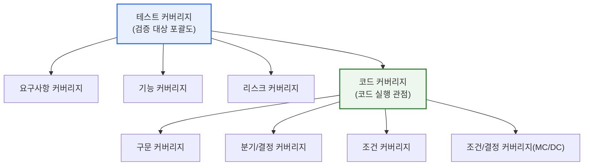
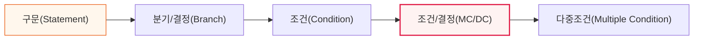

# 테스트 커버리지와 코드 커버리지

## 1. 개요

### 가. 정의
> **테스트 커버리지(Test Coverage)** 는 계획·수행한 테스트가 검증 대상(요구사항·기능·리스크)을 **얼마나 포괄했는지**를 나타내는 넓은 척도이고, **코드 커버리지(Code Coverage)** 는 테스트를 실행했을 때 소스 코드의 구문·분기·조건 등이 **얼마나 실제로 수행되었는지**를 정량 측정한 척도다. 코드 커버리지는 테스트 커버리지가 포괄하는 여러 관점 중 '코드 실행 관점'에 해당하는 하위 지표다.

두 개념을 구분하는 핵심 질문은 '**무엇을 기준으로 충분함을 재는가**'이다. 테스트 커버리지는 "테스트해야 할 대상 — 요구사항·기능·사용자 시나리오·리스크 — 을 얼마나 다뤘는가"를 묻는 넓은 관점으로, 요구사항 커버리지·기능 커버리지·형상 커버리지 등을 포괄한다. 반면 코드 커버리지는 그 대상 중 소스 코드에 초점을 맞춰 "각 줄·분기·조건이 테스트 과정에서 실제로 실행되었는가"를 도구로 자동 계측한 정량 지표다. 즉 테스트 커버리지가 '검증의 폭'을 다룬다면, 코드 커버리지는 '실행의 깊이'를 숫자로 보여준다.

코드 커버리지가 중요한 이유는 명확하다. **실행되지 않은 코드는 결코 테스트되지 않은 코드**이므로, 그 안에 결함이 숨어 있을 가능성을 배제할 수 없다. 커버리지 측정은 "어느 코드가 한 번도 실행되지 않았는가"를 드러내어 테스트의 사각지대를 가시화한다. 이런 의미에서 코드 커버리지는 테스트가 최소한의 검증 범위를 확보했는지 확인하는 '**필요조건**'으로 기능한다.

그러나 결정적으로, **코드 커버리지 100%가 곧 품질(정확성)을 보장하지는 않는다.** 여기서 두 가지를 구분해야 한다 — '코드가 실행된 것'과 '그 실행 결과가 올바른지 검증(단언)된 것'은 전혀 다른 문제다. 단언(assertion) 없이 코드를 통과시키기만 하는 테스트는 커버리지 숫자는 높이지만 결함은 잡지 못한다. 따라서 코드 커버리지는 '충분조건이 아닌 필요조건'이라는 정확한 위치에서 활용해야 하며, 숫자에 매몰되면 오히려 품질에 대한 잘못된 확신을 줄 수 있다.

### 나. 등장 배경과 필요성
소프트웨어 규모가 커지고 회귀(regression) 위험이 상시화되면서, "우리 테스트가 충분한가?"라는 질문에 감(感)이 아니라 **객관적 수치**로 답할 필요가 생겼다. 개발자가 직관적으로 "웬만큼 테스트했다"고 느껴도, 실제로는 예외 처리 경로나 특정 분기가 한 번도 실행되지 않은 채 남아 있는 경우가 흔하다. 커버리지 계측 도구는 이런 미검증 영역을 자동으로 드러내어, 테스트의 완성도를 정량화하고 품질 게이트(quality gate)의 근거를 제공한다. 특히 CI/CD가 보편화되면서, 매 커밋마다 커버리지를 측정해 회귀와 사각지대를 지속적으로 관리하는 것이 표준 실무로 자리 잡았다.

### 다. 두 개념의 관계
정리하면 코드 커버리지는 테스트 커버리지의 부분집합이다. 코드 커버리지가 아무리 높아도 요구사항 자체를 테스트 케이스로 도출하지 못했다면 테스트 커버리지는 낮을 수 있고, 반대로 요구사항 매핑은 충실해도 그 테스트가 코드의 특정 분기를 건드리지 못하면 코드 커버리지에 구멍이 남는다.

이 관계가 실무에서 중요한 이유는, 두 지표가 서로의 맹점을 보완하기 때문이다. 요구사항 커버리지는 "구현했어야 할 기능을 빠뜨리지 않았는가(누락 결함)"를 잡아내고, 코드 커버리지는 "구현된 코드가 실제로 검증되었는가(구현 결함)"를 잡아낸다. 어느 한쪽만으로는 완전한 검증이 되지 않으므로, 두 지표를 상호 보완적으로 함께 관리해야 검증의 폭과 깊이를 모두 확보할 수 있다.

## 2. 전체 구조 — 테스트 커버리지의 범주

```mermaid
flowchart TB
  T["테스트 커버리지<br/>(검증 대상 포괄도)"] --> R["요구사항 커버리지"]
  T --> F["기능 커버리지"]
  T --> RK["리스크 커버리지"]
  T --> CC["코드 커버리지<br/>(코드 실행 관점)"]
  CC --> S["구문 커버리지"]
  CC --> B["분기/결정 커버리지"]
  CC --> CO["조건 커버리지"]
  CC --> MC["조건/결정 커버리지(MC/DC)"]
  style T fill:#e8f0fe,stroke:#2f6fed,stroke-width:2px
  style CC fill:#eef7ee,stroke:#2e7d32,stroke-width:2px
```

위 구조도는 테스트 커버리지라는 넓은 우산 아래에 요구사항·기능·리스크 커버리지와 나란히 코드 커버리지가 위치하고, 코드 커버리지가 다시 구문→분기→조건→MC/DC로 세분화됨을 보여준다. 실무에서 "커버리지"라는 말이 대개 코드 커버리지를 가리키는 것은, 이 지표만이 도구로 자동·정량 측정되기 때문이다. 요구사항·기능 커버리지는 사람이 요구사항과 테스트 케이스를 매핑해 추적성 매트릭스(RTM)로 관리하는 반면, 코드 커버리지는 계측 도구가 실행 정보를 자동 수집한다는 점에서 성격이 다르다.

## 3. 코드 커버리지의 종류(엄격도 단계)

코드 커버리지는 코드의 무엇을, 얼마나 세밀하게 실행했는지에 따라 여러 단계로 나뉜다. 아래로 갈수록 요구되는 테스트가 정밀해지고, 검출 가능한 결함의 폭도 넓어진다.

```mermaid
flowchart LR
  S["구문(Statement)"] --> B["분기/결정(Branch)"]
  B --> C["조건(Condition)"]
  C --> M["조건/결정(MC/DC)"]
  M --> MU["다중조건(Multiple Condition)"]
  style S fill:#fff7ed,stroke:#ea580c
  style M fill:#fef3f2,stroke:#e11d48,stroke-width:2px
```

### 가. 구문 커버리지(Statement Coverage)
모든 실행 가능한 문장(statement)이 최소 한 번 이상 실행되었는지를 측정한다. 가장 기본적이고 이해하기 쉬운 지표이지만, 한계가 뚜렷하다. 예를 들어 `if (a) x = 1;`이라는 코드에서 `a`가 참인 경우만 테스트하면 구문 커버리지는 100%가 되지만, `a`가 거짓일 때(즉 분기하지 않을 때)의 동작은 전혀 검증되지 않는다. 즉 구문 커버리지는 "실행은 됐다"만 보장할 뿐, 분기의 다른 쪽 경로는 놓칠 수 있다.

### 나. 분기/결정 커버리지(Branch/Decision Coverage)
모든 분기점의 참(true)·거짓(false) 결과가 각각 최소 한 번씩 실행되었는지를 측정한다. 앞의 예에서 `a`가 참인 경우와 거짓인 경우를 모두 테스트해야 100%가 되므로, 구문 커버리지가 놓치는 '분기하지 않는 경로'까지 포괄한다. 일반적인 애플리케이션 개발에서는 구문·분기 커버리지를 실용적 목표로 삼는 경우가 많은데, 이는 비용 대비 결함 검출 효과의 균형점이 대체로 이 수준에 있기 때문이다.

### 다. 조건 커버리지(Condition Coverage)
결정문을 구성하는 **개별 조건식 각각**의 참·거짓이 모두 실행되었는지를 본다. 예컨대 `if (a && b)`에서 `a`와 `b` 각각이 참·거짓을 모두 가져야 한다. 다만 조건 커버리지만으로는 함정이 있다. 개별 조건의 참·거짓을 모두 채우면서도, 정작 전체 결정(decision)의 참·거짓 결과 중 하나를 놓칠 수 있어 분기 커버리지를 항상 만족시키지는 못한다. 이 때문에 실무에서는 조건과 결정을 함께 보는 상위 기준이 필요해진다.

### 라. MC/DC(조건/결정 커버리지)
MC/DC(Modified Condition/Decision Coverage)는 "**각 조건이 다른 조건과 독립적으로 결정의 결과에 영향을 미친다는 것**"을 각각 입증하도록 요구하는 강력한 기준이다. 즉 특정 조건 하나만 바꿨을 때 전체 결정 결과가 바뀌는 테스트 쌍(pair)을 조건마다 확보해야 한다. MC/DC의 실용적 장점은, 모든 조건 조합(2ⁿ)을 다 시험하는 다중조건 커버리지와 달리, 이상적인 경우 **조건 개수 n에 대해 n+1개의 테스트만으로도** 각 조건의 독립적 영향을 입증할 수 있어 조합 폭발을 피한다는 점이다.

MC/DC가 특히 중요한 이유는 안전필수(safety-critical) 표준에서 이를 명시적으로 요구하기 때문이다. 항공 소프트웨어 인증 표준인 DO-178C는 가장 높은 안전등급(Level A, DAL A) 소프트웨어에 대해 MC/DC 수준의 구조적 커버리지를 요구하며, 기능안전 표준 IEC 61508 역시 높은 SIL 등급에서 MC/DC를 권고·강력권고한다. 다만 MC/DC는 사람이 수작업으로 측정하기가 사실상 불가능해, VectorCAST·LDRA 같은 전용 도구로 최소 테스트 쌍을 도출·계측하는 것이 일반적이다.

| 종류 | 측정 대상 | 엄격도 | 대표 적용 |
|---|---|---|---|
| **구문(Statement)** | 모든 문장 1회 이상 실행 | 낮음 | 일반 개발 최소 기준 |
| **분기/결정(Branch)** | 분기의 참·거짓 모두 실행 | 중간 | 일반 애플리케이션 권장 |
| **조건(Condition)** | 개별 조건식 참·거짓 실행 | 중상 | 복합 조건 검증 |
| **MC/DC** | 각 조건의 독립적 영향 입증 | 높음 | 항공·의료 등 안전필수(DO-178C DAL A) |

## 4. 비교 및 실무 적용 사례

### 가. 테스트 커버리지 vs 코드 커버리지
아래 표는 두 개념의 차이를 정리한 것이나, 핵심은 표 자체보다 **차이가 생기는 이유**에 있다. 테스트 커버리지가 '무엇을 검증해야 하는가(요구사항)'라는 기획·설계 관점에서 출발하는 데 비해, 코드 커버리지는 '작성된 코드가 실제로 돌았는가'라는 실행·계측 관점에서 출발한다. 그래서 요구사항이 코드로 구현조차 되지 않았다면 코드 커버리지 지표에는 아예 잡히지 않으며(누락된 기능은 실행할 코드가 없으니 측정 대상이 아니다), 이것이 코드 커버리지만 맹신할 때 생기는 대표적 맹점이다.

| 구분 | 테스트 커버리지 | 코드 커버리지 |
|---|---|---|
| **대상** | 요구사항·기능·리스크 | 소스 코드의 실행 |
| **관점** | 무엇을 검증했나(폭) | 코드가 얼마나 실행됐나(정량) |
| **측정 방식** | 요구·기능 매핑(RTM), 수작업 | 계측 도구로 자동 측정 |
| **관계** | 상위(포괄) | 하위(코드 실행 관점) |
| **한계** | 정량화가 어려움 | 실행≠정답 검증, 누락 기능 미포착 |

### 나. 구체 사례로 본 함정
사례를 들면 이해가 분명해진다. 어떤 결제 모듈에 `if (amount > 0 && balance >= amount)`라는 조건이 있다고 하자. 테스트가 '정상 결제' 한 케이스만 다루면 구문 커버리지는 100%에 이를 수 있지만, `balance < amount`(잔액 부족) 분기는 실행되지 않아 분기 커버리지는 50%에 그친다. 실제로 잔액 부족 처리 로직에 결함이 있어도 구문 커버리지 100%라는 숫자만 보면 안심하게 되는 것이다. 반대로 단언이 부실한 사례도 흔하다 — 함수를 호출만 하고 반환값을 검증(assert)하지 않으면, 커버리지는 채워지지만 결과가 틀려도 테스트는 통과한다. 이 '거짓 안심'을 보완하기 위해 최근에는 **변이 테스트(Mutation Testing)** 를 병행하는 실무가 늘고 있다. 코드를 의도적으로 변형(mutant)시킨 뒤 테스트가 그 변형을 잡아내는지(kill) 측정함으로써, 커버리지 숫자가 아니라 테스트의 '결함 검출 능력' 자체를 평가하는 것이다.

### 다. 리스크 기반 목표 설정
따라서 커버리지 목표는 일률적 숫자가 아니라 **리스크에 비례**해 정해야 한다. 일반 사내 애플리케이션은 구문·분기 커버리지 70~80% 수준을 실용 목표로 삼는 경우가 많고, 금융 거래처럼 오류 비용이 큰 도메인은 더 높은 기준과 경계값 테스트를 병행한다. 항공·의료·자동차(ISO 26262) 같은 안전필수 시스템은 MC/DC 같은 엄격한 구조적 커버리지를 규제로 요구한다. 즉 "몇 %면 충분한가"에 정답은 없으며, 결함이 초래하는 손실의 크기가 목표 수준을 결정한다.

또한 목표를 100%로 무리하게 설정하면 오히려 역효과가 난다. 도달하기 어려운 예외 처리·방어적 코드까지 억지로 커버하려다 보면, 테스트가 구현 세부에 과도하게 결합되어 리팩터링을 방해하고 유지보수 비용을 키운다. 실무에서는 '핵심 비즈니스 로직은 높게, 단순 위임·설정 코드는 낮게'라는 식으로 코드 영역별 차등 목표를 두고, 커버리지가 낮은 영역이 곧 리스크가 높은 영역인지 아니면 테스트할 가치가 낮은 영역인지를 판단하는 해석 역량이 더 중요하다.

## 5. 심화 — 실무 동향과 예상 출제 방향

코드 커버리지는 오늘날 CI/CD 파이프라인의 품질 게이트로 깊이 통합되어 있다. JaCoCo(Java), Istanbul/nyc(JavaScript), Coverage.py(Python), gcov·llvm-cov(C/C++) 같은 도구가 매 빌드마다 커버리지를 측정하고, 설정한 임계치 미만이면 머지를 차단하거나 '커버리지가 감소하는 변경'을 경고하는 방식이 표준화되었다. 특히 신규·변경 코드에만 커버리지 기준을 적용하는 '차등 커버리지(diff/patch coverage)'가 확산되어, 레거시 전체를 무리하게 끌어올리는 대신 새로 들어오는 코드의 품질을 점진적으로 담보하는 현실적 접근이 자리 잡았다.

또한 커버리지의 '질'을 높이려는 흐름이 뚜렷하다. 앞서 언급한 변이 테스트가 대표적이며, 안전필수 영역에서는 GCC 14에 마스킹 방식의 MC/DC 계측이 추가되는 등 오픈소스 툴체인에서도 구조적 커버리지 지원이 강화되고 있다. 이는 "커버리지 숫자를 채우는 것"에서 "**의미 있는 검증을 정량화하는 것**"으로 실무의 무게중심이 이동하고 있음을 보여준다.

덧붙여, 최근에는 정적 커버리지 계측을 넘어 운영 환경의 실제 실행 경로를 측정하는 접근도 확산되고 있다. 프로덕션 트래픽 기반으로 어떤 코드가 실제로 자주 실행되는지를 파악하면, 테스트 자원을 사용 빈도·리스크가 높은 경로에 우선 배분할 수 있다. 즉 커버리지는 개발 단계의 검증 지표를 넘어, 운영 관찰가능성(observability)과 결합해 '무엇을 더 검증해야 하는가'를 데이터로 안내하는 방향으로 확장되고 있다.

예상 출제 방향(기술사 관점)으로는 ① 테스트 커버리지와 코드 커버리지의 개념·관계 구분, ② 코드 커버리지 종류(구문·분기·조건·MC/DC)의 정의와 엄격도 차이 및 예제 기반 설명, ③ MC/DC가 안전필수 표준(DO-178C)에서 요구되는 이유와 n+1 테스트의 효율성, ④ 커버리지의 한계와 이를 보완하는 변이 테스트·경계값 분석·품질 게이트 전략을 서술형으로 요구할 가능성이 높다. 답안에서는 '높은 커버리지 ≠ 높은 품질'이라는 명제를 축으로, 필요조건으로서의 커버리지와 의미 있는 검증의 결합을 강조하는 구성이 효과적이다.

## 6. 고려사항 및 시사점(기술사 관점)

1. **높은 커버리지가 품질을 보장하지 않는다 — 실행과 검증을 구분하라.** 코드가 실행된 것과 그 결과가 올바른지 단언된 것은 다르다. 커버리지 수치에 매몰되지 말고, 의미 있는 단언·경계값·예외 시나리오 검증을 함께 확보해야 한다. 변이 테스트로 테스트의 결함 검출 능력 자체를 평가하는 것도 유효한 보완책이다.
2. **목표 수준은 리스크에 비례해 설정한다.** 모든 시스템에 동일한 커버리지 기준을 강요하는 것은 비효율적이다. 일반 애플리케이션은 구문·분기, 금융은 그 이상, 항공·의료·자동차 등 안전필수 시스템은 MC/DC처럼 규제가 요구하는 엄격한 기준을 적용하는 리스크 기반 접근이 합리적이다.
3. **CI/CD 품질 게이트로 통합해 지속 관리한다.** 커버리지를 매 커밋마다 자동 측정해 품질 게이트로 삼고, 특히 변경분에 대한 차등 커버리지를 적용해 회귀와 사각지대를 점진적으로 통제한다. 일회성 측정이 아니라 파이프라인에 내재화되어야 실효성이 있다.
4. **커버리지는 필요조건이지 목적이 아니다 — 측정의 왜곡을 경계하라.** 커버리지가 조직의 KPI가 되는 순간, 단언 없는 형식적 테스트로 숫자만 채우는 굿하트의 법칙(측정이 목표가 되면 좋은 측정이기를 멈춘다)이 작동할 수 있다. 지표는 테스트 완성도를 진단하는 도구로 쓰되, 검증의 질을 함께 관리해 왜곡을 방지해야 한다.

## 참고자료
- LDRA, "DO-178C & Structural Coverage Analysis" — https://ldra.com/ldra-blog/do-178c-structural-coverage-analysis/
- Wikipedia, "Modified condition/decision coverage (MC/DC)" — https://en.wikipedia.org/wiki/Modified_condition/decision_coverage
- "Modified Condition/Decision Coverage in the GNU Compiler Collection" (GCC 14) — https://arxiv.org/pdf/2501.02133

---

> **한 줄 요약**: 테스트 커버리지는 *요구·기능·리스크를 얼마나 검증했나(폭)* 를, 코드 커버리지는 *코드가 얼마나 실행됐나(구문·분기·조건·MC/DC, 깊이)* 를 측정하는 상·하위 관계이며, 코드 커버리지 100%도 실행≠정답 검증이므로 품질을 보장하지 않는다 — 따라서 의미 있는 단언·변이 테스트와 함께 리스크 기반으로 목표를 정하고 CI 품질 게이트로 지속 관리해야 한다.
