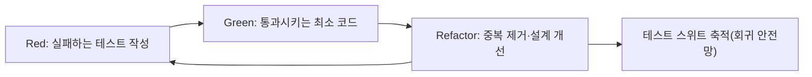
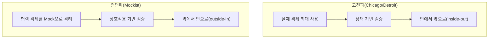

# 테스트 주도 개발(TDD, Test-Driven Development)

## 1. 개요

> 테스트 주도 개발(TDD)은 프로덕션 코드를 작성하기 전에 그 코드가 만족해야 할 동작을 실패하는 자동화 테스트로 먼저 기술하고, 그 테스트를 통과시키는 최소한의 코드를 구현한 뒤, 중복과 설계 냄새를 제거하는 리팩토링을 반복하는 진화적 설계·개발 기법이다.

전통적인 개발은 "설계 → 구현 → 테스트"의 순서를 따른다. 이 순서에서는 테스트가 개발의 마지막 단계로 밀리기 때문에, 일정이 압박받으면 가장 먼저 생략되는 활동이 되고, 결함은 통합·인수 단계에서 뒤늦게 발견된다. 결함이 늦게 발견될수록 수정 비용은 기하급수적으로 증가한다는 것은 소프트웨어 공학의 오래된 경험칙이며, 이는 TDD가 해결하려는 근본 문제의식과 직결된다.

TDD는 이 순서를 뒤집어 "테스트 → 구현 → 리팩토링"으로 재구성한다. 여기서 테스트는 단순한 검증 수단이 아니라 **아직 존재하지 않는 코드의 사용 방법을 먼저 정의하는 실행 가능한 명세(executable specification)**로 기능한다. 개발자는 "무엇을 만들 것인가"를 테스트 코드로 먼저 선언하고, 그 선언을 만족시키는 방향으로만 구현을 전개한다. 따라서 TDD의 산출물은 잘 동작하는 코드와 그 코드를 문서화하는 회귀 테스트 스위트를 동시에 확보한다는 점에서 이중의 가치를 가진다.

TDD는 켄트 벡(Kent Beck)이 익스트림 프로그래밍(XP)의 핵심 실천법으로 정립하였으며, 이후 애자일·데브옵스 문화가 확산되면서 지속적 통합(CI)과 결합해 현대 소프트웨어 품질 확보의 표준적 실천법으로 자리 잡았다. 중요한 것은 TDD가 "테스트를 많이 짜는 활동"이 아니라 **설계를 이끌어내는(design-driving) 활동**이라는 점이다. 테스트하기 어려운 코드는 대개 결합도가 높고 응집도가 낮은 코드이므로, 테스트를 먼저 작성한다는 제약 자체가 느슨한 결합과 높은 응집을 강제하는 설계 압력으로 작용한다.

### 1.1 등장 배경과 필요성

첫째, **결함의 늦은 발견 비용** 때문이다. 요구사항 단계에서 발견된 결함을 1이라 하면 운영 단계에서 발견된 동일 결함의 수정 비용은 수십에서 수백 배에 달한다는 것이 다수의 실증 연구가 공유하는 경향이다. TDD는 코드를 작성하는 그 순간에 테스트가 함께 존재하므로 결함 발견 시점을 개발 시점으로 최대한 앞당긴다(shift-left).

둘째, **회귀(regression)에 대한 두려움** 때문이다. 테스트 안전망이 없는 코드베이스에서는 작은 수정도 예기치 않은 부작용을 낳을 수 있어 개발자가 리팩토링과 개선을 기피하게 되고, 이는 기술부채 누적으로 이어진다. TDD가 남기는 촘촘한 테스트 스위트는 "변경해도 기존 동작이 깨지지 않는다"는 확신을 제공하여 지속적 개선을 가능하게 한다.

셋째, **명세의 모호성과 과잉 설계** 문제 때문이다. 요구사항이 코드로 옮겨지는 과정에서 개발자는 종종 아직 필요하지 않은 기능까지 미리 설계한다(YAGNI 위반). TDD는 "현재 실패하는 테스트를 통과시키는 데 필요한 최소한의 코드만 작성"하도록 강제하여 과잉 설계를 억제하고, 실제 요구를 코드 수준의 검증 가능한 형태로 고정한다.

넷째, **살아있는 문서(living documentation)의 필요성** 때문이다. 별도로 작성한 설계 문서는 코드가 변경되는 순간 낡은 정보가 되어 신뢰를 잃지만, 테스트는 매 빌드마다 실행되어 통과 여부로 자신이 최신 상태임을 스스로 증명한다. 잘 작성된 테스트 이름과 시나리오는 "이 컴포넌트가 어떤 입력에 어떻게 반응하는가"를 항상 정확하게 설명하는 문서 역할을 하며, 신규 인력의 온보딩과 유지보수 시 코드 이해 비용을 크게 낮춘다.

## 2. TDD의 핵심 사이클 — Red-Green-Refactor

TDD의 심장은 매우 짧은 주기로 반복되는 세 단계의 마이크로 사이클이다. 한 사이클은 보통 수 분 이내로 유지하며, 이 짧은 피드백 루프가 개발자의 인지 부하를 낮추고 방향 이탈을 조기에 교정하는 핵심 메커니즘이다.

**가. Red(실패) 단계** — 아직 구현되지 않은 동작을 검증하는 테스트를 먼저 작성한다. 이 테스트는 당연히 실패해야 하며, 실패를 확인하는 것 자체가 중요하다. 실패를 보지 않고 지나가면 테스트가 실제로 무언가를 검증하는지 확신할 수 없기 때문이다. Red 단계는 개발자가 "무엇을, 어떤 인터페이스로 만들 것인가"를 사용자(호출자) 관점에서 먼저 결정하도록 만든다. 예컨대 장바구니 합계 기능을 만든다면, `cart.total()`이 어떤 입력에 어떤 값을 반환해야 하는지를 API 형태로 먼저 확정한다. 이때 테스트가 컴파일조차 되지 않는 상태도 "실패"의 한 형태로 간주한다.

**나. Green(통과) 단계** — 방금 작성한 실패 테스트를 통과시키는 데 필요한 **가장 단순하고 최소한의 코드**를 작성한다. 이 단계의 목표는 "우아한 코드"가 아니라 "동작하는 코드"다. 심지어 상수를 그대로 반환하는 가짜 구현(fake it)이나 하드코딩도 허용된다. 중요한 것은 최대한 빨리 녹색 막대(all pass)를 회복하여 안정된 기반 위에 서는 것이다. 켄트 벡은 이를 "일단 통과시키고, 죄악은 나중에 씻어라"는 관점으로 설명한다.

**다. Refactor(개선) 단계** — 테스트가 모두 통과하는 안전한 상태에서 코드의 중복을 제거하고 이름을 개선하며 구조를 다듬는다. 이 단계에서는 외부에서 관찰되는 동작을 절대 바꾸지 않으며, 오직 내부 구조만 정리한다. 리팩토링 도중에도 수시로 테스트를 돌려 초록 상태를 유지하는 것이 핵심이다. Red-Green이 기능을 추가하는 단계라면 Refactor는 설계 품질을 확보하는 단계로, 이 둘의 리듬이 곧 TDD의 본질이다.

이 세 단계를 뒷받침하기 위해 개발자는 세 가지 진행 전략을 상황에 따라 선택한다. 명백한 구현(obvious implementation)은 답이 자명할 때 바로 작성하는 방식이고, 가짜 구현(fake it)은 상수를 반환한 뒤 점진적으로 일반화하는 방식이며, 삼각측량(triangulation)은 서로 다른 두 개 이상의 예시 테스트를 통해 일반화의 방향을 강제하는 방식이다. 예를 들어 덧셈 함수에서 `add(2,3)=5` 하나만으로는 `return 5`로도 통과하지만, `add(4,1)=5`와 `add(2,2)=4`를 추가하면 실제 덧셈 로직으로 수렴할 수밖에 없다.

### 2.1 사이클의 리듬과 보폭 조절

TDD 숙련의 핵심은 한 사이클에서 다루는 "보폭(step size)"을 상황에 맞게 조절하는 감각이다. 익숙하고 자명한 로직은 명백한 구현으로 큰 보폭을 택해 사이클을 빠르게 넘기고, 불확실하거나 실패가 반복되는 영역에서는 가짜 구현과 삼각측량으로 보폭을 잘게 쪼개 한 번에 한 가지 결정만 내린다. 실패가 두세 번 연속되면 보폭이 지나치게 크다는 신호로 보고 더 작은 테스트로 되돌아가는 것이 정석이다. 이처럼 보폭을 동적으로 조절하는 규율이 없으면 TDD는 형식만 남고 디버깅 지옥으로 회귀한다.

또한 각 사이클은 반드시 커밋 가능한 초록 상태에서 끝나야 한다. 이는 언제든 마지막 안정 지점으로 되돌아갈 수 있게 하여 심리적 안전감을 제공하고, 트렁크 기반 개발에서 잦은 통합을 가능하게 하는 기술적 전제가 된다.

한편 리팩토링 단계를 습관적으로 생략하면 TDD는 절반만 수행하는 셈이 된다. Red-Green만 반복하면 통과하는 코드는 쌓이지만 설계 부채도 함께 누적되어, 결국 변경이 어려운 코드베이스로 귀결된다. 반대로 초록 상태를 확보하지 않은 채 리팩토링을 시도하면 동작 변경과 구조 변경이 뒤섞여 원인 추적이 불가능해진다. 따라서 "초록일 때만 구조를 바꾸고, 빨강일 때만 동작을 더한다"는 분리 원칙을 지키는 것이 TDD 규율의 요체다.

## 3. 좋은 단위 테스트의 조건과 테스트 더블

TDD가 남기는 테스트가 신뢰받으려면 개별 테스트가 일정한 품질 기준을 만족해야 한다. 흔히 **FIRST 원칙**으로 요약한다. Fast(빠르게 실행되어 자주 돌릴 수 있어야 하고), Independent/Isolated(다른 테스트나 실행 순서에 의존하지 않으며), Repeatable(어떤 환경에서도 동일한 결과를 내고), Self-validating(사람의 눈이 아니라 통과/실패로 자동 판정되며), Timely(프로덕션 코드 직전에 적시에 작성)되어야 한다는 것이다. 이 원칙이 무너지면 테스트는 오히려 개발 속도를 갉아먹는 부채가 된다.

개별 테스트는 흔히 **AAA 패턴**(Arrange-Act-Assert)으로 구조화한다. 준비(Arrange)에서 입력과 협력 객체를 설정하고, 실행(Act)에서 검증 대상 동작을 호출하며, 단언(Assert)에서 기대 결과를 확인한다. 하나의 테스트는 하나의 논리적 관심사만 검증하도록 작게 유지하는 것이 이상적이다.

실제 시스템은 데이터베이스, 외부 API, 시간, 파일 같은 외부 의존성을 갖는다. 이들을 그대로 사용하면 테스트가 느리고 불안정해지므로, 이를 대체하는 **테스트 더블(Test Double)**을 사용한다. 다음 표는 주요 테스트 더블을 구분하되, 실무에서 이 구분이 흐려지는 경우가 많다는 점을 함께 고려해야 한다.

| 종류 | 역할 | 검증 초점 | 예시 |
|------|------|-----------|------|
| Dummy | 자리만 채우는 미사용 객체 | 없음 | 생성자 파라미터 채우기 |
| Stub | 미리 정한 응답을 반환 | 상태(state) | 고정 환율을 돌려주는 가짜 API |
| Spy | 호출 사실·인자를 기록 | 상호작용 | 이메일 발송 여부 기록 |
| Mock | 기대한 호출을 사전에 지정·검증 | 상호작용(behavior) | "결제 1회 호출" 검증 |
| Fake | 단순화된 실제 구현 | 상태 | 인메모리 DB, 인메모리 리포지토리 |

여기서 상태 검증과 상호작용 검증의 선택은 단순한 도구 문제가 아니라 설계 철학의 문제다. Mock을 과도하게 사용하면 테스트가 구현 세부(어떤 메서드를 몇 번 호출했는가)에 결합되어, 동작이 동일한데도 내부 리팩토링만으로 테스트가 깨지는 **취약한 테스트(fragile test)**가 발생한다. 따라서 가능한 한 상태 검증을 우선하고, 부수효과나 프로토콜 검증이 본질인 경우에만 상호작용 검증을 사용하는 것이 바람직하다.

테스트 더블 선택의 실무 지침을 정리하면 다음과 같다. 첫째, 값을 계산하는 순수 로직은 더블 없이 실제 객체로 검증하는 것이 가장 견고하다. 둘째, 응답이 필요할 뿐 검증 대상이 아닌 협력자는 Stub으로 대체한다. 셋째, "메일이 실제로 발송되었는가"처럼 부수효과 자체가 요구사항인 경우에만 Spy나 Mock으로 상호작용을 검증한다. 넷째, 데이터베이스나 저장소처럼 상태를 가지는 의존성은 인메모리 Fake로 대체하면 상태 검증의 견고함과 실행 속도를 함께 얻을 수 있다. 이 기준을 팀 표준으로 고정하면 개발자마다 제각각인 더블 사용으로 테스트 품질이 들쭉날쭉해지는 문제를 줄일 수 있다.

## 4. TDD의 두 학파 — 고전파와 런던파

TDD는 단일한 실천법이 아니라 협력 객체를 다루는 방식에서 두 갈래로 나뉘며, 이 차이를 이해해야 프로젝트 성격에 맞는 방식을 선택할 수 있다.

**고전파(Classicist, Chicago school)**는 켄트 벡의 원형에 가깝다. 실제 협력 객체를 최대한 사용하고, 느리거나 비결정적인 의존성만 Fake로 대체하며, 최종 상태를 검증한다. 이 방식은 여러 객체가 협력하는 결과를 함께 검증하므로 리팩토링에 강하지만, 실패 시 원인 지점을 좁히기 어렵고 설계가 사후적으로 드러나는 경향이 있다.

**런던파(Mockist, London school)**는 검증 대상 객체를 협력 객체로부터 Mock으로 철저히 격리하고, 객체 간 메시지 흐름(상호작용)을 검증한다. 상위 인수 테스트에서 출발해 필요한 협력자를 Mock으로 발견하며 안쪽으로 내려가는 "밖에서 안으로(outside-in)" 방식과 잘 맞아, 아직 존재하지 않는 객체의 인터페이스를 설계 관점에서 먼저 도출하는 데 유리하다. 다만 Mock 남용으로 테스트가 구현에 결합될 위험이 크다.

실무에서는 둘을 배타적으로 선택하기보다, 도메인 로직의 핵심부는 고전파적 상태 검증으로, 외부 시스템과의 경계(어댑터)는 런던파적 상호작용 검증으로 다루는 혼합 전략이 흔하다. 예컨대 결제 도메인 계산 로직은 실제 값 객체로 검증하고, 외부 PG사 연동 부분은 Mock으로 "정확한 요청이 1회 전송되었는가"를 검증하는 식이다.

## 5. TDD와 유사 기법 비교 — BDD·ATDD

TDD는 개발자 관점의 단위 수준 기법이며, 이해관계자의 요구를 다루는 상위 기법들과 결합될 때 가장 큰 효과를 낸다. 다음 비교는 단순한 용어 구분이 아니라 "누가, 어떤 언어로, 어떤 수준을 검증하는가"의 차이로 이해해야 한다.

| 구분 | TDD | BDD | ATDD |
|------|-----|-----|------|
| 초점 | 코드의 내부 동작 | 시스템의 행위·시나리오 | 인수 조건 충족 |
| 주 작성자 | 개발자 | 개발자+기획+QA | 고객+개발+QA |
| 표현 | 단위 테스트 코드 | Given-When-Then | 인수 기준 예시 |
| 수준 | 단위(micro) | 기능·시나리오 | 요구사항(feature) |
| 대표 도구 | xUnit 계열 | Cucumber, SpecFlow | FitNesse, Robot |

BDD(행위 주도 개발)는 TDD의 "테스트"라는 용어가 검증에만 초점을 맞추게 하는 한계를 극복하고자, 비즈니스가 이해할 수 있는 자연어에 가까운 시나리오(Given-When-Then)로 행위를 기술한다. 즉 BDD는 TDD를 대체하는 것이 아니라, 요구사항 발견과 공통 언어(ubiquitous language) 형성이라는 상위 목적을 더한 확장으로 보는 것이 정확하다. ATDD(인수 테스트 주도 개발)는 개발 착수 전에 고객과 함께 인수 조건을 실행 가능한 예시로 합의하여, 요구사항의 오해를 원천적으로 줄인다.

실무 적용에서는 바깥쪽 ATDD/BDD 시나리오가 "무엇을 만들지"의 방향을 잡고, 그 안에서 개발자가 TDD 사이클로 세부를 구현하는 **이중 루프(double-loop) 구조**가 널리 쓰인다. 이는 요구 정합성과 코드 품질을 동시에 확보하는 현실적인 조합이다.

## 6. 적용 사례 — 결제 수수료 계산 모듈

구체적인 예로, 전자상거래 플랫폼의 결제 수수료 계산 모듈을 TDD로 개발하는 상황을 가정한다. 요구는 "결제 금액의 2.5%를 수수료로 부과하되, 최소 수수료는 100원, 10만 원 이상 결제는 프로모션으로 2.0%를 적용한다"이다. 개발자는 먼저 가장 단순한 사례인 `fee(10000) == 250`을 실패 테스트로 작성한다(Red). 이어 `return amount * 0.025`로 통과시키고(Green), 리팩토링할 것이 없으므로 다음 사례로 넘어간다.

다음으로 최소 수수료 규칙을 검증하는 `fee(1000) == 100`을 추가하면(1000의 2.5%는 25원이므로 100원으로 올라가야 한다) 기존 구현이 실패한다(Red). 하한을 적용하는 분기를 추가해 통과시킨 뒤(Green), 매직 넘버 100과 0.025를 상수로 추출하고 조건식을 정리한다(Refactor). 마지막으로 `fee(100000) == 2000`(10만 원의 2.0%)과 경계값 `fee(99999)`를 삼각측량으로 추가하면, 프로모션 요율 분기가 자연스럽게 도출된다. 이 과정에서 경계값(정확히 10만 원, 그 직전), 하한 적용 구간, 요율 전환점이 모두 테스트로 고정되므로, 이후 요율 정책이 바뀌더라도 회귀 안전망 위에서 안전하게 수정할 수 있다.

이 사례가 보여주는 핵심은 TDD가 요구의 **경계 조건을 코드보다 먼저 명시적으로 드러낸다**는 점이다. 전통적 방식에서는 "10만 원일 때 2.5%인가 2.0%인가" 같은 모호함이 구현 이후 QA 단계에서야 발견되지만, TDD는 테스트를 쓰는 순간 이 모호함을 개발자가 스스로 마주하고 명세로 확정하게 만든다. 실제 금융·결제 도메인처럼 경계 조건의 오류가 곧바로 금전 손실로 이어지는 영역에서 TDD의 투자 효과가 특히 큰 이유가 여기에 있다.

## 7. 심화 — CI/CD 연계, 레거시 적용, 그리고 최근 동향

TDD의 가치는 지속적 통합·배포 파이프라인과 결합될 때 배가된다. 개발자가 남긴 단위 테스트는 CI 파이프라인의 첫 관문(commit stage)에서 매 커밋마다 자동 실행되어, 결함이 통합되는 즉시 빌드를 실패시키고 책임 소재를 좁힌다. 이는 데브옵스의 "빠른 피드백"과 트렁크 기반 개발을 떠받치는 기술적 토대가 된다. 실제로 DORA 연구가 강조하는 고성과 조직의 특성인 배포 빈도 향상과 변경 실패율 감소는, 신뢰할 수 있는 자동화 테스트 없이는 성립하기 어렵다.

**레거시 코드에 대한 적용**은 현장에서 가장 어려운 지점이다. 테스트가 전혀 없는 코드에 곧바로 TDD를 적용할 수는 없으므로, 마이클 페더스가 제시한 접근처럼 먼저 현재 동작을 있는 그대로 고정하는 **특성화 테스트(characterization test)**로 안전망을 만든 뒤, 의존성을 끊는 "이음새(seam)"를 도입해 테스트 가능한 구조로 점진적으로 전환한다. 즉 레거시에서는 "올바른 동작"이 아니라 "현재 동작"을 먼저 포착하는 역순 전략이 필요하다.

최근 동향으로는 세 가지가 두드러진다. 첫째, 생성형 AI 코딩 도구의 확산으로 테스트 코드 자동 생성이 쉬워지면서, 역설적으로 "무엇을 검증할 것인가"를 사람이 명세로 규정하는 TDD의 사고방식이 더 중요해지고 있다. AI가 생성한 코드의 정확성을 판정하는 오라클로서 테스트가 기능하기 때문이다. 둘째, 단순 라인 커버리지의 한계를 보완하기 위해 테스트가 실제로 결함을 잡아내는지를 검증하는 뮤테이션 테스트, 그리고 예시 대신 불변식을 검증하는 프로퍼티 기반 테스트가 TDD 스위트의 품질을 정량적으로 보강하는 수단으로 병행된다. 셋째, 계약 테스트(contract test)가 마이크로서비스 환경에서 서비스 간 경계를 TDD적으로 고정하는 실천으로 확산되고 있다.

특히 생성형 AI와의 결합은 TDD의 역할을 재정의하는 방향으로 진화하고 있다. 사람이 실패 테스트로 요구를 규정하면 AI가 이를 통과시키는 구현을 제안하고, 사람은 다시 경계 조건과 예외 시나리오를 테스트로 추가해 AI의 산출물을 검증·교정하는 협업 루프가 형성된다. 이 구조에서 테스트 스위트는 AI의 자유도를 제한하는 "실행 가능한 계약"으로 작동하여, AI가 요구를 벗어나거나 기존 동작을 훼손하는 것을 즉시 차단한다. 즉 자동화가 코드 생산을 담당할수록, 무엇이 올바른 동작인지를 규정하는 명세 작성 능력이 개발자의 핵심 역량으로 이동하며 TDD는 그 명세를 코드로 남기는 가장 실천적인 수단이 된다.

## 8. 고려사항 및 시사점

첫째, **TDD는 만능이 아니며 적용 대상을 선별해야 한다.** 로직 복잡도가 높고 회귀 위험이 큰 도메인 핵심부에서 투자 대비 효과가 크다. 반면 탐색적 프로토타이핑, UI 픽셀 레이아웃, 요구가 급변하는 초기 스파이크 단계에서는 오히려 부담이 될 수 있으므로, 조직은 TDD 적용 범위에 대한 명확한 전략을 수립해야 한다.

둘째, **테스트 자체가 자산이자 부채라는 양면성**을 인식해야 한다. 구현 세부에 결합된 취약한 테스트는 리팩토링을 방해하고 유지보수 비용을 키운다. 따라서 상태 검증 우선, 공개 동작 중심 검증, 과도한 Mock 억제 같은 규율을 코딩 표준·코드 리뷰 기준으로 제도화해야 지속 가능하다.

셋째, **커버리지 수치의 함정을 경계해야 한다.** 높은 라인 커버리지가 곧 높은 결함 검출력을 의미하지 않는다. 단언이 부실한 테스트는 실행만 하고 검증하지 않는다. 커버리지는 미검증 영역을 찾는 보조 지표로만 활용하고, 뮤테이션 점수 같은 결함 검출 관점 지표로 테스트의 실효성을 함께 관리하는 것이 기술사 관점의 성숙한 접근이다.

넷째, **문화·역량·트레이드오프 관점의 전환이 필요하다.** TDD는 개발 초기 코드 작성 속도를 다소 늦추는 대신 중장기 유지보수성과 변경 안전성을 높이는 투자다. 이 트레이드오프를 경영진과 팀이 공유하지 못하면 일정 압박 속에서 가장 먼저 폐기된다. 짝 프로그래밍·모브 프로그래밍을 통한 지식 전파, CI 게이트를 통한 강제, 리팩토링 시간의 공식 인정 같은 제도적 뒷받침이 병행되어야 한다.

다섯째, **테스트 실행 속도와 피드백 유지**가 지속 가능성의 조건이다. 스위트가 커질수록 실행 시간이 늘어 개발자가 자주 돌리기를 꺼리게 되면 TDD의 짧은 피드백 루프가 무너진다. 따라서 빠른 단위 테스트와 느린 통합·E2E 테스트를 테스트 피라미드 원칙에 따라 계층화하고, 병렬 실행·변경 영향 기반 선택 실행·테스트 격리를 통해 커밋 단계의 피드백을 수 분 이내로 유지하는 운영 전략을 병행해야 한다.

여섯째, **연계 기술과의 통합 전망** 측면에서 TDD는 리팩토링, 지속적 통합, 도메인 주도 설계, 마이크로서비스 계약 테스트, 그리고 생성형 AI 기반 개발과 유기적으로 결합될 때 진가를 발휘한다. 향후에는 AI가 초안 코드와 테스트를 생성하고, 사람이 명세와 경계 조건을 규정·검토하는 협업 모델에서 TDD의 "명세 우선" 사고가 품질 게이트의 중심축으로 재조명될 전망이다.

## 참고자료

- Kent Beck, "Test-Driven Development: By Example", Addison-Wesley
- Michael Feathers, "Working Effectively with Legacy Code", Prentice Hall
- Martin Fowler, "Mocks Aren't Stubs", https://martinfowler.com/articles/mocksArentStubs.html
- Steve Freeman & Nat Pryce, "Growing Object-Oriented Software, Guided by Tests"
- DORA, "Accelerate State of DevOps Report", https://dora.dev

---

> **한 줄 요약**: TDD는 실패하는 테스트를 먼저 쓰고(Red) 최소 구현으로 통과시킨 뒤(Green) 구조를 개선하는(Refactor) 짧은 사이클을 반복하여, 검증 가능한 명세·느슨한 설계·회귀 안전망을 동시에 확보하는 진화적 개발 기법이다.
