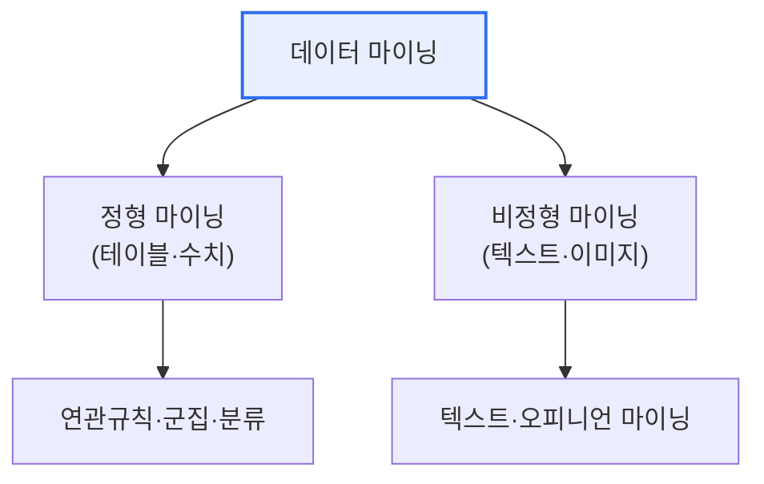

# 데이터 마이닝 — 통계와의 차이, 정형/비정형, 오피니언·텍스트 마이닝

## 1. 개요

### 가. 정의
> **데이터 마이닝**은 대량 데이터에서 숨겨진 패턴·규칙·지식을 발견하는 기법으로, 정형·비정형 데이터를 대상으로 한다. 그중 **텍스트 마이닝**은 비정형 텍스트에서 정보를 추출하고, **오피니언 마이닝**은 텍스트에 담긴 감정·의견(긍정/부정)을 분석한다.

데이터 마이닝을 이해하는 출발점은 '**통계와 무엇이 다른가**'이다. 통계는 대개 가설을 세우고 표본으로 이를 검증하는 **연역적·확인적** 접근인 반면, 데이터 마이닝은 방대한 데이터에서 미리 알지 못한 패턴을 찾아내는 **귀납적·탐색적** 접근이다. 통계가 "이 광고가 매출을 올렸는가?"를 검증한다면, 데이터 마이닝은 "매출과 연관된 숨은 요인이 무엇인가?"를 데이터에서 발견한다. 데이터가 정형(테이블)이면 연관규칙·군집·분류를 쓰고, 비정형(텍스트·이미지)이면 텍스트·오피니언 마이닝 같은 특화 기법이 필요하다.

### 나. 데이터 마이닝과 통계의 차이

| 구분 | 통계 | 데이터 마이닝 |
|---|---|---|
| **접근** | 연역적·확인적(가설 검증) | 귀납적·탐색적(패턴 발견) |
| **데이터** | 표본 중심 | 대량 전수 데이터 |
| **목적** | 가설의 통계적 유의성 확인 | 미지의 패턴·규칙 발견 |
| **전제** | 분포·모형 가정 | 가정 최소, 데이터 주도 |

## 2. 정형 vs 비정형 데이터 마이닝

| 구분 | 정형 데이터 마이닝 | 비정형 데이터 마이닝 |
|---|---|---|
| **대상** | 테이블·수치(거래·로그) | 텍스트·이미지·음성 |
| **기법** | 연관규칙·군집·분류·회귀 | 텍스트·오피니언 마이닝, NLP |
| **전처리** | 정제·정규화 | 형태소 분석·벡터화(임베딩) |
| **난이도** | 상대적 낮음 | 높음(의미 이해 필요) |

## 3. 오피니언 마이닝 수행 절차와 텍스트 마이닝 비교

오피니언 마이닝(감성 분석)은 리뷰·SNS 등에서 사람들의 의견 성향을 분석한다. 수행 절차는 ①대상 텍스트 수집 → ②전처리(형태소 분석·불용어 제거) → ③감성 사전·머신러닝으로 긍정/부정/중립 분류 → ④의견 집계·시각화 순이다.

| 구분 | 텍스트 마이닝 | 오피니언 마이닝 |
|---|---|---|
| **목적** | 텍스트에서 정보·주제 추출 | 텍스트의 감정·의견 분석 |
| **산출** | 키워드·주제·요약·분류 | 긍정/부정/중립, 감성 점수 |
| **관계** | 상위(포괄) 기법 | 텍스트 마이닝의 응용 |
| **활용** | 문서 분류·검색·요약 | 상품 평판·여론 분석 |

즉 오피니언 마이닝은 텍스트 마이닝의 한 응용으로, 단순히 정보를 추출하는 것을 넘어 그 안의 '태도(감정)'까지 분석한다는 점이 특징이다.

## 4. 고려사항 및 시사점

1. **비정형 데이터의 전처리가 성패를 좌우**한다. 텍스트는 형태소 분석·불용어 제거·벡터화 같은 전처리 품질이 분석 결과를 결정하며, 언어·도메인 특성을 반영해야 한다.
2. **문맥·반어 처리가 난제**다. 오피니언 마이닝은 반어·비꼼·이중부정 등으로 감성 판단이 어려우므로, 문맥을 이해하는 딥러닝·LLM 기반 분석으로 정확도를 높인다.
3. **생성형 AI·LLM으로 고도화**된다. 대규모 언어모델이 텍스트·오피니언 마이닝의 정확도와 다국어 처리를 크게 향상시키며, 여론·평판 분석의 실시간·자동화를 이끌고 있다.

---

> **한 줄 요약**: 데이터 마이닝은 *가설 검증의 통계와 달리 대량 데이터에서 패턴을 발견* 하는 탐색적 기법으로, 정형(연관·군집)과 비정형(텍스트·오피니언 마이닝)으로 나뉘며, 오피니언 마이닝은 텍스트의 감정까지 분석하는 텍스트 마이닝의 응용이다.
