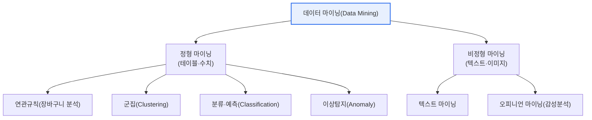

# 데이터 마이닝 — 통계와의 차이, 정형/비정형, 오피니언·텍스트 마이닝

## 1. 개요

### 가. 정의

> **데이터 마이닝(Data Mining)** 은 대량의 데이터에 숨어 있는 패턴·규칙·상관관계·지식을 통계·기계학습·데이터베이스 기술을 결합해 **자동 또는 반자동으로 발견**하는 기법이다. 그중 **텍스트 마이닝(Text Mining)** 은 비정형 텍스트에서 정보·주제·관계를 추출하는 응용이고, **오피니언 마이닝(Opinion Mining, 감성 분석)** 은 텍스트에 담긴 감정·의견의 극성(긍정/부정/중립)과 강도를 판별하는 텍스트 마이닝의 하위 분야이다.

데이터 마이닝을 제대로 이해하려면 먼저 "**통계와 무엇이 다른가**"라는 질문에서 출발해야 한다. 전통적 통계는 분석자가 먼저 가설을 세우고 표본을 뽑아 그 가설의 유의성을 검증하는 **연역적·확인적(confirmatory)** 접근이다. 예컨대 "이번 프로모션이 매출을 유의하게 올렸는가?"라는 명제를 t-검정으로 판정한다. 반면 데이터 마이닝은 가설이 명시적으로 주어지지 않은 상태에서 방대한 데이터 자체가 말하게 하여 **미리 알지 못했던 패턴을 찾아내는 귀납적·탐색적(exploratory)** 접근이다. "매출과 함께 움직이는 숨은 요인이 무엇인가?"를 데이터에서 발굴한다. 이 차이는 단순한 취향의 문제가 아니라, 데이터의 규모가 표본을 넘어 전수(全數)에 가까워지고 변수의 수가 수백·수천으로 늘어난 빅데이터 환경에서 가설을 일일이 세워 검증하는 방식이 현실적으로 불가능해졌기 때문에 생긴 방법론적 진화이다.

데이터 마이닝이 별도의 학문·실무 영역으로 자리 잡은 배경에는 세 가지 힘이 있다. 첫째는 **데이터의 폭증**이다. POS·웹로그·센서·SNS가 매 순간 데이터를 쏟아내면서, 사람이 눈으로 훑어 규칙을 찾는 일이 불가능해졌다. 둘째는 **저장·연산 비용의 하락**이다. 분산 저장(HDFS·오브젝트 스토리지)과 병렬 연산(Spark 등)이 대중화되면서 전수 데이터를 반복 순회하는 알고리즘을 현실적 비용에 돌릴 수 있게 되었다. 셋째는 **의사결정의 데이터화** 요구이다. 경험과 직관 대신 데이터 근거로 판단하려는 조직 문화가 확산되면서, 정형 거래 데이터뿐 아니라 리뷰·민원·소셜 등 비정형 텍스트까지 분석 대상으로 끌어들이게 되었다. 데이터가 정형(테이블·수치)이면 연관규칙·군집·분류·회귀를 쓰고, 비정형(텍스트·이미지·음성)이면 텍스트·오피니언 마이닝 같은 특화 기법이 필요하다.

### 나. 데이터 마이닝과 통계의 차이

통계와 데이터 마이닝은 대립하는 것이 아니라 **목적과 데이터 환경이 다를 뿐 상호 보완**한다. 통계는 표본에서 모집단을 추론하고 불확실성을 정량화(신뢰구간·p-값)하는 데 강하고, 데이터 마이닝은 대량 데이터에서 사전 가정 없이 패턴을 찾아 예측 모델을 만드는 데 강하다. 실무에서는 데이터 마이닝으로 후보 패턴을 발굴한 뒤 통계적 검정으로 그 패턴이 우연이 아닌지 확인하는 식으로 결합한다. 차이가 생기는 근본 이유는 "가설을 먼저 두는가(통계), 데이터가 먼저 말하게 하는가(마이닝)"라는 **인식의 출발점** 차이에 있다.

| 구분 | 통계 | 데이터 마이닝 |
|---|---|---|
| **접근** | 연역적·확인적(가설 검증) | 귀납적·탐색적(패턴 발견) |
| **데이터** | 표본 중심, 소·중규모 | 대량·전수 데이터, 고차원 |
| **목적** | 가설의 통계적 유의성 확인 | 미지의 패턴·규칙·예측 모델 발견 |
| **전제** | 분포·모형 가정(정규성 등) | 가정 최소, 데이터 주도 |
| **결과 해석** | 인과·유의성 중심 | 상관·예측력 중심 |

이 표의 각 행은 "왜 그런지"를 함께 읽어야 한다. 통계가 분포 가정을 두는 것은 표본으로 모집단을 추론하기 위해 수학적 근거가 필요하기 때문이고, 데이터 마이닝이 가정을 최소화하는 것은 전수에 가까운 데이터에서는 추론보다 데이터에 내재한 구조 자체가 더 신뢰할 만하기 때문이다. 또한 통계가 인과·유의성에 집중하는 반면 마이닝이 상관·예측력에 집중하는 것은, 마이닝의 목적이 "왜 그런가"의 설명보다 "다음에 무엇이 일어날까"의 예측에 있는 경우가 많기 때문이다.

## 2. 데이터 마이닝의 전체 구조와 주요 기법

데이터 마이닝은 단일 알고리즘이 아니라, 목적에 따라 갈라지는 **기법군의 집합**이다. 크게 무엇을 알고 싶은지에 따라 연관(함께 일어나는 것), 군집(비슷한 것끼리 묶기), 분류/예측(정답을 맞히기), 이상탐지(정상에서 벗어난 것)로 나뉜다. 아래 구조도는 데이터 마이닝의 큰 갈래를, 이어지는 세부도는 정형·비정형 처리 흐름을 보여 준다.

```mermaid
flowchart TB
  D["데이터 마이닝(Data Mining)"] --> S["정형 마이닝<br/>(테이블·수치)"]
  D --> U["비정형 마이닝<br/>(텍스트·이미지)"]
  S --> S1["연관규칙(장바구니 분석)"]
  S --> S2["군집(Clustering)"]
  S --> S3["분류·예측(Classification)"]
  S --> S4["이상탐지(Anomaly)"]
  U --> U1["텍스트 마이닝"]
  U --> U2["오피니언 마이닝(감성분석)"]
  style D fill:#e8f0fe,stroke:#2f6fed,stroke-width:2px
```

**연관규칙(Association Rule)** 은 "맥주를 산 고객이 기저귀도 함께 산다"처럼 항목 간 동시 발생 규칙을 지지도(support)·신뢰도(confidence)·향상도(lift)로 정량화한다. 이는 상품 추천·매대 배치·교차판매의 근거가 된다. 예를 들어 어떤 규칙의 지지도가 5%, 신뢰도가 60%, 향상도가 2.5라면 "두 상품이 우연보다 2.5배 더 자주 함께 팔린다"는 실무적 의미로 해석되어 번들 상품 기획에 쓰인다.

이들 기법을 실제 프로젝트에서 엮는 표준 절차로는 **CRISP-DM(Cross-Industry Standard Process for Data Mining)** 이 널리 쓰인다. 이는 ① 비즈니스 이해 → ② 데이터 이해 → ③ 데이터 준비 → ④ 모델링 → ⑤ 평가 → ⑥ 배포의 여섯 단계를 반복 순환하는 방법론이다. 이 절차가 강조하는 핵심은 "알고리즘보다 앞뒤가 중요하다"는 점이다. 무엇을 풀어야 하는지(비즈니스 이해)와 결과를 어떻게 쓸지(배포)가 불분명하면, 아무리 정교한 모델도 현업에서 버려진다. 실제로 데이터 마이닝 프로젝트 공수의 절반 이상은 모델링이 아니라 데이터 준비(정제·통합·변환)에 쓰인다는 것이 현장의 경험칙이며, 텍스트 마이닝에서는 전처리 비중이 더욱 커진다.

또 하나 유의할 점은 발견한 패턴이 **행동으로 옮길 수 있는(actionable)** 것인지의 판별이다. "비 오는 날 우산이 잘 팔린다"처럼 뻔하거나 통제 불가능한 패턴은 통계적으로 강해도 가치가 낮다. 반대로 지지도는 낮아도 수익성 높은 틈새 규칙은 실무적으로 값지다. 따라서 데이터 마이닝의 성과는 알고리즘의 정확도만이 아니라, 그 결과가 의사결정과 실행으로 연결되는지에 따라 최종 평가된다.

**군집(Clustering)** 은 정답 레이블 없이 비슷한 개체끼리 묶는 비지도 학습으로, 고객 세분화(RFM 기반 우량·이탈 위험 고객 구분)에 널리 쓰인다. 군집은 "미리 몇 개의 집단이 있는지 모른다"는 점에서 탐색적이며, 마케팅 전략을 집단별로 차별화하는 출발점이 된다. **분류·예측(Classification·Regression)** 은 과거 정답이 있는 지도 학습으로, 이탈 예측·부도 예측·스팸 판별 등에 쓰이고 정확도·정밀도·재현율로 성능을 평가한다. **이상탐지(Anomaly Detection)** 는 정상 패턴에서 크게 벗어난 관측을 찾아 카드 부정거래·설비 고장·침입 탐지에 활용된다.

### 정형 vs 비정형 데이터 마이닝

정형과 비정형의 근본 차이는 "**컴퓨터가 곧바로 계산할 수 있는 형태인가**"이다. 정형 데이터는 이미 행·열의 숫자·범주로 구조화되어 있어 전처리가 상대적으로 가볍지만, 비정형 텍스트는 사람의 언어라서 형태소 분석·불용어 제거·벡터화(임베딩)라는 무거운 변환을 거쳐야 비로소 숫자가 되고, 이 과정에서 의미의 손실·왜곡이 발생할 수 있다. 그래서 비정형 마이닝은 "의미를 얼마나 잘 수치로 보존하느냐"가 성패를 가른다.

| 구분 | 정형 데이터 마이닝 | 비정형 데이터 마이닝 |
|---|---|---|
| **대상** | 테이블·수치(거래·로그) | 텍스트·이미지·음성 |
| **기법** | 연관규칙·군집·분류·회귀 | 텍스트·오피니언 마이닝, NLP |
| **전처리** | 정제·결측/이상치 처리·정규화 | 형태소 분석·불용어 제거·벡터화(임베딩) |
| **난이도** | 상대적 낮음 | 높음(의미 이해·문맥 필요) |
| **평가** | 정확도·RMSE 등 명확 | 정답 모호, 사람 라벨링 의존 |

## 3. 텍스트 마이닝과 오피니언 마이닝

### 가. 텍스트 마이닝의 처리 흐름

텍스트 마이닝은 비정형 문서 더미를 컴퓨터가 다룰 수 있는 구조로 바꾸고, 거기서 키워드·주제·관계·요약을 뽑아내는 일련의 과정이다. 핵심은 "언어를 숫자로 바꾸는 벡터화"에 있다. 초기에는 단어의 등장 빈도를 세는 TF-IDF나 단어 가방(Bag-of-Words)을 썼지만, 이는 단어의 순서와 문맥을 버린다는 한계가 있었다. 이후 Word2Vec 같은 분산 표현이 단어의 의미적 유사성을 벡터 거리로 담아냈고, 최근에는 BERT·GPT 계열의 문맥 임베딩이 같은 단어라도 문장 안 위치에 따라 다른 벡터를 부여하여 "은행(bank)"이 강가인지 금융기관인지까지 구분한다.

```mermaid
flowchart LR
  A["텍스트 수집(리뷰·SNS)"] --> B["전처리<br/>(형태소분석·불용어제거)"]
  B --> C["벡터화<br/>(TF-IDF·임베딩)"]
  C --> D["분석<br/>(분류·군집·주제추출)"]
  D --> E["집계·시각화·활용"]
  style C fill:#e8f0fe,stroke:#2f6fed,stroke-width:2px
```

전처리 단계에서 한국어는 영어보다 까다롭다. 영어는 띄어쓰기로 단어가 비교적 잘 분리되지만, 한국어는 조사·어미가 붙는 교착어라서 형태소 분석기(예: Mecab·Okt)로 "먹었다 → 먹/다"처럼 어간을 추출해야 같은 의미의 표현을 하나로 모을 수 있다. 이 단계의 품질이 낮으면 이후 모든 분석이 흔들리므로, 도메인 사전(신조어·전문용어)을 갖추는 것이 실무의 관건이다.

### 나. 오피니언 마이닝의 수행 절차

오피니언 마이닝(감성 분석)은 리뷰·SNS·민원 등에서 사람들의 의견 성향과 강도를 판별한다. 수행 절차는 ① 대상 텍스트 수집 → ② 전처리(형태소 분석·불용어 제거) → ③ 감성 사전 또는 기계학습·딥러닝으로 긍정/부정/중립 분류 → ④ 의견 집계·시각화 순이다. 접근 방식은 크게 둘로 나뉜다. **사전 기반(lexicon)** 방식은 "좋다=+2, 나쁘다=-2"처럼 감성 점수를 매긴 사전으로 문장 점수를 합산하는 방식으로, 해석이 투명하지만 신조어·도메인 표현에 약하다. **기계학습·딥러닝 기반** 방식은 사람이 라벨링한 데이터로 모델을 학습시켜 문맥을 반영하지만, 양질의 학습 데이터가 필요하고 판단 근거가 불투명하다는 트레이드오프가 있다.

| 구분 | 텍스트 마이닝 | 오피니언 마이닝 |
|---|---|---|
| **목적** | 텍스트에서 정보·주제 추출 | 텍스트의 감정·의견·태도 분석 |
| **산출** | 키워드·주제·요약·문서분류 | 긍정/부정/중립, 감성 점수·강도 |
| **관계** | 상위(포괄) 기법 | 텍스트 마이닝의 응용(하위) |
| **활용** | 문서 분류·검색·요약·주제모델링 | 상품 평판·여론·브랜드 모니터링 |
| **난점** | 벡터화·다의어 처리 | 반어·문맥·도메인 극성 반전 |

즉 오피니언 마이닝은 텍스트 마이닝의 한 응용으로, 단순히 정보를 추출하는 것을 넘어 그 안의 '태도(감정)'까지 읽어낸다는 점이 차별점이다. 최근에는 문장 전체의 극성만 보는 것을 넘어, "화면은 좋지만 배터리는 별로"처럼 **속성(aspect)별 감성**을 나누어 분석하는 ABSA(Aspect-Based Sentiment Analysis)가 제품 개선의 실질 근거로 각광받는다.

## 4. 산업 적용 사례

구체적 사례로 실효성을 가늠할 수 있다. 첫째, **전자상거래**에서는 상품 리뷰 수십만 건을 오피니언 마이닝으로 분석해 "배송 지연", "포장 파손" 같은 부정 키워드가 급증하는 상품을 조기에 걸러내 물류 개선에 반영한다. 둘째, **금융·통신**에서는 콜센터 상담 로그를 텍스트 마이닝하여 반복 민원의 주제를 군집화하고, 이탈 위험이 높은 부정 감성 고객을 선별해 선제적 해지 방어(리텐션) 캠페인의 타깃으로 삼는다. 셋째, **공공·정책** 분야에서는 SNS·뉴스 댓글의 여론을 실시간 모니터링하여 정책에 대한 긍·부정 추이를 추적하고 위기 이슈를 조기 감지한다. 이들 사례의 공통점은 정형 지표(매출·해지율)만으로는 보이지 않던 '이유'를 비정형 텍스트에서 건져 올린다는 데 있다.

이러한 분석이 실무에서 힘을 갖는 것은 **정형 지표와의 결합** 덕분이다. 예를 들어 어떤 통신사의 특정 요금제 해지율이 한 달 새 3%p 상승했다면, 정형 데이터는 '얼마나' 이탈했는지는 알려 주지만 '왜'는 말해 주지 않는다. 이때 해당 고객군의 상담·리뷰 텍스트를 오피니언 마이닝하면 "약정 위약금 불만"이나 "속도 저하" 같은 부정 주제가 상위로 떠오르고, 이는 곧바로 요금제 개편·네트워크 투자라는 실행으로 연결된다. 이렇게 "정형이 알려 준 변화 → 비정형이 알려 준 원인 → 실행"으로 이어지는 순환이 데이터 마이닝이 조직에 주는 실질적 가치의 전형이다. 반대로 텍스트 분석 결과가 정형 성과 지표와 연결되지 못하면, 흥미로운 워드클라우드에 그칠 뿐 의사결정으로 이어지지 못한다는 점도 실무의 교훈이다.

## 5. 심화 — 생성형 AI·LLM에 의한 텍스트·오피니언 마이닝의 전환

최근 텍스트·오피니언 마이닝의 지형을 가장 크게 바꾼 것은 **대규모 언어모델(LLM)** 이다. 과거에는 감성 분석을 위해 도메인마다 별도의 라벨링 데이터를 모아 모델을 새로 학습시켜야 했지만, LLM은 사전학습된 언어 이해를 바탕으로 소량의 예시만 제시하는 퓨샷(few-shot)·프롬프트만으로도 상당한 수준의 감성 분류·요약·주제 추출을 수행한다. 이는 초기 구축 비용과 시간을 크게 낮춘다. 또한 LLM은 반어·비꼼·이중부정처럼 전통적 사전 기반 방식이 취약했던 문맥 의존 표현을 상대적으로 잘 처리하고, 다국어를 하나의 모델로 다룰 수 있어 글로벌 여론 분석의 문턱을 낮춘다.

다만 LLM 도입에는 실무적 고려가 따른다. 판단 근거가 불투명한 블랙박스 특성, 사실과 다른 내용을 그럴듯하게 생성하는 환각(hallucination), 그리고 대량 텍스트를 API로 처리할 때의 비용·지연·데이터 유출 위험이다. 그래서 실제 현장에서는 민감 데이터는 사내에 두고 경량 모델을 파인튜닝하거나, LLM을 1차 분류에만 쓰고 최종 판단은 규칙·사람 검수로 보정하는 하이브리드 구성이 늘고 있다. 기술사 관점에서 이는 "최신 기술을 무조건 도입"하는 것이 아니라 **정확성·비용·보안·설명가능성의 균형점**을 설계하는 문제로 귀결된다.

## 6. 고려사항 및 시사점

1. **비정형 데이터의 전처리 품질이 성패를 좌우한다.** 형태소 분석·불용어 제거·벡터화의 품질이 이후 모든 분석 결과를 결정하므로, 언어·도메인 특성을 반영한 사전과 파이프라인 표준화에 우선 투자해야 한다.
2. **문맥·반어·도메인 극성 반전이 최대 난제다.** 같은 "미쳤다"가 칭찬일 수도 비난일 수도 있듯, 도메인마다 극성이 뒤집히므로 문맥을 이해하는 딥러닝·LLM과 속성 기반(ABSA) 분석으로 정확도를 끌어올리되, 사람 검수로 오분류를 보정하는 체계가 필요하다.
3. **정형·비정형·통계의 결합이 가치를 만든다.** 마이닝으로 발굴한 패턴을 통계로 검증하고, 텍스트가 알려 준 '이유'를 정형 지표(매출·이탈)와 연결해야 실행 가능한 인사이트가 된다. 단일 기법에 의존하지 않는 설계가 핵심이다.
4. **데이터 윤리·프라이버시·편향을 설계에 내재화해야 한다.** 리뷰·SNS 텍스트에는 개인정보와 사회적 편향이 섞여 있어, 수집 동의·비식별·편향 완화를 파이프라인에 반영하지 않으면 법적·평판 리스크로 되돌아온다.
5. **평가의 어려움을 인정하고 지속 개선 체계를 갖춘다.** 텍스트 분석은 정답이 모호하므로, 정기적 샘플 검수·재라벨링·모델 재학습을 전제로 한 MLOps 관점의 운영이 일회성 구축보다 중요하다.

## 참고자료

- Bing Liu, "Sentiment Analysis and Opinion Mining", Morgan & Claypool (개론): https://www.cs.uic.edu/~liub/FBS/sentiment-analysis.html
- scikit-learn, Working with Text Data(TF-IDF·분류): https://scikit-learn.org/stable/tutorial/text_analytics/working_with_text_data.html
- Google, Word2Vec / 임베딩 개요: https://developers.google.com/machine-learning/crash-course/embeddings

---

> **한 줄 요약**: 데이터 마이닝은 *가설 검증의 통계와 달리 대량 데이터에서 패턴을 발견* 하는 탐색적 기법으로, 정형(연관·군집·분류)과 비정형(텍스트·오피니언 마이닝)으로 나뉘며, 오피니언 마이닝은 텍스트의 태도(감정)까지 읽는 텍스트 마이닝의 응용으로 LLM에 힘입어 정확도·다국어·실시간성이 크게 향상되고 있다.
