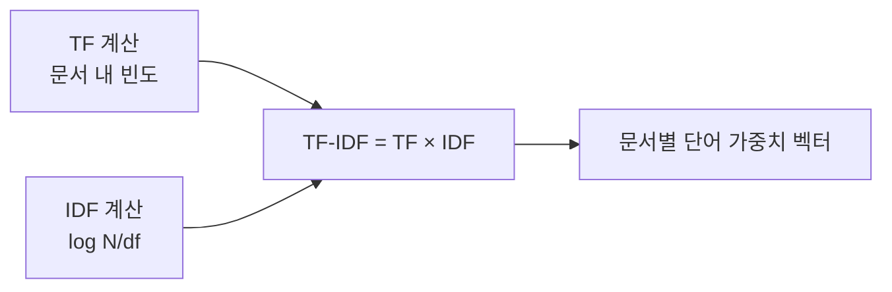

# TF-IDF (Term Frequency – Inverse Document Frequency)

## 1. 개요

### 가. 정의
> 문서 집합(코퍼스) 안에서 **한 단어가 특정 문서를 얼마나 잘 대표하는지**를 수치화하는 가중치 기법. 한 문서에서 자주 등장하고(**TF**), 전체 문서 전반에서는 드물게 등장하는(**IDF**) 단어일수록 높은 가중치를 부여한다.

### 나. 등장 배경 및 필요성
문서를 벡터로 표현하는 가장 단순한 방법은 단어 출현 빈도(Bag-of-Words)를 그대로 세는 것이다. 그러나 이 방식은 "은/는/이/가", "the/of/and" 같은 **불용어가 어느 문서에나 많이 나오기 때문에 빈도만으로는 오히려 이런 흔한 단어가 문서를 대표하는 것처럼 왜곡**된다. TF-IDF는 이 문제를 "**흔한 단어는 변별력이 없다**"는 직관으로 해결한다. 모든 문서에 두루 나오는 단어는 특정 문서를 구별하는 데 쓸모가 없으므로 IDF로 가중치를 깎고, 특정 문서에만 몰려 나오는 단어에는 가중치를 실어 줌으로써 **문서의 특징어(keyword)** 를 드러낸다. 단순·빠르면서도 해석이 명확해 검색엔진 랭킹, 문서 분류, 키워드 추출의 오랜 표준이 되었다.

## 2. 계산식과 각 항의 의미

TF-IDF는 두 요소의 곱으로 정의되며, 각 항이 서로 다른 방향에서 단어의 중요도를 조정한다.

| 항목 | 정의 | 직관적 의미 |
|---|---|---|
| **TF(t,d)** | 문서 d에서 단어 t의 출현 빈도(또는 정규화 빈도) | 이 문서에서 얼마나 자주 쓰였나 → 국소 중요도 |
| **IDF(t)** | **log( N / df(t) )**, N=전체 문서 수, df=t가 등장한 문서 수 | 코퍼스 전체에서 얼마나 희귀한가 → 변별력 |
| **TF-IDF** | **TF(t,d) × IDF(t)** | 국소 빈도 × 전역 희귀도 |

> IDF에 로그를 씌우는 이유는 두 가지다. 첫째, N/df가 문서 수가 많을 때 지나치게 커지는 것을 완만하게 눌러 TF와 균형을 맞춘다. 둘째, 단어가 흔해질수록(df↑) 값이 부드럽게 작아지고, 모든 문서에 나오면(df=N) log 1 = 0이 되어 **변별력 없는 단어의 가중치가 자연스럽게 0으로 소거**된다.

TF에도 로그 스케일링(1+log TF)이나 문서 길이 정규화를 적용하는 변형이 흔하다. 같은 단어가 3번 나왔다고 해서 1번 나온 문서보다 중요도가 정확히 3배라고 보기 어렵기 때문에, 빈도의 한계효용 체감을 반영하려는 것이다.

## 3. 계산 과정(예시)

계산은 TF와 IDF를 각각 구한 뒤 곱하는 단순한 흐름이다. 전체 문서 N=3, 단어 "AI"가 3개 중 2개 문서에 등장(df=2)하는 상황을 보자.

- IDF(AI) = log(3/2) = log(1.5) ≈ **0.176** (문제에서 주어진 log값을 그대로 사용)
- 문서1에서 "AI"가 3번 등장(TF=3) → TF-IDF = 3 × 0.176 ≈ **0.528**

만약 어떤 단어가 세 문서 모두에 나온다면 df=3, IDF=log(3/3)=log 1=0이 되어 TF가 아무리 커도 TF-IDF는 0이 된다. 이것이 "**흔한 단어는 특징어가 아니다**"라는 원리가 수식으로 구현되는 지점이다. 이렇게 각 문서를 단어별 TF-IDF 값의 벡터로 표현하면, 문서 간 유사도(코사인 유사도)나 질의-문서 매칭 점수를 계산할 수 있다.

## 4. 특징과 한계

TF-IDF의 강점은 계산이 가볍고 결과를 사람이 해석할 수 있다는 데 있다. 그러나 근본적으로 **단어를 독립된 기호로만 다루기 때문에 의미를 이해하지 못한다.**

| 구분 | 내용 | 이유 |
|---|---|---|
| **장점** | 단순·고속, 해석 용이, 특징어 추출 효과 | 통계적 빈도 기반이라 학습 불필요 |
| **한계** | 의미·문맥·어순 미반영 | 단어를 원자적 토큰으로만 취급 |
| **한계** | 동의어·다의어 처리 불가 | "차"와 "자동차"를 다른 단어로 봄 |
| **한계** | 고차원 희소(sparse) 벡터 | 어휘 수만큼 차원, 대부분 0 |
| **대안** | Word2Vec·BERT 등 임베딩 | 문맥·의미를 밀집 벡터로 학습 |

예를 들어 "은행 예금"과 "강 은행(둑)"에서 "은행"은 전혀 다른 뜻이지만 TF-IDF는 같은 단어로 처리해 문맥을 구분하지 못한다. 이런 의미·문맥 문제를 해결하기 위해 단어를 밀집 벡터로 학습하는 **임베딩(Word2Vec, BERT)** 이 등장했다.

## 5. 고려사항 및 시사점
- **전처리가 품질을 좌우한다**: 토큰화·불용어 제거·어간추출·정규화의 품질이 TF-IDF 결과를 결정한다. 특히 한국어는 조사·어미 처리를 위한 형태소 분석이 선행되어야 한다.
- **여전히 유효한 기반 기술**: 의미 기반 임베딩이 발전했지만, TF-IDF의 진화형인 **BM25**는 문서 길이 정규화와 빈도 포화를 반영해 지금도 검색 랭킹의 강력한 기준선(baseline)으로 쓰인다.
- **RAG 하이브리드 검색과의 결합**: 최신 RAG 파이프라인은 의미를 잡는 벡터(임베딩) 검색과 정확한 키워드 매칭에 강한 BM25/TF-IDF 검색을 **하이브리드**로 결합해, 각자의 약점을 상호 보완하는 방식으로 검색 정확도를 끌어올린다.

---

> **한 줄 요약**: TF-IDF는 *TF(문서 내 빈도) × IDF(log N/df)* 로 단어 중요도를 계산해 특정 문서에 자주·전체에는 드물게 나오는 특징어에 높은 가중치를 주는 기법으로, 흔한 단어를 자동으로 소거하는 장점이 있으나 의미·문맥을 반영하지 못해 임베딩·BM25로 발전하며 RAG 하이브리드 검색에 병용된다.
