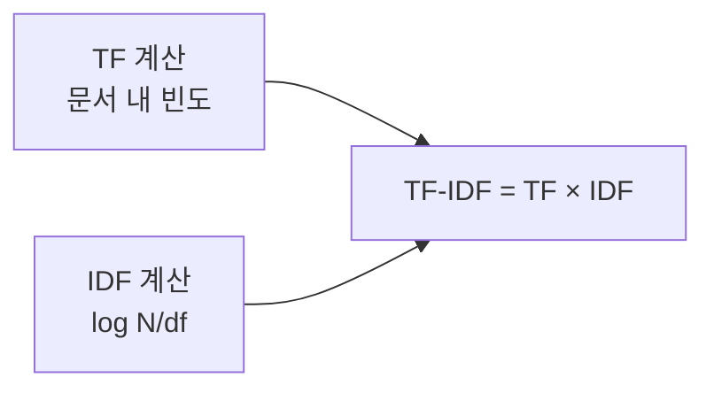

# TF-IDF (Term Frequency – Inverse Document Frequency)

## 1. 개요

### 가. 정의
> 문서 내 단어의 **중요도**를 수치화하는 가중치 기법. 한 문서에서 자주 나오고(**TF**) 전체 문서에서는 드물게 나오는(**IDF**) 단어에 높은 가중치를 부여한다.

### 나. 필요성
- 단순 빈도의 한계(불용어 편중) 보완, **문서 특징어 추출**·검색·분류

## 2. 계산식

| 항목 | 정의 |
|---|---|
| **TF(t,d)** | 문서 d에서 단어 t의 빈도(또는 정규화 빈도) |
| **IDF(t)** | **log( N / df(t) )** — N: 전체 문서 수, df: t가 등장한 문서 수 |
| **TF-IDF** | **TF(t,d) × IDF(t)** |

> IDF는 등장 문서가 많을수록(흔할수록) 값이 작아져 가중치를 낮춘다.

## 3. 계산 과정(예시)

**예**: 전체 문서 N=3, 단어 "AI"가 2개 문서에 등장(df=2)
- IDF(AI) = log(3/2) = log(1.5) ≈ 0.176 (제시된 log값 사용)
- 문서1에서 TF(AI)=3 → TF-IDF = 3 × 0.176 ≈ **0.528**

> 문제에서 주어진 log값을 그대로 사용하고, df(등장 문서 수)를 가공 없이 적용해 각 문서·단어의 TF-IDF를 산출한다.

## 4. 특징·한계

| 구분 | 내용 |
|---|---|
| **장점** | 단순·해석 용이, 특징어 추출 효과 |
| **한계** | 의미·문맥·어순 미반영, 희소 벡터 |
| **대안** | Word2Vec·BERT 등 임베딩(문맥 반영) |

## 5. 고려사항 및 시사점
- 검색엔진 랭킹·문서 분류·키워드 추출에 활용
- 전처리(토큰화·불용어·정규화)가 품질 좌우
- 임베딩·BM25 등으로 발전, RAG 하이브리드 검색에 병용

---

> **한 줄 요약**: TF-IDF는 *TF(문서 내 빈도) × IDF(log N/df)* 로 단어 중요도를 계산해, 특정 문서에 자주·전체에는 드물게 나오는 단어에 높은 가중치를 부여하는 특징어 추출·검색 기법이다.
