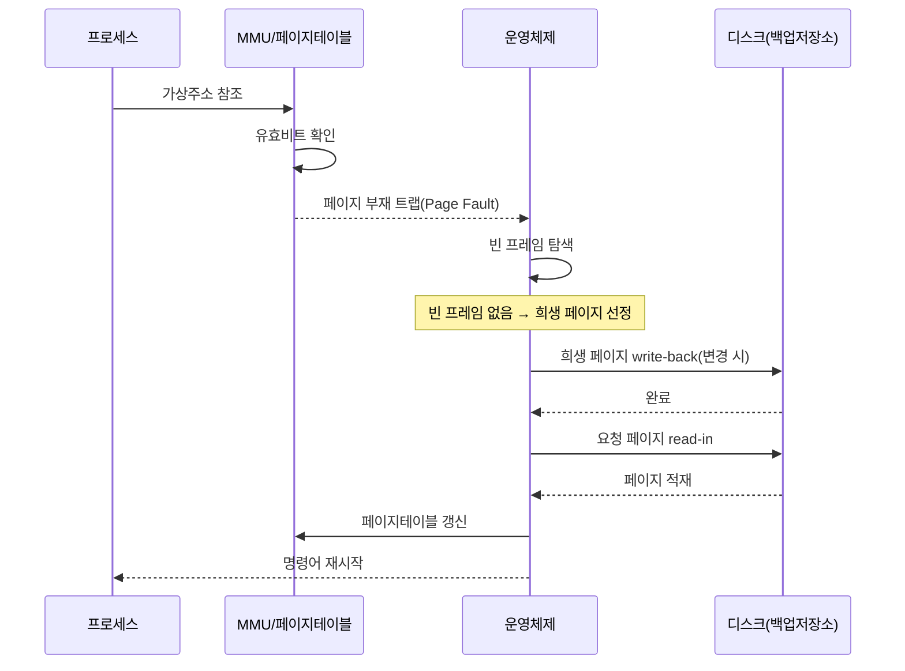

# 스레싱(Thrashing)

## 1. 개요

### 가. 정의
> **스레싱(Thrashing)** 은 가상 메모리 시스템에서 **페이지 부재(Page Fault)가 과도하게 발생해, CPU가 실제 연산보다 페이지 교체(스와핑)에 더 많은 시간을 쓰면서 시스템 처리량(throughput)이 급격히 붕괴하는 현상**이다. 다중 프로그래밍 정도(degree of multiprogramming)가 임계점을 넘는 순간 CPU 이용률이 수직으로 추락하는 것이 그 징표다.

스레싱의 본질은 '**일은 안 하고 페이지 바꾸기만 반복한다**'는 데 있다. 가상 메모리는 프로그램 전체를 물리 메모리에 올리지 않고, 실행에 필요한 페이지만 수요 적재(demand paging)로 올려두는 기법이다. 이 덕분에 물리 메모리보다 큰 프로그램을 실행하고 여러 프로세스를 동시에 돌릴 수 있다. 그러나 이 기법은 '필요한 페이지는 이미 메모리에 있을 것'이라는 참조 지역성 가정 위에 서 있으며, 이 가정이 무너지는 순간 시스템은 스레싱으로 붕괴한다.

문제의 뿌리는 **물리 메모리(프레임) 총량은 유한한데 실행하려는 프로세스가 너무 많다**는 데 있다. 각 프로세스가 자신의 작업에 필요한 최소한의 페이지 집합조차 확보하지 못하면, A 페이지를 올리기 위해 B를 내보내고(page-out), 곧 B가 다시 필요해 C를 내보내며 B를 올리고, 그 사이 A가 또 필요해지는 '페이지 뺏고 뺏기기'가 끝없이 반복된다. CPU는 정작 명령어를 실행하지 못한 채 디스크 입출력이 끝나기만 기다린다. 실제로 페이지 부재 한 번의 처리 비용은 수 밀리초(HDD 기준 약 5~10ms, SSD라도 수십~수백 마이크로초) 수준으로, 나노초 단위인 CPU 명령 실행보다 수만 배 이상 느리다. 부재율이 조금만 높아져도 유효 접근 시간이 폭증하는 이유가 여기에 있다.

여기에 **운영체제의 오판이 악순환을 완성**한다. 스레싱이 시작되면 CPU 이용률이 바닥을 치는데, 중기 스케줄러(스케줄링 정책)는 이를 'CPU가 한가하다'고 해석해 다중 프로그래밍 정도를 더 높인다. 프로세스가 추가로 투입되면 프레임 경쟁은 더 격화되고, 페이지 부재는 더 폭증하며, CPU 이용률은 더 떨어진다. 이 되먹임 고리(feedback loop)가 스레싱을 단순한 성능 저하가 아니라 '자기 강화형 붕괴'로 만드는 핵심이다. 따라서 스레싱은 자원을 늘려서가 아니라 **다중 프로그래밍 정도를 통제**해야 근본적으로 벗어날 수 있다.

### 나. 스레싱의 특징
스레싱은 단순한 과부하와 구별되는 몇 가지 특징을 가진다. 첫째, **비선형적 붕괴**다. 부하가 점진적으로 늘 때 성능도 완만히 떨어지는 것이 아니라, 임계점을 지나는 순간 절벽처럼 급락한다. 둘째, **낮은 CPU 이용률과 높은 디스크 활동의 동시 출현**이라는 역설적 지표를 보인다. 겉으로 CPU는 놀고 있는데 시스템은 마비 상태다. 셋째, **자기 악화성**이다. 개입하지 않으면 스스로 회복되지 못하고 더 나빠진다.

## 2. 발생 원리와 메커니즘

### 가. 다중 프로그래밍 정도와 CPU 이용률의 관계

위 다이어그램은 스레싱의 악순환 고리를 나타낸다. 핵심은 마지막의 붉은 노드, 즉 **운영체제가 낮은 CPU 이용률을 잘못 해석해 부하를 더 얹는 단계**다. 이 되먹임이 없다면 스레싱은 일시적 성능 저하에 그치겠지만, OS의 오판이 개입하면서 붕괴가 가속된다.

다중 프로그래밍 정도를 x축, CPU 이용률을 y축에 놓고 보면 곡선은 세 구간으로 나뉜다. 초기 구간에서는 프로세스를 늘릴수록 CPU가 놀지 않고 일하므로 이용률이 상승한다. 두 번째 구간, 즉 임계점 부근에서는 이용률이 정점에 이른다. 이 지점이 물리 메모리가 모든 프로세스의 워킹셋을 겨우 담을 수 있는 균형점이다. 세 번째 구간에서 프로세스를 더 투입하면 각 프로세스의 프레임이 워킹셋 이하로 줄면서 페이지 부재가 폭발하고, CPU 이용률은 수직 낙하한다. 스레싱은 바로 이 세 번째 구간에서 발생한다. 실무적으로 '정점 직전'을 노려 다중 프로그래밍 정도를 제어하는 것이 스케줄링의 목표가 된다.

### 나. 페이지 부재 처리의 세부 흐름

이 순차 다이어그램은 페이지 부재 한 번을 처리하는 데 얼마나 많은 단계가 개입하는지를 보여준다. 특히 **빈 프레임이 없을 때** 희생 페이지(victim)를 골라 디스크에 기록(write-back)하고, 다시 요청 페이지를 읽어오는 두 번의 디스크 I/O가 발생할 수 있다는 점이 중요하다. 스레싱 상태에서는 거의 모든 페이지 부재가 이 '빈 프레임 없음' 경로를 타므로, 부재 한 번이 두 번의 디스크 접근을 유발해 병목이 배가된다. 변경되지 않은(clean) 페이지를 우선 희생시키는 최적화가 존재하는 이유도 write-back 한 번을 아끼기 위해서다.

유효 접근 시간(EAT)으로 정량화하면 그 심각성이 분명해진다. 메모리 접근을 100ns, 페이지 부재 처리를 8ms(=8,000,000ns)로 두면, 부재율 p일 때 EAT ≈ (1-p)×100 + p×8,000,000 이다. 부재율이 0.1%(p=0.001)만 되어도 EAT는 약 8,100ns로 정상보다 80배 느려진다. 스레싱 구간에서는 부재율이 수 %에 달하므로 시스템이 사실상 정지 상태가 되는 것이다.

### 다. 워킹셋과 지역성
스레싱을 이해하고 통제하는 이론적 토대가 **참조 지역성(locality of reference)** 과 **워킹셋(working set)** 이다. 프로그램은 임의의 순간에 전체 주소 공간을 고루 참조하는 것이 아니라, 특정 시점에는 일부 페이지 집합에 참조가 집중된다. 시간 지역성(방금 쓴 데이터를 곧 다시 쓴다)과 공간 지역성(인접 주소를 함께 쓴다)이 그것이다. 프로그램의 실행은 이런 지역성 집합이 시간에 따라 옮겨가는 '국면(phase) 전환'의 연속으로 볼 수 있다.

워킹셋은 이 아이디어를 정량화한 개념으로, **최근 Δ(워킹셋 윈도) 시간 동안 참조된 서로 다른 페이지의 집합**으로 정의한다. Denning이 제시한 워킹셋 모델의 통찰은 '각 프로세스에 그 워킹셋 크기만큼의 프레임을 보장하면 페이지 부재가 급감한다'는 것이다. 반대로 프레임이 워킹셋보다 부족하면 국면이 안정적일 때조차 부재가 반복된다. 시스템 전체의 워킹셋 합계가 물리 프레임 수를 초과하는 순간이 바로 스레싱의 임계점이며, 이때 OS는 프로세스 하나를 스왑아웃해 합계를 낮춰야 한다.

### 라. 페이지 교체 정책의 영향
스레싱의 빈도는 페이지 교체 알고리즘과도 얽혀 있다. 전역 교체(global replacement)는 한 프로세스의 부재를 다른 프로세스의 프레임을 뺏어 해결하므로, 한 프로세스의 폭주가 시스템 전체로 전염되어 스레싱을 유발하기 쉽다. 반면 지역 교체(local replacement)는 각 프로세스가 자신에게 할당된 프레임 안에서만 교체하므로 전염을 막지만, 처음부터 할당이 워킹셋에 못 미치면 그 프로세스 내부에서 홀로 스레싱한다. 또한 FIFO 알고리즘은 프레임을 늘렸는데 부재가 오히려 늘어나는 **벨라디의 역설(Belady's Anomaly)** 을 보일 수 있어, 스택 알고리즘인 LRU 계열이 스레싱 관점에서 더 안전하다.

## 3. 해결 방법 비교

스레싱 대책은 크게 '워킹셋을 보장하는 쪽', '부재율을 직접 감시·조절하는 쪽', '부하 자체를 낮추는 쪽', '자원을 늘리는 쪽'으로 나뉜다. 아래 표는 이를 정리하되, 각 기법이 왜 효과가 있고 어떤 한계가 있는지는 이어서 산문으로 설명한다.

| 해결 방법 | 원리 | 한계·비용 |
|---|---|---|
| **워킹셋 모델** | 프로세스가 필요로 하는 페이지 집합 크기만큼 프레임 할당 | 윈도 Δ 추정·워킹셋 측정 오버헤드 |
| **PFF(Page-Fault Frequency)** | 페이지 부재율 상·하한으로 프레임 동적 조절 | 임계값 설정이 워크로드 의존적 |
| **다중프로그래밍 정도 조절** | 임계 초과 시 일부 프로세스 스왑아웃(중단) | 스왑아웃 프로세스의 응답성 저하 |
| **물리 메모리 증설** | 근본적 프레임 부족 해소 | 비용, 주소 공간·전력 한계 |
| **지역성 개선** | 참조 지역성 높은 코드·자료구조 설계 | 애플리케이션 재설계 필요 |

**워킹셋 모델**은 가장 근본적인 접근이다. OS가 각 프로세스의 워킹셋 크기를 추정하고 그만큼 프레임을 보장하되, 모든 프로세스의 워킹셋 합이 프레임 총량을 넘으면 프로세스 하나를 통째로 중단(스왑아웃)한다. 이렇게 하면 살아남은 프로세스들은 충분한 프레임을 확보해 부재가 급감한다. 다만 워킹셋 윈도 Δ를 정확히 잡기 어렵고, 매 참조마다 워킹셋을 갱신하는 비용이 커서 실제 구현은 참조 비트를 주기적으로 표본화하는 근사 방식을 쓴다.

**PFF(페이지 부재 빈도) 기법**은 워킹셋을 직접 재는 대신 결과 지표인 부재율만 감시하는 실용적 우회로다. 프로세스의 부재율이 상한을 넘으면 '프레임이 부족하다'는 신호로 보고 프레임을 더 주고, 하한 밑으로 내려가면 '남는다'고 보아 회수한다. 부재율이 특정 밴드 안에 머물도록 되먹임 제어하는 방식이라 구현이 단순하고 반응이 빠르다. 그러나 상·하한 임계값이 워크로드에 따라 최적치가 달라, 잘못 잡으면 진동하거나 반응이 둔해진다.

**다중 프로그래밍 정도 조절**은 스레싱의 직접 원인인 과부하를 낮추는 정공법이다. 중기 스케줄러가 스레싱을 감지하면 우선순위가 낮거나 워킹셋이 큰 프로세스를 스왑아웃해 잠시 중단시키고, 시스템이 안정되면 다시 스왑인한다. 즉각적 효과가 크지만, 중단된 프로세스의 응답 시간이 길어지므로 대화형 워크로드에서는 신중해야 한다.

**물리 메모리 증설**은 프레임 부족이라는 근본 원인을 없애는 가장 확실한 방법이지만 비용과 물리적 한계가 있고, 워크로드가 메모리 증설분을 즉시 소진하는 경우(예: 데이터 크기가 메모리에 비례해 커지는 분석 잡)에는 근본 해법이 되지 못한다. 끝으로 **지역성 개선**은 애플리케이션 차원의 대책으로, 이차원 배열을 행 우선 저장 순서에 맞춰 순회하도록 반복문을 바꾸는 것만으로도 부재가 수십 배 줄어드는 고전적 예가 있다.

## 4. 유사 현상과의 비교

스레싱은 여러 계층에서 유사한 이름과 메커니즘으로 반복 등장한다. 이들을 구별하면 진단이 빨라진다.

| 구분 | 발생 계층 | 원인 | 증상 |
|---|---|---|---|
| **페이지 스레싱** | 가상 메모리(프레임) | 프레임 < 워킹셋 합 | 스와핑 폭주, CPU 이용률 급락 |
| **캐시 스레싱** | CPU 캐시 라인 | 충돌 미스·false sharing | 캐시 미스율 급증, IPC 저하 |
| **TLB 스레싱** | 주소 변환 캐시(TLB) | 작업집합 > TLB 엔트리 수 | TLB 미스 폭증, 페이지워크 증가 |

세 현상은 계층은 다르지만 '작은 고속 저장소에 담아야 할 작업집합이 용량을 초과해, 교체가 끝없이 반복된다'는 동일한 원리를 공유한다. 예컨대 멀티코어에서 서로 다른 코어가 같은 캐시 라인의 인접 변수를 번갈아 쓰는 **거짓 공유(false sharing)** 는 캐시 스레싱의 대표 사례로, 변수 사이에 패딩을 넣어 라인을 분리하면 성능이 크게 회복된다. 이처럼 스레싱은 특정 기법의 고유 문제가 아니라 '유한한 빠른 저장소 + 초과하는 작업집합'이라는 구조가 있는 곳이면 어디서든 나타나는 보편 패턴이다.

## 5. 심화 — 현대 환경에서의 스레싱과 대응

전통적 페이지 스레싱은 물리 메모리가 커진 오늘날 드물어졌다고 오해하기 쉽지만, 실상은 형태를 바꿔 여전히 흔하다. **컨테이너·가상화 환경의 메모리 오버커밋(over-commit)** 이 대표적이다. 쿠버네티스에서 파드에 메모리 `limit`을 낮게 걸거나 노드 전체가 오버커밋 상태가 되면, 리눅스 커널의 회수 경로가 페이지를 계속 내보내며 `kswapd`가 CPU를 점유하고, 결국 OOM Killer가 프로세스를 강제 종료한다. 현대 리눅스는 이 상황을 조기에 포착하기 위해 **PSI(Pressure Stall Information)** 지표를 제공하는데, `/proc/pressure/memory`의 `some`·`full` 비율이 높으면 태스크들이 메모리 회수 대기로 멈춰 있다는 뜻으로, 사실상 스레싱의 정량적 신호다.

**스왑 정책의 변화**도 주목할 지점이다. `zram`·`zswap`은 스왑 대상 페이지를 디스크 대신 메모리에서 압축 보관해, 느린 디스크 I/O를 압축·해제 비용으로 대체함으로써 스레싱의 체감 고통을 줄인다. 다만 이는 증상을 완화할 뿐 작업집합이 압축 후에도 넘치면 결국 붕괴하므로 근본 해법은 아니다. 또한 데이터베이스·JVM처럼 **자체 버퍼 관리**를 하는 시스템은 스와핑을 극도로 싫어해, 스왑을 끄거나(`swappiness=0`에 가깝게) 대용량 메모리를 고정(pinning)하는 튜닝을 흔히 적용한다. 반대로 스왑을 완전히 끄면 여유가 사라져 작은 초과에도 즉시 OOM으로 직행하는 트레이드오프가 생긴다.

거시적으로는 **메모리 계층의 확장**이 스레싱의 지형을 바꾸고 있다. CXL(Compute Express Link) 기반 메모리 풀링·티어링은 원격 메모리를 로컬보다 느린 계층으로 두어, '디스크 스왑'이 '원격 메모리 접근'으로 완만해진 새로운 스레싱 스펙트럼을 만든다. 이 환경에서는 이진적 '스레싱이냐 아니냐'보다 계층별 접근 비율을 관리하는 티어링 정책이 성능을 좌우한다.

## 6. 고려사항 및 시사점

기술사 관점에서 스레싱은 단일 기술이 아니라 '자원 경합을 어떻게 통제할 것인가'라는 시스템 설계 원리로 확장해 이해해야 한다.

1. **관측 지표의 재정의 — CPU 이용률만 보지 말라.** 스레싱 시 CPU 이용률은 오히려 낮게 보이므로, 이용률만으로 판단하면 OS·운영자가 부하를 더 얹는 치명적 오판을 한다. 반드시 **페이지 부재율·스왑 in/out 량·PSI 메모리 압력·디스크 대기 큐**를 함께 관측하는 다지표 모니터링 체계를 갖춰야 한다. 관측 대상이 잘못되면 개입 방향 자체가 뒤집힌다.
2. **워킹셋 보장과 부하 제어의 이원 전략.** 근본 대책은 각 프로세스에 워킹셋만큼의 프레임을 보장하는 것이고, 그것이 불가능할 만큼 부하가 크면 다중 프로그래밍 정도를 낮춰야 한다. '자원을 늘리는 것'과 '부하를 줄이는 것'은 대체재가 아니라 상황에 따라 선택할 두 지렛대이며, 스레싱은 대개 후자로만 근본 해결된다.
3. **트레이드오프의 명시적 설계.** 스왑 비활성화는 스레싱 대신 OOM 위험을, 메모리 오버커밋은 집적도 대신 붕괴 위험을, zram은 CPU 비용 대신 I/O 절감을 가져온다. 어느 선택도 공짜가 아니므로, 워크로드 특성(대화형 vs 배치, 메모리 탄력성)에 맞춰 트레이드오프를 의도적으로 설계해야 한다.
4. **계층 보편성 인식.** 스레싱은 가상 메모리만의 문제가 아니라 캐시·TLB·커넥션 풀·스레드 풀 등 '유한한 자원 + 초과 수요'가 있는 모든 곳에서 재현된다. 이 구조를 일반화해 이해하면, 커넥션 풀 고갈이나 스레드 컨텍스트 스위칭 폭주 같은 문제도 동일한 프레임(작업집합 vs 용량)으로 진단·해결할 수 있다.
5. **클라우드 비용·SLA 연계.** 오토스케일링 환경에서 스레싱은 응답 지연 급증→요청 적체→헬스체크 실패→인스턴스 교체의 연쇄로 이어져 비용과 가용성을 동시에 해친다. 메모리 기준 스케일링 임계값과 `limit`/`request` 설정을 워킹셋 실측에 근거해 잡는 것이 SRE 관점의 핵심 과제다.

## 참고자료
- Silberschatz, Galvin, Gagne, *Operating System Concepts* — Thrashing, Working-Set Model, PFF 장
- P. J. Denning, "The Working Set Model for Program Behavior" (1968)
- Linux Kernel Documentation — Pressure Stall Information (PSI): https://docs.kernel.org/accounting/psi.html
- Kubernetes Documentation — Node-pressure Eviction: https://kubernetes.io/docs/concepts/scheduling-eviction/node-pressure-eviction/

---

> **한 줄 요약**: 스레싱은 *과도한 다중프로그래밍으로 페이지 부재가 폭증해 CPU가 스와핑만 반복하며 처리량이 붕괴하는 자기 강화형 현상* 으로, 워킹셋 보장·PFF·다중프로그래밍 정도 조절로 대응하되 CPU 이용률만 보는 오판을 피하고 컨테이너 오버커밋·PSI 등 현대 환경 지표까지 함께 관리해야 한다.
