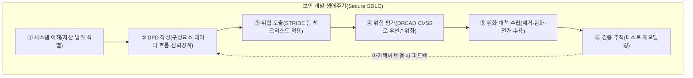
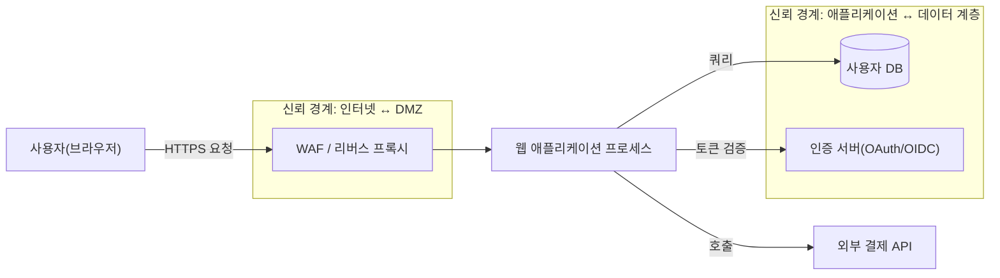

# 위협 모델링(Threat Modeling)

## 1. 개요

> **위협 모델링(Threat Modeling)**이란 시스템의 아키텍처와 데이터 흐름을 구조적으로 분석하여 잠재적 위협(Threat)과 공격 표면(Attack Surface)을 **설계 단계에서 사전에 식별·분류·평가**하고, 위험도에 따라 완화 대책(Mitigation)을 도출하는 보안 활동이다.

전통적인 보안은 시스템을 다 만든 뒤 모의해킹(Penetration Test)이나 취약점 스캔으로 결함을 찾는 **사후 대응(Reactive)** 방식이었다. 그러나 이미 배포된 시스템에서 발견된 결함을 고치는 비용은 설계 단계에서 잡는 비용보다 훨씬 크다. IBM System Science Institute의 고전적 연구와 이를 인용한 여러 보안 문헌은 요구·설계 단계에서 결함을 제거하는 비용을 1이라 할 때, 운영 단계에서 같은 결함을 고치는 비용은 대략 **수십 배에서 100배 수준**에 이른다고 본다. 정확한 배수는 조직·연구마다 다르지만, "왼쪽으로 이동(Shift-Left)할수록 비용이 급감한다"는 방향성은 일관된다. 위협 모델링은 바로 이 사전 예방(Proactive) 관점의 대표적 실천이며, 개발 초기에 "무엇을, 무엇으로부터, 어떻게 지킬 것인가"를 체계적으로 답하는 활동이다.

위협 모델링이 필요한 배경은 세 가지로 요약된다. 첫째, **시스템 복잡도의 폭증**이다. 마이크로서비스(MSA), 클라우드, API 연동, 서드파티 SaaS가 얽히면서 공격 표면이 기하급수적으로 넓어졌고, 담당자의 직관만으로는 위협을 빠짐없이 열거하기 어렵다. 둘째, **규제·컴플라이언스 요구**다. 개인정보보호법, ISMS-P, PCI-DSS, 그리고 미국 행정명령(EO 14028)에 따른 SSDF(NIST SP 800-218) 등은 보안을 개발 생애주기(SDLC)에 내재화할 것을 요구하며, 위협 모델링은 그 핵심 산출물로 인정된다. 셋째, **DevSecOps로의 전환**이다. 배포 주기가 하루에도 수십 회에 이르는 환경에서 보안을 자동화·상시화하려면, 설계 시점의 위협 분석이 파이프라인의 첫 관문으로 편입되어야 한다.

위협 모델링의 특징은 (1) 특정 도구가 아니라 **사고의 절차이자 방법론**이라는 점, (2) 완벽한 보안이 아니라 **위험 기반(Risk-based) 우선순위화**를 지향한다는 점, (3) 일회성 문서가 아니라 아키텍처 변경마다 갱신되는 **살아있는 산출물(Living Document)**이라는 점이다.

## 2. 위협 모델링의 4대 핵심 질문과 전체 프로세스

Adam Shostack이 정리한 위협 모델링의 본질은 네 가지 질문으로 압축된다. "① 우리가 무엇을 만들고 있는가(What are we building?)", "② 무엇이 잘못될 수 있는가(What can go wrong?)", "③ 그에 대해 무엇을 할 것인가(What are we going to do about it?)", "④ 우리가 잘했는가(Did we do a good job?)". 이 네 질문은 각각 자산·구조 식별, 위협 도출, 대응 수립, 검증 단계로 대응되며, 위협 모델링을 처음 도입하는 조직도 이 프레임을 뼈대로 삼으면 방향을 잃지 않는다.

아래 개념도는 위협 모델링이 SDLC 안에서 어떤 위치를 차지하며 각 단계가 어떻게 연결되는지 전체 구조를 보여준다.

전체 프로세스는 순차적이지만 마지막 검증 단계에서 다시 데이터 흐름도(DFD) 단계로 되돌아가는 **반복형(Iterative)** 구조라는 점이 중요하다. 새 기능이 추가되거나 인프라가 바뀌면 신뢰 경계(Trust Boundary)가 이동하므로, 위협 모델은 반드시 갱신되어야 한다. 이를 소홀히 하면 모델과 실제 시스템이 어긋나는 "모델 표류(Model Drift)"가 발생하여 분석의 신뢰성이 무너진다.

### 가. 시스템 이해와 자산 식별

첫 단계는 보호 대상 자산과 분석 범위를 명확히 하는 것이다. 자산에는 고객 개인정보(PII), 인증 자격증명, 결제정보, 영업비밀, 그리고 시스템 가용성 자체가 포함된다. 자산의 **민감도와 비즈니스 영향도**를 함께 기술해야 이후 위험 평가의 기준이 선다. 예컨대 전자상거래 시스템이라면 "카드번호·CVC"는 최고 등급 자산으로, 노출 시 PCI-DSS 위반과 직접적 금전 피해로 이어지므로 최우선 보호 대상이 된다. 이 단계에서 범위를 지나치게 넓히면 분석이 발산하므로, 하나의 서비스·경계 컨텍스트 단위로 잘라 접근하는 것이 실무적으로 효과적이다.

### 나. 데이터 흐름도(DFD)와 신뢰 경계

위협을 체계적으로 도출하려면 시스템을 그림으로 표현해야 한다. 가장 널리 쓰이는 표기법이 **데이터 흐름도(Data Flow Diagram, DFD)**이며, 네 가지 요소로 구성된다. 외부 엔티티(External Entity, 사용자·외부 시스템), 프로세스(Process, 연산 주체), 데이터 저장소(Data Store), 데이터 흐름(Data Flow)이다. 여기에 **신뢰 경계**를 겹쳐 그리는 것이 핵심이다. 신뢰 경계는 신뢰 수준이 달라지는 지점 — 예를 들어 인터넷과 DMZ 사이, 애플리케이션과 데이터베이스 사이 — 을 나타내며, 데이터가 이 경계를 넘나드는 지점이 바로 위협이 집중되는 곳이다.

아래는 웹 애플리케이션을 DFD로 표현하고 STRIDE 위협이 어디에서 발생하는지 매핑한 세부 아키텍처 도해다.

신뢰 경계를 명시적으로 그리면, "사용자 입력이 애플리케이션으로 넘어오는 지점에서는 위·변조(Tampering)와 명령 주입을, DB 접근 지점에서는 정보 노출(Information Disclosure)을" 집중적으로 검토하라는 식으로 위협 도출이 구조화된다. 즉 DFD는 단순한 그림이 아니라 위협을 빠짐없이(MECE) 열거하기 위한 **탐색 지도** 역할을 한다.

DFD를 그릴 때 실무적으로 유의할 점은 **추상화 수준(Level)의 선택**이다. 시스템 전체를 하나의 프로세스로 표현하는 컨텍스트 다이어그램(Level 0)에서 시작해, 분석이 필요한 부분만 하위 프로세스로 분해(Level 1, 2)하는 계층적 접근이 권장된다. 처음부터 지나치게 상세히 그리면 유지관리가 어렵고, 너무 추상적이면 위협을 놓친다. 고민감 자산이 지나가는 흐름과 신뢰 경계를 넘는 흐름을 우선 상세화하는 것이 비용 대비 효과가 높다.

### 다. STRIDE — 위협 분류 체계

STRIDE는 마이크로소프트가 정립한 위협 분류법으로, 여섯 가지 위협 범주의 머리글자다. 각 범주는 보안의 기본 속성(CIA 등)이 **위반되는 상황**과 정확히 대응된다는 점에서 체계적이다. 아래 표로 정리하되, 각 항목이 왜 그렇게 대응되는지는 이어서 서술한다.

| 위협(Threat) | 위반되는 보안 속성 | 대표 사례 | 주요 완화책 |
|---|---|---|---|
| **S**poofing(위장) | 인증(Authentication) | 타인 계정 사칭 로그인 | 강력 인증·MFA·상호 TLS |
| **T**ampering(변조) | 무결성(Integrity) | 전송 데이터·파라미터 조작 | 해시·전자서명·입력 검증 |
| **R**epudiation(부인) | 부인방지(Non-repudiation) | 거래 사실 부인 | 감사로그·타임스탬프·서명 |
| **I**nformation Disclosure(정보 노출) | 기밀성(Confidentiality) | 민감정보 유출·SQLi | 암호화·접근통제·최소권한 |
| **D**enial of Service(서비스 거부) | 가용성(Availability) | DDoS·자원 고갈 | 속도 제한·오토스케일·CDN |
| **E**levation of Privilege(권한 상승) | 인가(Authorization) | 일반→관리자 권한 탈취 | 권한 분리·RBAC·샌드박스 |

Spoofing은 신원을 속이는 위협으로, 인증 메커니즘이 약할 때 발생한다. 예컨대 세션 토큰을 탈취하거나 예측 가능한 세션 ID를 악용하는 경우로, 다중요소인증(MFA)과 안전한 토큰 관리로 완화한다. Tampering은 데이터의 무결성을 깨뜨리는 것으로, HTTP 파라미터 조작이나 중간자 공격이 대표적이며 전자서명·메시지 인증 코드(MAC)·서버 측 재검증으로 방어한다. Repudiation은 행위자가 자신의 행위를 부인하는 위협으로, 위·변조가 불가능한 감사 로그와 타임스탬프가 필수 대응책이다.

Information Disclosure는 기밀성 침해로, SQL 인젝션·에러 메시지 과다 노출·미암호화 통신이 원인이 된다. 저장·전송 암호화와 최소 권한 원칙이 핵심이다. Denial of Service는 가용성을 노리는 위협으로, 애플리케이션 계층 DDoS나 정규식 폭발(ReDoS) 같은 자원 고갈 공격을 포함하며, 속도 제한(Rate Limiting)·리버스 프록시·오토스케일링으로 완화한다. Elevation of Privilege는 인가 통제를 우회해 더 높은 권한을 획득하는 것으로, 권한 검사 누락(IDOR)·안전하지 않은 역직렬화 등이 원인이며 역할 기반 접근제어(RBAC)와 서버 측 인가 검증으로 막는다. 이처럼 STRIDE는 "이 요소에서 여섯 가지 위협이 각각 어떻게 실현될 수 있는가"를 강제로 점검하게 하여, 분석자의 경험에 의존하지 않고도 위협을 망라적으로 도출하도록 돕는다.

## 3. 위험 평가와 방법론 비교

도출된 위협을 모두 같은 비중으로 다룰 수는 없다. 자원은 유한하므로 **위험도에 따른 우선순위화**가 필수이며, 대표적 정성 기법이 **DREAD**다. DREAD는 잠재적 피해(Damage), 재현 가능성(Reproducibility), 악용 용이성(Exploitability), 영향받는 사용자(Affected Users), 발견 용이성(Discoverability)의 다섯 요소를 각 0~10점으로 채점하여 평균 위험 점수를 산출한다. 예를 들어 어떤 SQL 인젝션 위협이 Damage 9, Reproducibility 8, Exploitability 7, Affected Users 9, Discoverability 6이라면 평균 7.8로 "높음(High)" 등급이 되어 최우선 조치 대상이 된다. 다만 DREAD는 채점의 주관성이 크다는 비판이 있어, 최근에는 취약점 자체의 심각도 표준인 **CVSS(Common Vulnerability Scoring System)**나 조직의 리스크 매트릭스(발생 가능성 × 영향도)와 병행하는 추세다.

위협 모델링 방법론은 STRIDE 외에도 여러 가지가 있으며, 관점에 따라 선택한다.

| 방법론 | 관점·중심 | 특징 | 적합 상황 |
|---|---|---|---|
| **STRIDE** | 시스템·개발자 중심 | 위협 범주 망라, 학습 용이 | 일반 SW·설계 단계 표준 |
| **PASTA** | 비즈니스·위험 중심 | 7단계, 공격 시뮬레이션 정교 | 위험 기반 의사결정 필요 시 |
| **Attack Tree** | 공격자·목표 중심 | 목표를 루트로 공격 경로 분해 | 특정 자산 심층 분석 |
| **LINDDUN** | 프라이버시 중심 | 개인정보 위협 7범주 | GDPR·개인정보 영향평가 |
| **VAST** | 확장성·자동화 중심 | 애자일·대규모 조직 적용 | DevOps 전사 확산 |

방법론 선택에서 흔히 저지르는 실수는 "가장 정교한 방법론이 항상 옳다"고 여기는 것이다. 실제로는 조직의 보안 성숙도, 팀 규모, 배포 주기가 선택을 좌우한다. 위협 모델링을 처음 도입하는 팀이 곧바로 PASTA 7단계를 전면 적용하면 부담이 커 정착에 실패하기 쉽다. 따라서 STRIDE로 습관을 들인 뒤 고위험 자산에 한해 정밀 방법론을 덧대는 점진적 확산이 현실적이며, 이는 뒤에서 다룰 트레이드오프 고려사항과도 직결된다.

STRIDE가 "무엇이 잘못될 수 있는가"를 시스템 관점에서 폭넓게 훑는다면, **PASTA(Process for Attack Simulation and Threat Analysis)**는 비즈니스 목표에서 출발해 위협을 실제 공격 시나리오로 시뮬레이션하는 7단계 위험 중심 방법론으로, 경영진 설득과 투자 우선순위 결정에 강점이 있다. **Attack Tree**는 "관리자 권한 탈취"처럼 하나의 공격 목표를 루트 노드에 두고 이를 달성하는 하위 경로를 AND/OR로 분해하여, 특정 고위험 자산을 깊이 파고들 때 유용하다. **LINDDUN**은 STRIDE의 프라이버시 판(연결성·식별성·부인불가·탐지·정보노출·미인지·미준수)으로, 개인정보 영향평가(PIA)와 결합해 활용된다. 실무에서는 하나만 쓰기보다 STRIDE로 넓게 훑고 고위험 부분에 Attack Tree/PASTA를 덧대는 **혼합 전략**이 일반적이다.

## 4. 완화 대책과 실무 적용 사례

위협에 대한 대응은 위험 관리의 일반 원칙을 따른다. 즉 (1) 위협 자체를 제거(Eliminate, 예: 불필요한 기능·포트 제거), (2) 통제로 위험을 완화(Mitigate, 예: 입력 검증·암호화), (3) 제3자에게 전가(Transfer, 예: 결제를 PCI-DSS 인증 PG사에 위임·사이버보험), (4) 잔여 위험을 수용(Accept, 근거 문서화)하는 네 가지 선택지 중에서 비용 대비 효과를 고려해 결정한다. 여기서 핵심은 **모든 위협을 0으로 만드는 것이 목표가 아니라, 감내 가능한 수준(Risk Appetite)으로 낮추는 것**이라는 위험 관리적 사고다.

구체적 사례로, 한 핀테크 서비스가 송금 API를 설계하며 위협 모델링을 수행했다고 하자. DFD상 "클라이언트→송금 프로세스" 흐름에서 Tampering(금액 파라미터 조작)과 Elevation of Privilege(타인 계좌 송금, IDOR)가 도출되었다면, 대응으로 서버 측 금액 재검증·거래 서명, 그리고 요청자 소유 계좌인지 검증하는 인가 로직을 넣는 식이다. 또 "송금 프로세스→감사 저장소" 흐름에서는 Repudiation을 막기 위해 변조 불가 로그(예: 추가 전용 저장소)와 타임스탬프를 설계에 반영한다. 이렇게 하면 개발이 끝난 뒤 모의해킹에서 IDOR가 발견되어 긴급 패치하는 상황을 사전에 예방할 수 있다.

또 다른 사례로, IoT 스마트홈 게이트웨이를 설계한다고 하자. 다수의 저사양 센서가 게이트웨이를 거쳐 클라우드로 데이터를 보내는 구조에서는, 펌웨어 무결성이 취약해 Tampering(악성 펌웨어 주입)과 Spoofing(위장 디바이스 등록)이 핵심 위협으로 도출된다. 이에 대응해 보안 부팅(Secure Boot)과 디바이스별 상호 인증서(mTLS)를 설계에 반영하고, 대량 디바이스가 동시에 요청을 폭주시키는 DoS를 막기 위해 게이트웨이 단에서 디바이스별 속도 제한을 둔다. 이처럼 위협 모델링은 도메인(웹·핀테크·IoT)에 따라 강조되는 STRIDE 범주가 달라지며, 그 차이는 각 도메인의 신뢰 경계와 자산 특성에서 비롯된다.

산업 적용 관점에서, 마이크로소프트는 SDL(Security Development Lifecycle)의 필수 활동으로 위협 모델링을 제도화하고 무료 도구인 **Microsoft Threat Modeling Tool**을 배포해 왔으며, 오픈소스 진영에서는 OWASP **Threat Dragon**과 코드로 위협 모델을 관리하는 **pytm**이 널리 쓰인다. 특히 pytm처럼 위협 모델을 코드로 표현하면(Threat Modeling as Code) 형상관리·리뷰·CI 자동화가 가능해져, DevSecOps 파이프라인에 자연스럽게 통합된다. 실제로 대형 클라우드·금융 기업은 신규 서비스 설계 리뷰(Design Review)의 통과 조건으로 위협 모델 산출물을 요구하는 경우가 많으며, 이를 통해 설계 결함이 코드·운영 단계로 전파되기 전에 걸러낸다.

## 5. 심화 — DevSecOps 자동화와 최신 동향

전통적 위협 모델링의 한계는 **속도와 확장성**이었다. 보안 전문가가 워크숍 형태로 수작업 분석을 하다 보니, 하루에도 수십 번 배포되는 애자일·DevOps 환경을 따라가지 못했다. 이를 극복하기 위해 등장한 것이 **자동화·경량화 흐름**이다.

첫째, **위협 모델링 애즈 코드(Threat Modeling as Code)**다. 앞서 언급한 pytm이나 Threagile처럼 아키텍처를 선언적(YAML·DSL)으로 기술하면 도구가 자동으로 위협과 대응책을 생성하고, 이를 Git으로 버전 관리하며 CI 파이프라인에서 실행한다. 코드가 바뀌면 위협 모델도 함께 갱신되므로 앞서 지적한 "모델 표류" 문제를 크게 완화한다.

둘째, **표준화**다. OWASP는 위협 모델링을 위한 공통 어휘와 절차를 제시하고, 위협 정보를 기계가 읽을 수 있게 교환하는 OASIS의 **Threat Model Manifesto** 및 관련 표준화 논의가 진행 중이다. MITRE **ATT&CK**의 전술·기법 지식베이스를 위협 도출 단계에 접목하여, 추상적 STRIDE 범주를 실제 공격 기법으로 구체화하는 시도도 늘고 있다.

넷째, **DevSecOps 파이프라인 통합**이다. 위협 모델링의 결과는 그 자체로 끝나지 않고, 도출된 완화 대책이 정적 분석(SAST)·동적 분석(DAST)·의존성 검사(SCA)의 점검 규칙으로 전환되어 CI/CD에 반영될 때 실효를 갖는다. 예컨대 "정보 노출" 위협에 대응한 암호화 요구사항은 SAST 규칙으로, "권한 상승" 위협에 대응한 인가 검증은 통합 테스트 케이스로 각각 자동 검증되도록 연계한다. 이렇게 하면 위협 모델의 마지막 질문인 "잘했는가"를 파이프라인 지표로 상시 측정할 수 있다.

다섯째, **생성형 AI의 접목**이다. 최근에는 아키텍처 다이어그램이나 설계 문서를 입력하면 LLM이 STRIDE 기반 위협 목록과 완화책 초안을 제안하는 실험적 접근이 확산되고 있다. 이는 초안 작성 시간을 크게 줄여주는 보조 수단으로 유용하나, LLM이 존재하지 않는 위협을 생성하거나(환각) 맥락상 중요한 위협을 누락할 수 있어, **전문가 검토(Human-in-the-loop)를 반드시 병행**해야 한다는 점이 강조된다. 즉 AI는 위협 모델링을 대체하는 것이 아니라 가속하는 도구로 자리매김하고 있다. 다만 이러한 도구·AI 활용의 구체적 성숙도는 조직과 시점에 따라 편차가 크므로, 도입 시에는 파일럿을 통한 효과 검증이 선행되어야 한다.

## 6. 고려사항 및 시사점

기술사 관점에서 위협 모델링의 도입과 정착을 위해서는 다음을 고려해야 한다.

- **Shift-Left와 SDLC 내재화**: 위협 모델링은 설계 단계에 배치될 때 비용 효과가 극대화된다. 요구·설계 산출물 검토(Design Review)의 정식 게이트로 편입하고, 그 산출물을 보안 요구사항의 근거로 삼아 요구공학·테스트와 연계해야 한다. 사후 점검용 문서로만 남기면 형식화되어 실효가 없다.

- **비용·시간과 커버리지의 트레이드오프**: 모든 컴포넌트를 정밀 분석하면 이상적이지만 배포 속도를 저해한다. 신뢰 경계·고민감 자산 중심으로 범위를 우선 집중(Risk-based Prioritization)하고, 반복 주기마다 점진적으로 확장하는 것이 현실적이다. 경량 방법론(VAST)과 정밀 방법론(PASTA)을 자산 등급에 따라 차등 적용하는 하이브리드 전략이 효과적이다.

- **거버넌스와 조직 문화**: 위협 모델링은 보안팀만의 활동이 아니라 아키텍트·개발자·운영자가 함께 참여하는 협업 활동이다. 담당 R&R을 명확히 하고, 재사용 가능한 위협 라이브러리·체크리스트를 축적하며, DevSecOps 문화 속에서 개발자가 스스로 수행할 수 있도록 교육·도구를 지원해야 지속 가능하다.

- **살아있는 산출물로서의 유지관리**: 아키텍처·인프라·규제가 바뀌면 신뢰 경계와 위협도 변한다. 위협 모델을 코드로 관리하고 CI에 연동하여, 변경이 발생할 때마다 자동으로 재평가되도록 해야 모델 표류를 막을 수 있다. 또한 완화 대책의 이행 여부를 취약점 관리·보안 테스트 결과와 연계 추적(Traceability)하여 "잘했는가"라는 마지막 질문에 답할 수 있어야 한다.

- **연계 기술과의 통합**: 위협 모델링은 단독으로 완결되지 않는다. SBOM 기반 공급망 위협, 제로 트러스트 아키텍처의 신뢰 경계 재정의, MITRE ATT&CK 기반 위협 인텔리전스, 그리고 SIEM·XDR의 탐지 규칙과 상호 연계할 때 예방-탐지-대응의 전 주기가 완성된다. 특히 클라우드·MSA 환경에서는 동적으로 변하는 경계를 고려한 지속적 위협 노출 관리(CTEM)와의 접목이 전망된다.

- **정량적 효과 측정과 ROI 입증**: 위협 모델링은 "일어나지 않은 사고"를 예방하므로 성과가 눈에 잘 띄지 않는다는 한계가 있다. 따라서 설계 단계에서 제거한 위협 수, 모의해킹에서 새로 발견된 결함의 감소율, 결함 수정 소요시간(MTTR) 단축 등의 지표로 효과를 정량화하여 경영진에게 투자 가치를 입증하고 활동의 지속성을 확보하는 것이 중요하다.

## 참고자료

- OWASP, "Threat Modeling Process", https://owasp.org/www-community/Threat_Modeling_Process
- Microsoft, "Threat Modeling — Security Development Lifecycle", https://learn.microsoft.com/en-us/security/engineering/threat-modeling-tool
- OWASP, "Threat Modeling Cheat Sheet", https://cheatsheetseries.owasp.org/cheatsheets/Threat_Modeling_Cheat_Sheet.html
- NIST, "SP 800-218 Secure Software Development Framework (SSDF)", https://csrc.nist.gov/pubs/sp/800/218/final

---

> **한 줄 요약**: 위협 모델링은 DFD로 시스템을 구조화하고 STRIDE로 위협을 망라 도출한 뒤 DREAD·CVSS로 우선순위화하여 설계 단계에서 위험을 선제적으로 낮추는 Shift-Left 보안 활동으로, DevSecOps 자동화와 AI 접목으로 진화하고 있다.
