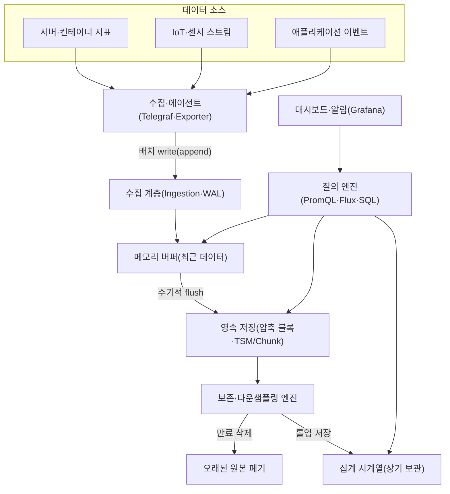
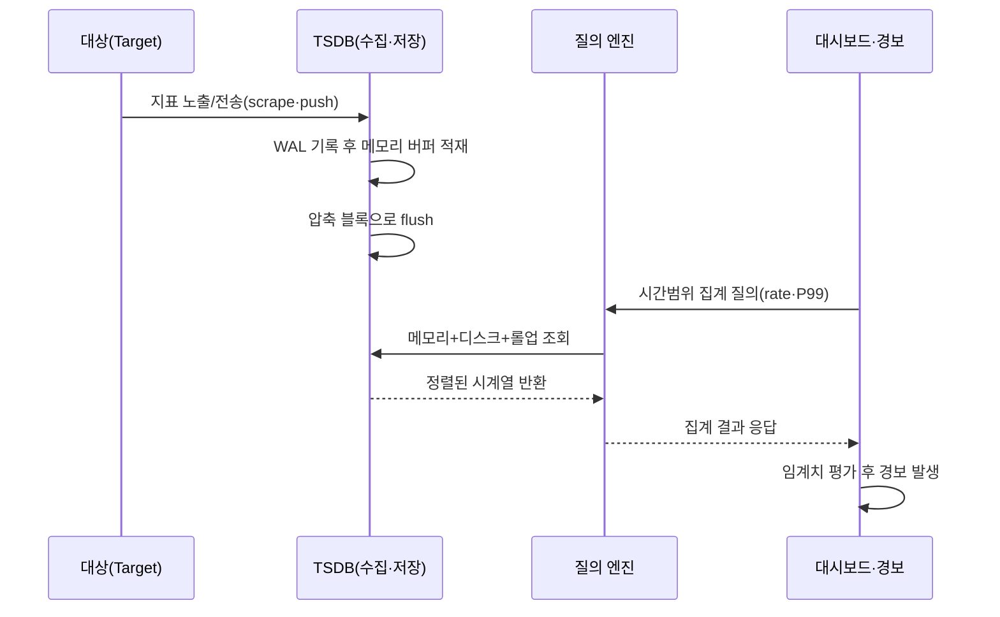

# 시계열 데이터베이스(Time Series Database, TSDB)

## 1. 개요

> **시계열 데이터베이스(TSDB)**는 시간(timestamp)을 일급(first-class) 축으로 삼아, 시간 순서로 끊임없이 쌓이는 측정값(metric)을 고속으로 수집·압축·질의·보존하도록 최적화된 특수 목적 데이터베이스이다. 관계형 DB가 "무엇이 참인가(현재 상태)"를 저장한다면, TSDB는 "언제 무슨 값이었는가(상태의 변화 이력)"를 저장하며, 대량의 append-only 쓰기와 시간 범위 집계(range aggregation)에 특화된다.

시계열 데이터는 하나의 관측 대상을 시간에 따라 반복 측정한 값의 나열이다.
서버의 CPU 사용률을 1초마다 기록한 값, 스마트팩토리 설비의 진동 센서가 초당 수천 번 내보내는 값, 주식의 체결가, 가정용 스마트미터의 전력 사용량이 모두 시계열이다.
이들은 공통적으로 **시간이 지나면 다시 바뀌지 않는(immutable) 사실**이며, 압도적으로 **삽입 위주(write-heavy)**이고, 조회는 대개 "최근 N분/특정 구간"에 대한 **시간 범위 집계** 형태를 띤다.

이런 데이터를 전통적 관계형 DB(RDBMS)에 그대로 담으면 여러 곳에서 어긋난다.
RDBMS는 임의 행의 갱신·삭제와 복잡한 조인을 전제로 B-tree 인덱스와 행 단위 저장을 쓰는데, 시계열은 갱신이 거의 없고 삽입만 폭주하므로 B-tree 인덱스가 계속 쪼개지며(page split) 쓰기 성능이 급락한다.
또한 초당 수십만 포인트가 무한히 쌓이면 저장 용량이 선형으로 폭증하는데, 범용 DB에는 시간축에 특화된 압축이나 자동 만료(retention) 개념이 없어 운영 부담이 커진다.
TSDB는 바로 이 간극 — **고속 수집, 극한의 압축, 시간 범위 질의, 수명주기 관리** — 를 해결하기 위해 설계된 저장 엔진이다.

논술 답안에서 TSDB는 단순히 "시간 데이터를 넣는 DB"로 축소하지 말고, (1) 시계열 데이터 모델(측정값·태그·타임스탬프)의 **구조적 특성**, (2) LSM 기반 append 최적화와 델타·컬럼 압축이라는 **저장 엔진 기술**, (3) 다운샘플링·보존정책으로 대표되는 **데이터 수명주기 관리**의 세 축으로 전개하는 것이 바람직하다.

### 가. 등장 배경과 필요성

첫째, **관측(Observability)과 IoT의 폭발**이 결정적 계기다.
마이크로서비스 아키텍처(MSA)가 확산되며 수백 개 서비스가 각자 수백 개 지표를 초 단위로 내보내고, 산업 현장에서는 수만 개 센서가 동시에 측정값을 쏟아낸다.
가령 컨테이너 100개가 각 50개 지표를 10초마다 기록하면 하루에만 약 4,300만 포인트가 발생하며, 이 규모는 범용 DB의 삽입 처리 한계를 쉽게 넘어선다.

둘째, **저장 비용(TCO) 압박**이다.
시계열은 결코 멈추지 않고 쌓이므로, 원본을 그대로 두면 저장 비용이 무한히 증가한다.
연속된 측정값은 값의 변화폭이 작다는 성질(예: CPU 60% → 61% → 60%)을 이용하면 델타 인코딩·비트패킹으로 10배 이상 압축할 수 있어, 전용 압축이 곧 직접적인 비용 절감으로 이어진다.

셋째, **질의 패턴의 편향**이다.
시계열 조회는 개별 행 검색보다 "지난 6시간의 5분 평균", "P99 응답시간의 추세"처럼 **시간 버킷별 집계**가 압도적이다.
이런 질의를 빠르게 처리하려면 시간축을 기준으로 데이터를 물리적으로 정렬·분할(파티셔닝)하고, 사전 집계된 롤업을 활용하는 전용 구조가 필요하다.

## 2. 시계열 데이터 모델과 전체 구조

TSDB의 데이터 모델은 대부분 **측정값 이름(measurement/metric) + 태그 집합(tags/labels) + 필드 값(field) + 타임스탬프**의 조합으로 이루어진다.
여기서 태그의 고유 조합 하나가 하나의 **시계열(series)**을 정의한다.
예컨대 `cpu_usage{host="web-01", region="seoul"}`와 `cpu_usage{host="web-02", region="seoul"}`는 이름은 같지만 태그가 달라 별개의 시계열이며, 각 시계열은 시간에 따라 정렬된 (timestamp, value) 쌍의 연속이다.

이 모델을 이해하는 핵심 개념이 **카디널리티(cardinality)**다.
카디널리티는 서로 다른 시계열의 총 개수로, 대략 각 태그가 가질 수 있는 값의 수를 모두 곱한 값이다.
`host`가 1,000종, `region`이 10종, `metric`이 50종이면 이론상 50만 개의 시계열이 생긴다.
카디널리티가 폭증하면 인덱스가 메모리를 잠식하고 질의가 느려지므로, 사용자 ID·요청 ID처럼 값의 종류가 무한히 늘어나는 항목을 태그로 쓰지 않는 것이 설계의 제1원칙이다.

위 구조에서 데이터는 에이전트가 소스에서 지표를 긁어와 수집 계층으로 배치 전송하는 것으로 시작한다.
갓 들어온 데이터는 먼저 WAL(Write-Ahead Log)에 기록되어 내구성을 확보한 뒤 메모리 버퍼에 쌓이고, 최근 데이터일수록 조회 빈도가 높으므로 메모리에서 바로 응답한다.
버퍼가 일정 크기에 이르면 시간순으로 정렬·압축된 불변 블록으로 디스크에 내려앉으며(flush), 보존 엔진이 오래된 원본은 만료 삭제하고 장기 보관이 필요한 것은 저해상도 롤업으로 남긴다.
질의 엔진은 메모리·디스크·롤업을 투명하게 가로질러 결과를 조합하며, 대시보드는 이 질의 결과를 시각화한다.

### 가. 저장 엔진: LSM과 시간축 압축

TSDB가 고속 삽입을 견디는 비결은 대부분 **LSM(Log-Structured Merge) 계열 구조**에 있다.
RDBMS의 B-tree는 삽입 위치를 찾아 페이지를 갱신하므로 랜덤 쓰기가 많지만, LSM은 들어오는 쓰기를 일단 메모리(memtable)에 순차 누적한 뒤 통째로 정렬된 불변 파일로 디스크에 순차 기록한다.
순차 쓰기는 랜덤 쓰기보다 수십 배 빠르고 SSD 수명에도 유리하여, 초당 수십만~수백만 포인트의 append를 감당할 수 있다.
InfluxDB의 TSM 엔진, Prometheus의 블록/청크 구조가 이 원리를 따른다.

압축은 TSDB의 가장 극적인 이점이다.
타임스탬프는 대개 일정 간격(예: 10초)이므로 **델타-오브-델타(delta-of-delta)** 인코딩으로 대부분 0에 가까운 값으로 만들어 비트 몇 개로 표현하고, 부동소수 측정값은 이전 값과 XOR한 뒤 앞뒤의 0 비트를 제거하는 **Gorilla 압축**을 적용한다.
페이스북이 발표한 Gorilla 논문에 따르면 이 기법으로 시계열 포인트 하나를 평균 약 1.37바이트까지 줄여, 무압축 대비 10배 이상의 압축률을 달성했다.
실무적으로 원시 16바이트(타임스탬프 8B + 값 8B) 포인트가 1~2바이트로 줄면, 저장 비용과 디스크 I/O가 함께 급감한다.

### 나. 데이터 수명주기: 보존정책과 다운샘플링

시계열은 "최근일수록 자세히, 과거일수록 거칠게" 보는 것이 자연스럽다.
장애를 실시간 추적할 때는 1초 해상도가 필요하지만, 1년 전 용량 추세를 볼 때는 1시간 평균이면 충분하다.
이 성질을 이용해 TSDB는 **다운샘플링(downsampling)**으로 오래된 원본을 저해상도 롤업(예: 1초 → 1분 평균/최대/최소)으로 요약하고, **보존정책(retention policy)**으로 원본을 자동 만료시킨다.

예를 들어 "원본은 7일, 1분 롤업은 90일, 1시간 롤업은 2년 보관"으로 정책을 세우면, 최근 장애 분석의 정밀도와 장기 추세 분석의 경제성을 동시에 확보한다.
가령 초당 1포인트를 1분 평균으로 다운샘플링하면 데이터 양이 1/60로 줄어들어, 2년치 장기 데이터도 실용적 비용으로 유지할 수 있다.
이는 범용 DB에는 없는, 시계열 워크로드에 특화된 핵심 운영 기능이다.

## 3. 주요 제품 유형과 아키텍처 비교

TSDB는 태생과 설계 철학에 따라 크게 세 갈래로 나뉜다.
전용 엔진형(InfluxDB), 모니터링 통합형(Prometheus), 그리고 관계형 확장형(TimescaleDB)이 대표적이며, 각각 강점과 트레이드오프가 다르다.

InfluxDB는 시계열만을 위해 밑바닥부터 설계된 전용 엔진으로, 자체 저장 포맷(TSM)과 질의 언어(Flux/InfluxQL)를 갖춰 높은 삽입 처리량과 압축률을 낸다.
반면 SQL 생태계와의 호환성은 약하고, 클러스터링 등 고가용 기능이 상용 버전에 묶여 있는 점이 제약이다.

Prometheus는 쿠버네티스 관측의 사실상 표준으로, **풀(pull) 방식 수집**과 강력한 질의 언어 PromQL, 경보 규칙이 결합된 모니터링 플랫폼이다.
단일 노드 로컬 저장이 기본이라 장기 보관·수평 확장에는 Thanos나 Cortex/Mimir 같은 원격 저장 계층을 덧붙여야 한다.

TimescaleDB는 PostgreSQL 확장으로 동작하여, 표준 SQL·조인·트랜잭션을 그대로 쓰면서 내부적으로 시간 기준 자동 파티셔닝(하이퍼테이블)과 컬럼 압축을 제공한다.
기존 관계형 자산과 인력을 재활용할 수 있다는 것이 최대 강점이며, 순수 전용 엔진 대비 극단적 삽입 성능은 다소 양보한다.

| 구분 | InfluxDB(전용 엔진형) | Prometheus(모니터링형) | TimescaleDB(RDBMS 확장형) |
|------|----------------------|------------------------|----------------------------|
| 기반 | 자체 TSM 엔진 | 자체 블록/청크 | PostgreSQL 확장 |
| 수집 | Push(라인 프로토콜) | Pull(스크레이핑) | SQL INSERT/COPY |
| 질의 | Flux·InfluxQL | PromQL | 표준 SQL |
| 강점 | 고압축·고삽입 | 클라우드네이티브 관측 | SQL 호환·조인 |
| 한계 | SQL 생태계 약함 | 장기저장 별도 구성 | 초고속 삽입은 양보 |

다만 위 표는 선택의 출발점일 뿐이며, 실제 결정은 "이미 보유한 기술 스택과 팀 역량, 요구 카디널리티, 장기 보관 요건"에 따라 갈린다.
쿠버네티스 관측이 핵심이면 Prometheus가 자연스럽고, 기존 PostgreSQL 운영 인력이 두텁고 SQL 분석을 병행해야 한다면 TimescaleDB가 총비용 면에서 유리하며, 순수 IoT 대량 수집이 목적이면 전용 엔진이 우세한 식이다.

### 가. 질의와 시각화의 결합

시계열의 가치는 저장이 아니라 **질의·시각화·경보**에서 실현된다.
PromQL의 `rate(http_requests_total[5m])`는 최근 5분간 초당 요청 증가율을 계산하는데, 이처럼 시계열 전용 언어는 시간 윈도우·비율·백분위(P95/P99) 계산을 일급 연산으로 제공한다.
대부분의 현장은 이 질의 결과를 Grafana 같은 대시보드로 시각화하고, 임계치 초과 시 경보를 발생시키는 파이프라인으로 완성한다.

## 4. 심화: 최신 동향과 실무 적용

시계열 저장은 최근 **분산 오브젝트 스토리지 기반 아키텍처**로 무게중심이 이동하고 있다.
Thanos·Grafana Mimir·VictoriaMetrics 등은 최근 데이터는 로컬에서 빠르게 처리하되, 오래된 압축 블록은 S3 같은 오브젝트 스토리지로 내려 무제한에 가까운 장기 보관과 저비용을 실현한다.
컴퓨트와 스토리지를 분리(disaggregation)하는 이 흐름은, 수집 급증에도 저장 계층을 독립적으로 저렴하게 확장할 수 있게 해준다.

또한 **관측성(Observability)의 통합**이 강화되고 있다.
과거에는 메트릭(TSDB)·로그·트레이스가 별도 시스템이었지만, OpenTelemetry가 이 세 신호(signal)의 수집 표준을 통일하면서, 시계열 메트릭을 로그·분산 추적과 상관 분석(correlation)하는 방향으로 진화 중이다.
예컨대 특정 지표가 튀는 순간의 트레이스로 곧바로 드릴다운하는 식의 통합 관측이 표준이 되고 있다.

실무 사례로, 국내외 대형 커머스·핀테크는 서비스 지표를 초 단위로 TSDB에 적재하고 SRE 팀이 SLO/에러버짓을 이 데이터로 산정한다.
제조 분야에서는 설비 센서 스트림을 TSDB에 저장해 진동·온도의 미세 추세로 고장을 사전 예측(예지정비)하며, 여기서 TSDB는 실시간 이상탐지 모델의 특징(feature) 공급원 역할까지 담당한다.
카디널리티 관리 실패가 대표적 장애 원인인데, 요청 ID를 태그로 넣어 시계열 수가 수백만으로 폭증하면 메모리가 고갈되므로, 태그 설계 단계에서 값의 종류를 반드시 제한해야 한다.

## 5. 고려사항 및 시사점

기술사 관점에서 TSDB 도입은 저장소 교체가 아니라 **관측·데이터 수명주기 전략의 재설계**로 접근해야 하며, 다음을 종합적으로 고려한다.

- **카디널리티 거버넌스**: 태그(레이블) 설계가 성능과 비용을 좌우한다. 값의 종류가 무한히 늘 수 있는 항목(사용자 ID, 세션 ID, 전체 URL)은 태그가 아닌 로그/트레이스로 분리하고, 태그 조합의 상한을 사전에 산정·모니터링하는 거버넌스 체계를 둔다.

- **정확도-비용 트레이드오프**: 원본 해상도·보존 기간·다운샘플링 정책은 분석 정밀도와 저장 비용의 상충 관계다. 장애 분석에 필요한 고해상도 구간과 추세 분석용 장기 롤업을 계층화해, 규정 준수(감사 로그 보존 요건)와 비용을 함께 만족시키는 정책을 명문화한다.

- **정합성·집계 모델의 한계 이해**: 시계열 집계는 근사·확률적 특성을 가질 수 있다(예: 히스토그램 기반 백분위는 근사값). 금융 정산처럼 정확한 합계가 필요한 영역과, 추세 관측으로 충분한 영역을 구분해 적용 범위를 정한다.

- **연계 기술과 아키텍처 통합**: TSDB는 단독으로 완성되지 않는다. 수집(Telegraf·OpenTelemetry), 시각화·경보(Grafana), 장기 저장(S3·Thanos), 스트림 처리(Kafka)와 결합되어야 가치를 낸다. 특히 관측성(로그·트레이스·메트릭) 통합과 SRE의 SLO/에러버짓 운영, 예지정비·이상탐지 같은 AI 파이프라인과의 연계를 함께 설계한다.

- **전망**: 컴퓨트-스토리지 분리형 클라우드 네이티브 TSDB와 OpenTelemetry 기반 신호 통합이 표준으로 자리 잡으며, 시계열은 단순 모니터링을 넘어 실시간 의사결정·예측의 핵심 데이터 계층으로 격상되고 있다.

## 참고자료

- Facebook, "Gorilla: A Fast, Scalable, In-Memory Time Series Database", VLDB 2015 — https://www.vldb.org/pvldb/vol8/p1816-teller.pdf
- Prometheus Documentation, "Storage" — https://prometheus.io/docs/prometheus/latest/storage/
- InfluxData, "Time Series Database (TSDB) explained" — https://www.influxdata.com/time-series-database/
- Timescale Documentation, "Hypertables and compression" — https://docs.timescale.com/

---

> **한 줄 요약**: 시계열 데이터베이스는 시간을 일급 축으로 삼아 append-only 대량 수집·시간축 압축(델타/Gorilla)·범위 집계·다운샘플링과 보존정책을 최적화한 전용 저장소로, 관측성·IoT·예지정비의 실시간 데이터 계층을 담당하며 카디널리티 거버넌스와 정확도-비용 트레이드오프가 도입의 핵심 관건이다.
