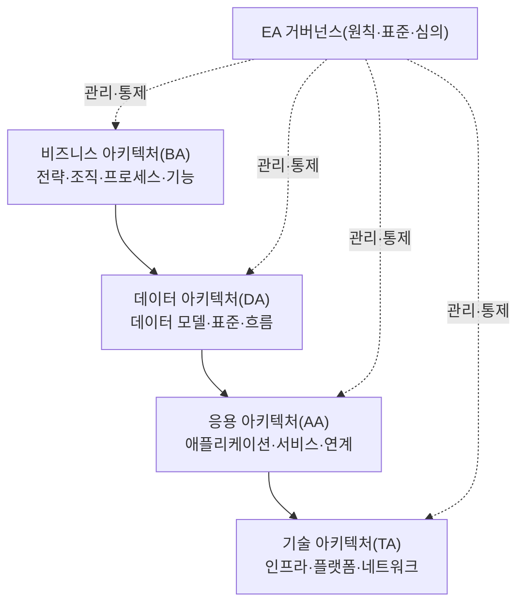
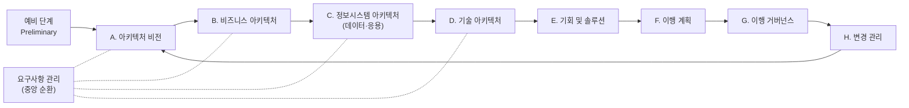

# TOGAF(The Open Group Architecture Framework)와 엔터프라이즈 아키텍처

## 1. 개요

### 가. 정의

> **엔터프라이즈 아키텍처(EA, Enterprise Architecture)**는 조직의 비즈니스 전략과 IT 자원을 정합(alignment)시키기 위해 업무·데이터·응용·기술의 현재(As-Is)와 목표(To-Be) 구조를 표준화된 관점으로 기술하고, 그 사이의 이행 경로를 관리하는 종합 설계 체계이다. **TOGAF**는 The Open Group이 제정한 개방형 EA 프레임워크로, EA를 개발·운영하기 위한 방법론(ADM)·참조모델·거버넌스 체계를 총체적으로 제공한다.

EA는 특정 시스템 하나의 설계도가 아니라 "기업 전체를 하나의 시스템으로 보고 그린 청사진"이다. 도시계획에 비유하면 개별 건물(개별 정보시스템)의 도면이 아니라 도로·용도지역·상하수도를 규정하는 도시 마스터플랜에 해당한다. 따라서 EA의 핵심 가치는 개별 최적화가 아니라 **전사 관점의 중복 제거·표준화·상호운용성 확보**에 있다.

TOGAF는 이러한 EA를 "어떻게 만들 것인가"에 대한 사실상의 산업 표준 방법론이다. 특정 벤더에 종속되지 않는 개방형이며, 반복적(iterative) 절차인 ADM(Architecture Development Method)을 중심으로 아키텍처를 점진적으로 발전시킨다는 점이 특징이다.

### 나. 등장 배경과 필요성

첫째, **IT와 비즈니스의 단절(business-IT gap)** 때문이다. 부서별로 개별 발주된 시스템이 누적되면서 동일 기능이 여러 시스템에 중복 구현되고, 데이터 정의가 제각각이어서 전사 통계조차 어긋나는 이른바 '사일로(silo)'가 발생했다. 무엇이 어디에 있는지 전사적으로 파악하는 지도가 필요해졌고, 이것이 EA 등장의 직접적 동인이다.

둘째, **투자 통제와 거버넌스 요구**다. IT 투자 규모가 커질수록 "이 시스템이 왜 필요한가, 기존 자산과 중복되지 않는가"를 판단할 근거가 필요하다. EA는 현행 자산 목록과 목표 구조를 제시함으로써 신규 투자 심의(Portfolio Management)의 판단 근거를 제공한다. 우리나라도 「전자정부법」에 따라 일정 규모 이상 공공기관에 EA(정부는 이를 정보기술아키텍처, ITA로 지칭) 도입을 의무화한 바 있다.

셋째, **변화 대응 속도**다. 디지털 전환·클라우드 전환처럼 전사적 변화가 잦아지면서, 변경이 어느 업무·데이터·시스템에 파급되는지(영향도 분석) 신속히 파악할 수 있는 구조적 지도가 필수가 되었다. EA의 계층 간 추적성(traceability)이 이 요구를 충족한다.

## 2. EA의 구성 관점과 프레임워크 비교

EA는 통상 네 개의 아키텍처 도메인(BDAT)으로 구성된다. 이는 단순한 분류가 아니라 "비즈니스가 무엇을 하는가 → 어떤 데이터가 필요한가 → 어떤 응용이 그 데이터를 다루는가 → 어떤 기술 기반 위에서 동작하는가"라는 인과적 계층을 이룬다. 상위 계층의 요구가 하위 계층의 설계를 유도하며, 이 연결 고리가 끊기면 "쓰지 않는 시스템", "근거 없는 데이터"가 생겨난다.

**비즈니스 아키텍처(BA)**는 조직의 전략·목표·업무 기능·프로세스를 정의한다. EA의 출발점이자 다른 모든 계층의 정당성을 부여하는 층으로, "이 업무 기능을 수행하기 위해"라는 목적 없이는 데이터도 응용도 존재 이유를 갖지 못한다. **데이터 아키텍처(DA)**는 업무를 지원하는 데 필요한 논리·물리 데이터 모델과 전사 데이터 표준을 규정하여 데이터 중복과 정의 불일치를 제거한다. **응용 아키텍처(AA)**는 데이터를 처리하는 애플리케이션 포트폴리오와 그 연계 관계를 정의하며, 기능 중복 시스템을 식별하는 근거가 된다. **기술 아키텍처(TA)**는 이 모든 것이 구동되는 하드웨어·소프트웨어·네트워크 표준을 다룬다.

프레임워크는 여러 종류가 있으며, 각각 강조점이 다르다. 아래 비교에서 중요한 것은 "어느 것이 우수한가"가 아니라 **조직의 성숙도와 목적에 따라 선택·혼합한다**는 점이다.

| 프레임워크 | 특징 | 강점 | 한계 |
|-----------|------|------|------|
| Zachman | 6×6 매트릭스(관점×의문사)로 산출물을 분류 | 빠짐없는 분류 체계, 문서화 관점 | 방법론(어떻게)이 없음 — 만드는 절차 부재 |
| TOGAF | ADM 반복 절차 중심 방법론 | 벤더 중립, 실용적 개발 절차 제공 | 산출물 표준이 상대적으로 유연(모호) |
| FEAF | 미국 연방정부 참조모델 중심 | 성과·투자 연계 참조모델(PRM 등) | 공공 특화, 민간 적용 시 재해석 필요 |

Zachman이 "무엇을 문서화할지"의 분류 틀이라면, TOGAF는 "어떻게 만들지"의 절차를 제공한다는 점에서 상호 보완적이다. 실무에서는 Zachman으로 산출물 체계를 잡고 TOGAF ADM으로 개발 절차를 운영하는 결합 방식이 흔하다.

## 3. TOGAF ADM(아키텍처 개발 방법)

TOGAF의 핵심은 ADM이라 불리는 순환형 개발 절차다. 폭포수처럼 한 번에 끝내는 것이 아니라, 요구사항 관리를 중심에 두고 각 단계를 반복하며 아키텍처를 점진적으로 성숙시킨다. 이 반복성이야말로 잦은 변화에 대응해야 하는 현대 EA의 핵심 요건이다.

**예비 단계**에서는 EA를 수행할 조직·원칙·거버넌스 체계를 준비한다. **A단계(비전)**에서 이해관계자와 범위·목표를 합의하고, **B~D단계**에서 비즈니스·데이터·응용·기술 각 도메인의 As-Is와 To-Be를 정의하며 그 격차(gap)를 분석한다. 이 격차 분석이 이후 무엇을 새로 만들거나 폐기할지의 근거가 된다.

**E단계(기회 및 솔루션)**에서는 갭을 메우는 구현 후보를 도출하고, **F단계(이행 계획)**에서 이를 우선순위·비용·리스크에 따라 로드맵으로 배열한다. **G단계(이행 거버넌스)**는 실제 구현 프로젝트가 아키텍처 표준을 준수하는지 통제하고, **H단계(변경 관리)**는 운영 중 발생하는 변경 요구를 평가해 다시 A단계로 순환시킨다. 전 과정의 중앙에는 **요구사항 관리**가 위치하여 모든 단계와 양방향으로 연결되는데, 이는 어느 단계에서 발생한 요구든 즉시 반영·추적된다는 의미다.

이때 재사용을 촉진하는 자산이 **ACF(Architecture Content Framework)**와 **엔터프라이즈 연속체(Enterprise Continuum)**다. 후자는 범용적 재단 아키텍처(Foundation)에서 산업 공통 아키텍처를 거쳐 조직 고유 아키텍처로 구체화되는 스펙트럼을 정의하여, 이미 검증된 참조 아키텍처를 재활용하도록 유도한다.

## 4. 적용 사례와 EA 성숙도

실제 적용의 한 예로, 한 금융기관이 계정계·정보계·채널계 시스템을 부서별로 30여 개 개별 발주해 운영하다 보니 고객 정보가 시스템마다 다르게 저장되어 통합 고객 뷰(Single View)를 만들 수 없었던 상황을 들 수 있다. EA를 도입해 전사 데이터 표준(고객 식별자·코드체계)을 정의하고 응용 포트폴리오의 기능 중복을 식별한 결과, 중복 시스템 통폐합으로 유지보수 비용을 절감하고 신규 시스템 개발 시 표준 준수 심의를 통해 사일로 재발을 억제할 수 있다. 여기서 중요한 것은 기술 자체가 아니라 **표준과 거버넌스가 결합되어야 효과가 지속**된다는 점이다.

공공에서도 「전자정부법」과 「정보시스템의 구축·운영 기술지침」에 따라 범정부 EA(GEAP 등)를 통해 부처 간 정보시스템 현황을 통합 관리하고 중복 투자를 사전 심의하는 체계가 운영되어 왔다. 다만 EA를 문서 산출물 작성으로만 접근하면 "만들어 놓고 쓰지 않는 EA(shelf-ware)"가 되기 쉽다는 점이 공통된 교훈이다.

EA의 실효성은 성숙도로 관리된다. 대략 (1) 초기(개별 산출물 존재) → (2) 관리(전사 표준·저장소 구축) → (3) 정의(EA가 투자심의 프로세스에 결합) → (4) 최적화(변경관리·성과측정으로 자기개선)의 단계로 발전하며, 성숙도가 3단계 이상으로 올라가 **EA 산출물이 실제 의사결정에 사용될 때** 비로소 투자 대비 효과가 발생한다.

## 5. 고려사항 및 시사점

기술사 관점에서 EA/TOGAF 도입은 다음을 종합적으로 고려해야 한다.

- **문서가 아니라 거버넌스가 목적임**: EA의 성패는 산출물 완성도가 아니라 그것이 IT 투자심의·변경관리 프로세스에 실제로 결합되는지에 달려 있다. EA 저장소(Repository)와 심의 프로세스가 없으면 EA는 사문화된다. 도입 초기부터 "산출물 작성"이 아니라 "의사결정 활용"을 목표로 설계해야 한다.

- **성숙도에 맞춘 점진 도입(트레이드오프)**: 모든 도메인을 한 번에 완성하려는 빅뱅 방식은 실패 위험이 크다. ADM의 반복성을 활용해 우선순위 높은 업무 영역부터 얇게(thin-slice) 완성하고 확장하는 편이 현실적이다. 완전성과 실행 속도 사이의 균형이 관건이다.

- **최신 아키텍처 사조와의 정합**: 클라우드·MSA·데이터 메시처럼 분산·자율을 강조하는 흐름과, EA의 중앙집중 표준화가 충돌할 수 있다. 최근에는 EA를 하향식 통제가 아니라 **가드레일(원칙·표준)만 제시하고 팀 자율을 보장하는 경량 거버넌스**로 재해석하며, 아키텍처 산출물도 코드형(Architecture-as-Code)·자동 수집으로 최신성을 유지하려는 경향이 있다.

- **비즈니스 아키텍처와 케이퍼빌리티 중심 전환**: 최근 EA는 기술 자산 목록화를 넘어 비즈니스 케이퍼빌리티 맵을 기반으로 전략-투자를 연결하는 방향으로 무게중심이 이동하고 있다. 디지털 전환·AX 전략을 실행 로드맵으로 번역하는 도구로서 EA의 재조명이 이루어지고 있으며, 기술사는 EA를 전략 실행의 인프라로 위치시키는 관점이 필요하다.

- **연계 주제와의 관계**: EA는 IT 거버넌스(COBIT), IT 투자분석·IT-ROI, ISP/ISMP, 디지털 트랜스포메이션과 밀접하게 연계된다. 답안 작성 시 이들과의 관계를 명시하면 통합적 이해를 보여줄 수 있다.

---

> **한 줄 요약**: EA는 비즈니스·데이터·응용·기술(BDAT) 계층으로 전사 IT 청사진을 그려 중복 제거와 정합을 달성하는 체계이고, TOGAF는 이를 반복 절차(ADM)와 거버넌스로 구현하는 개방형 표준 방법론으로, 문서화가 아닌 의사결정 활용과 거버넌스 결합이 성패를 좌우한다.
