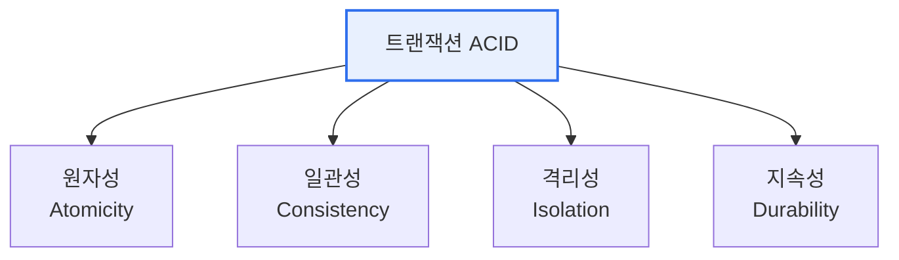

# 데이터베이스 트랜잭션의 특징(ACID)

## 1. 개요

### 가. 정의
> **트랜잭션(Transaction)** 은 데이터베이스의 상태를 바꾸는 하나의 논리적 작업 단위로, 여러 연산을 묶어 **전부 성공하거나 전부 실패하도록** 보장한다. 이 신뢰성을 규정하는 네 가지 특성이 **ACID**다.

트랜잭션의 본질은 '**전부 아니면 전무(All or Nothing)**'라는 원칙에 있다. 계좌 이체를 예로 들면, A 계좌에서 출금하고 B 계좌에 입금하는 두 연산은 반드시 함께 성공하거나 함께 실패해야 한다. 출금만 되고 입금이 안 되면 돈이 사라지기 때문이다. 트랜잭션은 이런 연산 묶음을 하나의 단위로 다뤄, 중간에 오류가 나면 처음 상태로 되돌린다(롤백). ACID는 이 신뢰성이 어떤 성질로 이뤄지는지를 네 가지로 정의한 것으로, 데이터베이스가 '믿을 수 있는' 이유의 근간이다.

### 나. 필요성
동시에 수많은 사용자가 접근하고 장애가 언제든 발생할 수 있는 환경에서, 데이터의 정확성과 일관성을 지키려면 작업을 신뢰할 수 있는 단위로 묶는 트랜잭션과 그 보장 특성(ACID)이 필수다.

## 2. ACID 특성

네 특성은 서로 다른 관점에서 신뢰성을 보장한다. **원자성** 은 트랜잭션의 연산이 모두 반영되거나 전혀 반영되지 않음을 보장하고(중간 상태 없음), **일관성** 은 트랜잭션 전후로 데이터가 정의된 규칙(제약조건)을 만족함을 보장한다. **격리성** 은 동시에 실행되는 여러 트랜잭션이 서로 간섭하지 않는 것처럼 보이게 하며, **지속성** 은 성공(커밋)한 트랜잭션의 결과가 장애가 나도 영구히 보존됨을 보장한다.

| 특성 | 내용 | 구현 기법 |
|---|---|---|
| **원자성(Atomicity)** | 모두 반영 또는 전혀 반영 안 됨 | 커밋/롤백, 로그(UNDO) |
| **일관성(Consistency)** | 규칙·제약조건 유지 | 무결성 제약, 트리거 |
| **격리성(Isolation)** | 동시 트랜잭션 간 간섭 차단 | 로킹·MVCC, 격리 수준 |
| **지속성(Durability)** | 커밋 결과 영구 보존 | 로그(REDO), 백업 |

## 3. 상태 전이

트랜잭션은 활동(Active)→부분완료(Partially Committed)→완료(Committed) 또는 실패(Failed)→철회(Aborted)의 상태를 거친다. COMMIT은 결과를 확정하고, ROLLBACK은 처음 상태로 되돌린다. 이 상태 관리가 원자성·지속성의 실질적 구현이다.

## 4. 고려사항 및 시사점

1. **격리성과 성능의 트레이드오프**가 실무의 핵심이다. 격리 수준을 높이면 일관성은 커지나 동시성·성능이 떨어지므로, 업무 특성에 맞는 격리 수준을 선택한다.
2. **분산 환경에서 ACID의 한계**를 이해해야 한다. 분산 트랜잭션은 2PC(2단계 커밋)로 ACID를 확장하지만 성능·가용성 부담이 크며, NoSQL·MSA에서는 **BASE(결과적 일관성)** 나 사가(Saga) 패턴으로 완화한다(CAP 이론).
3. **로그 기반 복구가 신뢰성의 기반**이다. UNDO·REDO 로그로 원자성과 지속성을 구현하므로, 로그 관리와 백업 전략이 데이터 무결성을 좌우한다.

---

> **한 줄 요약**: 트랜잭션은 *전부 성공 또는 전부 실패* 하는 논리적 작업 단위로, *원자성·일관성·격리성·지속성(ACID)* 으로 신뢰성을 보장하며, 분산·NoSQL 환경에서는 BASE·CAP·Saga로 트레이드오프를 조정한다.
