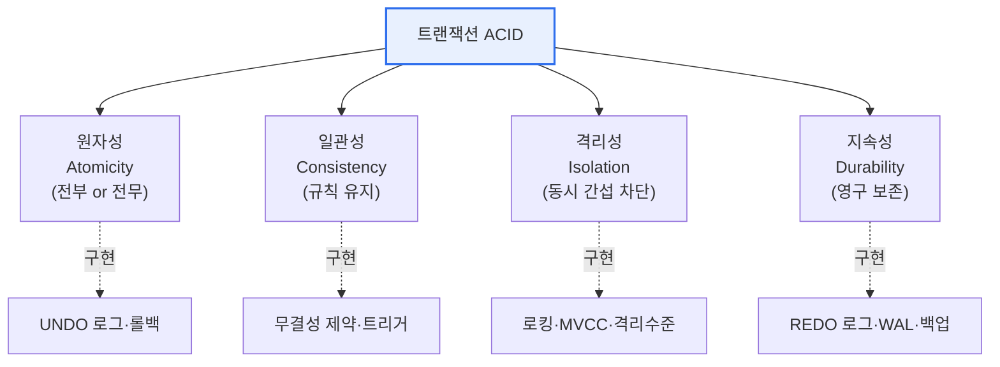
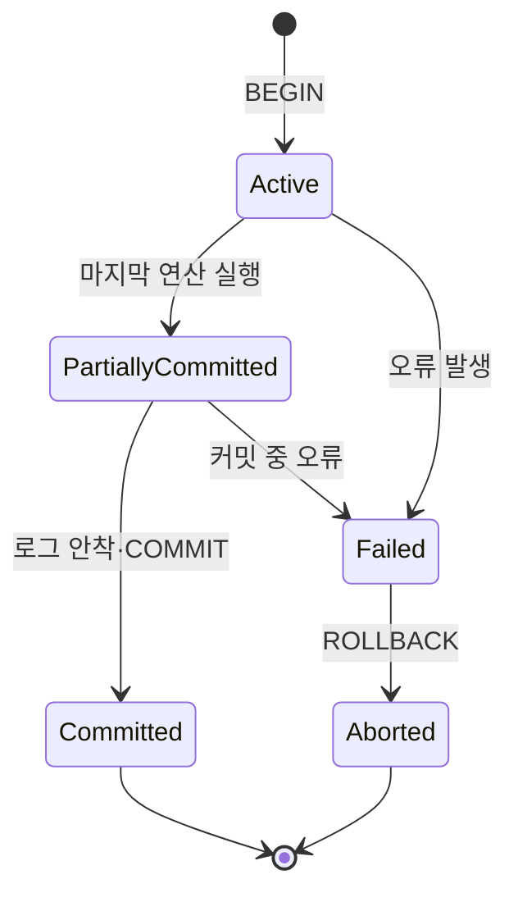

# 데이터베이스 트랜잭션의 특징(ACID)

## 1. 개요

### 가. 정의
> **트랜잭션(Transaction)** 은 데이터베이스의 상태를 바꾸는 하나의 **논리적 작업 단위(logical unit of work)** 로, 여러 개의 읽기·쓰기 연산을 묶어 **전부 성공(Commit)하거나 전부 실패(Rollback)하도록** 보장한다. 이 신뢰성이 갖추어야 할 네 가지 성질을 규정한 것이 **ACID(Atomicity·Consistency·Isolation·Durability)** 다.

트랜잭션의 본질은 '**전부 아니면 전무(All or Nothing)**'라는 원칙에 있다. 은행 계좌 이체를 예로 들면, A 계좌에서 10만 원을 출금하는 연산과 B 계좌에 10만 원을 입금하는 연산은 논리적으로 하나의 사건이므로 반드시 함께 성공하거나 함께 실패해야 한다. 만약 출금은 반영되고 입금이 시스템 장애로 누락되면 10만 원이 세상에서 사라져 데이터가 모순 상태에 빠진다. 트랜잭션은 이런 연산 묶음을 하나의 단위로 다뤄, 중간에 오류가 나면 시작 시점의 상태로 원자적으로 되돌린다(롤백).

ACID는 이 신뢰성이 '어떤 성질들로 구성되는가'를 네 축으로 분해한 것이다. 원자성은 '나눌 수 없음'을, 일관성은 '규칙 위반 없음'을, 격리성은 '동시 실행이 순차 실행처럼 보임'을, 지속성은 '한 번 확정되면 사라지지 않음'을 보장한다. 이 네 성질이 함께 지켜질 때 비로소 데이터베이스는 다수 사용자와 장애가 상존하는 환경에서도 '믿을 수 있는 기록 시스템(system of record)'으로 기능한다. 은행·증권·전자상거래·항공예약처럼 데이터의 정확성이 곧 신뢰이자 법적 책임인 도메인에서 ACID가 관계형 DBMS의 근간으로 자리 잡은 이유가 여기에 있다.

### 나. 등장 배경과 필요성
초기 파일 시스템은 여러 사용자가 동시에 같은 데이터를 갱신하거나 처리 도중 정전이 발생하면 데이터가 쉽게 깨졌다. 갱신 손실(lost update), 부분 갱신, 오손 읽기(dirty read) 같은 문제가 방치되면 회계·재고·예약 데이터의 무결성이 무너진다. 이를 근본적으로 해결하기 위해 등장한 개념이 트랜잭션이며, 짐 그레이(Jim Gray)가 1970~80년대에 정립한 트랜잭션 처리 이론이 오늘날 ACID의 이론적 토대가 되었다.

필요성은 두 가지 축으로 정리된다. 첫째는 **동시성(concurrency)** 이다. 수많은 사용자가 동시에 같은 데이터를 읽고 쓰는 환경에서, 각 트랜잭션이 마치 홀로 실행되는 것처럼 결과의 정합성을 보장해야 한다. 둘째는 **장애 회복(recovery)** 이다. 정전·디스크 오류·프로세스 강제 종료 등 언제든 발생할 수 있는 장애 속에서도, 커밋된 결과는 살아남고 커밋되지 않은 결과는 흔적 없이 사라져야 한다. ACID는 이 두 요구를 만족시키기 위한 계약(contract)이며, 이를 지키는 로킹·로그·MVCC 같은 메커니즘이 DBMS 엔진의 핵심을 이룬다.

## 2. ACID 네 가지 특성

ACID는 서로 다른 관점에서 트랜잭션의 신뢰성을 보장하는 네 성질의 집합이다. 아래 구조도는 네 특성이 하나의 트랜잭션 개념 아래 어떤 관점을 담당하는지를 보여준다.

```mermaid
flowchart TB
  T["트랜잭션 ACID"] --> A["원자성<br/>Atomicity<br/>(전부 or 전무)"]
  T --> C["일관성<br/>Consistency<br/>(규칙 유지)"]
  T --> I["격리성<br/>Isolation<br/>(동시 간섭 차단)"]
  T --> D["지속성<br/>Durability<br/>(영구 보존)"]
  A -.구현.-> AM["UNDO 로그·롤백"]
  C -.구현.-> CM["무결성 제약·트리거"]
  I -.구현.-> IM["로킹·MVCC·격리수준"]
  D -.구현.-> DM["REDO 로그·WAL·백업"]
  style T fill:#e8f0fe,stroke:#2f6fed,stroke-width:2px
```

### 가. 원자성(Atomicity)
원자성은 트랜잭션을 이루는 연산들이 **더 이상 쪼갤 수 없는 하나의 덩어리**로 취급됨을 뜻한다. 모든 연산이 성공적으로 반영되거나(Commit), 하나라도 실패하면 이미 실행된 연산까지 전부 취소되어(Rollback) 시작 이전 상태로 돌아간다. 중간 상태(예: 출금만 되고 입금은 안 된 상태)가 외부에 확정 결과로 남는 일은 결코 없다.

원자성이 없으면 어떤 문제가 생기는지 다시 계좌 이체로 보자. 출금 UPDATE가 성공한 직후 서버가 다운되면, 원자성이 보장되지 않는 시스템에서는 출금만 반영된 채로 남아 자산 총액이 어긋난다. 원자성은 이때 이미 기록된 출금을 **UNDO 로그**를 이용해 되돌려 정합성을 회복한다. 이처럼 원자성은 '실패 시의 안전한 후퇴'를 책임진다.

구현 관점에서 원자성은 주로 **로그 기반 롤백**으로 실현된다. DBMS는 데이터를 실제로 바꾸기 전에 변경 이전 값을 UNDO 로그에 먼저 기록해 두고, 트랜잭션이 실패하면 이 로그를 역순으로 적용해 원상 복구한다. 따라서 원자성은 뒤에 나오는 지속성과 마찬가지로 로그 관리 품질에 직접 의존한다.

### 나. 일관성(Consistency)
일관성은 트랜잭션이 실행되기 전과 후 모두 데이터베이스가 **미리 정의된 규칙(무결성 제약조건)** 을 만족하는 상태로 유지됨을 뜻한다. 규칙에는 기본키·외래키 제약, NOT NULL, CHECK 제약, 그리고 "모든 계좌 잔액의 합은 이체 전후로 동일하다" 같은 업무 규칙이 포함된다. 트랜잭션은 한 일관된 상태에서 다른 일관된 상태로 데이터를 이동시키며, 중간 과정이 규칙을 위반하더라도 커밋 시점에는 반드시 모든 규칙을 만족해야 한다.

여기서 유의할 점은 일관성의 책임이 **DBMS와 애플리케이션에 나뉜다**는 것이다. DBMS는 선언된 제약조건과 트리거를 강제하지만, "이체 총액 보존" 같은 도메인 규칙은 애플리케이션이 올바른 SQL을 작성했을 때 비로소 지켜진다. 즉 원자성·격리성·지속성이 지켜지더라도, 개발자가 잘못된 로직을 넣으면 일관성은 깨질 수 있다. 이 점에서 일관성은 순수한 엔진 기능이라기보다 '엔진 보장 + 올바른 설계'의 합작이다.

실무 사례로 재고 관리 시스템을 보자. 주문 트랜잭션은 재고 수량을 차감하는데, 재고가 음수가 되지 않도록 CHECK(stock >= 0) 제약을 걸어두면 DBMS가 규칙 위반을 막아 커밋을 거부한다. 이렇게 제약조건을 데이터 계층에 선언해 두면 애플리케이션 버그가 있더라도 최후의 방어선이 작동한다.

### 다. 격리성(Isolation)
격리성은 여러 트랜잭션이 동시에 실행되더라도 **각 트랜잭션이 마치 홀로 순차 실행된 것과 같은 결과**를 보장한다. 즉 실행 중인 트랜잭션의 중간 결과는 다른 트랜잭션에 보이지 않아야 하며, 동시 실행이 서로의 정합성을 훼손해서는 안 된다. 완전한 격리(직렬성, Serializability)를 항상 강제하면 동시성이 크게 떨어지므로, 실무에서는 **격리 수준(Isolation Level)** 을 두어 성능과 정합성을 교환한다.

격리가 불완전할 때 나타나는 대표적 이상현상은 세 가지다. **오손 읽기(Dirty Read)** 는 커밋되지 않은 남의 변경을 읽는 것, **반복 불가능 읽기(Non-repeatable Read)** 는 같은 행을 두 번 읽었는데 값이 달라지는 것, **유령 읽기(Phantom Read)** 는 같은 조건으로 조회했는데 행의 개수가 달라지는 것이다. ANSI SQL은 이 이상현상들을 어디까지 허용하느냐로 네 격리 수준을 정의한다.

| 격리 수준 | 오손 읽기 | 반복불가능 읽기 | 유령 읽기 |
|---|---|---|---|
| **READ UNCOMMITTED** | 허용 | 허용 | 허용 |
| **READ COMMITTED** | 방지 | 허용 | 허용 |
| **REPEATABLE READ** | 방지 | 방지 | 허용(구현 따라 방지) |
| **SERIALIZABLE** | 방지 | 방지 | 방지 |

격리 수준을 높일수록 정합성은 좋아지지만 잠금 범위가 넓어지거나 재시도가 늘어 동시성·처리량이 떨어진다. 예컨대 은행 정산은 SERIALIZABLE에 가까운 강한 격리가 필요하지만, 조회가 대부분인 상품 카탈로그는 READ COMMITTED로도 충분하다. 구현 방식도 두 계열로 나뉜다. 전통적 잠금 기반(Lock-based)은 읽기·쓰기 잠금으로 충돌을 막고, **MVCC(다중 버전 동시성 제어)** 는 데이터의 여러 버전(스냅샷)을 유지해 "읽기가 쓰기를 막지 않는다"는 특성으로 동시성을 높인다. Oracle·PostgreSQL·MySQL InnoDB가 MVCC를 채택해 읽기 성능을 확보하는 것이 대표적이다.

### 라. 지속성(Durability)
지속성은 성공적으로 **커밋된 트랜잭션의 결과가 이후 어떤 장애(정전·크래시)가 발생해도 영구히 보존됨**을 뜻한다. 커밋 응답을 받은 사용자는 그 결과가 사라지지 않으리라 신뢰할 수 있어야 한다. 지속성의 핵심 구현 기법은 **WAL(Write-Ahead Logging, 선행 기록 로그)** 이다. 데이터 페이지를 디스크에 기록하기 전에 변경 내용을 먼저 REDO 로그에 안전하게 적어두고, 로그가 디스크에 안착한 뒤에야 커밋을 확정한다.

WAL 덕분에 커밋 직후 서버가 죽더라도, 재기동 시 REDO 로그를 다시 적용(roll-forward)해 커밋된 변경을 복원하고, 미완료 트랜잭션은 UNDO로 제거(roll-back)해 정합성을 맞춘다. 이 '로그 우선 기록' 원칙이 성능과 안전성을 동시에 확보하는 이유는, 임의 위치의 데이터 페이지를 매번 디스크에 쓰는 것보다 로그를 순차 기록하는 편이 훨씬 빠르면서도 복구 근거를 남기기 때문이다.

다만 지속성은 저장 계층의 신뢰성에 의존한다는 한계도 있다. 로그가 OS 버퍼에만 있고 실제 디스크에 flush되지 않은 상태에서 전원이 나가면 커밋이 유실될 수 있으므로, 실무에서는 fsync 강제, 배터리 백업 캐시, 다중 복제본(replication)으로 지속성을 강화한다. 표로 네 특성과 구현 기법을 정리하면 다음과 같다.

| 특성 | 보장 내용 | 대표 구현 기법 |
|---|---|---|
| **원자성(Atomicity)** | 모두 반영 또는 전혀 반영 안 됨 | 커밋/롤백, UNDO 로그 |
| **일관성(Consistency)** | 규칙·제약조건 유지 | 무결성 제약, 트리거, 올바른 앱 로직 |
| **격리성(Isolation)** | 동시 트랜잭션 간 간섭 차단 | 로킹·MVCC, 격리 수준 |
| **지속성(Durability)** | 커밋 결과 영구 보존 | REDO 로그·WAL, fsync, 복제·백업 |

## 3. 트랜잭션 상태 전이와 커밋 프로토콜

트랜잭션은 정해진 생명주기(상태)를 거치며, 이 상태 관리가 원자성·지속성의 실질적 구현이다. 아래 상태도는 트랜잭션이 시작부터 완료 또는 철회에 이르는 전이를 나타낸다.

```mermaid
stateDiagram-v2
  [*] --> Active: BEGIN
  Active --> PartiallyCommitted: 마지막 연산 실행
  Active --> Failed: 오류 발생
  PartiallyCommitted --> Committed: 로그 안착·COMMIT
  PartiallyCommitted --> Failed: 커밋 중 오류
  Failed --> Aborted: ROLLBACK
  Committed --> [*]
  Aborted --> [*]
```

트랜잭션은 BEGIN과 함께 **활동(Active)** 상태로 들어가 연산을 수행하고, 마지막 연산까지 마치면 **부분완료(Partially Committed)** 로 넘어간다. 이 시점에 변경은 아직 메모리(버퍼)에만 있을 수 있어, REDO 로그가 디스크에 안전히 기록되어야 비로소 **완료(Committed)** 로 확정된다. 실행 중 오류가 나면 **실패(Failed)** 상태가 되고, ROLLBACK을 통해 UNDO 로그로 원상 복구한 뒤 **철회(Aborted)** 로 종료한다. COMMIT은 결과를 영구 확정하고 ROLLBACK은 시작 상태로 되돌린다는 점에서, 이 상태 전이 자체가 원자성(중간 상태 노출 금지)과 지속성(로그 안착 후 커밋)의 구체적 실행 절차다.

분산 환경에서는 여러 노드가 관여하므로 단순 커밋으로는 원자성을 지킬 수 없다. 이때 **2단계 커밋(2PC, Two-Phase Commit)** 을 쓴다. 조정자(coordinator)가 모든 참여자에게 "커밋 가능?"을 묻는 준비(prepare) 단계와, 전원이 동의하면 "커밋하라"를 지시하는 확정(commit) 단계로 나눠, 어느 한 노드라도 준비에 실패하면 전체를 롤백한다. 다만 2PC는 조정자가 다운되면 참여자가 무한 대기하는 블로킹 문제와 지연 비용이 크다는 약점이 있어, 대규모 분산 시스템에서는 뒤에 설명할 Saga 같은 대안이 선호된다.

## 4. 분산 환경에서의 확장 — BASE·CAP·Saga

단일 노드에서 강력했던 ACID는 데이터가 여러 노드에 분산되는 순간 비용이 급증한다. **CAP 정리**는 그 근본 이유를 설명한다. 분산 시스템은 일관성(Consistency)·가용성(Availability)·분할내성(Partition tolerance) 세 가지를 동시에 완전히 만족할 수 없으며, 네트워크 분할(P)이 불가피한 현실에서는 C와 A 사이에서 하나를 어느 정도 양보해야 한다. 강한 일관성(ACID)을 고수하면 분할 시 가용성이 떨어지고, 가용성을 우선하면 일시적 불일치를 감수해야 한다.

이 트레이드오프에서 가용성·확장성을 택한 진영이 채택한 모델이 **BASE(Basically Available, Soft state, Eventually consistent)** 다. BASE는 항상 즉시 일관되기보다 **결과적 일관성(Eventual Consistency)** 을 지향한다. 즉 갱신 직후 잠시 노드 간 값이 다를 수 있지만, 일정 시간이 지나면 모든 복제본이 같은 값으로 수렴한다. 대규모 소셜 미디어의 '좋아요' 카운트나 상품 조회수처럼 순간적 불일치가 치명적이지 않은 데이터에 적합하며, Cassandra·DynamoDB 같은 NoSQL이 이 모델을 대표한다.

| 구분 | ACID | BASE |
|---|---|---|
| **지향점** | 강한 일관성·정합성 | 가용성·확장성 |
| **일관성 모델** | 즉시 일관성 | 결과적 일관성 |
| **대표 사용처** | 금융·회계·예약 | SNS·로그·추천·캐시 |
| **대표 기술** | RDBMS(2PC) | NoSQL, 메시지 기반 시스템 |

MSA(마이크로서비스 아키텍처)에서는 서비스마다 DB가 분리되어 하나의 업무가 여러 DB에 걸치므로 전통적 트랜잭션을 쓸 수 없다. 이때 **Saga 패턴**이 대안이 된다. Saga는 긴 업무를 로컬 트랜잭션의 연쇄로 쪼개고, 중간에 실패하면 앞서 성공한 단계를 되돌리는 **보상 트랜잭션(compensating transaction)** 을 실행해 논리적 원자성을 흉내 낸다. 예컨대 주문→결제→배송 흐름에서 배송 예약이 실패하면 결제 취소·주문 취소라는 보상 연산을 역순으로 수행한다. Saga는 코레오그래피(이벤트 기반)와 오케스트레이션(중앙 조정자)의 두 방식으로 구현되며, 2PC의 블로킹 없이 확장성을 얻는 대신 '즉시 일관성 포기'와 '보상 로직 설계 부담'을 대가로 치른다.

## 5. 심화 — 최신 동향과 실무 적용

한동안 "확장을 위해 ACID를 버린다"는 흐름(NoSQL 초기)이 우세했지만, 최근에는 **분산 환경에서도 ACID를 되살리려는 NewSQL·분산 SQL** 이 강하게 부상했다. Google Spanner는 원자시계(TrueTime)를 이용해 전 지구적 규모에서 강한 일관성과 외부 일관성(external consistency)을 제공하며, CockroachDB·YugabyteDB·TiDB 등은 이를 오픈소스 계열에서 구현해 "수평 확장 + ACID"라는 두 마리 토끼를 겨냥한다. 이는 개발자에게 결과적 일관성의 복잡한 처리를 떠넘기지 않으면서도 확장성을 확보하려는 요구가 크다는 것을 보여준다.

관계형 진영 자체의 트랜잭션 처리도 진화했다. 다수 DBMS가 MVCC를 기본으로 채택해 읽기와 쓰기의 충돌을 줄였고, PostgreSQL은 직렬성 스냅샷 격리(SSI, Serializable Snapshot Isolation)로 잠금 없이도 SERIALIZABLE 수준을 제공한다. 또한 클라우드 관리형 DB(Aurora 등)는 로그를 스토리지 계층으로 분리해 WAL 기록과 복제를 최적화함으로써 지속성과 가용성을 동시에 끌어올렸다. 실무에서는 이런 특성을 알고 **업무 성격에 맞는 일관성 등급을 선택**하는 것이 설계의 핵심 역량이 된다.

정보관리기술사 관점의 출제 포인트는 대체로 ① ACID 각 특성의 정의와 구현 기법을 정확히 서술하고, ② 격리 수준과 이상현상의 대응 관계를 표와 사례로 제시하며, ③ 분산 환경에서 ACID의 한계를 CAP·BASE·2PC·Saga로 확장해 논하는 세 갈래다. 특히 "왜 격리 수준을 낮추는가", "MSA에서 왜 Saga를 쓰는가"처럼 **트레이드오프의 이유**를 설명하는 답안이 변별력을 갖는다.

## 6. 고려사항 및 시사점

1. **격리성과 성능의 트레이드오프가 실무의 핵심이다.** 격리 수준을 높이면 정합성은 좋아지나 잠금·재시도로 동시성과 처리량이 떨어진다. 조회 위주 업무는 READ COMMITTED로, 정산·재고처럼 정확성이 중요한 업무는 REPEATABLE READ 이상으로 두는 등 업무 특성별 차등 적용이 필요하다.

2. **일관성은 엔진과 애플리케이션의 공동 책임이다.** DBMS가 제약조건·트리거로 규칙을 강제하더라도, 도메인 규칙(총액 보존 등)은 올바른 SQL 설계가 있어야 지켜진다. 제약조건을 데이터 계층에 선언해 애플리케이션 버그에 대한 최후 방어선을 두는 것이 안전하다.

3. **분산 환경에서는 ACID를 상황에 맞게 완화·재구성한다.** 2PC는 강한 원자성을 주지만 블로킹·지연 비용이 크고, BASE·Saga는 확장성을 주는 대신 결과적 일관성과 보상 로직 부담을 수반한다. CAP의 제약 아래에서 데이터 중요도에 따라 강한 일관성과 가용성 중 어디에 무게를 둘지 결정해야 한다.

4. **로그 기반 복구가 신뢰성의 물리적 기반이다.** UNDO·REDO 로그(WAL)로 원자성과 지속성이 구현되므로, 로그 관리·체크포인트·백업 전략과 fsync·복제 구성이 데이터 무결성의 실질을 좌우한다. 지속성은 저장 계층 신뢰성에 의존하므로 이중화·복제로 보강해야 한다.

5. **NewSQL·분산 SQL로 '확장성과 ACID의 양립'을 재검토한다.** Spanner·CockroachDB 등의 등장으로 "확장하려면 ACID를 버려야 한다"는 전제가 흔들렸다. 신규 시스템 설계 시에는 결과적 일관성을 감수하기 전에 분산 SQL로도 요구 성능을 낼 수 있는지 먼저 검토하는 것이 합리적이다.

## 참고자료
- Wikipedia, "ACID" — https://en.wikipedia.org/wiki/ACID
- PostgreSQL Documentation, "Transaction Isolation" — https://www.postgresql.org/docs/current/transaction-iso.html
- microservices.io, "Pattern: Saga" — https://microservices.io/patterns/data/saga.html

---

> **한 줄 요약**: 트랜잭션은 *전부 성공 또는 전부 실패* 하는 논리적 작업 단위로, *원자성·일관성·격리성·지속성(ACID)* 을 로킹·MVCC·로그(WAL)로 구현해 신뢰성을 보장하며, 분산·NoSQL·MSA 환경에서는 CAP의 제약 아래 BASE·2PC·Saga로 트레이드오프를 조정하고 최근에는 NewSQL이 확장성과 ACID의 양립을 시도한다.
