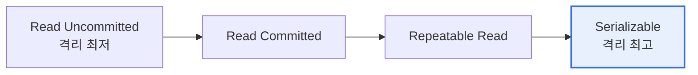

# 트랜잭션 격리 수준(Transaction Isolation Level)

## 1. 개요

### 가. 정의
> 동시에 실행되는 트랜잭션이 서로에게 **어느 정도 영향을 미치는지(격리 정도)** 를 규정하는 수준. ACID의 **격리성(Isolation)** 을 구현하며, 동시성과 일관성의 **트레이드오프**를 조절한다.

### 나. 필요성
- 격리 수준↑ → 일관성↑, 동시성·성능↓ / 격리 수준↓ → 동시성↑, 이상현상 위험↑
- 업무 특성에 맞는 **적정 수준 선택** 필요

## 2. 격리 수준별 이상현상

| 격리 수준 | Dirty Read | Non-repeatable Read | Phantom Read |
|---|---|---|---|
| **Read Uncommitted** | 발생 | 발생 | 발생 |
| **Read Committed** | 방지 | 발생 | 발생 |
| **Repeatable Read** | 방지 | 방지 | 발생(가능) |
| **Serializable** | 방지 | 방지 | 방지 |

## 3. 사례 중심 설명

| 수준 | 동작 | 사례 |
|---|---|---|
| **Read Uncommitted** | 커밋되지 않은 데이터도 읽음 | A가 잔액을 100→200 수정(미커밋)했는데 B가 200으로 조회 → A가 롤백하면 **Dirty Read** |
| **Read Committed** | 커밋된 데이터만 읽음 | B가 조회 중 A가 값을 변경·커밋 → B가 같은 행을 다시 읽으면 값이 달라짐(**Non-repeatable Read**) |
| **Repeatable Read** | 트랜잭션 내 동일 행 반복 조회 일관 | 같은 행은 일관되나, 범위 조회 시 A가 새 행 삽입·커밋하면 결과 건수 증가(**Phantom Read**) |
| **Serializable** | 완전 직렬화 격리 | 모든 이상현상 방지, 그러나 잠금·성능 저하로 동시성 최저 |

## 4. 시사점
- **MVCC**(Oracle·PostgreSQL): 스냅샷 기반으로 읽기-쓰기 충돌 최소화(Read Committed·Snapshot Isolation)
- 대부분의 DBMS 기본값은 **Read Committed**(Oracle) 또는 **Repeatable Read**(MySQL InnoDB)
- 금융 등 강한 일관성은 Serializable, 조회 위주는 낮은 수준으로 **성능·일관성 균형**

---

> **한 줄 요약**: 격리 수준은 *Read Uncommitted→Committed→Repeatable Read→Serializable* 로 갈수록 Dirty·Non-repeatable·Phantom Read를 차례로 차단하며, **일관성과 동시성의 균형**을 조절한다.
