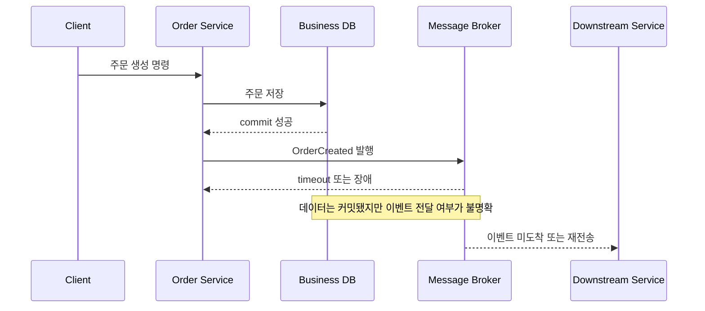
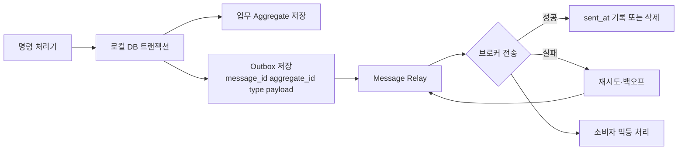
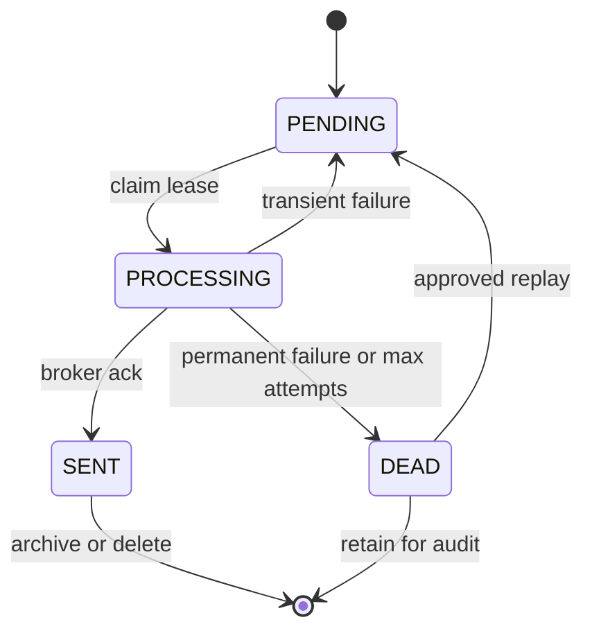

# 트랜잭션 아웃박스 패턴(Transactional Outbox Pattern)

## 1. 개요

> 트랜잭션 아웃박스 패턴은 업무 데이터 변경과 이벤트·메시지 발행을 같은 데이터베이스 로컬 트랜잭션으로 기록한 뒤, 별도의 메시지 릴레이가 커밋된 아웃박스를 브로커로 전달하는 분산 시스템 설계 패턴이다.

마이크로서비스에서 하나의 명령은 대개 두 가지 부작용을 만든다.
첫째, 주문·결제·재고와 같은 업무 상태를 자신의 데이터베이스에 저장한다.
둘째, 다른 서비스가 후속 업무를 수행하도록 이벤트를 메시지 브로커에 발행한다.
이 두 저장 대상은 서로 다른 시스템이므로 애플리케이션 코드에서 순서대로 호출하면 이중 쓰기(dual write)가 된다.

데이터베이스 커밋이 성공한 다음 프로세스가 중단되면 데이터는 존재하지만 이벤트가 사라질 수 있다.
반대로 브로커 발행이 먼저 성공한 뒤 데이터베이스 트랜잭션이 롤백되면 존재하지 않는 업무 사실을 소비자가 처리하게 된다.
네트워크 타임아웃은 실제 브로커 수신 여부를 호출자에게 명확히 알려주지 않으므로 단순 재시도만으로는 중복과 유실을 동시에 해결하기 어렵다.

트랜잭션 아웃박스는 메시지를 브로커에 직접 보내는 대신 데이터베이스의 아웃박스 테이블 또는 레코드에 함께 저장한다.
업무 테이블과 아웃박스가 동일한 로컬 트랜잭션에 포함되면 커밋된 업무 변경에는 전달할 이벤트가 반드시 남고, 롤백된 업무 변경에는 이벤트가 남지 않는다.
그 후 메시지 릴레이가 아웃박스를 읽어 브로커에 전송하므로 애플리케이션 요청 경로와 외부 브로커 장애를 분리할 수 있다.

이 패턴은 모든 분산 트랜잭션을 해결하는 만능 기법은 아니다.
하나의 서비스 내부에서 데이터와 이벤트의 기록을 원자화하지만, 브로커 전달 이후 소비자 처리까지 원자적으로 묶지는 않는다.
따라서 최소 한 번 전달, 중복 메시지, 순서, 소비자 멱등성, 재처리와 보상 업무를 함께 설계해야 한다.

기술사 답안에서는 정의만 쓰기보다 이중 쓰기의 실패 지점, 아웃박스의 원자적 기록, 릴레이의 재전송, 소비자 멱등성이라는 네 축을 연결해 설명하는 것이 중요하다.

## 2. 등장 배경과 해결하려는 문제

### 2.1 직접 발행 방식의 이중 쓰기

가장 직관적인 구현은 서비스가 데이터베이스를 갱신한 직후 메시지 브로커의 `publish` API를 호출하는 것이다.
두 호출이 모두 성공하면 원하는 결과를 얻지만, 애플리케이션 프로세스·네트워크·데이터베이스·브로커 중 어느 하나라도 실패하면 상태가 갈라진다.

데이터베이스 먼저 쓰는 방식은 업무 상태가 커밋된 뒤 브로커 발행이 실패하거나 프로세스가 죽는 구간을 가진다.
이때 재고 서비스나 배송 서비스는 주문 생성 사실을 영원히 알지 못할 수 있다.
브로커 먼저 쓰는 방식은 소비자가 이벤트를 처리하는 동안 원본 데이터가 롤백될 수 있어 더 심각한 허위 사실을 만든다.

`DB commit`과 `broker publish`가 서로 다른 자원에 대한 독립 동작이라는 점이 핵심이다.
데이터베이스 트랜잭션 안에 브로커 호출을 넣어도 브로커가 같은 트랜잭션에 참여하지 않으면 원자성이 생기지 않는다.
오히려 브로커 지연 때문에 데이터베이스 연결을 오래 점유하고, 커밋과 메시지 전송의 순서를 해석하기 어려워질 수 있다.

반대로 아웃박스 방식은 브로커 호출을 업무 트랜잭션에서 분리한다.
업무 테이블과 아웃박스 행을 함께 커밋하는 짧은 로컬 트랜잭션을 먼저 끝내고, 릴레이는 커밋된 행만 비동기로 전송한다.
따라서 요청 응답의 성공 조건은 “브로커가 즉시 받았다”가 아니라 “업무 상태와 전달할 이벤트가 안전하게 저장됐다”로 정의된다.

### 2.2 실패 행렬과 보장 범위

실패를 분석할 때는 업무 DB, 릴레이, 브로커, 소비자를 분리해 관찰해야 한다.
업무 DB 트랜잭션이 롤백되면 아웃박스도 함께 롤백되어 이벤트가 발행되지 않아야 한다.
커밋 후 릴레이가 죽으면 아웃박스 행은 남아 재기동 후 재시도할 수 있어야 한다.

| 구간 | 장애 예 | 바람직한 결과 | 필요한 설계 |
|---|---|---|---|
| 업무 저장 전 | 입력 검증·도메인 규칙 실패 | 업무 데이터와 이벤트 모두 없음 | 트랜잭션 롤백 |
| 업무 저장 중 | DB 오류·타임아웃 | 업무 데이터와 아웃박스 모두 없음 | 같은 로컬 트랜잭션 |
| 커밋 직후 | 서비스 프로세스 중단 | 아웃박스는 남고 전송은 지연 | 재기동·재시도 |
| 브로커 전송 중 | 네트워크 응답 유실 | 실제 수신 여부가 불명확 | 중복 허용·메시지 ID |
| 소비 처리 중 | 소비자 중단 | 메시지 재전달 또는 재처리 | 소비자 멱등성 |
| 장기 장애 | 브로커·소비자 장기 불능 | 아웃박스 적체 및 경보 | 보존·격리·운영 런북 |

이 패턴의 대표적인 보장은 “업무 트랜잭션이 커밋된 경우에만 이벤트가 릴레이 대상이 된다”는 것이다.
그러나 “이벤트가 정확히 한 번만 브로커와 소비자에 도착한다”는 보장은 일반적인 구현에서 성립하지 않는다.
릴레이가 전송 성공 응답을 받기 전에 죽으면 재기동 후 같은 행을 다시 보낼 수 있기 때문이다.

따라서 시스템의 전달 의미를 at-least-once로 명시하고 중복을 정상적인 운영 상황으로 취급하는 편이 안전하다.
정확히 한 번처럼 보이는 업무 결과는 메시지 ID, 처리 이력, 조건부 갱신, 고유 제약조건을 조합해 소비자에서 구현한다.
전달 의미와 업무 의미를 구분하지 않으면 브로커의 기능만 믿고 중복 결제나 중복 예약을 허용하는 오류가 발생한다.

## 3. 핵심 구성요소와 처리 흐름

### 3.1 아웃박스의 논리 구조

아웃박스는 전송해야 할 이벤트를 일시적으로 저장하는 내구성 있는 경계다.
관계형 데이터베이스에서는 업무 테이블과 같은 데이터베이스의 별도 테이블로 만들고, 문서형 데이터베이스에서는 업무 레코드 내부의 이벤트 배열이나 변경 속성으로 표현할 수 있다.
어느 방식이든 이벤트의 업무 의미와 전송 상태를 추적할 식별자가 필요하다.

`message_id`는 재전송과 소비자 중복 제거의 기준이 된다.
`aggregate_id`는 같은 주문·계정·배송 건에 속한 이벤트를 묶고 파티션 키나 순서 보장의 기준으로 사용할 수 있다.
`event_type`과 `schema_version`은 소비자가 이벤트 종류와 계약 버전을 해석하도록 한다.

`occurred_at`은 업무 사건이 발생한 시각이고, `published_at`은 브로커 전달 시각이므로 둘을 혼동하지 않는다.
`sequence`는 동일 aggregate 안의 업무 순서를 표현할 수 있지만, 단순한 전역 자동 증가 값이 곧 모든 서비스의 인과 순서를 의미하지는 않는다.
`attempt_count`, `last_error`, `next_attempt_at`은 운영자가 재시도 상태를 확인하고 지수 백오프를 계산하는 데 사용한다.

예시 스키마는 다음과 같이 설계할 수 있다.

| 컬럼 | 의미 | 설계 포인트 |
|---|---|---|
| `id` | 아웃박스 행 식별자 | 증가 키 또는 시간 정렬 가능한 ID |
| `message_id` | 논리적 메시지 ID | 전역 고유 제약과 중복 제거에 활용 |
| `aggregate_type` | 업무 객체 종류 | 소비자 라우팅과 권한 검토 |
| `aggregate_id` | 업무 객체 식별자 | 동일 객체 순서와 파티션 키 |
| `event_type` | 이벤트 종류 | 계약 및 핸들러 선택 |
| `schema_version` | payload 버전 | 하위 호환·마이그레이션 기준 |
| `payload` | 이벤트 본문 | 민감정보 최소화·직렬화 규칙 |
| `occurred_at` | 업무 발생 시각 | 지연 측정과 감사 추적 |
| `status` | pending·processing·sent·dead | 상태 전이와 재처리 통제 |
| `attempt_count` | 전송 시도 횟수 | 백오프·격리 임계치 |
| `last_error` | 최근 실패 요약 | 비밀정보 제외·운영 진단 |

아웃박스 payload에는 소비자가 필요한 사실을 담되, 원본 데이터베이스를 나중에 조회해야만 의미가 완성되는 형태는 신중히 선택한다.
이벤트 발행 시점과 소비 시점 사이에 원본 레코드가 변경되거나 삭제되면 과거 사실을 재현할 수 없기 때문이다.
반면 개인정보와 대용량 바이너리를 이벤트에 복제하면 보존·암호화·삭제 요구가 복잡해지므로 데이터 최소화 원칙을 적용한다.

### 3.2 원자적 기록 순서

서비스는 명령을 검증하고 도메인 규칙을 실행한 뒤 업무 변경과 아웃박스 이벤트를 하나의 로컬 트랜잭션에 넣는다.
업무 테이블을 먼저 저장하고 아웃박스를 나중에 저장하더라도 둘 다 같은 트랜잭션이면 순서 자체보다 원자성이 중요하다.
어느 쓰기라도 실패하면 전체를 롤백해야 하며, 성공 응답은 이 커밋 이후에 반환한다.

애플리케이션 계층이 이벤트 발행을 호출하되 실제 브로커 전송을 직접 수행하지 않도록 이벤트 저장 포트와 메시지 릴레이를 분리한다.
도메인 이벤트를 수집하는 경우에도 이벤트를 아웃박스 레코드로 변환하는 지점에서 correlation ID, causation ID, schema version을 확정한다.
이렇게 해야 동일 명령의 추적과 여러 서비스에서 이어진 원인 관계를 관측할 수 있다.

ORM의 자동 flush나 트랜잭션 경계에만 의존하면 테스트와 운영 환경에서 이벤트 누락이 생길 수 있다.
업무 상태 변경마다 발행할 이벤트를 명시적으로 결정하고, 통합 테스트에서 “커밋된 상태 수 = 아웃박스 이벤트 수”와 롤백 시 “아웃박스 0건”을 검증한다.
코드 리뷰 규칙이나 도메인 이벤트 디스패처를 사용해 개발자가 아웃박스 기록을 빠뜨릴 가능성도 낮춘다.

### 3.3 메시지 릴레이 방식

릴레이는 아웃박스를 브로커로 옮기는 별도 프로세스 또는 데이터 플랫폼 구성요소다.
가장 단순한 폴링 퍼블리셔는 주기적으로 `pending` 행을 조회하고 잠금·claim을 적용한 뒤 배치로 발행한다.
발행 성공을 확인한 뒤 `sent_at`을 기록하거나 삭제하며, 실패한 행은 재시도 시각을 갱신한다.

폴링 주기가 짧으면 전달 지연은 줄지만 DB 조회와 잠금 부하가 늘어난다.
배치 크기가 너무 크면 한 번의 장애에서 재전송 규모와 브로커 부하가 커지고, 너무 작으면 처리량이 낮아진다.
따라서 목표 지연시간, 아웃박스 유입률, 평균 payload 크기, DB IOPS, 브로커 quota를 이용해 주기와 배치 크기를 부하 시험으로 정한다.

CDC 방식은 데이터베이스 트랜잭션 로그나 변경 스트림에서 커밋된 아웃박스 변경을 읽어 브로커로 전달한다.
폴링보다 애플리케이션 DB 조회 부하와 전달 지연을 줄일 수 있지만, 로그 보존·스키마 변경·커넥터 운영·offset 복구를 별도로 관리해야 한다.
CDC가 업무 테이블의 모든 변경을 곧바로 공개 이벤트로 만든다는 뜻은 아니며, 명시적인 outbox 이벤트만 발행 대상으로 제한하는 것이 안전하다.

| 방식 | 장점 | 비용·위험 | 적합한 상황 |
|---|---|---|---|
| 주기적 폴링 | 구조가 단순하고 DB만으로 시작 가능 | 조회·잠금 부하, 지연 변동 | 소규모 또는 초기 도입 |
| 트랜잭션 로그 CDC | 낮은 지연, 대량 처리에 유리 | 커넥터·로그·offset 운영 복잡도 | 이벤트 유입이 많고 플랫폼 역량이 있는 조직 |
| DB 트리거 | 기록 누락 방지 가능 | 업무 규칙이 DB에 숨고 이식성 저하 | 제한된 레거시 통합 |
| 애플리케이션 이벤트 수집 | 업무 의미와 계약을 코드로 통제 | 개발자 누락·공통 라이브러리 의존 | 도메인 중심 서비스 |

릴레이의 전송과 상태 기록 사이에는 다시 원자적이지 않은 구간이 있다.
브로커에 성공적으로 보낸 뒤 `sent_at` 기록 전에 릴레이가 죽을 수 있으므로, 상태 행을 먼저 `processing`으로 바꾸는 것만으로 중복이 사라지지 않는다.
이 구간을 없애려 하기보다 재전송을 허용하고 동일 `message_id`를 유지해 소비자가 안전하게 중복을 제거하도록 설계한다.

### 3.4 동시성·잠금·순서

여러 릴레이 인스턴스가 같은 행을 읽으면 중복 발행이 증가할 수 있다.
관계형 DB에서는 `SELECT ... FOR UPDATE SKIP LOCKED`와 claim 시각, 소유자, lease 만료를 조합할 수 있지만, 사용하는 DB의 잠금 의미와 장기 트랜잭션 비용을 검증해야 한다.
행을 영구적으로 점유한 릴레이가 죽으면 lease가 만료된 뒤 다른 릴레이가 회수할 수 있어야 한다.

동일 aggregate의 이벤트 순서가 중요하면 aggregate별 단일 파티션, sequence 검증, 순차 claim 중 하나를 선택한다.
전역 순서를 강제하면 처리량과 가용성이 떨어질 수 있으므로 대부분은 같은 주문·계정·기기처럼 업무적으로 필요한 범위의 순서만 보장한다.
서로 다른 aggregate 사이의 행 ID 순서가 곧 업무 인과관계를 뜻한다고 가정해서는 안 된다.

## 4. 중복·순서·재처리 설계

### 4.1 멱등 소비자

중복은 릴레이가 브로커 응답을 확인하지 못한 경우, 브로커 재전달, 소비자 ACK 전 장애에서 자연스럽게 발생한다.
소비자는 `message_id` 처리 이력 테이블에 고유 제약을 두고 이미 처리한 메시지를 빠르게 성공 처리하거나, 업무 갱신 자체를 조건부·멱등적으로 만든다.
예를 들어 결제 승인 요청은 주문 ID에 유일한 결제 시도 키를 두고, 같은 키로 두 번째 요청이 들어오면 기존 결과를 반환하게 한다.

처리 이력 기록과 업무 갱신도 가능하면 하나의 소비자 로컬 트랜잭션으로 묶는다.
업무 갱신 후 처리 이력 기록 전에 장애가 나면 재처리 시 중복 부작용이 생기므로, 고유 키 충돌을 정상적인 중복 신호로 활용한다.
외부 결제 API처럼 소비자 DB 밖의 부작용은 제공자의 idempotency key, 요청 키, 대사 작업을 함께 사용해야 한다.

### 4.2 실패 분류와 재시도

일시적 네트워크 오류·브로커 throttling·소비자 일시 중단은 지수 백오프와 jitter를 적용해 재시도한다.
스키마 오류·필수 필드 누락·유효하지 않은 업무 상태는 재시도해도 성공하지 않으므로 무한 재시도 대신 격리 큐나 dead-letter outbox로 보낸다.
재시도 정책은 오류 코드별 최대 횟수, 최대 보존 시간, 운영자 재처리 승인 여부를 포함해야 한다.

재처리는 원본 payload를 그대로 다시 보내는 것과 새 보정 이벤트를 만드는 것을 구분한다.
단순 재전송은 소비자 코드가 수정된 뒤 과거 이벤트를 다시 반영할 때 유용하지만, 이미 부분적으로 수행된 외부 부작용을 되돌리지는 않는다.
금액·재고·권한처럼 보상 업무가 필요한 경우에는 운영자가 원인과 결과를 확인하고 별도의 보상 명령을 실행하도록 한다.

### 4.3 관측성과 운영 지표

아웃박스는 비동기 경계이므로 요청 성공률만 보면 장애를 놓친다.
아웃박스 행의 oldest age, pending count, publish latency, retry rate, dead-letter count, relay throughput을 핵심 지표로 수집한다.
`occurred_at`부터 브로커 발행 시각까지의 지연과 발행부터 소비 처리 완료까지의 지연을 분리하면 병목 위치를 알 수 있다.

로그에는 message_id, aggregate_id, correlation_id, event_type, attempt_count, relay_instance를 구조화해 기록한다.
payload 전체나 개인정보를 로그에 남기지 않고, 추적 ID로 원본 이벤트와 운영 기록을 연결한다.
분산 추적에서는 업무 요청 span과 릴레이 span이 다른 프로세스에 걸치므로 trace context를 이벤트 헤더에 안전하게 전파한다.

보존 기간이 끝난 아웃박스를 곧바로 삭제하면 감사와 재처리가 어려워질 수 있다.
운영 DB의 hot 영역, 저비용 archive, 개인정보 삭제 정책을 구분하고, 삭제 전 백업·대사·재처리 가능성을 검토한다.
처리 완료 행을 무한히 남기면 인덱스와 저장 비용이 커지므로 파티션, TTL, archive job을 사용하되 규제 보존 요구와 충돌하지 않게 한다.

## 5. 관련 기술과 비교

### 5.1 직접 발행 및 2PC와의 비교

직접 발행은 구현이 짧지만 DB 커밋과 브로커 전송의 실패 구간을 애플리케이션이 직접 감당해야 한다.
2PC는 여러 참여자의 prepare와 commit을 조정해 원자적 커밋을 시도하지만, 참여자 지원 여부와 coordinator 장애, 잠금 유지와 블로킹 비용을 고려해야 한다.
아웃박스는 브로커를 분산 트랜잭션 참여자로 만들지 않고 DB 안에 메시지를 먼저 기록하므로 결합도와 운영 복잡도를 낮춘다.

| 구분 | 직접 발행 | 2PC/XA | 트랜잭션 아웃박스 |
|---|---|---|---|
| 원자성 범위 | 호출 순서에 의존 | 참여자 전체 | 업무 DB와 outbox 기록 |
| 브로커 결합 | 애플리케이션에 직접 결합 | coordinator·XA 지원 필요 | 릴레이가 결합 |
| 전달 지연 | 즉시 시도 | 커밋 조정 시간 | 비동기 지연 |
| 중복 처리 | 구현에 따라 다름 | 커밋 후에도 별도 고려 | 멱등 소비자 필수 |
| 장애 격리 | 요청 경로가 영향 받음 | 참여자 장애가 트랜잭션을 막음 | 릴레이 적체로 격리 |
| 운영 부담 | 초기 낮음, 장애 시 높음 | 프로토콜·락·복구 복잡 | outbox·relay·replay 운영 |

아웃박스가 2PC보다 항상 우월한 것은 아니다.
강한 원자성이 여러 데이터 저장소에 반드시 필요하고 모든 참여자가 검증된 XA를 지원한다면 2PC를 검토할 수 있다.
그러나 외부 브로커·SaaS·클라우드 서비스가 XA에 참여하지 않거나 높은 가용성과 느슨한 결합이 중요하면 아웃박스의 최종 일관성이 더 현실적인 선택이 된다.

### 5.2 CDC와 이벤트 소싱·사가와의 관계

CDC는 변경 내용을 읽어 전달하는 전송 메커니즘이고, 아웃박스는 어떤 업무 사실을 공개할지 명시적으로 기록하는 패턴이다.
업무 테이블의 모든 row change를 외부에 노출하면 내부 스키마가 이벤트 계약으로 굳어질 수 있으므로, 별도 outbox 이벤트를 CDC로 읽는 방식이 경계를 명확히 한다.

이벤트 소싱은 이벤트를 시스템의 원본 사실로 저장하고 그 이벤트를 재생해 상태를 만드는 모델이다.
아웃박스는 일반적인 현재 상태 테이블을 유지하면서 외부 발행을 보장하는 목적이므로, 이벤트 소싱 없이도 사용할 수 있다.
이벤트 소싱을 도입한 시스템에서는 이벤트 저장소와 외부 브로커의 전달 경계를 아웃박스 또는 로그 기반 릴레이로 설계할 수 있다.

사가(Saga)는 여러 서비스에 걸친 업무를 로컬 트랜잭션과 보상 작업의 연쇄로 조정하는 패턴이다.
각 사가 단계에서 자신의 DB 변경과 다음 명령·이벤트를 안전하게 발행하는 데 아웃박스를 함께 사용할 수 있다.
아웃박스는 메시지 전달의 원자성을 보완하고, 사가는 여러 서비스의 업무 진행·보상 정책을 담당하므로 역할을 혼동하지 않는다.

## 6. 적용 사례

### 6.1 전자상거래 주문

주문 서비스가 주문 상태를 `PAID_PENDING`으로 바꾸면서 `PaymentRequested`를 아웃박스에 기록한다.
결제가 승인되면 결제 서비스는 처리 이력과 결제 상태를 함께 기록하고 `PaymentApproved`를 다시 자신의 아웃박스에 넣는다.
재고·배송 서비스는 같은 주문 ID와 이벤트 ID를 사용해 중복 예약·중복 출고를 방지한다.

결제 승인 이벤트의 유실은 주문이 영원히 대기하는 문제를 만들 수 있으므로 pending oldest age를 경보로 둔다.
결제 재시도에서 네트워크 응답만 유실된 경우에는 같은 idempotency key로 결제 결과를 조회해야 하며, 무작정 새 승인 요청을 만들면 이중 결제가 될 수 있다.
운영자는 주문·결제·재고의 상태를 대사해 보정 명령을 수행할 수 있어야 한다.

### 6.2 금융 이체와 원장 이벤트

계좌 서비스는 원장 잔액과 이체 이벤트를 같은 로컬 트랜잭션으로 기록한다.
이벤트에는 거래 ID, 계정 식별자, 금액, 통화, 원장 sequence를 담되 인증 정보나 불필요한 개인정보는 제외한다.
소비자는 거래 ID 고유 제약과 sequence 검증을 통해 같은 이체를 두 번 반영하지 않고 순서가 뒤바뀐 이벤트를 격리한다.

금융 업무는 “한 번만 처리”라는 표현보다 원장 불변식과 대사 가능성이 중요하다.
브로커 재전송을 허용하되 최종 원장 결과가 한 번만 반영되도록 저장소 제약과 처리 이력을 설계한다.
보존·감사·접근통제 요구 때문에 아웃박스의 archive와 삭제 정책을 법무·보안 담당과 함께 정해야 한다.

### 6.3 물류와 IoT 상태 변화

물류 허브는 장비 상태를 저장하면서 `DeviceStateChanged` 이벤트를 발행해 관제·정비·알림 서비스를 갱신한다.
같은 장비의 상태 순서가 중요하므로 device ID를 파티션 키로 사용하고 sequence가 이전 값보다 작거나 같으면 중복·지연 이벤트로 처리한다.
짧은 일시 장애는 재시도하고, 장기간 오프라인 단말의 오래된 상태는 최신 상태 덮어쓰기 또는 폐기 정책을 적용한다.

초당 이벤트 수가 많으면 매 행을 폴링하는 방식이 DB에 부담이 될 수 있다.
이때 CDC와 파티션 아웃박스, 배치 릴레이, 보존 주기 조정을 결합하되 데이터베이스 로그와 브로커 처리량을 부하 시험한다.
운영 지표에는 장비별 지연과 누락뿐 아니라 outbox 적체로 인한 관제 화면의 신선도도 포함해야 한다.

## 7. 심화: 설계·도입 전략과 예상 출제 포인트

### 7.1 단계적 도입

첫 단계에서는 이벤트가 필요한 핵심 유스케이스 하나를 선정하고, 업무 테이블과 같은 DB에 최소 필드의 outbox를 만든다.
동기 브로커 발행을 제거하기 전에 기존 발행과 아웃박스 발행을 비교 관찰하는 shadow 모드를 사용할 수 있다.
중복 이벤트가 소비자에 도달할 수 있으므로 전환 기간에는 consumer idempotency를 먼저 확보한다.

둘째 단계에서는 릴레이의 claim·lease·backoff·DLQ·재처리를 표준화한다.
서비스마다 서로 다른 상태명과 재시도 규칙을 만들면 운영자가 장애를 대응하기 어려우므로 공통 라이브러리와 플랫폼 가드를 제공한다.
다만 이벤트 계약은 도메인별 의미가 다르므로 하나의 거대한 공통 payload 모델로 강제하지 않는다.

셋째 단계에서는 CDC 또는 이벤트 플랫폼으로 확장하고, 스키마 레지스트리·계약 테스트·보존·접근통제를 연결한다.
브로커가 바뀌어도 도메인 이벤트의 의미와 message_id 규칙은 유지해 소비자 계약의 불필요한 변경을 줄인다.
도입 성과는 단순 처리량보다 이벤트 누락률, 평균 전달 지연, 재처리 성공률, 대사 미해결 건수로 평가한다.

### 7.2 예상 답안 구성

시험 답안의 개요에서는 이중 쓰기와 분산 트랜잭션의 배경을 제시한 뒤 “업무 데이터와 outbox를 동일 로컬 트랜잭션으로 저장하고 relay가 비동기 발행한다”고 정의한다.
개념도에는 명령 처리기, DB 트랜잭션, 업무 테이블, outbox, relay, broker, idempotent consumer를 빠짐없이 표시한다.

본론에서는 직접 발행의 두 실패 시나리오와 아웃박스의 원자적 기록을 대비한다.
폴링과 CDC의 차이, message_id·aggregate_id·sequence 설계, 중복·순서·재시도·DLQ·관측 지표를 설명하면 단순 암기형 답안에서 벗어날 수 있다.

결론에서는 아웃박스가 “정확히 한 번”을 약속하는 방식이 아니라, 로컬 원자성과 재처리 가능한 최종 일관성을 제공한다는 한계를 명시한다.
업무 중요도에 따라 2PC·사가·이벤트 소싱과 조합하고, 멱등 소비자·대사·보안·비용·운영 역량까지 제시하면 기술사 관점의 판단을 드러낼 수 있다.

## 8. 고려사항 및 시사점

### 8.1 보장 범위를 계약으로 명시

“이벤트 발행 보장”을 커밋 보장, 브로커 전달 보장, 소비 처리 보장으로 나누어 문서화한다.
서비스 수준 목표에는 최대 전달 지연, 최대 재시도 시간, DLQ 처리시간, 허용 가능한 중복률을 포함한다.
업무 담당자가 이를 이해하지 못하면 비동기 최종 일관성을 사용자에게 잘못 표시할 수 있다.

### 8.2 멱등성과 순서는 업무별로 설계

모든 메시지에 전역 순서를 강제하는 대신 aggregate별로 필요한 순서만 정의한다.
소비자의 처리 이력, 조건부 업데이트, 고유 키, 외부 idempotency key를 부작용의 종류에 맞게 조합한다.
중복을 오류로만 기록하지 말고 정상적인 재전달 경로로 테스트해야 한다.

### 8.3 저장·보존·개인정보 최소화

아웃박스는 이벤트가 발행될 때까지 원본 payload를 보존하므로 민감정보가 복제되는 지점이 된다.
필드를 최소화하고 암호화·접근통제·마스킹·보존 기간·삭제 전파를 설계한다.
처리 완료 이벤트를 archive하는 경우에도 감사 요구와 개인정보 삭제 요구 사이의 우선순위를 사전에 결정한다.

### 8.4 운영 안전성과 장애 격리

릴레이는 DB에 과도한 잠금을 걸지 않고 장애가 난 행 하나가 전체 배치를 막지 않도록 격리한다.
브로커 장애 시 backpressure, circuit breaker, rate limit을 적용하고, outbox 적체가 업무 DB의 저장 공간을 고갈시키지 않게 상한과 경보를 둔다.
DLQ 재처리는 승인·미리보기·dry-run·롤백 또는 보상 절차를 갖춘 운영 도구로 통제한다.

### 8.5 계약 진화와 테스트

이벤트는 내부 테이블 DTO가 아니라 외부 소비자가 의존하는 계약이므로 필드 삭제·의미 변경을 신중히 한다.
schema version, 하위 호환 규칙, consumer-driven contract test, 샘플 payload를 함께 관리한다.
통합 테스트에서는 커밋·롤백·릴레이 중단·브로커 ACK 유실·중복·순서 역전·DLQ 재처리를 시나리오로 검증한다.

### 8.6 아키텍처 선택의 균형

아웃박스 테이블과 릴레이는 추가 저장·운영 구성요소를 요구하므로 단순 CRUD 서비스에 무조건 적용하면 비용이 커진다.
반대로 데이터 변경이 다른 서비스의 결제·재고·권한·감사로 이어지고 이벤트 유실의 비용이 크다면 작은 전달 지연과 운영 복잡도를 감수할 가치가 있다.
기술사는 트랜잭션 경계, 실패 비용, 처리량, 규제, 조직 역량을 기준으로 직접 발행·아웃박스·2PC·사가를 선택해야 한다.

## 참고자료

- AWS Prescriptive Guidance, [Transactional outbox pattern](https://docs.aws.amazon.com/prescriptive-guidance/latest/cloud-design-patterns/transactional-outbox.html)
- Chris Richardson, [Pattern: Transactional outbox](https://microservices.io/patterns/data/transactional-outbox.html)
- Debezium Documentation, [Outbox Event Router](https://debezium.io/documentation/reference/stable/transformations/outbox-event-router.html)

---

> **한 줄 요약**: 업무 데이터와 이벤트를 같은 로컬 트랜잭션으로 outbox에 기록하고, 멱등 소비자·순서·재처리 체계를 갖춘 릴레이로 최종 일관성 있게 전달하는 패턴이다.
