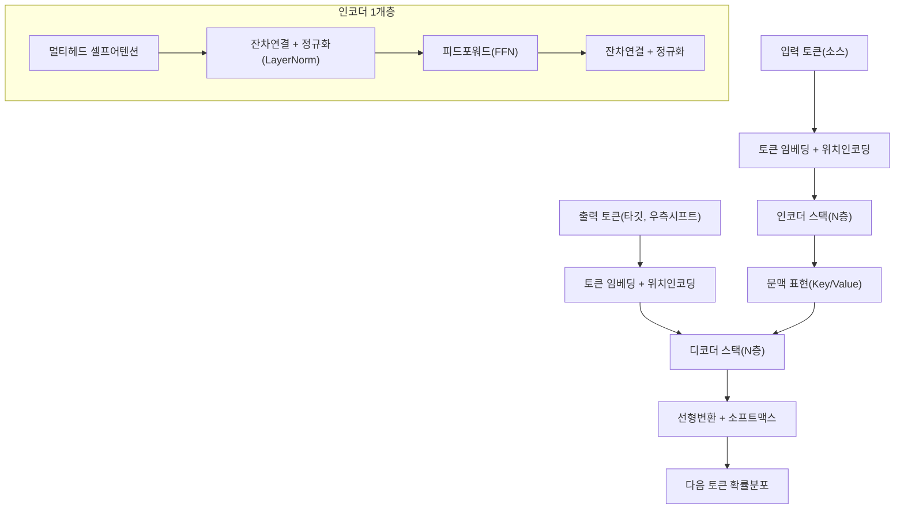
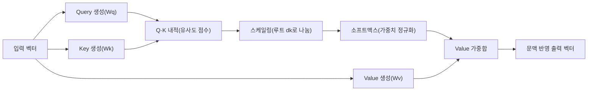

# 트랜스포머(Transformer)와 어텐션(Attention) 메커니즘

## 1. 개요

> **정의**: 트랜스포머는 순환(RNN)이나 합성곱(CNN) 구조 없이 오직 **어텐션(Attention)** 연산만으로 입력 시퀀스 내 모든 토큰 간의 관계를 병렬로 계산하는 딥러닝 아키텍처로, 2017년 구글의 "Attention Is All You Need" 논문에서 제안된 이래 자연어처리·비전·음성을 아우르는 현대 대규모 AI 모델의 사실상 표준 구조가 되었다.

트랜스포머의 등장 배경은 기존 순환신경망(RNN·LSTM)이 가진 두 가지 구조적 한계에 있다.
첫째는 **순차 처리로 인한 병렬화의 불가능**이다.
RNN은 시점 t의 은닉상태를 계산하려면 t-1의 상태가 먼저 필요하므로 시퀀스 길이에 비례해 순차적으로 계산할 수밖에 없고, 이는 GPU의 대규모 병렬 연산 능력을 활용하지 못해 대용량 학습을 병목시켰다.
둘째는 **장거리 의존성(long-range dependency)의 소실**이다.
문장 앞부분의 정보가 뒤까지 전달되려면 여러 시점을 거쳐 은닉상태에 실려 흘러야 하는데, 그 과정에서 기울기 소실이 발생해 멀리 떨어진 단어 간의 관계가 희미해진다.

트랜스포머는 이 두 문제를 어텐션이라는 단일 원리로 동시에 해결한다.
어텐션은 각 토큰이 시퀀스의 **모든** 토큰을 한 번에 바라보며 관련도(가중치)를 직접 계산하므로, 순차 의존이 사라져 완전한 병렬 처리가 가능하고, 두 토큰이 아무리 멀리 떨어져 있어도 경로 길이가 상수(O(1))로 유지되어 장거리 관계가 손실 없이 반영된다.
이러한 병렬성과 확장성 덕분에 트랜스포머는 데이터와 파라미터를 키울수록 성능이 예측 가능하게 향상되는 **규모의 법칙(scaling law)**을 실현했고, GPT·BERT·T5와 같은 초거대 언어모델(LLM)의 공통 기반이 되었다.
답안에서는 트랜스포머를 단순한 신경망 하나가 아니라, "병렬성·장거리 의존성·확장성"이라는 세 가치를 동시에 달성한 **패러다임 전환**으로 서술하는 것이 타당하다.

## 2. 트랜스포머 전체 아키텍처

트랜스포머는 입력을 이해하는 **인코더(Encoder)**와 출력을 생성하는 **디코더(Decoder)**를 각각 N개(원논문은 6개) 쌓은 인코더-디코더 구조를 기본형으로 한다.
아래 개념도는 입력 토큰이 임베딩·위치인코딩을 거쳐 인코더·디코더 스택을 통과해 최종 확률분포로 변환되는 전체 골격을 나타낸다.

**임베딩과 위치인코딩** 단계에서는 각 토큰을 고정 차원(예: 512차원)의 실수 벡터로 변환한다.
그런데 어텐션은 집합(set) 연산이라 토큰의 순서 정보를 스스로 알지 못하므로, "몇 번째 위치인가"를 벡터에 더해 주어야 한다.
원논문은 서로 다른 주파수의 사인·코사인 함수로 위치를 부호화하는 **정현파 위치인코딩**을 사용했고, 이후 학습형 위치임베딩이나 상대위치를 반영하는 RoPE(회전 위치인코딩)·ALiBi 등이 등장해 긴 문맥 처리에서 널리 쓰인다.
위치 정보가 없으면 "개가 사람을 물었다"와 "사람이 개를 물었다"를 구분하지 못하므로, 위치인코딩은 순서가 의미를 좌우하는 언어에서 필수적이다.

**인코더**는 셀프어텐션과 피드포워드 신경망을 두 축으로 하며, 각 서브층마다 **잔차연결(residual connection)**과 **층 정규화(LayerNorm)**를 적용한다.
잔차연결은 입력을 출력에 그대로 더해 기울기가 깊은 층까지 소실 없이 전달되도록 하고, 층 정규화는 각 층의 입력 분포를 안정시켜 학습을 원활하게 한다.
이 두 장치가 없으면 수십 층을 쌓은 심층 트랜스포머는 학습이 사실상 불가능하다.

## 3. 어텐션 메커니즘의 원리

트랜스포머의 심장은 어텐션이며, 그 핵심 연산은 **Scaled Dot-Product Attention**이다.
아래 다이어그램은 하나의 토큰이 질의(Query)를 만들어 다른 모든 토큰의 키(Key)와 유사도를 재고, 그 가중치로 값(Value)을 가중합하는 과정을 프로세스로 표현한다.

### 가. Query·Key·Value의 직관

어텐션은 정보 검색(retrieval)에 비유하면 이해가 쉽다.
**Query**는 "내가 지금 찾는 정보"를, **Key**는 "각 토큰이 제공할 수 있는 정보의 색인"을, **Value**는 "실제 담긴 내용"을 의미한다.
한 토큰의 Query를 다른 모든 토큰의 Key와 내적하면 관련도 점수가 나오고, 이 점수를 소프트맥스로 정규화해 0~1의 가중치로 만든 뒤 Value들을 가중합한다.
결과적으로 각 토큰의 출력 벡터는 자신과 관련이 큰 토큰들의 정보를 많이 담게 된다.
예컨대 "그 동물은 길을 건너지 않았다. 그것이 너무 피곤했기 때문이다"에서 "그것(it)"의 Query는 "동물"의 Key와 높은 유사도를 가져, "그것"이 무엇을 가리키는지를 문맥에서 스스로 해소한다.

### 나. 스케일링과 소프트맥스

내적 점수를 그대로 소프트맥스에 넣지 않고 키 차원의 제곱근(√dk)으로 나누는 이유는 수치 안정성에 있다.
차원이 커지면 내적값의 분산이 커져 소프트맥스가 특정 토큰에 극단적으로 쏠리고, 그 영역에서 기울기가 0에 가까워져 학습이 정체된다.
√dk로 나누면 점수 분포가 완만해져 여러 토큰에 고르게 주의를 배분할 수 있고 기울기도 안정된다.
이처럼 작은 스케일링 상수 하나가 심층 학습의 수렴을 좌우한다는 점은 트랜스포머 설계의 정밀함을 보여준다.

### 다. 멀티헤드 어텐션(Multi-Head Attention)

단일 어텐션은 한 종류의 관계만 포착하는 반면, **멀티헤드 어텐션**은 Q·K·V를 여러 개(원논문은 8개)의 저차원 부분공간으로 나눠 병렬로 어텐션을 수행한 뒤 결과를 이어붙인다.
각 헤드는 문법적 관계, 지시어 해소, 의미적 유사성 등 **서로 다른 관점의 관계**를 학습하도록 분화된다.
이는 하나의 문장을 여러 전문가가 각기 다른 관점(구문·의미·공기관계)으로 동시에 해석해 종합하는 것에 비유할 수 있으며, 표현력을 크게 높인다.
아래 표는 세 가지 어텐션의 쓰임을 정리한 보조 자료이다.

| 구분 | 위치 | Query 출처 | Key/Value 출처 | 역할 |
|------|------|-----------|----------------|------|
| 인코더 셀프어텐션 | 인코더 | 입력 | 입력 | 소스 문맥 내 상호 관계 파악 |
| 마스크드 셀프어텐션 | 디코더 | 출력(생성분) | 출력 | 미래 토큰 차단, 자기회귀 생성 |
| 인코더-디코더 어텐션 | 디코더 | 출력 | 인코더 표현 | 소스와 타깃 정렬(번역 대응) |

### 라. 마스킹과 자기회귀 생성

디코더의 셀프어텐션은 **마스킹(masking)**을 적용해 각 위치가 자신보다 뒤(미래)의 토큰을 보지 못하게 한다.
생성 시점에는 아직 뒤 단어가 존재하지 않으므로, 학습 때 미래를 미리 참조하면 컨닝이 되어 실제 추론과 불일치하기 때문이다.
마스킹된 위치의 점수를 음의 무한대로 만들어 소프트맥스 후 가중치를 0으로 만드는 방식이며, 이로써 디코더는 왼쪽에서 오른쪽으로 한 토큰씩 생성하는 **자기회귀(autoregressive)** 방식으로 동작한다.
GPT 계열은 이 디코더 구조만 취해 다음 단어 예측에 특화했고, BERT 계열은 인코더만 취해 양방향 문맥 이해에 특화했다.

## 4. 유형 비교와 산업 적용 사례

트랜스포머는 사용 목적에 따라 세 계열로 분화되며, 그 차이는 어떤 블록을 취하고 어텐션을 어떻게 제약하는가에서 비롯된다.
**인코더 전용(BERT·RoBERTa)**은 양방향 문맥을 모두 활용해 분류·개체명 인식·검색 임베딩처럼 "이해"가 중요한 과업에 강하다.
**디코더 전용(GPT·LLaMA)**은 마스크드 어텐션으로 다음 토큰을 예측하는 생성에 특화되어, 대화·요약·코드 생성의 기반이 된다.
**인코더-디코더(T5·BART)**는 입력을 이해해 다른 형태로 변환하는 번역·요약에 적합하다.
이 세 계열의 선택은 "입력을 이해만 하면 되는가, 새로 생성해야 하는가, 변환해야 하는가"라는 과업의 성격에서 갈린다.

산업 적용 사례는 광범위하다.
기계번역에서는 트랜스포머 도입 이후 BLEU 점수가 기존 RNN 기반 대비 크게 향상되었고, 오늘날 대부분의 상용 번역 서비스가 트랜스포머 기반이다.
비전 분야에서는 이미지를 패치로 쪼개 토큰처럼 다루는 **ViT(Vision Transformer)**가 대규모 데이터에서 CNN을 능가하는 성능을 보였고, 의료 영상 판독·자율주행 인식에 활용된다.
생명과학에서는 단백질 서열을 언어처럼 학습한 AlphaFold2가 구조 예측 난제를 크게 진전시켰고, 음성에서는 Whisper가 다국어 음성인식을 통합했다.
이처럼 트랜스포머는 특정 도메인 구조에 의존하지 않는 범용 시퀀스 모델이라는 점이 폭넓은 확산의 근본 이유다.

아래 표는 RNN·CNN과 트랜스포머의 원리적 차이를 비교한 것이다.

| 항목 | RNN/LSTM | CNN | 트랜스포머 |
|------|----------|-----|-----------|
| 처리 방식 | 순차 | 지역 병렬 | 전역 병렬 |
| 장거리 의존성 | 약함(소실) | 제한적(수용영역) | 강함(O(1) 경로) |
| 병렬화 | 불가(시점 의존) | 가능 | 완전 가능 |
| 계산 복잡도 | O(n) | O(n·k) | O(n²·d) |
| 대표 한계 | 기울기 소실 | 전역 문맥 부족 | 시퀀스 길이 제곱 비용 |

## 5. 심화: 최신 동향과 효율화 연구

트랜스포머의 최대 약점은 셀프어텐션이 시퀀스 길이 n에 대해 **O(n²)**의 계산·메모리 비용을 갖는다는 점이다.
모든 토큰 쌍의 관계를 계산하므로 문맥이 길어질수록 비용이 제곱으로 폭증해, 긴 문서나 대화를 다룰 때 병목이 된다.
이를 완화하기 위한 연구가 활발하다.
**희소 어텐션(Sparse Attention)**은 모든 쌍이 아니라 일부 패턴(국소 윈도우 + 전역 토큰)만 계산해 비용을 준선형으로 낮추며(Longformer·BigBird), **선형 어텐션**은 소프트맥스를 근사해 O(n) 복잡도를 달성한다.
시스템 최적화 관점에서는 GPU 메모리 접근을 최소화하는 **FlashAttention**이 정확도 손실 없이 속도와 메모리 효율을 크게 개선해 장문맥 학습을 실용화했다.

추론 단계에서는 이미 계산한 Key·Value를 재사용하는 **KV 캐시**가 자기회귀 생성의 반복 계산을 줄이는 핵심 기법이며, 이 캐시의 메모리 관리(PagedAttention 등)가 대규모 서빙의 효율을 좌우한다.
또한 위치인코딩을 상대적·회전형(RoPE)으로 개선하고 문맥 창을 확장하는 기법이 발전하면서, 초기 수백 토큰 수준이던 문맥 길이가 수십만 토큰까지 늘어났다.
아키텍처 측면에서는 필요한 전문가 하위망만 활성화해 연산량을 억제하는 **전문가 혼합(MoE)** 구조가 초거대 모델의 효율적 확장 방법으로 부상하고 있다.
다만 이런 효율화 기법들은 대개 정확도와 비용 사이의 절충을 수반하므로, 과업의 문맥 길이·지연 요구·예산에 맞춰 선택해야 한다.

## 6. 고려사항 및 시사점

기술사 관점에서 트랜스포머의 적용과 확산은 다음을 종합적으로 고려해야 한다.

- **연산·메모리 비용과 규모의 트레이드오프**: 성능은 파라미터·데이터·연산의 규모에 비례하지만 O(n²) 비용과 GPU 자원 부담도 함께 커진다. 문맥 길이 요구, 지연·처리량 목표, 인프라 예산을 정량화해 희소·선형 어텐션, KV 캐시, 양자화·증류 같은 효율화 전략을 선택적으로 조합해야 한다.
- **데이터 품질과 편향·환각**: 대규모 사전학습 데이터에 내재한 편향·오류가 모델에 그대로 학습되며, 자기회귀 생성은 사실과 다른 내용을 그럴듯하게 지어내는 환각을 낳는다. 데이터 정제·RAG를 통한 근거 기반 응답·출력 검증·휴먼 피드백 정렬(RLHF/DPO)로 신뢰성을 보강해야 한다.
- **적용 전략과 개발 방식**: 대부분의 조직은 초거대 모델을 처음부터 학습하기보다, 공개 사전학습 모델을 파인튜닝·PEFT(LoRA)하거나 RAG·프롬프트로 활용하는 것이 현실적이다. 과업이 이해형인지 생성형인지에 따라 인코더·디코더·인코더-디코더 계열을 선택하는 것이 출발점이다.
- **보안·프라이버시·거버넌스**: 학습·추론 데이터에 개인정보·기밀이 포함될 수 있고, 프롬프트 인젝션·모델 탈취 같은 신종 위협도 존재한다. 데이터 최소화·접근통제·입출력 필터링과 함께 AI 신뢰성·설명가능성(XAI) 관점의 거버넌스를 갖춰야 한다.
- **전망과 연계 기술**: 트랜스포머는 멀티모달(텍스트·이미지·음성 통합)·에이전트·온디바이스 경량화로 확장되고 있으며, MoE·장문맥·효율적 어텐션 연구와 결합해 성능과 비용의 균형을 진화시키고 있다. 한편 상태공간모델(SSM, Mamba 등) 같은 대안 구조도 등장하고 있어, 트랜스포머 일변도를 넘어서는 아키텍처 다변화 가능성도 주시할 필요가 있다.

---

> **한 줄 요약**: 트랜스포머는 순환·합성곱 없이 Query·Key·Value 기반 셀프어텐션만으로 시퀀스 전체의 관계를 병렬로 계산해 장거리 의존성과 확장성을 동시에 확보한 아키텍처로, 멀티헤드·위치인코딩·인코더/디코더 구조를 통해 현대 LLM과 멀티모달 AI의 공통 기반이 되었으며, O(n²) 비용의 효율화와 신뢰성·거버넌스 확보가 실무의 핵심 과제다.
