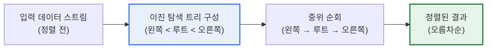
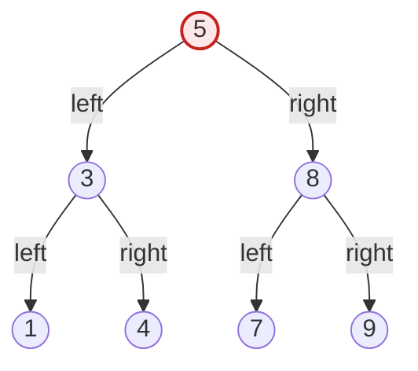

# 트리 정렬(Tree Sort)

## 1. 개요

### 가. 정의
> 트리 정렬은 정렬 대상 데이터를 **이진 탐색 트리(BST, Binary Search Tree)에 하나씩 삽입한 뒤, 중위 순회(In-order Traversal)로 읽어내어 오름차순(또는 내림차순) 정렬을 얻는 비교 기반 정렬 알고리즘**이다. '왼쪽 서브트리 < 루트 < 오른쪽 서브트리'라는 이진 탐색 트리의 불변식(invariant)을 정렬에 그대로 빌려 쓴다.

트리 정렬의 핵심 원리는 '**이진 탐색 트리를 중위 순회하면 자동으로 정렬된 순서가 나온다**'는 성질에 있다. 이진 탐색 트리는 임의의 노드를 기준으로 왼쪽 서브트리에는 자기보다 작은 값만, 오른쪽 서브트리에는 자기보다 큰 값만 오도록 구성되는 자료구조다. 이 성질은 재귀적으로 모든 노드에서 성립하기 때문에, 트리 전체를 '왼쪽 → 루트 → 오른쪽' 순서로 방문하는 중위 순회를 수행하면 가장 작은 값에서부터 가장 큰 값까지 오름차순으로 값이 흘러나온다. 즉 정렬이라는 목적을 달성하기 위해 버블·퀵 정렬처럼 별도의 비교·교환(swap) 로직을 명시적으로 설계하는 대신, 데이터를 트리에 삽입하는 행위 자체가 각 원소를 크기 순서에 맞는 자리에 배치하는 '숨은 정렬'이 되고, 순회는 그 결과를 선형으로 펼쳐 읽는 과정일 뿐이다.

이러한 접근이 흥미로운 이유는 정렬 알고리즘과 자료구조가 사실상 동전의 양면임을 드러내기 때문이다. 퀵 정렬이 분할 정복으로 피벗을 기준으로 좌우를 나누는 과정은, 트리 정렬이 루트를 기준으로 좌우 서브트리를 만드는 과정과 구조적으로 동형(isomorphic)이다. 실제로 무작위 데이터에 대한 트리 정렬의 삽입 순서를 그대로 따라가면 퀵 정렬이 무작위 피벗을 선택했을 때의 비교 횟수와 통계적으로 동일한 분포를 보인다. 이 때문에 트리 정렬은 '자료구조로 표현한 퀵 정렬'이라고도 불린다.

### 나. 등장 배경과 필요성
전통적인 정렬 알고리즘(버블·삽입·선택·퀵·병합 등)은 대체로 '한 번에 주어진 배열 전체를 정렬'하는 정적(batch) 정렬을 전제로 한다. 그러나 실무에서는 데이터가 스트림처럼 계속 들어오면서 언제든 정렬된 상태로 조회·순회할 수 있어야 하는 동적(online) 상황이 많다. 예를 들어 실시간 순위표, 이벤트 로그의 시간순 유지, 우선순위가 바뀌는 작업 큐 등이 그렇다. 이때 새 원소가 들어올 때마다 배열 전체를 다시 O(n log n)에 정렬하는 것은 낭비다. 트리 정렬은 각 삽입을 O(log n)(균형 시)에 처리하면서 트리 자체가 항상 '정렬 가능한 상태'를 유지하므로, 삽입·삭제가 반복되는 동적 환경에 자연스럽게 맞는다.

또한 트리 정렬은 정렬 결과뿐 아니라 **정렬된 순서 위에서의 다양한 질의**를 부수적으로 얻을 수 있다는 실용적 가치가 있다. 트리를 유지하면 최솟값·최댓값 조회는 각각 가장 왼쪽·오른쪽 노드로 O(log n), 특정 값의 존재 여부 탐색도 O(log n), 어떤 값의 바로 다음(successor)·이전(predecessor) 원소 조회도 트리 구조를 따라 즉시 가능하다. 단순히 '정렬된 배열'만 필요한 경우라면 퀵·병합 정렬이 더 낫지만, '정렬된 상태를 계속 유지하며 질의도 함께 처리'해야 한다면 트리 기반 접근이 유리하다는 점이 트리 정렬을 별도로 학습하는 이유다.

## 2. 동작 원리와 절차

### 가. 전체 구조도
트리 정렬은 크게 '삽입 단계'와 '순회 단계'의 두 국면으로 나뉜다. 삽입 단계에서 n개의 원소가 각자 크기 비교를 통해 트리 안의 제자리를 찾아 배치되고, 순회 단계에서 완성된 트리를 중위 순회하여 정렬 결과를 선형으로 출력한다.



### 나. 삽입 단계 — 트리에 제자리 찾기
삽입은 루트에서 시작해 각 노드에서 '넣을 값이 현재 노드보다 작으면 왼쪽, 크면 오른쪽'을 반복해 빈 자리에 도달하면 그곳에 새 노드를 매단다. 각 원소의 삽입 비용은 그 순간 트리의 높이에 비례한다. 균형이 잘 잡힌 트리라면 높이가 약 log₂n이므로 삽입 하나당 O(log n), n개 전체로는 O(n log n)이다. 반대로 트리가 한쪽으로 치우치면 높이가 n에 가까워져 삽입 하나가 O(n), 전체가 O(n²)로 악화된다. 따라서 삽입 단계의 성능은 전적으로 '입력 순서가 트리를 얼마나 균형 있게 만드는가'에 달려 있다.

구체적인 예로 입력이 `[5, 3, 8, 1, 4, 7, 9]`인 경우를 보자. 5가 루트가 되고, 3은 5보다 작으니 왼쪽, 8은 크니 오른쪽, 1은 5·3보다 작아 3의 왼쪽, 4는 5보다 작고 3보다 크니 3의 오른쪽, 7은 5보다 크고 8보다 작으니 8의 왼쪽, 9는 8보다 크니 8의 오른쪽에 배치된다. 결과적으로 높이 2의 비교적 균형 잡힌 트리가 만들어진다. 반면 입력이 이미 정렬된 `[1, 3, 4, 5, 7, 8, 9]`라면 매 원소가 직전 노드의 오른쪽에만 붙어 오른쪽으로 길게 늘어진 '사향(skewed) 트리'가 되며, 이는 연결 리스트와 다름없어 높이가 n−1이 된다.

### 다. 중위 순회 단계 — 정렬 결과 읽기
삽입이 끝나면 트리를 중위 순회한다. 중위 순회는 각 노드에서 '왼쪽 서브트리를 모두 방문 → 자신을 출력 → 오른쪽 서브트리를 모두 방문' 순서로 재귀 수행한다. 위 예의 트리를 중위 순회하면 `1, 3, 4, 5, 7, 8, 9`가 순서대로 출력되어 정렬이 완성된다. 순회는 모든 노드를 정확히 한 번씩 방문하므로 항상 O(n)이며, 트리의 균형 여부와 무관하다. 따라서 트리 정렬의 성능 병목은 순회가 아니라 삽입 단계에 있다.



위 구조에서 중위 순회의 방문 순서(1→3→4→5→7→8→9)가 곧 오름차순 정렬 결과임을 확인할 수 있다. 만약 내림차순이 필요하면 '오른쪽 → 루트 → 왼쪽' 순의 역중위 순회(reverse in-order)를 하면 된다.

### 라. 구현 예시(의사코드)
트리 정렬은 삽입 함수와 중위 순회 함수 두 개로 간결하게 표현된다. 아래 의사코드는 각 노드가 값(key), 왼쪽·오른쪽 자식 포인터를 갖는 이진 탐색 트리를 전제로 한다. 삽입은 재귀적으로 자리를 찾아 내려가고, 정렬은 중위 순회 결과를 리스트에 누적한다.

```text
function insert(node, key):
    if node is NULL:
        return new Node(key)          # 빈 자리에 새 노드 생성
    if key < node.key:
        node.left  = insert(node.left, key)   # 작으면 왼쪽으로
    else:
        node.right = insert(node.right, key)  # 크거나 같으면 오른쪽으로
    return node

function inorder(node, result):
    if node is NULL: return
    inorder(node.left, result)         # 1) 왼쪽 서브트리
    result.append(node.key)            # 2) 자신 출력
    inorder(node.right, result)        # 3) 오른쪽 서브트리

function treeSort(array):
    root = NULL
    for key in array:
        root = insert(root, key)       # 전체 삽입: 평균 O(n log n)
    result = []
    inorder(root, result)              # 중위 순회: O(n)
    return result                      # 정렬된 결과
```

의사코드에서 보듯 트리 정렬의 논리적 복잡성은 매우 낮다. 별도의 교환·병합 로직 없이 '삽입'과 '순회'라는 두 표준 트리 연산의 조합만으로 정렬이 완성되며, 이 단순함이 트리 정렬을 자료구조와 알고리즘의 관계를 가르치는 교육용 예제로 널리 쓰이게 한 이유다. 다만 이 순수 구현은 균형을 보장하지 않으므로, 실무에서는 `insert`를 AVL·레드-블랙 트리의 회전을 포함한 균형 삽입으로 대체해 최악을 방지한다.

### 마. 중복 값과 안정성 처리
실무 데이터에는 같은 키가 여러 개 존재할 수 있다. 이때 '작으면 왼쪽, 크거나 같으면 오른쪽'과 같이 동치 처리 규칙을 일관되게 정해야 하며, 그렇지 않으면 중복 키의 삽입 위치가 모호해진다. 또한 트리 정렬은 기본적으로 안정 정렬(stable sort)이 아니다. 즉 키가 같은 원소들의 원래 입력 순서가 정렬 후에도 보존된다는 보장이 없다. 안정성이 필요하면 각 노드에 '삽입 시각(순번)'을 보조 키로 함께 저장하고, 키가 같을 때 순번으로 2차 비교하도록 확장해야 한다. 이런 세부 처리는 표만으로는 드러나지 않으며, 실제 구현에서 반드시 결정해야 하는 설계 항목이다.

## 3. 복잡도 분석

트리 정렬의 시간·공간 복잡도는 트리의 균형 상태에 따라 크게 달라지며, 이를 정확히 이해하는 것이 이 알고리즘의 핵심이다.

| 구분 | 시간 복잡도 | 발생 조건 | 비고 |
|---|---|---|---|
| **평균(무작위 입력)** | O(n log n) | 데이터가 무작위로 섞여 균형에 가까움 | 삽입 n×O(log n) + 순회 O(n) |
| **최선** | O(n log n) | 완전 균형에 가까운 삽입 순서 | 퀵 정렬 최선과 동급 |
| **최악(편향 트리)** | O(n²) | 이미 정렬·역정렬된 입력 | 사향 트리 → 삽입이 O(n)로 열화 |
| **공간** | O(n) | 항상 | 노드 n개 저장(제자리 정렬 아님) |

트리 정렬 성능의 결정적 변수는 '**입력이 트리를 얼마나 균형 있게 만드는가**'이다. 무작위로 섞인 데이터는 각 원소가 좌우로 고르게 분산되어 트리 높이가 통계적으로 약 1.39·log₂n 수준에 머물러 평균 O(n log n)을 낸다. 그러나 이미 오름차순 또는 내림차순으로 정렬된 데이터를 넣으면 모든 원소가 한쪽 방향으로만 붙어 높이 n−1의 편향 트리가 되고, i번째 원소 삽입에 i−1번의 비교가 필요해 총 비교 횟수가 1+2+…+(n−1) ≈ n²/2, 즉 O(n²)로 악화된다. 예컨대 원소 10,000개가 이미 정렬돼 있으면 무작위였을 때 약 13만 번(≈ n·log₂n)이면 될 삽입 비교가 약 5,000만 번(≈ n²/2)으로 폭증한다. 이것이 트리 정렬이 순수 형태로는 실무에서 잘 쓰이지 않고, 반드시 균형 트리와 함께 논의되는 이유다.

공간 측면에서 트리 정렬은 입력 크기에 비례하는 별도의 트리 저장 공간 O(n)을 요구하는 비제자리(out-of-place) 정렬이다. 이는 O(1) 추가 공간의 힙 정렬이나 O(log n)의 퀵 정렬(재귀 스택)과 대비되는 단점으로, 메모리가 빠듯한 임베디드 환경에서는 부담이 될 수 있다.

## 4. 다른 정렬·자료구조와의 비교

트리 정렬을 제대로 이해하려면 유사 알고리즘과의 '차이가 생기는 이유'까지 파악해야 한다. 아래 표는 비교의 출발점이며, 각 차이의 배경은 산문으로 부연한다.

| 알고리즘 | 평균 시간 | 최악 시간 | 공간 | 안정성 | 특징 |
|---|---|---|---|---|---|
| **트리 정렬** | O(n log n) | O(n²) | O(n) | 불안정(확장 시 가능) | 동적 삽입·질의에 유리 |
| **퀵 정렬** | O(n log n) | O(n²) | O(log n) | 불안정 | 캐시 효율 높은 제자리 정렬 |
| **병합 정렬** | O(n log n) | O(n log n) | O(n) | 안정 | 최악에도 안정적 성능 |
| **힙 정렬** | O(n log n) | O(n log n) | O(1) | 불안정 | 트리(힙) 구조지만 제자리 |

트리 정렬과 힙 정렬은 둘 다 트리 구조를 쓰지만 목적과 구현이 다르다. 힙 정렬은 '완전 이진 트리' 형태의 힙을 배열 위에 암묵적으로 표현해 O(1) 추가 공간으로 제자리 정렬하며, 최악에도 O(n log n)을 보장한다. 반면 트리 정렬은 명시적 포인터 기반 이진 탐색 트리를 별도 메모리에 만들어 O(n) 공간을 쓰고, 균형이 깨지면 O(n²)로 열화될 수 있다. 대신 트리 정렬은 정렬 후에도 트리를 유지해 successor/predecessor 질의나 범위 검색을 이어갈 수 있는 반면, 힙은 최댓값(또는 최솟값) 하나만 빠르게 꺼낼 수 있어 임의 원소 질의에는 부적합하다. 즉 '한 번 정렬하고 끝'이면 힙·퀵이 낫고, '정렬 상태를 유지하며 질의를 계속'하면 트리 기반이 낫다는 실무적 함의가 생긴다.

트리 정렬과 퀵 정렬이 평균·최악 복잡도가 동일하면서도 실무 선호도가 갈리는 이유는 캐시 지역성(cache locality)과 메모리 접근 패턴에 있다. 퀵 정렬은 배열을 연속 메모리에서 in-place로 다루어 CPU 캐시 적중률이 높은 반면, 트리 정렬은 포인터로 흩어진 노드를 따라다니며 캐시 미스가 잦아 같은 O(n log n)이라도 실측 속도가 느린 경우가 많다. 이론적 복잡도가 같아도 상수 인자와 메모리 접근 특성 때문에 실무 성능이 갈린다는 점은 알고리즘 선택 시 반드시 고려해야 할 사항이다.

## 5. 심화 — 균형 이진 탐색 트리를 통한 최악 회피와 응용

트리 정렬의 O(n²) 최악을 근본적으로 해결하는 방법은 **자가 균형 이진 탐색 트리(self-balancing BST)** 를 사용하는 것이다. 대표적으로 AVL 트리와 레드-블랙(Red-Black) 트리가 있다. AVL 트리는 모든 노드에서 좌우 서브트리 높이 차를 최대 1로 엄격히 유지하도록 삽입·삭제 때마다 회전(rotation) 연산으로 균형을 잡는다. 그 결과 어떤 입력 순서가 들어와도 트리 높이가 항상 O(log n)으로 보장되어, 이미 정렬된 데이터를 넣어도 삽입이 O(log n)을 유지해 전체가 O(n log n)이 된다. 레드-블랙 트리는 균형 조건을 다소 느슨하게(색 규칙 기반) 두어 회전 횟수를 줄인 대신 높이 상한을 2·log₂(n+1)로 관리하는데, 삽입·삭제가 잦은 상황에서 AVL보다 재균형 비용이 낮아 실무에서 더 널리 쓰인다.

실제로 많은 표준 라이브러리의 정렬형 컨테이너가 이 원리를 사용한다. 예컨대 C++ STL의 `std::map`·`std::set`, 자바의 `TreeMap`·`TreeSet`은 내부적으로 레드-블랙 트리로 구현되어, 원소를 삽입하는 것만으로 항상 정렬된 상태를 O(log n)에 유지한다. 이들 컨테이너를 순회하면 자동으로 정렬 순서로 나오는데, 이것이 곧 '균형 트리로 안정화한 트리 정렬'의 실전 형태다. 즉 트리 정렬은 학습용 알고리즘에 머무르지 않고, 우리가 매일 쓰는 정렬형 자료구조의 이론적 토대로 살아 있다.

또 다른 심화 응용은 데이터베이스와 파일시스템의 인덱스다. B-트리·B+트리는 이진이 아닌 다분기(multi-way) 균형 탐색 트리로, 디스크 블록 단위 접근에 최적화되어 있다. 이들 역시 '삽입하면 정렬 유지, 순회하면 정렬 결과, 범위 검색 고속화'라는 트리 정렬의 핵심 아이디어를 디스크 환경으로 확장한 것이다. 관계형 데이터베이스에서 인덱스 컬럼으로 `ORDER BY`를 걸면 별도 정렬 없이 인덱스 순회만으로 정렬 결과를 얻는 것도 같은 원리다. 이렇듯 트리 정렬의 발상은 알고리즘 이론에서 시스템 소프트웨어의 인덱싱 전반으로 폭넓게 확장되어 있다.

## 6. 고려사항 및 시사점

정보관리기술사 관점에서 트리 정렬은 단일 알고리즘의 성능을 넘어, '자료구조 선택이 알고리즘 성능을 결정한다'는 원리를 보여주는 사례로 접근해야 한다.

1. **균형 트리로 최악을 설계 단계에서 제거한다.** 순수 트리 정렬은 정렬·역정렬 입력에 O(n²)로 취약하므로, 실무 적용 시에는 AVL·레드-블랙 트리 같은 자가 균형 트리를 기본 전제로 삼아 O(n log n)을 보장해야 한다. 입력 데이터의 사전 정렬 여부를 예측할 수 없다면 균형 트리 채택은 선택이 아니라 필수다.
2. **워크로드 특성에 맞춰 정렬 전략을 선택한다.** '정렬 결과만 한 번 필요'하면 캐시 효율이 높은 퀵 정렬이나 최악이 안정적인 병합 정렬이, '정렬 상태를 지속 유지하며 삽입·삭제·질의를 반복'하면 균형 이진 탐색 트리 기반 접근이 유리하다. 트레이드오프는 시간 복잡도만이 아니라 공간·안정성·질의 지원 범위까지 함께 저울질해야 한다.
3. **메모리·캐시 제약을 함께 고려한다.** 트리 정렬은 O(n) 추가 공간과 포인터 추적으로 인한 캐시 미스라는 비용을 수반한다. 임베디드·모바일처럼 메모리와 캐시가 제한된 환경에서는 제자리 정렬(힙·퀵)이나 배열 기반 자료구조가 더 적합할 수 있으므로, 이론적 복잡도만이 아니라 실행 환경의 물리적 제약을 반영해 결정해야 한다.
4. **안정성 요구를 사전에 정의한다.** 정렬 후 동일 키의 원래 순서 보존(안정성)이 필요한 업무(예: 다단계 정렬, 동점 처리)라면 트리 정렬은 순번 보조 키를 두는 확장이 필요하다. 요구사항 분석 단계에서 안정성·중복 키 처리 규칙을 명확히 하지 않으면 구현 후 미묘한 정렬 오류로 이어질 수 있다.
5. **시스템 소프트웨어와의 연계를 이해한다.** 트리 정렬의 발상은 STL/JCF의 정렬형 컨테이너, 데이터베이스 B+트리 인덱스, 파일시스템 인덱싱으로 확장된다. 단순 알고리즘 문제로 끝내지 말고, '정렬을 유지하는 자료구조'라는 관점으로 인덱스·질의 최적화 설계와 연결해 사고하는 것이 기술사 수준의 접근이다.

---

> **한 줄 요약**: 트리 정렬은 *이진 탐색 트리에 삽입 후 중위 순회로 정렬* 하는 알고리즘으로, 평균 O(n log n)이지만 정렬된 입력에서는 편향 트리로 O(n²)까지 악화되므로 AVL·레드-블랙 등 자가 균형 트리로 최악을 제거하며, 정렬 상태를 유지하며 질의까지 처리해야 하는 동적 데이터 환경(STL map, DB B+트리 인덱스)에 그 발상이 살아 있다.
