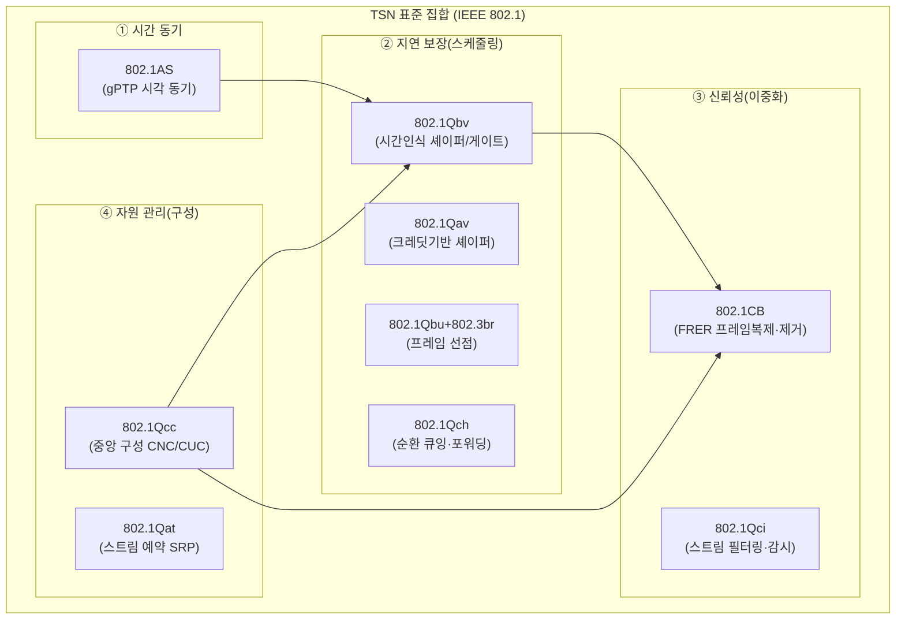
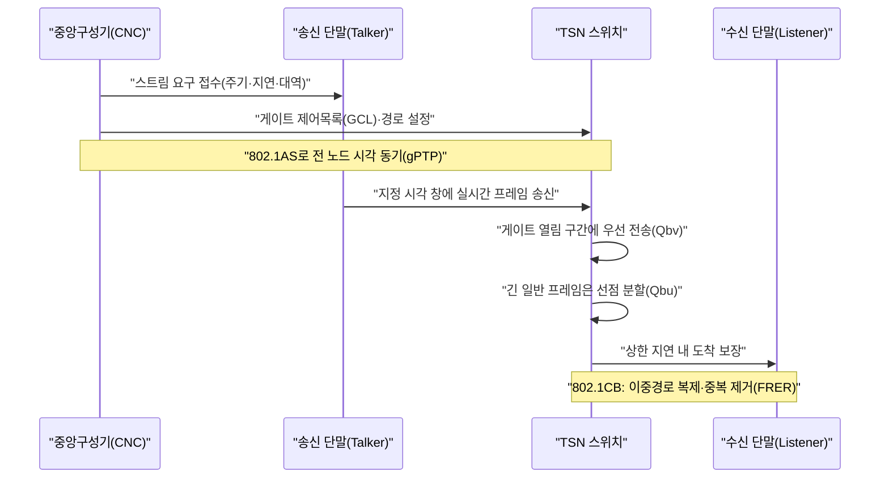

# 시간 확정형 네트워킹(TSN, Time-Sensitive Networking)

## 1. 개요

### 가. 정의
> **TSN(Time-Sensitive Networking)** 은 표준 이더넷(IEEE 802.3) 위에서 **정해진 시간 안에 프레임이 반드시 도착함을 보장(bounded low latency)** 하고, **지연 편차(지터, jitter)를 마이크로초(µs) 수준으로 억제**하며, **무손실 이중화**까지 제공하도록 IEEE 802.1 워킹그룹이 표준화한 **결정성(deterministic) 이더넷 기술의 집합**이다. 기존 이더넷이 "언젠가는 도착한다(best-effort)"였다면, TSN은 "**약속한 시각에 도착한다**"를 보장한다.

TSN의 본질을 이해하려면 전통 이더넷의 한계를 먼저 짚어야 한다. 표준 이더넷은 CSMA/CD에서 출발해 스위칭·전이중으로 발전하며 대역폭은 비약적으로 커졌지만, 여전히 **프레임의 전달 시각을 보장하지 않는다.** 스위치 내부 큐에 여러 트래픽이 몰리면 우선순위가 낮은 프레임은 밀려나(head-of-line blocking) 지연이 들쭉날쭉해지고, 최악 지연(worst-case latency)의 상한을 수학적으로 보장할 수 없다. 사무용 데이터(파일 전송·웹)에서는 수십 ms의 지연 변동이 문제되지 않지만, **로봇 모션 제어·자동차 조향·전력 계통 보호 계전기**처럼 수백 µs 이내에 명령이 도달하지 않으면 사고로 이어지는 실시간 제어 영역에서는 치명적이다.

이 때문에 산업 현장은 오랫동안 PROFINET IRT, EtherCAT, SERCOS III 같은 **벤더별 산업용 이더넷(Industrial Ethernet)** 을 써 왔다. 그러나 이들은 서로 호환되지 않고 표준 IT 장비와 섞을 수 없어, 공장 안에 제어망(OT)과 정보망(IT)이 물리적으로 분리된 이중 네트워크를 낳았다. TSN은 바로 이 문제를 **국제 표준 이더넷 하나로 실시간 제어 트래픽과 일반 IT 트래픽을 같은 케이블 위에서 공존(convergence)** 시키자는 발상에서 출발한다.

### 나. 등장 배경과 필요성
TSN이 부상한 결정적 배경은 **스마트팩토리·인더스트리 4.0과 IT/OT 융합(convergence)** 의 요구다. 제조 현장이 디지털트윈·AI 예지정비·클라우드 분석으로 진화하면서, 현장 센서·PLC·로봇이 만들어 내는 실시간 제어 데이터와 상위 분석 시스템이 요구하는 대용량 정보 데이터가 **하나의 망에서 흘러야** 경제성과 관리 효율이 확보된다. 그런데 벤더 종속적 산업용 이더넷은 IT망과 단절되어 있어, 데이터를 상위로 올리려면 게이트웨이·프로토콜 변환이라는 병목을 거쳐야 했다. TSN은 표준 이더넷의 개방성·저가·풍부한 생태계를 그대로 쓰면서 결정성을 더함으로써 이 벽을 허문다.

두 번째 동인은 **자동차(In-Vehicle Network)와 자율주행**이다. 차량 내부는 CAN·LIN·FlexRay 등 이종 버스가 난립해 배선(하네스) 무게와 대역폭 한계가 심각했는데, 자율주행 센서(카메라·라이다)의 기가비트급 데이터를 실시간으로 나르려면 결정성 있는 고대역 백본이 필요했다. 실제로 TSN의 모태는 2005년 시작된 오디오·비디오 실시간 전송 표준 **AVB(Audio Video Bridging)** 로, 자동차·프로 오디오 업계 요구에 힘입어 2012년 워킹그룹 명칭이 TSN으로 확장되며 산업 제어 전반으로 적용 범위가 넓어졌다. 세 번째로 **5G 프론트홀·전력망 보호제어(IEC 61850)·프로 오디오** 등 마이크로초 동기와 상한 지연이 요구되는 분야가 공통 기반을 필요로 했다는 점이 표준화를 가속했다.

요컨대 TSN의 필요성은 세 가지 흐름으로 수렴한다. **① 이종 실시간 네트워크의 통일**(벤더별 산업용 이더넷을 표준 하나로), **② IT/OT 융합**(제어망과 정보망의 물리적 단일화), **③ 대용량·실시간 병존**(자율주행·5G처럼 큰 대역과 엄격한 지연을 동시에 요구하는 응용)이다. 기존 best-effort 이더넷이 대역만 키워서는 이 세 요구를 함께 충족할 수 없었기에, "이더넷에 시간(time)을 도입한다"는 접근이 필연적 선택이 되었다.

## 2. TSN의 4대 기능 축과 전체 구조

TSN은 단일 표준이 아니라 IEEE 802.1의 **여러 하위 표준(amendment) 묶음**이며, 기능적으로 **① 시간 동기, ② 지연 보장(스케줄링/셰이핑), ③ 신뢰성(이중화), ④ 자원 관리(구성)** 의 4개 축으로 나뉜다. 아래 그림은 이 4대 축과 대표 표준의 관계를 나타낸 전체 구조도다.

**시간 동기(802.1AS, gPTP)** 는 TSN의 가장 기초가 되는 토대다. 결정성 스케줄링은 망 안의 모든 스위치·단말이 **같은 시각(공통 시계)** 을 공유해야만 성립한다. 802.1AS는 IEEE 1588 PTP를 이더넷 환경에 맞게 프로파일링한 gPTP(generalized Precision Time Protocol)로, 그랜드마스터를 정점으로 하는 시각 분배 트리를 구성해 **µs 이하(통상 1µs 이내)의 동기 정밀도**를 달성한다. 각 노드는 링크 지연과 잔류 시간(residence time)을 측정·보정하므로, 멀티홉을 지나도 오차가 누적되지 않는다. 시각이 어긋나면 뒤이은 시간표(게이트 스케줄)가 무너지므로, 802.1AS는 그랜드마스터 다중화(hot-standby)와 BMCA(최적 마스터 선정)로 동기 자체의 신뢰성도 확보한다.

**지연 보장(스케줄링·셰이핑)** 은 TSN의 심장이다. 핵심인 **802.1Qbv(Time-Aware Shaper, TAS)** 는 스위치 출력 포트의 각 큐 앞에 **시간 기반 게이트(gate)** 를 두고, gPTP 시각에 맞춰 짜인 **게이트 제어 목록(GCL, Gate Control List)** 대로 게이트를 열고 닫는다. 예컨대 사이클의 특정 구간에는 제어 트래픽 큐만 열고 나머지는 닫아, 그 시간 창(protected window)에는 오직 실시간 프레임만 회선을 독점하게 한다. 이렇게 하면 최악 지연의 상한이 스케줄에 의해 수학적으로 확정된다. 보조적으로 **802.1Qav(Credit-Based Shaper, CBS)** 는 AVB에서 온 기법으로, 크레딧을 소진·충전하며 특정 스트림이 대역을 독점하지 못하도록 평활화(평균 대역 보장)한다. **802.1Qbu/802.3br(프레임 선점, Frame Preemption)** 은 이미 송신 중인 긴 일반 프레임을 잘게 끊고 그 사이에 긴급(express) 프레임을 끼워 넣어, 게이트가 닫히기 직전 큰 프레임이 걸쳐 있어 생기는 '가드밴드 낭비'와 대기 지연을 줄인다.

### 가. 결정성 트래픽의 흐름(프로세스 세부도)
아래 그림은 하나의 실시간 스트림이 송신 단말에서 시간표에 따라 스위치를 통과해 수신 단말에 도착하기까지의 절차를 나타낸 세부 프로세스도다.

보다 단순한 대안으로 **802.1Qch(Cyclic Queuing and Forwarding, CQF)** 도 널리 쓰인다. CQF는 시간을 동일 길이의 사이클로 잘게 나누고 짝·홀 두 개의 큐를 번갈아 쓰는 방식으로, 한 사이클에 들어온 프레임을 반드시 다음 사이클에 내보낸다. 그 결과 프레임의 지연이 홉 수 × 사이클 길이로 **결정적으로 계산**되어, GCL을 스트림마다 정밀하게 짜야 하는 Qbv보다 설계·검증이 단순하다. 대신 사이클 경계에 맞춰 버퍼링하므로 최소 지연은 다소 커지는 트레이드오프가 있어, 초저지연이 필요한 모션 제어는 Qbv를, 다수 스트림을 단순·예측가능하게 다뤄야 하는 대규모 망은 CQF를 택하는 식으로 구분한다.

정량적으로 감을 잡으면, 1Gbps 링크에서 1,500바이트 최대 프레임 하나를 내보내는 데 약 12µs가 걸린다. 선점(Qbu)이 없다면 게이트가 열리기 직전 이 큰 프레임이 송신을 시작할 경우 긴급 프레임은 최대 12µs를 더 기다려야 하고, 이런 지연이 멀티홉마다 누적되면 상한을 맞추기 어렵다. 프레임 선점은 이 12µs 급 블로킹을 수 µs 단위로 잘라 넣어 최악 지연을 크게 낮춘다. 이처럼 TSN의 각 셰이퍼는 "프레임 하나의 송신 시간"이라는 물리적 하한 위에서 지연 예산을 어떻게 배분하느냐를 다루는 기법들이다.

**신뢰성·이중화(802.1CB, FRER)** 는 무손실을 요구하는 제어망의 필수 요소다. FRER(Frame Replication and Elimination for Reliability)은 송신측에서 프레임에 순차 번호를 붙여 **두 개 이상의 서로 다른 경로로 복제 전송**하고, 수신측에서 **먼저 도착한 하나만 취하고 중복을 제거**한다. 한 경로가 끊겨도 다른 경로 프레임이 도착하므로, 장애 시에도 재전송 대기 없이 **끊김 없는(seamless) 이중화**가 실현된다. 함께 쓰이는 **802.1Qci(Per-Stream Filtering and Policing)** 는 스트림별로 시간·대역을 감시해, 오동작하거나 악의적으로 폭주하는 트래픽(babbling idiot)이 시간표를 망가뜨리지 못하게 입구에서 차단한다. 예컨대 발전소 보호 계전 시스템에서 계전기와 차단기를 잇는 트립(trip) 신호는 단 한 프레임의 유실도 사고로 직결되므로, FRER로 지리적으로 분리된 두 경로에 복제해 보내고 링 절단·스위치 고장 시에도 무손실을 확보한다. 이는 재전송으로 손실을 만회하는 TCP 방식이 실시간 제어에서는 지연 때문에 쓸 수 없다는 근본 제약을, "미리 복제해 둔다"는 공간적 이중화로 우회한 것이다.

**자원 관리·구성(802.1Qcc)** 은 위의 모든 기능을 어떻게 설정·배포하느냐를 다룬다. 결정성 스케줄은 어느 단말이 어떤 주기·지연·대역의 스트림을 요구하는지 전체를 알아야 계산되므로, 802.1Qcc는 **중앙집중형 모델(CNC: Centralized Network Configuration + CUC: Centralized User Configuration)** 을 정의한다. CUC가 단말의 요구(Talker/Listener)를 모으고, CNC가 망 위상을 근거로 각 스위치의 GCL과 경로를 계산해 배포한다. 이는 SDN의 중앙 컨트롤러 개념과 맞닿아 있어, TSN을 SDN·NETCONF/YANG으로 관리하려는 흐름과 자연스럽게 연결된다. 802.1Qcc는 이 밖에도 각 노드가 이웃과 요구를 주고받아 스스로 자원을 예약하는 **완전 분산 모델**과, 분산 예약과 중앙 계산을 절충한 **혼합(hybrid) 모델**도 정의한다. 실무에서는 스케줄 최적화 품질과 전역 가시성 때문에 중앙집중 모델이 산업 자동화의 주류로 채택되는 경향이 있으나, 단순·소규모 망에서는 분산 모델이 구축 부담이 적다.

## 3. 주요 표준 정리(보조 표)

앞서 설명한 표준들을 기능 축별로 정리하면 다음과 같다. 표는 비교·정리를 위한 보조 수단이며, 각 표준이 "왜 필요한가"는 위 본문의 서술로 이해해야 한다.

| 기능 축 | 표준(Amendment) | 역할 | 핵심 개념 |
|---|---|---|---|
| ① 시간 동기 | 802.1AS (gPTP) | 전 노드 공통 시각 분배 | 그랜드마스터·잔류시간 보정, µs 이하 동기 |
| ② 지연 보장 | 802.1Qbv (TAS) | 시간 기반 게이트 스케줄 | GCL, protected window |
| ② 지연 보장 | 802.1Qav (CBS) | 대역 평활화 | 크레딧 충·방전 |
| ② 지연 보장 | 802.1Qbu/802.3br | 프레임 선점 | express/preemptable, 가드밴드 절감 |
| ② 지연 보장 | 802.1Qch (CQF) | 순환 큐잉·포워딩 | 결정적 지연·구현 단순화 |
| ③ 신뢰성 | 802.1CB (FRER) | 무손실 이중화 | 복제·순번·중복 제거 |
| ③ 신뢰성 | 802.1Qci (PSFP) | 스트림 필터·감시 | 폭주 트래픽 입구 차단 |
| ④ 자원 관리 | 802.1Qcc | 중앙 구성 | CNC/CUC, YANG 모델 |
| ④ 자원 관리 | 802.1Qat (SRP) | 스트림 예약 | 대역 사전 예약 |

여기서 실무적으로 중요한 함의는 **"TSN을 도입한다"가 곧 "9개 표준을 모두 켠다"를 뜻하지 않는다**는 점이다. 산업별로 필요한 표준의 조합이 다르기 때문에, IEC/IEEE 60802(산업 자동화), IEEE 802.1DG(자동차), IEEE 802.1BA(오디오·비디오) 같은 **프로파일**이 각 응용에 맞는 표준 부분집합과 파라미터를 규정한다. 예컨대 자동차 프로파일은 gPTP·CBS·FRER를 중시하고, 산업 자동화 프로파일은 Qbv·Qbu·Qcc를 핵심으로 삼는 식이다.

## 4. 유사 기술과의 비교 — 차이가 생기는 이유

TSN을 기존 실시간 네트워크와 비교하면 그 위치가 분명해진다. 아래 비교는 단순 항목 나열이 아니라, **왜 그런 차이가 생기며 실무적으로 무엇을 의미하는지**까지 함께 본다.

| 구분 | 표준 이더넷 | 산업용 이더넷(EtherCAT 등) | TSN |
|---|---|---|---|
| 결정성 | 없음(best-effort) | 있음(벤더 전용) | 있음(국제 표준) |
| 지연 보장 | 상한 없음 | 수십 µs | µs~수백 µs 상한 |
| 표준성·호환 | 개방·범용 | 벤더 종속 | 개방·범용(IEEE) |
| IT/OT 융합 | 곤란(결정성 부재) | 곤란(폐쇄) | 용이(공존 설계) |
| 생태계·가격 | 매우 풍부·저가 | 제한·고가 | 이더넷 생태계 활용 |

한 가지 유의할 점은 TSN이 산업용 이더넷을 "대체(replace)"한다기보다 그 하부를 표준화된 **공통 계층으로 흡수**한다는 것이다. PROFINET·EtherNet/IP 등은 상위 응용·객체 모델을 그대로 유지한 채 전송 계층만 TSN으로 이식하는 방향으로 진화하므로, 사용자는 익숙한 상위 프로토콜을 쓰면서 결정성과 IT 융합의 이점을 얻는다. 이 점이 TSN 채택을 가속하는 실무적 유인이다.

표준 이더넷과의 근본 차이는 **"시간 개념의 유무"** 다. 표준 이더넷 스위치는 프레임이 오면 큐에 넣고 순서대로 내보낼 뿐 '지금 몇 µs인지'를 모른다. 반면 TSN 스위치는 gPTP로 공통 시각을 알고 그 시각에 맞춰 게이트를 여닫으므로, 큐 경합이 발생해도 실시간 프레임의 최악 지연 상한이 흔들리지 않는다. 이 차이가 곧 "일반 IT 트래픽과 제어 트래픽을 같은 회선에서 안전하게 섞을 수 있는가"라는 실무적 결과로 직결된다.

산업용 이더넷(EtherCAT·PROFINET IRT 등)과의 차이는 **"개방성"** 에 있다. 이들도 결정성을 제공하지만 벤더 고유 방식이라 서로 통신할 수 없고, 상위 IT 인프라와 연동하려면 게이트웨이가 필요하다. TSN은 이 결정성 기능을 **IEEE 표준 이더넷의 일부로 편입**했기 때문에, 서로 다른 벤더의 TSN 장비가 상호 운용되고 일반 스위치·서버와 한 망을 이룬다. 실제로 PROFINET·EtherNet/IP·OPC UA 같은 상위 산업 프로토콜들도 자신의 하부 전송계층을 TSN 위로 옮기는 방향(OPC UA over TSN 등)으로 수렴하고 있다.

### 구체 적용 사례
첫째, **자동차 존(Zonal) 아키텍처**다. 최신 SDV(Software-Defined Vehicle)는 수십 개 ECU를 몇 개의 존 컨트롤러로 통합하고 이를 기가비트 이더넷 백본으로 잇는데, 카메라·라이다의 대용량 스트림과 조향·제동의 안전 제어 신호를 하나의 TSN 백본에서 나른다. 100BASE-T1/1000BASE-T1 차량용 이더넷과 결합해 배선 무게를 줄이면서도 안전 신호의 상한 지연을 보장한다. 둘째, **스마트팩토리 모션 제어**로, 다축 로봇의 동기 오차가 수 µs를 넘으면 가공 정밀도가 무너지므로 gPTP+Qbv 조합으로 사이클 동기를 맞춘다. 셋째, **5G 프론트홀**로, 무선 기지국 분산 유닛(DU)과 라디오 유닛(RU) 사이(eCPRI)의 엄격한 지연·동기 요구를 TSN 브리지가 충족해, 통신사업자가 프론트홀을 이더넷 기반으로 통합하도록 돕는다.

넷째, **프로 오디오·방송(AV)** 분야다. TSN의 뿌리인 AVB는 대규모 공연장·스튜디오에서 수백 채널의 오디오를 µs 동기로 전송하는 데 쓰였는데, 여러 스피커가 미세하게라도 어긋나면 음상이 흐트러지므로 gPTP 동기와 CBS의 대역 보장이 결정적 역할을 한다. 이 사례는 TSN이 산업 제어뿐 아니라 "정확한 타이밍"이 품질을 좌우하는 전 분야의 공통 인프라임을 보여 준다.

## 5. 심화 — 표준화 동향과 SDN·OT 보안과의 연계

TSN 생태계에서 최근 가장 주목할 흐름은 **응용별 프로파일의 정착과 상위 프로토콜의 수렴**이다. 산업 자동화 분야에서는 IEC와 IEEE가 공동 작업한 **IEC/IEEE 60802 TSN 산업 자동화 프로파일**이 자리를 잡으며, 서로 다른 벤더 장비의 상호운용성을 검증하는 시험·인증 체계(Avnu Alliance 등)가 성숙하고 있다. 특히 **OPC UA over TSN**은 상위 정보 모델(OPC UA)과 하위 결정성 전송(TSN)을 결합해, 필드 레벨부터 클라우드까지 하나의 의미 체계로 데이터를 흐르게 하는 인더스트리 4.0의 사실상 표준 통신 스택으로 부상하고 있다.

두 번째 심화 논점은 **SDN·중앙 구성(CNC)과의 결합**이다. 802.1Qcc의 중앙집중 모델은 CNC가 망 전체를 조망해 스케줄을 계산·배포한다는 점에서 SDN 컨트롤러와 개념이 같으며, 실제로 NETCONF/RESTCONF와 YANG 데이터 모델로 TSN 스위치를 원격 구성하는 표준화가 진행되고 있다. 이는 TSN을 정적 설정 기술에서 **동적으로 스트림을 추가·재계산하는 지능형 결정성 네트워크**로 진화시킨다. 다만 스케줄 계산(GCL 산출)은 스트림 수가 늘수록 조합 폭발적으로 복잡해지는 NP-난해 문제여서, 휴리스틱·ILP·최근에는 강화학습을 활용한 스케줄링 연구가 활발하다.

세 번째로 **OT 보안과의 연계**가 중요해지고 있다. TSN이 IT/OT를 하나의 망으로 합치면서, 과거 물리적으로 격리(air-gap)되어 있던 제어망이 IT 위협에 노출된다. 시각 동기(gPTP)를 겨냥한 스푸핑·지연 공격은 게이트 스케줄 전체를 붕괴시킬 수 있어, 802.1Qci의 스트림 감시, MACsec(802.1AE) 계층 암호화, 그리고 IEC 62443·제로트러스트 원칙과의 결합이 필수 설계 요소로 다뤄진다. 즉 TSN 설계는 이제 '결정성 확보'와 '보안 내재화'를 분리할 수 없는 단계에 이르렀다.

네 번째로 **하드웨어·실리콘 생태계의 성숙**이 확산의 관건이다. Qbv의 게이트 개폐를 µs 오차 없이 수행하려면 스위치 ASIC/FPGA 수준의 하드웨어 타임스탬핑과 게이트 로직이 필요하고, 단말(NIC)도 gPTP 하드웨어 지원이 있어야 한다. 초기에는 이런 TSN 지원 실리콘이 소수 벤더에 국한되고 값이 비쌌으나, 주요 스위치·SoC 제조사가 TSN 기능을 표준 라인업에 편입하면서 진입 장벽이 낮아지고 있다. 다만 소프트웨어 스위칭(가상 스위치)만으로는 하드웨어급 정밀도를 내기 어렵다는 점에서, 클라우드·컨테이너 환경으로의 결정성 확장은 여전히 연구·표준화가 진행 중인 영역이다.

## 6. 고려사항 및 시사점(기술사 관점)

- **적용 전략 — 전면 교체가 아닌 점진 융합**: TSN 도입은 기존 제어망을 일시에 걷어내는 방식이 아니라, 백본·핵심 셀부터 TSN 스위치를 배치하고 레거시 산업용 이더넷을 게이트웨이로 흡수하며 확산하는 **브라운필드 전략**이 현실적이다. 초기에는 결정성이 꼭 필요한 스트림만 Qbv로 보호하고 나머지는 best-effort로 두는 부분 적용이 리스크·비용 면에서 유리하다.

- **트레이드오프 — 결정성 대 유연성/활용률**: 시간표(GCL) 기반 스케줄은 상한 지연을 보장하는 대가로, 보호 구간에 다른 트래픽을 넣지 못해 회선 활용률이 떨어지고 스트림 변경 시 재계산 부담이 크다. 반대로 스케줄 창을 느슨히 잡으면 활용률은 오르나 결정성 여유가 줄어든다. 응용의 실시간 등급(하드/소프트 리얼타임)에 따라 Qbv(엄격)·CBS(평활)·CQF(단순) 중 적정 셰이퍼를 선택하는 설계 판단이 핵심이다.

- **표준·상호운용 리스크**: TSN은 다수 표준의 조합이므로, 벤더가 지원하는 표준 부분집합과 프로파일 준수 여부가 제각각일 수 있다. 도입 시 **프로파일(60802/802.1DG 등) 적합성과 상호운용 인증**을 조달 요건에 명시하고, PoC로 이종 벤더 혼용을 검증해 벤더 종속을 방지해야 한다.

- **운영·검증 체계의 확보**: 결정성은 설계만으로 끝나지 않고 운영 중에도 유지되어야 한다. 스트림이 추가·변경될 때마다 GCL을 재계산·무중단 배포하는 오케스트레이션, 실시간 지연·지터·동기 오차를 상시 계측하는 모니터링, 그리고 도입 전 스케줄이 상한을 지키는지 검증하는 **네트워크 미적분(network calculus)·시뮬레이션 기반 사전 검증**이 함께 갖춰져야 한다. 이는 TSN이 단순 장비 도입이 아니라 설계·검증·운영을 아우르는 엔지니어링 역량임을 뜻한다.

- **전망과 연계 기술**: TSN은 5G URLLC의 유선 구간, 디지털트윈의 실시간 데이터 파이프라인, 시분할 결정성이 요구되는 엣지 AI 추론 등과 결합하며 **결정성 인프라의 공통 기반**으로 확대될 전망이다. SDN·OPC UA·MACsec·IEC 62443과의 통합 설계 역량이 향후 스마트제조·자율주행 아키텍트의 핵심 경쟁력이 될 것이다.

## 참고자료
- IEEE 802.1 Time-Sensitive Networking (TSN) Task Group — https://1.ieee802.org/tsn/
- Avnu Alliance, TSN 개요 및 인증 — https://avnu.org/
- IEC/IEEE 60802 TSN Profile for Industrial Automation (개요) — https://1.ieee802.org/tsn/60802/

---
> **한 줄 요약**: TSN은 표준 이더넷 위에 시간 동기(802.1AS)·시간인식 스케줄링(802.1Qbv)·무손실 이중화(802.1CB)·중앙 구성(802.1Qcc)을 더해 상한 지연과 저지터를 보장하는 결정성 이더넷 기술 집합으로, IT/OT 융합·자율주행·스마트팩토리의 실시간 통신 기반이 된다.
