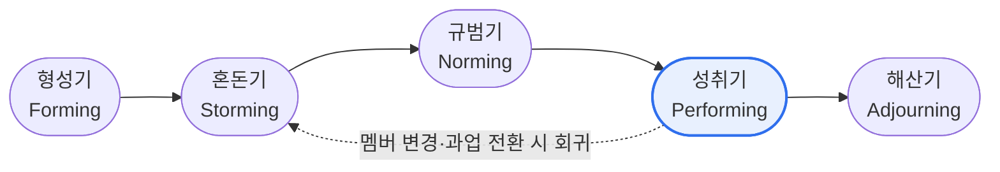

# 터크만(Tuckman) 사다리 모델 — 팀 발달 및 단계별 특징

## 1. 개요

### 가. 정의
> Bruce W. Tuckman(1965)이 제시한 **팀 발달 단계 모델**로, 팀이 결성되어 성과를 내기까지 거치는 과정을 사다리(Ladder)를 오르는 것에 비유한 이론이다. **PMBOK**의 자원관리(팀 개발, Develop Team) 영역에서 팀 성장 이론으로 인용된다.

터크만 모델의 핵심 통찰은 "팀은 만들어지는 즉시 성과를 내지 못한다"는 것이다. 개인이 모였다고 곧바로 협력이 일어나는 것이 아니라, 서로를 탐색하고 갈등을 겪으며 규범을 세우는 **일정한 발달 과정**을 반드시 거친다. 각 단계는 팀의 정서와 생산성이 뚜렷이 다르므로, 리더가 지금 팀이 어느 단계에 있는지 진단하고 그에 맞는 개입을 해야 성장을 촉진할 수 있다.

### 나. 등장 배경 및 필요성
Tuckman은 다양한 집단 연구를 종합해 팀 발달의 공통 패턴을 초기 4단계(Forming~Performing)로 정리했고, 1977년 Mary Ann Jensen과 함께 과업 종료 후의 **Adjourning(해산기)** 을 추가해 5단계로 확장했다. 이 모델이 실무에서 중요한 이유는, 각 단계의 특성과 리더 개입 방식이 다르기 때문이다. 특히 갈등이 정점에 이르는 혼돈기를 방치하면 팀이 성과 단계에 도달하지 못하므로, **단계 진단 → 맞춤형 리더십**이라는 처방을 제공한다는 점에서 실천적 가치가 크다.

## 2. 팀 발달 5단계 (사다리 도식)



발달은 사다리를 오르듯 **순차적으로 상승**하는 것이 기본이지만, 실제 팀은 반드시 한 방향으로만 나아가지 않는다. 신규 멤버가 합류하거나 과업이 크게 바뀌거나 묻혔던 갈등이 재발하면, 팀은 이전 단계로 **회귀(Regression)** 해 다시 혼돈기를 겪을 수 있다. 따라서 리더는 성취기에 도달했다고 관리를 놓지 말고, 회귀 가능성을 전제로 팀 상태를 지속 점검해야 한다.

### 단계별 갈등 · 생산성 추이

```chart
{
  "type": "line",
  "data": {
    "labels": ["형성기", "혼돈기", "규범기", "성취기", "해산기"],
    "datasets": [
      { "label": "갈등 수준", "data": [2, 5, 3, 1.5, 1], "borderColor": "#e11d48", "backgroundColor": "rgba(225,29,72,0.12)", "tension": 0.35, "fill": true },
      { "label": "생산성", "data": [1, 2, 3.5, 5, 3], "borderColor": "#2f6fed", "backgroundColor": "rgba(47,111,237,0.12)", "tension": 0.35, "fill": true }
    ]
  },
  "options": {
    "plugins": { "legend": { "position": "bottom" } },
    "scales": { "y": { "min": 0, "max": 6, "title": { "display": true, "text": "상대 수준" } } }
  }
}
```

> 혼돈기에 갈등이 정점에 달하고, 이를 넘어서면 생산성이 성취기에서 최고조에 이른다. (수치는 상대적 경향을 나타내는 예시)

이 그래프의 핵심 메시지는 **갈등과 생산성이 반비례하지 않는다**는 점이다. 갈등이 최고조인 혼돈기를 회피하지 않고 건강하게 통과해야 비로소 신뢰와 규범이 서고, 그 위에서 생산성이 성취기에 폭발적으로 오른다. 즉 혼돈기는 없애야 할 문제가 아니라 성장을 위해 거쳐야 하는 관문이다.

## 3. 단계별 특징

각 단계는 팀원의 심리 상태, 갈등·생산성 수준, 그리고 그에 맞는 리더십이 다르다. **형성기**는 서로 조심스럽게 탐색하는 시기로 역할과 목표가 모호하니, 리더는 **지시형**으로 방향과 규칙을 명확히 제시해 불확실성을 줄인다. **혼돈기**는 주도권·업무방식 갈등이 표면화되는 가장 어려운 국면으로, 리더는 갈등을 억누르기보다 **코칭형**으로 중재·경청해 건설적으로 풀어낸다. **규범기**에 이르면 신뢰와 규범이 서고 협력이 자리 잡으므로 리더는 **지원형**으로 자율성을 부여하고, **성취기**에는 팀이 스스로 문제를 해결하는 자기조직화 단계이니 **위임형**으로 권한을 넘긴다. **해산기**에는 성과를 인정하고 정서적 마무리를 돕는다.

| 단계 | 핵심 특징 | 갈등 / 생산성 | 리더십(상황적) |
|---|---|---|---|
| **형성기**<br>Forming | 상호 탐색, 역할·목표 모호, 예의 바르고 독립적 행동 | 갈등 낮음 / 생산성 낮음 | **지시형** — 명확한 목표·역할·규칙 제시 |
| **혼돈기**<br>Storming | 의견 충돌, 주도권 다툼, 역할·우선순위 갈등 표출 | 갈등 최고 / 생산성 저조 | **코칭형** — 갈등 중재·조율, 경청 |
| **규범기**<br>Norming | 신뢰·규범·역할 정립, 협력·응집력 형성 | 갈등 완화 / 생산성 상승 | **지원형** — 참여 촉진, 자율성 부여 |
| **성취기**<br>Performing | 상호 의존, 자기조직화, 스스로 문제 해결 | 갈등 낮음 / 생산성 최고 | **위임형** — 권한 위임, 성과 관리 |
| **해산기**<br>Adjourning | 과업 완료 후 해체, 성과 회고, 정서적 마무리 | 성찰·마무리 | **인정·지원** — 성과 인정, 전환 지원 |

## 4. 단계별 관리 전략

관리 전략의 핵심은 **각 단계의 특성을 거스르지 않는 개입**이다. 형성기에는 킥오프 미팅과 그라운드룰 공유로 불확실성을 줄이고, 혼돈기에는 갈등을 자연스러운 성장 과정으로 인정하며 조기 정착을 돕는다. 특히 혼돈기 관리는 팀 성패를 좌우하는 분수령이다. 규범기에는 확립된 규범을 문서화·표준화해 협업을 안정시키고, 성취기에는 과도한 개입을 자제하되 목표를 상향하며 성과를 유지한다. 해산기에는 회고와 교훈(Lessons Learned)을 정리하고 팀원의 공로를 인정한다.

- **형성기**: 킥오프 미팅, 목표·R&R·그라운드룰 공유로 불확실성 감소
- **혼돈기**: 갈등을 자연스러운 과정으로 인정, 조기 정착 지원이 팀 성패를 좌우
- **규범기**: 확립된 규범을 문서화·정착, 협업 도구·프로세스 표준화
- **성취기**: 과도한 개입 자제, 목표 상향·지속적 피드백으로 성과 유지
- **해산기**: 회고(Retrospective), 산출물·교훈 정리, 팀원 공로 인정

## 5. 고려사항 및 시사점 (기술사 관점)

1. **상황적 리더십(Situational Leadership)과의 연계** — 단계별로 지시→코칭→지원→위임으로 리더십 스타일을 전환하는 것이 모델의 실천적 핵심이다. 정형화된 하나의 리더십은 오히려 특정 단계에서 역효과를 낸다.
2. **혼돈기(Storming) 관리가 관건** — 이 단계를 넘지 못하면 팀은 결코 성과 단계에 도달하지 못한다. 갈등 회피가 아니라 건강한 표출·해소가 목표다.
3. **회귀 가능성 전제** — 인력 교체·과업 변경 시 하위 단계 재발생을 당연한 것으로 보고 관리 체계를 유연하게 둔다.
4. **애자일과의 정합성** — 스크럼의 자기조직화 팀은 Performing 단계 지향과 맥을 같이하며, 스프린트 회고는 단계 진단·개선의 도구가 된다.
5. PMBOK 팀 개발(Develop Team)과 동기부여 이론 맥락에서 답안에 활용하기 좋다.

---

> **한 줄 요약**: 팀은 *형성 → 혼돈 → 규범 → 성취(→ 해산)* 의 사다리를 오르며, 갈등이 정점인 혼돈기를 건강하게 통과해야 성과가 폭발하므로, 리더는 각 단계에 맞는 **상황적 리더십(지시→코칭→지원→위임)** 으로 개입해 성과 단계 도달을 촉진한다.
