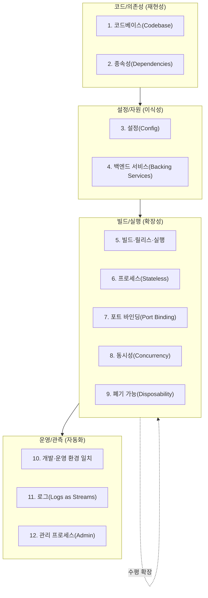
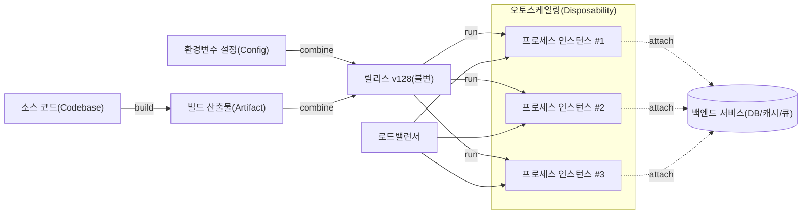

# 12요소 앱(The Twelve-Factor App)

## 1. 개요

> **정의**: 12요소 앱은 SaaS(Software as a Service)형 애플리케이션을 선언적 설정, 실행 환경과의 느슨한 결합, 무상태 프로세스, 지속적 배포에 적합하도록 구성하기 위한 12가지 설계 원칙의 집합으로, 이식성·확장성·운영 자동화를 코드 수준에서 보장하기 위한 방법론이다.

12요소 앱은 2011년 클라우드 플랫폼 Heroku의 엔지니어들이 수많은 SaaS 애플리케이션의 운영 경험을 정리해 발표한 방법론이다.
당시 많은 애플리케이션은 특정 서버의 파일 경로, 수동으로 편집한 설정 파일, 사람이 직접 수행하는 배포 절차에 강하게 묶여 있었고, 이로 인해 동일한 코드가 개발·스테이징·운영에서 서로 다르게 동작하는 이른바 "환경 편차(divergence)" 문제가 빈번했다.
12요소 앱은 이러한 결합을 끊어 애플리케이션이 어떤 실행 환경에서도 동일하게 동작하고, 새 인스턴스를 몇 초 안에 추가하거나 폐기할 수 있으며, 코드 변경이 자동화된 파이프라인을 통해 반복 가능하게 배포되도록 하는 것을 목표로 한다.

핵심은 애플리케이션과 실행 환경을 분리하는 데 있다.
전통적 배포에서는 애플리케이션이 특정 장비의 상태(로컬 디스크의 세션, 서버에 심어진 설정, 수동 설치된 패키지)에 의존하기 때문에, 장비가 곧 애플리케이션의 일부가 된다.
12요소는 반대로 애플리케이션을 "실행 환경에 대해 아무것도 가정하지 않는 자족적인 코드 묶음"으로 정의하고, 환경마다 달라지는 모든 것(접속 정보·비밀·자원 위치)을 외부에서 주입한다.
이 관점의 전환은 이후 등장한 컨테이너·오케스트레이션·불변 인프라·GitOps의 사상적 토대가 되었으며, 오늘날 클라우드 네이티브 애플리케이션 설계의 기본 문법으로 자리 잡았다.

12요소를 단순한 체크리스트로 나열식 암기하는 것은 기술사 관점에서 실패한 이해다.
각 요소는 독립적인 규칙이 아니라 "무상태·이식성·자동화"라는 공통 목표를 서로 다른 각도에서 강제하는 장치이며, 하나의 요소를 지키면 다른 요소를 지키기 쉬워지는 상호 강화 구조를 가진다.
예를 들어 설정을 환경변수로 외부화(요소 3)하면 동일한 빌드 산출물을 여러 환경에 배포(요소 5)하기 쉬워지고, 이는 다시 폐기 가능한 무상태 프로세스(요소 6·9)와 수평 확장(요소 8)을 가능하게 한다.

### 1.1 등장 배경과 필요성

첫째, 클라우드 환경에서 인스턴스는 "가축(cattle)이지 애완동물(pet)이 아니다"라는 운영 패러다임이 확산되었기 때문이다.
과거에는 서버 한 대 한 대에 이름을 붙이고 정성껏 관리했지만, 오토스케일링과 스팟 인스턴스가 보편화되면서 인스턴스는 언제든 생성·폐기되는 대체 가능한 자원이 되었다.
애플리케이션이 특정 인스턴스의 로컬 상태에 의존하면 이런 환경에서 데이터 손실과 장애가 발생하므로, 무상태 설계가 필수가 되었다.

둘째, 배포 빈도가 급격히 높아졌기 때문이다.
연 단위·월 단위 릴리스가 일 단위·시간 단위 배포로 바뀌면서, 사람이 개입하는 수동 배포 절차는 병목이자 사고의 원인이 되었다.
빌드·릴리스·실행을 엄격히 분리하고(요소 5) 설정을 코드에서 떼어내야만(요소 3) 롤백과 재현이 가능한 자동 배포 파이프라인을 구축할 수 있다.

셋째, 개발 환경과 운영 환경의 격차가 사고를 유발했기 때문이다.
개발자 노트북에서는 잘 동작하지만 운영에서는 실패하는 문제의 상당수는 백엔드 서비스·라이브러리·런타임 버전의 불일치에서 비롯된다.
12요소는 개발·운영 동일성(요소 10)을 명시적 원칙으로 세워, 환경 편차를 설계 단계에서 억제한다.

### 1.2 목표와 적용 범위

12요소의 첫 번째 목표는 **이식성(portability)**이다.
설정·자원·실행 환경 의존성을 외부로 밀어내면, 동일한 코드가 로컬 도커, 온프레미스 쿠버네티스, 퍼블릭 클라우드 관리형 서비스 어디에서든 동일하게 동작한다.
두 번째 목표는 **확장성(scalability)**으로, 무상태 프로세스와 포트 바인딩을 통해 인스턴스를 수평으로 복제해 부하를 흡수한다.
세 번째 목표는 **운영 자동화와 관측성**으로, 로그를 이벤트 스트림으로 다루고(요소 11) 관리 작업을 일회성 프로세스로 실행(요소 12)함으로써 배포·운영을 재현 가능한 코드로 만든다.
다만 12요소는 상태를 다루는 데이터베이스·메시지 브로커 같은 백엔드 서비스 자체의 설계 지침은 아니며, 스테이트풀 워크로드나 배치 파이프라인에는 그대로 적용하기 어렵다는 한계도 함께 이해해야 한다.

## 2. 12요소 전체 구조

12개 요소는 개별 규칙처럼 보이지만, 실제로는 "코드베이스 → 의존성 → 설정 → 실행/배포 → 운영/관측"이라는 애플리케이션 생애주기의 흐름을 따라 배치할 수 있다.
아래 구조도는 12요소를 성격에 따라 네 개의 묶음으로 분류한 것으로, 각 묶음이 이식성·확장성·자동화라는 공통 목표에 어떻게 기여하는지를 보여준다.

각 요소를 단순히 지키는 것을 넘어, 이 흐름 안에서 요소들이 어떻게 서로를 강화하는지 이해하는 것이 중요하다.
예컨대 코드베이스 하나에서 여러 배포(요소 1)를 만들어내려면, 그 여러 배포의 차이가 오직 설정(요소 3)으로만 표현되어야 한다.
설정이 코드에 하드코딩되어 있으면 배포마다 코드가 갈라지고, 이는 빌드·릴리스·실행 분리(요소 5)를 무너뜨린다.

### 2.1 코드베이스·종속성 (재현성의 기반)

**요소 1(코드베이스)**은 버전 관리되는 하나의 코드베이스와 다수의 배포를 1:N으로 대응시킬 것을 요구한다.
동일한 코드베이스에서 개발·스테이징·운영이라는 여러 배포가 파생되며, 배포 간 차이는 코드가 아니라 설정으로만 표현되어야 한다.
만약 운영용과 개발용 코드가 서로 다른 저장소에 있다면 그것은 하나의 앱이 아니라 여러 앱의 분산 시스템이며, 각 저장소는 각자 12요소를 따라야 한다.
마이크로서비스 환경에서는 서비스마다 코드베이스를 두되, 공유 코드는 별도 라이브러리로 분리해 종속성으로 끌어오는 방식이 권장된다.

**요소 2(종속성)**은 모든 종속성을 명시적으로 선언하고 격리할 것을 요구한다.
시스템 전역에 설치된 패키지에 암묵적으로 의존하면, 실행 환경이 바뀔 때 "내 환경에서는 되는데" 문제가 발생한다.
`package.json`·`requirements.txt`·`pom.xml`·`go.mod` 같은 매니페스트로 의존 버전을 고정하고, 가상환경·컨테이너로 격리하면 어떤 장비에서도 동일한 라이브러리 집합이 재현된다.
실제로 2016년 npm의 `left-pad` 패키지가 삭제되면서 수많은 빌드가 깨진 사건은, 종속성을 명시적으로 고정(lock)하지 않고 실행 시점에 원격에서 끌어오는 방식이 얼마나 취약한지를 보여준 대표적 사례다.

### 2.2 설정·백엔드 서비스 (이식성의 핵심)

**요소 3(설정)**은 환경마다 달라지는 모든 값을 코드에서 분리해 환경변수로 주입할 것을 요구한다.
데이터베이스 접속 문자열, 외부 API 키, 크리덴셜처럼 배포마다 달라지는 값을 코드나 설정 파일에 넣으면, 그 값이 실수로 저장소에 커밋되어 유출되거나 환경마다 코드가 갈라진다.
12요소의 판별 기준은 명확하다 — "지금 이 코드베이스를 오픈소스로 공개해도 비밀이 새지 않는가?"이며, 답이 '아니오'라면 설정 분리가 덜 된 것이다.
다만 환경변수 방식은 수백 개의 설정을 관리할 때 그룹핑이 어렵다는 비판이 있어, 오늘날에는 Vault·AWS Secrets Manager 같은 비밀 관리 서비스나 쿠버네티스 ConfigMap/Secret과 병행하는 형태로 발전했다.

**요소 4(백엔드 서비스)**는 데이터베이스·캐시·메시지 큐·메일 서버 등 네트워크로 접근하는 모든 자원을 "부착된 자원(attached resource)"으로 취급할 것을 요구한다.
즉 로컬 MySQL이든 관리형 RDS든, 애플리케이션 코드는 URL 형태의 설정만 바꾸면 되도록 추상화되어야 하며, 코드 변경 없이 자원을 교체·재부착할 수 있어야 한다.
이 원칙 덕분에 장애가 난 데이터베이스를 복제본으로 교체하거나, 개발 환경의 로컬 캐시를 운영의 관리형 Redis로 바꾸는 일이 설정 변경만으로 가능해진다.

### 2.3 프로세스·확장 (확장성의 실현)

**요소 5(빌드·릴리스·실행)**는 코드를 실행 가능한 산출물로 만드는 과정을 세 단계로 엄격히 분리한다.
빌드는 코드와 종속성을 실행 가능한 번들로 변환하고, 릴리스는 그 빌드에 해당 환경의 설정을 결합해 고유 식별자(예: v128)를 부여하며, 실행은 그 릴리스를 런타임에서 구동한다.
모든 릴리스는 불변(immutable)이고 고유 ID를 가지므로, 문제가 생기면 이전 릴리스로 즉시 롤백할 수 있다.
운영 중인 실행 단계에서 코드를 직접 수정하는 것(hotfix를 서버에서 직접 편집)은 이 원칙의 정면 위반이며, 그렇게 만든 변경은 다음 배포에서 유실된다.

**요소 6(프로세스)**과 **요소 9(폐기 가능)**는 애플리케이션을 무상태(stateless)로 실행하고 언제든 빠르게 시작·종료할 수 있게 할 것을 요구한다.
프로세스는 어떤 요청도 로컬 메모리나 디스크에 영구 상태로 남기지 않으며, 지속되어야 하는 상태는 모두 백엔드 서비스로 밀어낸다.
그래야 인스턴스가 죽어도 데이터가 유실되지 않고, 오토스케일러가 인스턴스를 자유롭게 추가·회수할 수 있다.
폐기 가능성은 특히 빠른 기동(수 초 내 시작)과 우아한 종료(graceful shutdown — SIGTERM 수신 시 진행 중인 요청을 마치고 종료)를 포함하며, 이는 쿠버네티스의 파드 재스케줄링이나 스팟 인스턴스 회수 상황에서 무중단 운영의 전제가 된다.

**요소 7(포트 바인딩)**은 애플리케이션이 외부 웹 서버(Apache·Nginx)에 얹혀 실행되는 것이 아니라, 스스로 포트를 열어 서비스를 완결적으로 제공(self-contained)할 것을 요구한다.
**요소 8(동시성)**은 부하 처리를 프로세스 모델로 확장할 것을 요구한다 — 하나의 프로세스를 무겁게 키우는 수직 확장이 아니라, 웹·워커 등 역할별 프로세스를 수평으로 복제(scale-out)해 부하를 분산한다.
아래 배포 흐름도는 요소 5·6·8·9가 어떻게 맞물려 무중단 배포와 수평 확장을 만들어내는지를 보여준다.

### 2.4 개발·운영 일치와 관측 (자동화의 완성)

**요소 10(개발·운영 환경 일치)**은 개발·스테이징·운영 사이의 시간 격차·인력 격차·도구 격차를 최소화할 것을 요구한다.
과거에는 개발자가 코드를 작성한 뒤 며칠~몇 주 뒤에야 운영에 반영되고(시간 격차), 개발자와 운영자가 분리되어 있으며(인력 격차), 개발은 SQLite·운영은 Oracle처럼 서로 다른 백엔드를 썼다(도구 격차).
12요소는 지속적 배포로 시간 격차를 줄이고, DevOps 문화로 인력 격차를 줄이며, 컨테이너로 동일한 백엔드를 모든 환경에서 사용하도록 권장한다.

**요소 11(로그)**은 로그를 애플리케이션이 직접 파일로 관리하는 대상이 아니라, 시간순으로 흐르는 이벤트 스트림으로 다룰 것을 요구한다.
애플리케이션은 로그를 표준출력(stdout)으로 흘려보내기만 하고, 수집·라우팅·저장·분석은 실행 환경(예: Fluentd·Loki·ELK)이 담당한다.
이 분리 덕분에 애플리케이션은 로그 저장 위치나 로테이션을 신경 쓸 필요가 없고, 인스턴스가 폐기되어도 로그는 중앙 시스템에 보존된다.

**요소 12(관리 프로세스)**는 데이터베이스 마이그레이션·일회성 스크립트 같은 관리 작업을, 앱과 동일한 코드베이스·설정·릴리스 환경에서 일회성 프로세스로 실행할 것을 요구한다.
관리 작업을 별도 도구나 다른 버전의 코드로 수행하면 운영 코드와 관리 코드가 갈라져 불일치가 생기므로, 반드시 동일한 릴리스에 부착된 일회성 프로세스(예: `rails db:migrate`, 쿠버네티스 Job)로 실행해야 한다.

## 3. 요소별 위반 사례와 준수 방식 비교

12요소를 제대로 이해하려면 "지키지 않았을 때 무슨 일이 벌어지는가"를 함께 보아야 한다.
아래 표는 대표적인 위반 패턴과 그로 인한 실무적 문제, 그리고 준수 방식을 정리한 것이다.
표의 각 행은 단순 대비가 아니라, 위반이 왜 확장성·이식성을 무너뜨리는지에 대한 인과를 담고 있다.

| 요소 | 흔한 위반 | 발생하는 문제 | 준수 방식 |
|---|---|---|---|
| 3. 설정 | DB 비밀번호를 코드/설정파일에 하드코딩 | 저장소 공개 시 크리덴셜 유출, 환경마다 코드 분기 | 환경변수·Secret Manager로 주입 |
| 6. 프로세스 | 세션을 로컬 메모리에 저장 | 인스턴스 재시작 시 로그인 풀림, 수평확장 불가 | 세션을 Redis 등 외부 저장소로 분리 |
| 8. 동시성 | 단일 프로세스 수직 확장에만 의존 | 물리적 한계 도달, 단일 장애점 | 역할별 프로세스 수평 복제 |
| 9. 폐기가능 | 종료 시그널 무시, 느린 기동 | 배포·스케일링 시 요청 유실 | graceful shutdown + 빠른 기동 |
| 11. 로그 | 앱이 로컬 파일에 직접 기록·로테이션 | 인스턴스 폐기 시 로그 소실, 분석 곤란 | stdout 스트림 → 중앙 수집 |

특히 세션 상태 처리(요소 6)는 실무에서 가장 자주 위반되는 지점이다.
초기에 편의상 세션을 애플리케이션 메모리에 저장했다가, 트래픽 증가로 인스턴스를 늘리는 순간 "로그인이 계속 풀린다"는 장애를 겪는 경우가 대표적이다.
이때 스티키 세션(sticky session)으로 임시 회피할 수 있으나, 이는 특정 인스턴스에 사용자를 고정하므로 인스턴스 폐기 시 여전히 상태가 유실되고 부하 분산이 왜곡된다 — 근본 해법은 세션을 외부 저장소로 분리하는 것이다.

## 4. 심화: 컨테이너·쿠버네티스 시대의 12요소와 확장(Beyond 12-Factor)

12요소가 발표된 2011년에는 컨테이너 오케스트레이션이 보편화되기 전이었으나, 오늘날의 컨테이너·쿠버네티스 생태계는 12요소를 사실상 인프라 차원에서 구현하고 있다.
컨테이너 이미지는 종속성 격리(요소 2)와 개발·운영 일치(요소 10)를 이미지 수준에서 보장하고, 쿠버네티스의 ConfigMap/Secret은 설정 외부화(요소 3)를, Service 오브젝트는 백엔드 서비스 부착(요소 4)을, Deployment의 롤링 업데이트는 빌드·릴리스·실행 분리(요소 5)와 폐기 가능성(요소 9)을 자동화한다.
즉 12요소는 컨테이너 시대에 폐기된 것이 아니라, 애플리케이션이 지켜야 할 계약을 정의하고 그 계약을 플랫폼이 대신 이행하는 형태로 진화했다.

한편 클라우드 파운드리의 엔지니어 Kevin Hoffman은 2016년 저서 『Beyond the Twelve-Factor App』에서 마이크로서비스와 클라우드 네이티브 시대에 맞춰 원 12요소를 재해석하고 세 가지를 추가한 15요소를 제안했다.
추가된 요소는 첫째 **API 우선(API First)**으로, 서비스를 만들기 전에 API 계약을 먼저 정의해 팀 간 병렬 개발과 소비자 주도 계약 테스트를 가능하게 한다.
둘째 **원격 측정(Telemetry)**으로, 로그를 넘어 애플리케이션 성능 지표(APM)·도메인 지표·헬스체크를 관측 데이터로 함께 수집할 것을 요구한다.
셋째 **인증·인가(Authentication & Authorization)**로, 보안을 사후 추가가 아니라 설계 초기부터 내장(OAuth2·OIDC·RBAC)할 것을 강조한다.

이러한 확장은 12요소의 한계를 보완한다.
원 12요소는 무상태 웹 애플리케이션을 전제로 하기 때문에, 상태를 반드시 유지해야 하는 데이터베이스·스트리밍 처리·머신러닝 학습 워크로드에는 그대로 적용하기 어렵다.
또한 서비스가 수백 개로 늘어나는 마이크로서비스 환경에서는 서비스 간 통신·관측·보안·계약 관리가 핵심 과제가 되므로, 서비스 메시·API 게이트웨이·분산 트레이싱 같은 보완 기술과 함께 설계해야 한다.
실무적으로 Netflix·Spotify 같은 대규모 SaaS 기업들은 12요소 원칙을 기본으로 삼되, 여기에 카오스 엔지니어링·서킷 브레이커·플랫폼 엔지니어링을 결합해 자사 환경에 맞게 확장해 운영하고 있다.

## 5. 고려사항 및 시사점

**첫째, 12요소는 목적이 아니라 수단이라는 점을 분명히 해야 한다.**
12개 항목을 모두 지켰다는 사실 자체가 좋은 아키텍처를 보장하지 않는다.
예를 들어 서비스 경계가 잘못 설정된 마이크로서비스는 아무리 12요소를 지켜도 분산 트랜잭션과 통신 비용으로 고통받는다.
기술사 관점에서는 "이식성·확장성·자동화라는 목표를 달성하기 위한 도구"로 12요소를 위치시키고, 시스템의 성격(무상태 웹 vs. 스테이트풀 배치)에 따라 선별적으로 적용하는 판단이 필요하다.

**둘째, 무상태 원칙과 상태 관리의 트레이드오프를 이해해야 한다.**
프로세스를 무상태로 만들면 확장은 쉬워지지만, 상태를 외부 저장소로 밀어낸 만큼 백엔드 서비스(DB·캐시·큐)의 성능·가용성이 전체 시스템의 병목이자 단일 장애점이 된다.
따라서 무상태 설계를 채택할 때는 반드시 백엔드 서비스의 이중화·샤딩·복제와 캐시 일관성 전략을 함께 설계해야 하며, 무상태화가 곧 상태 문제의 소멸이 아니라 상태 문제의 이동임을 인식해야 한다.

**셋째, 설정 외부화와 비밀 관리의 보안 수준을 함께 높여야 한다.**
환경변수로 설정을 주입하는 원 12요소 방식은 간편하지만, 프로세스 환경변수는 하위 프로세스에 상속되거나 크래시 덤프·프로세스 목록에 노출될 위험이 있다.
민감한 크리덴셜은 환경변수 대신 Vault·Secrets Manager 같은 전용 비밀 관리 시스템에서 런타임에 동적으로 조회하고, 짧은 수명의 토큰과 자동 회전(rotation)을 적용하는 것이 제로 트러스트 관점에서 바람직하다.

**넷째, 조직·프로세스의 변화가 동반되어야 실효를 거둔다.**
개발·운영 환경 일치(요소 10)와 지속적 배포는 기술만으로 달성되지 않으며, 개발과 운영이 협업하는 DevOps 문화, 코드로 인프라를 관리하는 IaC, 파이프라인 자동화가 함께 갖춰져야 한다.
12요소를 코드에만 적용하고 배포·운영 프로세스는 여전히 수동이라면 그 효과는 제한적이므로, 플랫폼 엔지니어링을 통해 셀프서비스 배포 환경을 제공하는 방향으로 조직 역량을 함께 성숙시켜야 한다.

**다섯째, 향후 전망으로 12요소는 서버리스·플랫폼 표준으로 흡수되고 있다.**
서버리스(FaaS)와 관리형 컨테이너 플랫폼은 무상태·폐기 가능·포트 바인딩 같은 원칙을 런타임이 강제하도록 설계되어, 개발자가 의식하지 않아도 12요소를 따르게 만든다.
앞으로는 애플리케이션이 12요소 계약을 준수하는지를 플랫폼이 자동으로 검증·강제하는 방향으로 발전할 것이며, 개발자의 관심은 개별 요소의 준수에서 도메인 설계와 서비스 경계 정의로 이동할 것으로 전망된다.

## 참고자료

- The Twelve-Factor App (원문): https://12factor.net/
- Kevin Hoffman, "Beyond the Twelve-Factor App", O'Reilly, 2016
- CNCF Cloud Native Glossary: https://glossary.cncf.io/
- Kubernetes Documentation — ConfigMaps and Secrets: https://kubernetes.io/docs/concepts/configuration/

---

> **한 줄 요약**: 12요소 앱은 설정·자원·실행 환경을 코드에서 분리하고 프로세스를 무상태·폐기 가능하게 설계해 이식성·확장성·운영 자동화를 보장하는 SaaS 설계 방법론으로, 컨테이너·쿠버네티스·서버리스 시대의 클라우드 네이티브 아키텍처가 계승·확장하고 있다.
