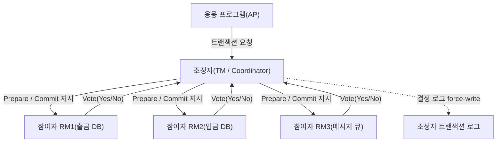
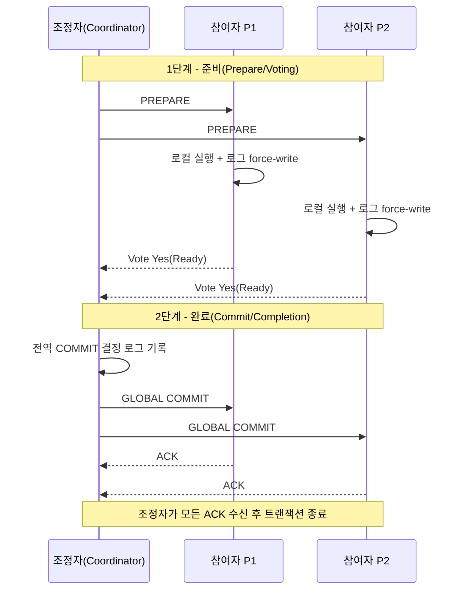
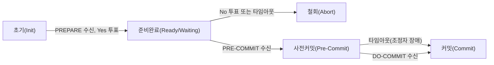

# 2단계 커밋(2PC)과 3단계 커밋(3PC) 프로토콜

## 1. 개요

> **정의**: 원자적 커밋 프로토콜(ACP, Atomic Commit Protocol)은 하나의 트랜잭션에 참여한 다수의 분산 노드가 그 트랜잭션의 최종 결과를 **전부 커밋(Commit)하거나 전부 철회(Abort)** 하도록 보장하는 합의 절차이며, 2단계 커밋(2PC, Two-Phase Commit)은 그 대표 구현이고 3단계 커밋(3PC, Three-Phase Commit)은 2PC의 블로킹 한계를 완화하기 위한 확장이다.

분산 트랜잭션의 본질적 어려움은 하나의 논리적 작업이 물리적으로 서로 다른 자원 관리자(RM, Resource Manager)에 걸쳐 수행된다는 점에서 출발한다. 예컨대 은행 계좌이체는 출금 DB와 입금 DB라는 두 개의 독립적 저장소에 각각 갱신을 가하는데, 어느 한쪽만 반영되면 돈이 사라지거나 복제되는 치명적 정합성 붕괴가 발생한다. 단일 노드 트랜잭션에서는 ACID의 원자성(Atomicity)을 로그와 롤백만으로 보장할 수 있지만, 분산 환경에서는 각 노드가 독립적으로 실패·지연·네트워크 단절을 겪기 때문에 "모두 성공했는지"를 **한 번의 명령으로 결정할 수 없다**. 이 지점에서 참여자들의 의사를 먼저 물어보고(투표), 전원이 준비되었을 때만 확정을 통보하는 2단계 구조가 필요해진다.

이러한 원자적 커밋의 필요성은 1980년대 분산 데이터베이스와 트랜잭션 처리 모니터(TP Monitor)의 등장과 함께 표준화되었다. X/Open이 정의한 DTP(Distributed Transaction Processing) 모델과 XA 인터페이스가 대표적이며, 오늘날에도 JTA/JTS(Java Transaction API), 메시지 큐의 트랜잭션 브릿지, 이종 DB 간 연계에 2PC가 실무적으로 사용된다. 다만 마이크로서비스와 클라우드 네이티브 환경에서는 2PC의 동기적 잠금과 블로킹 특성이 확장성을 저해하기 때문에, 뒤에서 다룰 사가(Saga)·이벤트 기반 최종 일관성 모델로 상당 부분 대체되고 있다. 그럼에도 2PC/3PC는 "왜 강한 일관성이 비싼가"를 설명하는 기준점이자, CAP·FLP 불가능성 정리와 직결되는 이론적 토대이므로 기술사 관점에서 반드시 정확히 이해해야 한다.

원자적 커밋을 합의(consensus) 문제의 특수한 형태로 보는 시각도 중요하다. 각 참여자가 Yes/No를 제안하고 모두가 동일한 최종 결정(commit/abort)에 도달해야 한다는 점에서 이는 합의와 닮았지만, "단 하나의 No만 있어도 반드시 abort여야 한다"는 제약이 추가된 더 까다로운 문제다. 이 때문에 비동기 네트워크에서 하나의 노드라도 죽을 수 있다면 "항상 종료하면서 항상 올바른" 비차단 원자적 커밋은 존재할 수 없다는 것이 이론적으로 증명되어 있다. 2PC가 블로킹을 감수하고, 3PC가 정합성 위험을 감수하는 것은 이 불가능성을 서로 다른 방식으로 회피한 결과이며, 두 프로토콜의 모든 트레이드오프는 이 근본 한계에서 파생된다.

- **원자성 보장**: 참여자 전원 커밋 또는 전원 철회로 부분 완료(partial commit)를 원천 차단한다.
- **역할 분리**: 조정자(Coordinator/TM)와 참여자(Participant/RM)의 명확한 책임 분담.
- **로그 기반 복구**: 각 노드가 결정을 **강제 기록(force-write)** 한 뒤 응답하여 장애 후 재개를 가능하게 한다.

## 2. 전체 구조와 참여 주체

분산 트랜잭션의 커밋은 하나의 조정자가 다수의 참여자를 지휘하는 별(star) 형태의 제어 흐름을 가진다. 아래 구조도는 응용 프로그램(AP)이 트랜잭션 관리자(TM=조정자)를 통해 여러 자원 관리자(RM=참여자)를 묶는 X/Open DTP 모델의 골격을 나타낸다. 조정자는 트랜잭션의 시작·종료를 관장하고 투표를 집계하며, 참여자는 실제 데이터 갱신과 로컬 로그 관리를 담당한다. 이 구조에서 핵심은 **결정 권한이 조정자 한 곳에 집중**된다는 점인데, 이는 일관된 결과를 보장하는 장점인 동시에 조정자가 단일 장애점(SPOF)이 되는 약점의 근원이기도 하다.

이 별 구조에서 조정자 역할은 별도의 트랜잭션 관리자 프로세스가 맡을 수도 있고, 참여 노드 중 하나가 겸할 수도 있다. 어느 쪽이든 조정자는 트랜잭션 식별자(XID)를 발급해 모든 참여자가 동일 트랜잭션을 지칭하도록 하고, 참여자 목록과 투표 결과를 관리한다. 참여자가 동적으로 추가되는 경우(트랜잭션 도중 새 자원이 등록되는 경우)에는 조정자가 이를 참여자 집합에 편입해야 하며, 이 등록 정보 역시 결정 전에 안정적으로 보존되어야 재기동 후 누락 없이 전원에게 결정을 통지할 수 있다. 요컨대 조정자는 "누가 이 트랜잭션에 속했는가"라는 멤버십과 "무엇으로 결정했는가"라는 결과를 모두 책임지는 단일 권위점이다.

조정자와 참여자는 각각 자신의 상태를 안정 저장소(stable storage)의 로그에 기록한다. 이 로그가 프로토콜의 신뢰성을 떠받치는 기둥이다. 참여자는 "Yes"에 투표하기 전에 자신이 커밋할 수 있는 모든 변경을 REDO/UNDO 로그로 **먼저 디스크에 강제 기록**해야 하며, 그래야 투표 후 장애가 나더라도 재기동 시 조정자의 최종 결정에 따라 커밋 또는 철회를 완결할 수 있다. 마찬가지로 조정자는 최종 결정(global commit/abort)을 로그에 강제 기록한 뒤에야 참여자에게 통보한다. 이 "먼저 기록하고 나중에 통보한다"는 WAL(Write-Ahead Logging) 원칙이 지켜지지 않으면, 장애 후 노드마다 서로 다른 결론에 도달해 원자성이 깨진다.

한편 참여자가 "Yes"를 투표한 순간부터 최종 통보를 받기 전까지의 구간을 **불확실(in-doubt/uncertain) 상태**라고 부른다. 이 상태의 참여자는 스스로 커밋할지 철회할지 결정할 수 없고 오직 조정자의 지시를 기다려야 하며, 그동안 해당 자원에 대한 잠금(lock)을 계속 보유한다. 불확실 구간의 존재가 곧 2PC의 블로킹 문제와 성능 저하의 직접적 원인이며, 3PC가 해결하려는 표적이기도 하다.

메시지 복잡도 관점에서 참여자가 N명일 때 표준 2PC는 조정자 기준 최소 `3N`회의 메시지(Prepare N + Decision N + ACK N)와 조정자 1회·참여자 각 2회의 로그 강제 기록을 요구한다. 이 동기적 왕복과 디스크 I/O가 지연의 하한을 규정하므로, 참여자 수가 많거나 지리적으로 분산될수록 커밋 지연이 선형 이상으로 증가한다. 추정 철회 같은 최적화가 이 비용을 줄이려는 이유가 여기에 있으며, 대규모 분산에서는 아예 프로토콜 자체를 합의 기반으로 바꾸는 편이 유리해진다.

## 3. 2단계 커밋(2PC)의 절차

2PC는 이름 그대로 **투표 단계(Voting/Prepare Phase)** 와 **완료 단계(Completion/Commit Phase)** 의 두 라운드로 구성된다. 첫 단계에서 조정자는 모든 참여자에게 `PREPARE`를 보내 "커밋할 준비가 되었는가"를 묻고, 각 참여자는 로컬에서 트랜잭션을 실행·검증한 뒤 로그를 강제 기록하고 `Yes(Ready)` 또는 `No(Abort)`로 답한다. 둘째 단계에서 조정자는 투표를 집계하여 **단 한 명이라도 No이거나 응답이 없으면 전역 철회**, 전원이 Yes이면 전역 커밋을 결정하고 이를 로그에 기록한 뒤 모든 참여자에게 통보한다. 참여자는 통보대로 커밋/철회를 확정하고 `ACK`를 회신하며, 조정자는 모든 ACK를 받으면 트랜잭션을 종료한다.

아래 시퀀스 다이어그램은 정상적인 커밋 경로를 단계별로 보여준다. 각 화살표가 네트워크 왕복이며, 참여자 수가 N이면 최소 2회의 브로드캐스트 왕복과 다수의 로그 강제 기록이 발생한다는 점에 주목해야 한다. 이 동기적 왕복이 2PC의 지연(latency)과 처리량 한계를 규정한다.

**가. 준비 단계의 의미와 잠금 유지.** 참여자가 `Yes`를 투표한다는 것은 단순한 응답이 아니라 "나는 이후 어떤 상황에서도 이 트랜잭션을 커밋할 수 있음을 보증한다"는 계약이다. 따라서 투표 전에 무결성 제약, 트리거, 디스크 여유 공간 등 커밋 성공을 좌우하는 모든 조건을 검증하고, 변경분과 잠금을 안정적으로 확보해야 한다. 이 시점부터 참여자는 관련 레코드에 대한 배타적 잠금을 최종 통보 시까지 보유하므로, 다른 트랜잭션은 해당 자원을 기다리게 된다. 한 건의 분산 트랜잭션이 여러 노드의 잠금을 장시간 붙드는 구조가 처리량을 크게 떨어뜨리는데, 실무에서는 2PC 하나가 수십 밀리초에서 수백 밀리초의 잠금 보유 시간을 유발해 고TPS 서비스에서 병목이 되는 사례가 흔하다.

이 계약적 성격 때문에 준비 단계는 사실상 "실행은 끝냈으나 확정만 미룬" 상태여야 한다. 만약 참여자가 `Yes`를 투표해 놓고 실제로는 커밋할 수 없는 상황(잠금 해제, 세션 종료, 자원 회수)에 빠지면 원자성이 붕괴되므로, 자원 관리자는 Yes 투표 이후의 트랜잭션을 각별히 보호(prepared 상태 격리)한다. 이 때문에 준비 단계는 자원 소모가 크고, 조정자가 오래 응답하지 않으면 prepared 트랜잭션이 쌓여 자원을 잠식하는 부작용을 낳는다. 운영자는 이런 in-doubt 트랜잭션을 모니터링하고, 최후의 수단으로만 관리자 개입(heuristic decision)을 허용하는 정책을 세워야 한다.

**나. 완료 단계와 최적화(Presumed Abort/Commit).** 표준 2PC는 결정 로그 기록, 통보, ACK 수집, 종료 로그 기록까지 다수의 로그 I/O를 요구한다. 이를 줄이기 위해 **추정 철회(Presumed Abort)** 와 **추정 커밋(Presumed Commit)** 최적화가 널리 쓰인다. 추정 철회는 조정자가 트랜잭션 정보를 잃어버린(로그에 없는) 문의에 대해 "철회되었다"고 응답해도 안전하다는 성질을 이용하여, 철회 시 로그 기록과 ACK를 생략한다. 대부분의 상용 DBMS(예: Oracle의 분산 트랜잭션, X/Open XA 구현)는 추정 철회를 기본으로 채택하여 정상 커밋 경로의 오버헤드를 최소화한다. 이처럼 "빈번한 경로를 싸게 만든다"는 설계 철학은 트랜잭션 시스템 전반의 공통 원리다.

**다. 실패 시나리오와 블로킹 문제.** 2PC의 치명적 약점은 **1단계 이후 조정자가 죽는 경우**에 드러난다. 참여자들이 모두 `Yes`를 투표해 불확실 상태에 들어간 직후 조정자가 다운되면, 참여자들은 최종 결정이 커밋인지 철회인지 알 방법이 없다. 스스로 커밋하면 조정자가 철회를 결정했을 위험이, 스스로 철회하면 그 반대의 위험이 있으므로 참여자는 **조정자가 복구될 때까지 무한정 대기(blocking)** 하며 잠금을 계속 보유해야 한다. 이 블로킹은 단일 노드 장애가 시스템 전체의 진행을 멈추게 하는, 가용성 측면의 근본 결함이다. 참여자들끼리 서로 물어보는 **협력 종료 프로토콜(cooperative termination)** 로 일부 상황(누군가 이미 결정을 통보받은 경우)은 해소할 수 있으나, 모두가 불확실 상태이면 여전히 대기할 수밖에 없다.

**라. 장애 지점별 복구 규칙.** 프로토콜의 견고함은 "어느 시점에 죽어도 재기동 후 올바른 결론에 수렴한다"는 데서 나온다. 아래 표는 장애 발생 위치에 따른 복구 규칙을 정리한 것으로, 그 근거는 모두 앞서 설명한 로그 강제 기록(WAL) 원칙에 있다. 참여자가 투표 전에 죽으면 로그에 아무 흔적이 없으므로 안전하게 철회로 간주하고, 투표 후(불확실 상태) 죽으면 로그의 Ready 기록을 근거로 조정자에게 최종 결정을 재문의한다. 조정자가 결정 로그를 남기기 전에 죽으면 철회로, 남긴 뒤 죽으면 로그의 결정을 재전파한다.

| 장애 위치 | 로그 상태 | 재기동 후 처리 |
|-----------|-----------|----------------|
| 참여자, 투표 전 | Prepare 기록 없음 | 철회로 간주(추정 철회) |
| 참여자, 투표 후(불확실) | Ready 기록 존재 | 조정자에 결정 재문의, 그때까지 잠금 유지 |
| 조정자, 결정 전 | 전역 결정 기록 없음 | 전역 철회 |
| 조정자, 결정 후 | Commit/Abort 기록 존재 | 해당 결정을 참여자에 재전파 |

이 표가 보여주듯 2PC의 정합성은 어떤 장애 조합에서도 결코 깨지지 않는다. 다만 "불확실 상태에서 잠금을 유지한 채 재문의를 기다린다"는 항목이 바로 앞서 지적한 블로킹의 실체이며, 가용성과 정합성 사이의 근본적 긴장을 다시 한번 확인시켜 준다.

## 4. 3단계 커밋(3PC)의 절차와 비교

3PC는 2PC의 블로킹을 완화하기 위해 완료 단계를 **사전 커밋(Pre-Commit)** 단계로 한 번 더 쪼갠 프로토콜이다. 핵심 아이디어는 "커밋을 확정하기 전에, 전원이 커밋할 준비가 되었다는 사실 자체를 모두에게 먼저 전파"하는 것이다. 조정자는 전원 `Yes` 투표를 확인하면 곧바로 커밋하지 않고 `PRE-COMMIT`을 뿌려 참여자들이 "곧 커밋될 것"임을 인지하게 한 뒤, 참여자들의 ACK를 받고 나서야 `DO-COMMIT`을 보낸다. 이렇게 하면 조정자가 죽더라도, 살아남은 참여자들은 자신이 Pre-Commit을 받았는지 여부로 최종 결정을 **자율적으로 유추**할 수 있다. 누군가 Pre-Commit을 받았다면 전원이 Yes였다는 뜻이므로 커밋으로, 아무도 못 받았다면 철회로 종료하는 식이다.

위 상태 전이도의 요점은 **사전커밋 상태에서 타임아웃이 발생하면 철회가 아니라 커밋으로 진행**한다는 규칙이다. 이 "타임아웃 기반 자율 종료"가 3PC를 **비차단(non-blocking)** 으로 만든다. 즉 조정자가 응답하지 않아도 참여자들은 무한 대기 대신 정해진 규칙에 따라 스스로 종료할 수 있다. 그러나 이 비차단성은 어디까지나 **네트워크 분할이 없고 노드 장애만 있다**는 전제(동기 네트워크 가정) 아래에서만 성립한다. 실제로 네트워크 분할이 일어나면, 분할된 양쪽 그룹이 서로 다른 타임아웃 판단을 내려 한쪽은 커밋, 다른 쪽은 철회하는 **불일치(split-brain)** 가 발생할 수 있다. 이 때문에 3PC는 이론적 우아함에도 불구하고 상용 시스템에서 거의 채택되지 않으며, 대신 아래 심화에서 다룰 합의 기반(Paxos/Raft) 접근이 실무 표준이 되었다.

두 프로토콜의 차이는 단순한 단계 수가 아니라 **어떤 실패 가정에서 어떤 속성을 포기하는가**에 있다. 아래 표는 그 트레이드오프를 정리한 것이며, 각 항목의 "이유"는 앞의 본문 서술에 근거한다.

| 구분 | 2단계 커밋(2PC) | 3단계 커밋(3PC) |
|------|----------------|----------------|
| 라운드 수 | 2단계(Prepare→Commit) | 3단계(Prepare→Pre-Commit→Commit) |
| 조정자 장애 시 | 블로킹(무한 대기) 발생 | 타임아웃으로 비차단 종료 |
| 네트워크 분할 | 안전(정합성 유지, 대신 대기) | 불일치 위험(split-brain) |
| 메시지/지연 | 적음(2 왕복) | 많음(3 왕복, 지연 증가) |
| 실무 채택 | 광범위(XA, JTA, DBMS) | 드묾(주로 이론·교육용) |

여기서 얻는 실무적 함의는 명확하다. 2PC는 **정합성(Safety)을 위해 가용성(Liveness)을 희생**하고, 3PC는 특정 실패 모델에서 가용성을 얻는 대신 **분할 상황에서 정합성 위험**을 감수하며 지연도 늘어난다. 결국 "완벽한 원자적 커밋을 비차단으로 달성하는 것은 비동기 네트워크에서 불가능"하다는 FLP(Fischer-Lynch-Paterson) 불가능성 정리의 그림자가 두 프로토콜 모두에 드리워져 있다.

실무에서 3PC가 외면받은 이유를 조금 더 구체적으로 보면, 첫째 추가 라운드로 인한 지연 증가가 대부분의 워크로드에서 감내하기 어렵고, 둘째 3PC의 비차단성이 성립하는 "동기 네트워크·노드 장애만 존재" 가정이 실제 데이터센터(가변 지연·타임아웃 오판·부분 분할)와 어긋나며, 셋째 같은 노력이라면 아예 Paxos/Raft로 조정자를 복제하는 편이 분할 상황에서도 정합성을 지키면서 고가용성을 얻는 더 나은 해법이기 때문이다. 즉 3PC는 "2PC와 합의 기반 커밋 사이의 과도기적 아이디어"로 이해하는 것이 정확하다.

## 5. 심화: 실무 적용과 대안 — XA, 사가, 합의 기반 커밋

**가. XA/DTP와 이종 자원 연계.** 실무에서 2PC가 가장 확실히 살아 있는 영역은 X/Open XA 인터페이스를 통한 이종 자원 연계다. 예를 들어 주문 처리에서 관계형 DB 갱신과 JMS 메시지 발행을 하나의 원자적 단위로 묶어야 할 때, JTA 트랜잭션 매니저(예: Narayana, Atomikos)가 두 자원을 XA로 등록하고 2PC로 커밋한다. 이 방식은 강한 일관성을 제공하지만, 잠금 보유 시간이 길고 자원 매니저 하나가 XA를 지원하지 않으면 전체가 성립하지 않는다는 제약이 있다. 그래서 고성능이 요구되는 결제·주문 도메인에서는 XA 대신 **메시지 발행을 DB 트랜잭션에 편입하는 Outbox 패턴 + CDC**로 우회하는 사례가 늘고 있다.

XA 운영에서 특히 주의할 부분이 **휴리스틱 결정(heuristic outcome)** 이다. 조정자 응답이 장시간 지연되면 자원 관리자가 관리자 개입이나 자체 정책으로 prepared 트랜잭션을 강제로 커밋/롤백할 수 있는데, 이때 조정자의 최종 결정과 어긋나면 `heuristic mixed/hazard`라는 정합성 위반이 기록된다. 이는 자동으로 복구되지 않는 데이터 불일치이므로, 운영 표준에는 휴리스틱 결정의 허용 조건, 발생 시 경보, 사후 수동 정합성 조정 절차를 반드시 포함해야 한다. 즉 2PC를 도입한다는 것은 "정상 경로의 강한 일관성"뿐 아니라 "예외 경로의 운영 부담"까지 함께 떠안는 결정임을 인식해야 한다.

**나. 사가(Saga)와 최종 일관성.** 마이크로서비스는 서비스마다 DB를 소유하는 "database-per-service" 원칙 때문에 2PC의 전역 잠금이 근본적으로 어울리지 않는다. 대안으로 널리 쓰이는 것이 사가 패턴인데, 하나의 비즈니스 트랜잭션을 여러 로컬 트랜잭션의 연쇄로 나누고 실패 시 **보상 트랜잭션(compensating transaction)** 으로 되돌린다. 사가는 잠금을 오래 붙들지 않아 확장성이 뛰어나지만, 중간 상태가 외부에 노출되는 **최종 일관성(eventual consistency)** 을 받아들여야 하고, 격리성이 약해 세마포어·버전 체크 같은 애플리케이션 수준 보완이 필요하다. 즉 2PC의 강한 일관성과 사가의 높은 가용성은 CAP 관점의 선택 문제이며, 도메인의 정합성 요구 수준으로 결정해야 한다.

구체적 비교를 위해 초당 수천 건의 주문을 처리해야 하는 e커머스 결제 플로우를 가정해 보자. 결제 승인·재고 차감·포인트 적립 세 서비스를 2PC(XA)로 묶으면, 세 노드의 잠금이 한 트랜잭션당 수십~수백 ms 유지되어 잠금 경합으로 유효 처리량이 급락하고, 어느 한 서비스의 순간 장애가 전체 결제를 블로킹시킨다. 반면 동일 플로우를 오케스트레이션 사가로 구성하면 각 서비스가 로컬 트랜잭션을 즉시 커밋·해제하므로 처리량이 수 배 향상되지만, "결제는 승인됐으나 재고 차감 실패 → 결제 취소 보상" 같은 중간 비일관 구간을 사용자·정산 로직이 감내하도록 설계해야 한다. 이처럼 동일 요구를 두 방식으로 구현했을 때의 처리량·정합성 격차가 프로토콜 선택이 곧 아키텍처 결정임을 보여준다.

**다. 합의 기반 원자적 커밋.** 3PC의 분할 취약성을 근본적으로 해결한 접근이 **Paxos Commit**과 Raft 기반 커밋이다. 아이디어는 조정자의 결정을 단일 노드가 아니라 복제된 합의 그룹이 내리게 하여, 조정자 장애를 합의 프로토콜의 리더 선출로 흡수하는 것이다. Google Spanner는 이 원리를 대규모로 구현한 대표 사례로, 각 샤드(Paxos 그룹) 위에 2PC를 얹되 조정자와 참여자의 상태를 모두 복제하여 블로킹과 SPOF를 동시에 제거하고, TrueTime(원자시계+GPS)으로 외부 일관성까지 보장한다. 이는 "2PC의 원자성 + 합의의 고가용성"을 결합한 현대적 정석으로 평가된다. 이처럼 현업의 흐름은 2PC를 버리기보다, 그 약점인 조정자 신뢰성을 합의로 보강하는 방향으로 진화해 왔다.

**라. 예상 출제 방향과 답안 구성 전략.** 기술사 시험에서 본 주제는 단독 출제보다 "분산 트랜잭션의 원자성 보장 방안", "MSA에서의 데이터 일관성", "CAP/BASE와 강한 일관성 비교" 같은 상위 문제의 핵심 논거로 등장하는 경향이 있다. 따라서 답안은 (1) 2PC 절차와 로그 원리를 시퀀스 다이어그램으로 정확히 제시하고, (2) 블로킹 문제를 명확히 지적한 뒤, (3) 3PC의 한계와 사가·Paxos Commit 대안까지 연결해 "왜 강한 일관성이 비싸며 현업이 어떻게 절충하는가"라는 서사로 마무리하는 구성이 고득점에 유리하다. 단답형(1교시)으로 나오면 "2PC=원자성 보장, 단점=블로킹, 대안=3PC/사가"의 핵심을 표와 함께 압축 제시한다.

## 6. 고려사항 및 시사점

원자적 커밋 프로토콜은 "분산 환경에서 강한 일관성은 공짜가 아니다"라는 명제를 가장 선명하게 보여주는 주제다. 기술사 관점에서는 단순히 절차를 외우는 것을 넘어, 프로토콜 선택이 곧 가용성·성능·운영 복잡도에 대한 아키텍처 의사결정임을 다음과 같이 정리할 수 있다.

- **일관성-가용성 트레이드오프의 명시적 선택(적용 전략)**: 강한 원자성이 반드시 필요한 금융·재고 도메인은 2PC/XA를, 규모와 가용성이 우선인 사용자 대면 서비스는 사가·이벤트 기반 최종 일관성을 채택하는 식으로 도메인별 정합성 요구를 먼저 정의하고 프로토콜을 사후 선택해야 한다. "전 구간 2PC"는 확장성을 해치는 안티패턴이다.
- **조정자 고가용성 확보(트레이드오프 관리)**: 2PC의 최대 위험인 조정자 SPOF는 조정자 로그의 복제, 스탠바이 조정자, 나아가 Paxos/Raft 기반 조정자 복제로 완화해야 한다. 단순 3PC 도입은 지연 증가와 분할 시 정합성 위험을 새로 안기므로 신중해야 한다.
- **잠금 보유 시간과 성능 관측(운영)**: 분산 트랜잭션의 잠금 보유 시간, in-doubt 트랜잭션 수, 조정자 로그 I/O를 상시 모니터링하고, 타임아웃과 자동 해소(heuristic decision) 정책을 명확히 규정해야 한다. heuristic commit/rollback은 정합성을 깨뜨릴 수 있으므로 감사 로그와 사후 정합성 검증을 반드시 병행한다.
- **표준·기술 연계와 전망(연계 기술)**: XA/JTA, Outbox+CDC, 사가 오케스트레이션, Spanner류 합의 기반 커밋은 상호 배타가 아니라 계층적으로 조합된다. 향후에는 TrueTime·하이브리드 논리시계(HLC) 기반의 외부 일관성 보장, 클라우드 매니지드 분산 DB(NewSQL)의 보편화로 애플리케이션이 커밋 프로토콜을 직접 다루지 않고 위임하는 방향으로 추상화가 진전될 전망이다.
- **아키텍처 의사결정 원칙(설계 판단)**: 프로토콜 선택은 성능 수치 하나로 결정하기보다, 도메인의 정합성 위반 시 비용(금전적 손실·규제·신뢰)과 지연·가용성 요구를 함께 저울질하는 리스크 기반 판단이어야 한다. 강한 일관성이 필수인 핵심 원장(ledger)에만 2PC를 국소적으로 적용하고, 주변 도메인은 사가로 분리하는 "일관성 경계 설정"이 실무적 정석이다.
- **테스트·검증 전략(품질 보증)**: 분산 커밋의 결함은 정상 경로가 아니라 장애 조합에서 드러나므로, 조정자/참여자의 각 단계별 강제 종료를 주입하는 카오스 테스트와 장애 후 정합성 재검증(reconciliation) 자동화를 CI에 편입해야 한다. "정상 시엔 잘 된다"는 검증만으로는 원자성 보장을 신뢰할 수 없다.

## 참고자료

- X/Open, "Distributed Transaction Processing: The XA Specification" — https://pubs.opengroup.org/onlinepubs/009680699/toc.pdf
- Gray, J. & Lamport, L., "Consensus on Transaction Commit(Paxos Commit)", ACM TODS — https://lamport.azurewebsites.net/pubs/pubs.html#consensus-on-transaction-commit
- Google, "Spanner: Google's Globally-Distributed Database", OSDI 2012 — https://research.google/pubs/pub39966/
- Microsoft Docs, "Two-Phase Commit / Distributed Transactions" — https://learn.microsoft.com/en-us/windows/win32/cossdk/two-phase-commit-protocol

---

> **한 줄 요약**: 2PC는 준비·완료 2단계 투표로 분산 트랜잭션의 원자성을 보장하지만 조정자 장애 시 블로킹이라는 약점이 있고, 3PC는 사전커밋 단계를 더해 비차단성을 노리나 네트워크 분할에 취약해, 현업은 XA·사가·Paxos/Raft 기반 합의 커밋으로 정합성과 가용성을 도메인에 맞게 절충한다.
