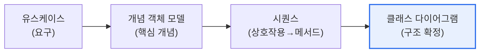

# UML 클래스 다이어그램과 객체 모델링

## 1. 개요

### 가. 정의
> **클래스 다이어그램**은 시스템을 구성하는 **클래스와 그들의 속성·오퍼레이션, 클래스 간 관계(연관·상속·집합)를 표현**하는 UML 구조(정적) 다이어그램으로, 객체지향 설계의 핵심 산출물이다.

클래스 다이어그램이 객체지향 설계의 중심에 있는 이유는 '**시스템의 뼈대(구조)를 한 장에 담는다**'는 데 있다. 유스케이스가 '무엇을 하는가(요구)', 시퀀스 다이어그램이 '어떻게 흐르는가(동작)'를 보여준다면, 클래스 다이어그램은 '무엇으로 이뤄지는가(구조)'를 보여준다. 객체지향 분석·설계는 보통 이렇게 흐른다. 먼저 문제 영역에서 핵심 개념(명사)을 뽑아 **개념적 객체 모델**을 만들고, 시나리오별 상호작용을 **시퀀스 다이어그램**으로 구체화하며(객체가 주고받는 메시지가 곧 메서드가 된다), 이를 종합해 속성·연산·관계가 확정된 **클래스 다이어그램**으로 완성한다. 예컨대 주사위 게임이라면 '게임·주사위·플레이어'가 개념 객체가 되고, "굴린다·합을 구한다"는 상호작용이 메서드가 되며, 이들의 관계(게임은 주사위 2개를 가진다)가 클래스 다이어그램의 연관으로 정리된다. 즉 클래스 다이어그램은 분석·설계의 최종 수렴점이다.

### 나. 모델링 흐름

## 2. 클래스 다이어그램 구성요소

클래스는 세 칸(이름·속성·오퍼레이션)의 사각형으로 그린다. 속성·연산에는 가시성(+public, -private, #protected)을 표시한다.

| 구성요소 | 내용 |
|---|---|
| **클래스(Class)** | 이름·속성(attribute)·오퍼레이션(operation) |
| **가시성** | +공개, -비공개, #보호 |
| **연관(Association)** | 클래스 간 구조적 연결, 다중성(1..*) |
| **집합/합성** | 전체-부분(has-a), 합성은 강한 소유 |
| **일반화(Generalization)** | 상속(is-a), 부모-자식 |
| **의존(Dependency)** | 일시적 사용 관계 |

## 3. 개념 객체 모델과 시퀀스와의 연계

**개념적 객체 모델**은 설계 이전 단계로, 문제 영역의 핵심 개념(도메인 객체)과 관계만 식별한다. 구현 세부(메서드·가시성)는 아직 없다. **시퀀스 다이어그램**에서 객체 간 메시지를 정의하면, 그 메시지가 수신 객체의 **오퍼레이션(메서드)** 이 된다. 이렇게 동적 모델(시퀀스)에서 도출한 연산을 정적 모델(클래스)에 반영하며 설계를 정교화한다. [[uml-sequence]]

| 모델 | 관점 | 산출 |
|---|---|---|
| **개념 객체 모델** | 도메인 개념 | 핵심 객체·관계 |
| **시퀀스** | 동적 상호작용 | 메시지→메서드 |
| **클래스** | 정적 구조 | 속성·연산·관계 확정 |

## 4. 고려사항 및 시사점

1. **모델 간 정합성 유지**가 중요하다. 유스케이스→개념객체→시퀀스→클래스가 일관되게 연결돼야 하며, 시퀀스의 메시지와 클래스의 오퍼레이션이 서로 맞아떨어져야 설계 품질이 확보된다.
2. **적정 추상화 수준**을 지킨다. 분석 단계 클래스는 도메인 중심으로 단순하게, 설계 단계에서 점차 구현 세부를 더한다. 처음부터 과도하게 상세하면 유지·변경이 어렵다.
3. **코드 생성·역공학과 연계**된다. 클래스 다이어그램은 소스코드와 상호 변환(정방향/역방향)이 가능해, 설계-구현 일관성 유지와 레거시 이해에 활용된다.

---

> **한 줄 요약**: 클래스 다이어그램은 *클래스와 속성·연산·관계를 표현하는 UML 정적 모델* 로, 개념 객체 모델→시퀀스(메시지→메서드)→클래스로 이어지는 객체지향 설계의 수렴점이며, 모델 간 정합성과 적정 추상화가 핵심이다.
