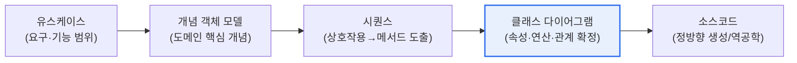
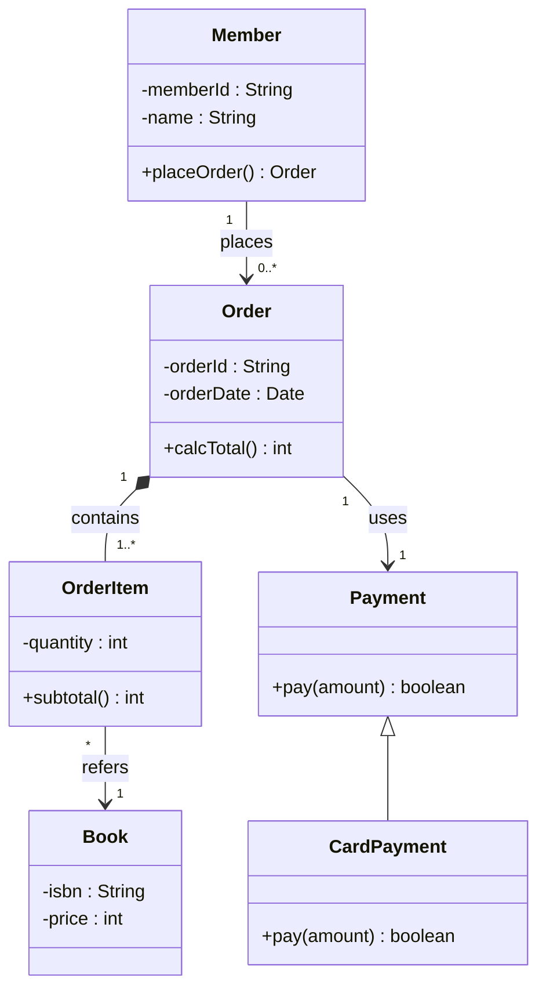

# UML 클래스 다이어그램과 객체 모델링

## 1. 개요

### 가. 정의
> **클래스 다이어그램(Class Diagram)** 은 시스템을 구성하는 **클래스와 그들의 속성(attribute)·오퍼레이션(operation), 그리고 클래스 간 관계(연관·집합·합성·일반화·의존)를 표현**하는 UML의 대표적 구조(정적) 다이어그램으로, 객체지향 분석·설계(OOAD)의 최종 산출물이자 소스코드로 이어지는 설계의 청사진이다.

클래스 다이어그램이 객체지향 설계의 중심에 있는 이유는 "**시스템의 뼈대(구조)를 한 장에 담는다**"는 데 있다. UML의 여러 다이어그램은 서로 다른 관점을 표현한다. 유스케이스 다이어그램이 '무엇을 하는가(요구·기능 범위)'를, 시퀀스·협력 다이어그램이 '어떻게 흐르는가(동적 상호작용)'를 보여 준다면, 클래스 다이어그램은 '무엇으로 이루어지는가(정적 구조)'를 보여 준다. 객체지향 개발은 이 세 관점을 오가며 점진적으로 정교화되는데, 그 수렴점이 바로 클래스 다이어그램이다.

객체지향 분석·설계의 전형적 흐름은 다음과 같다. 먼저 문제 영역(도메인)에서 핵심 개념(명사)을 추출해 **개념적 객체 모델(도메인 모델)** 을 만들고, 시나리오별 상호작용을 **시퀀스 다이어그램**으로 구체화한다. 이때 객체가 주고받는 메시지가 곧 수신 객체의 메서드(오퍼레이션)로 승격된다. 마지막으로 이들을 종합해 속성·연산·관계가 확정된 **클래스 다이어그램**으로 완성한다. 예컨대 온라인 서점이라면 '회원·도서·주문·장바구니'가 개념 객체가 되고, "주문한다·결제한다·재고를 차감한다"는 상호작용이 메서드가 되며, 이들의 관계(하나의 주문은 여러 주문항목을 가진다, 회원은 여러 주문을 낸다)가 클래스 다이어그램의 연관·다중성으로 정리된다. 즉 클래스 다이어그램은 분석·설계 활동의 최종 수렴점이자, 구현과 문서를 잇는 연결 고리다.

### 나. 등장 배경과 필요성
구조적 방법론 시절에는 데이터(ERD)와 기능(DFD)을 분리해 모델링했으나, 데이터와 그 데이터를 다루는 행위(연산)가 따로 놀아 변경에 취약했다. 객체지향은 **데이터와 연산을 하나의 객체(클래스)로 캡슐화**하여 이 문제를 해결했고, 그 구조를 시각적으로 표준화한 것이 UML 클래스 다이어그램이다. UML은 Booch·Rumbaugh(OMT)·Jacobson(OOSE)의 방법론이 통합되어 OMG에서 표준화(현재 UML 2.x)되었으며, 클래스 다이어그램은 그중에서도 코드 생성·역공학(Reverse Engineering)과 직접 연결되는 가장 실무적인 다이어그램이다. 복잡한 시스템일수록 구조를 공유·검증할 공통 언어가 필요하고, 클래스 다이어그램은 개발자·설계자·이해관계자가 구조를 합의하는 의사소통 수단으로서 필수적이다.

### 다. 모델링 흐름 개관

```mermaid
flowchart LR
  U["유스케이스<br/>(요구·기능 범위)"] --> O["개념 객체 모델<br/>(도메인 핵심 개념)"]
  O --> S["시퀀스<br/>(상호작용→메서드 도출)"]
  S --> C["클래스 다이어그램<br/>(속성·연산·관계 확정)"]
  C --> Code["소스코드<br/>(정방향 생성/역공학)"]
  style C fill:#e8f0fe,stroke:#2f6fed,stroke-width:2px
```

## 2. 클래스 다이어그램의 구성요소

### 가. 클래스의 표현과 가시성
클래스는 세 칸으로 나뉜 사각형으로 그린다. 맨 위 칸에 **클래스 이름**, 가운데 칸에 **속성**, 아래 칸에 **오퍼레이션(연산)** 을 적는다. 속성과 연산 앞에는 **가시성(visibility)** 기호를 붙여 접근 범위를 명시한다. `+`는 public(외부 공개), `-`는 private(자기 클래스 내부만), `#`는 protected(상속 관계에서 접근 허용), `~`는 package(같은 패키지 내부)이다. 예를 들어 `- balance : int`는 잔액이 외부에서 직접 접근 불가능한 은닉 속성임을, `+ withdraw(amount : int) : boolean`은 외부가 호출 가능한 인출 연산임을 뜻한다. 가시성은 단순한 표기가 아니라 **캡슐화·정보은닉**이라는 객체지향 원칙을 다이어그램 수준에서 강제하는 장치다. 속성을 private로 감추고 public 메서드로만 접근을 허용하면, 내부 구현이 바뀌어도 외부 계약(인터페이스)은 유지되어 변경 파급이 줄어든다.

### 나. 관계(Relationship)의 종류와 의미
클래스 다이어그램의 진짜 표현력은 **클래스 간 관계**에 있다. 관계는 결합의 강도와 의미에 따라 여러 종류로 나뉘며, 어떤 관계를 선택하느냐가 곧 설계 품질을 좌우한다.

**연관(Association)** 은 두 클래스가 구조적으로 연결되어 서로를 알고 참조하는 관계이며, 실선으로 그리고 양 끝에 **다중성(multiplicity, 예: 1, 0..1, 1..\*, \*)** 을 표기한다. 예컨대 "회원 1명은 주문 0개 이상을 낸다"는 회원 `1` — 주문 `0..*` 로 표현된다. 방향(navigability) 화살표로 어느 쪽이 어느 쪽을 참조하는지 명시할 수 있다.

**집합(Aggregation)과 합성(Composition)** 은 모두 '전체-부분(whole-part, has-a)' 관계지만 결합 강도가 다르다. 집합(속 빈 마름모)은 부분이 전체와 독립적으로 존재할 수 있는 느슨한 소유(예: 부서와 직원 — 부서가 없어져도 직원은 존재)를, 합성(채워진 마름모)은 부분이 전체의 생명주기에 종속되는 강한 소유(예: 주문과 주문항목 — 주문이 삭제되면 주문항목도 함께 소멸)를 뜻한다. 이 미묘한 차이는 구현에서 객체의 생성·소멸 책임과 참조 관리 방식을 결정한다.

**일반화(Generalization)** 는 상속(is-a) 관계로, 속 빈 삼각형 화살표를 부모(상위) 클래스로 향하게 그린다. 자식은 부모의 속성·연산을 물려받고 특화한다(예: '결제'를 부모로 '카드결제·계좌이체·간편결제'가 자식). **실체화(Realization)** 는 인터페이스와 구현 클래스의 관계(점선+삼각형)이며, **의존(Dependency)** 은 한 클래스가 다른 클래스를 일시적으로(파라미터·지역변수로) 사용하는 약한 관계(점선 화살표)다.

| 관계 | 표기 | 의미 | 결합도 |
|---|---|---|---|
| **연관(Association)** | 실선 + 다중성 | 구조적 참조 | 중 |
| **집합(Aggregation)** | 속 빈 마름모 | 전체-부분(독립 생존) | 약 |
| **합성(Composition)** | 채워진 마름모 | 전체-부분(생명주기 종속) | 강 |
| **일반화(Generalization)** | 속 빈 삼각형 | 상속(is-a) | 강 |
| **실체화(Realization)** | 점선 + 삼각형 | 인터페이스 구현 | 중 |
| **의존(Dependency)** | 점선 화살표 | 일시적 사용 | 약 |

### 다. 구조 예시 다이어그램
아래는 온라인 서점 도메인의 축약 클래스 구조로, 연관·다중성·합성·일반화가 함께 나타난 예다.

```mermaid
classDiagram
  class Member {
    -memberId : String
    -name : String
    +placeOrder() Order
  }
  class Order {
    -orderId : String
    -orderDate : Date
    +calcTotal() int
  }
  class OrderItem {
    -quantity : int
    +subtotal() int
  }
  class Book {
    -isbn : String
    -price : int
  }
  class Payment {
    +pay(amount) boolean
  }
  class CardPayment {
    +pay(amount) boolean
  }
  Member "1" --> "0..*" Order : places
  Order "1" *-- "1..*" OrderItem : contains
  OrderItem "*" --> "1" Book : refers
  Payment <|-- CardPayment
  Order "1" --> "1" Payment : uses
```

이 다이어그램은 텍스트 명세보다 훨씬 압축적으로 구조를 전달한다. `Order`와 `OrderItem`을 잇는 채워진 마름모(`*--`)는 주문이 사라지면 주문항목도 함께 사라지는 합성임을, `Payment`와 `CardPayment`를 잇는 삼각형(`<|--`)은 카드결제가 결제의 한 종류임을 한눈에 보여 준다.

## 3. 개념 객체 모델·시퀀스와의 연계

**개념적 객체 모델(도메인 모델)** 은 설계 이전 단계로, 문제 영역의 핵심 개념(도메인 객체)과 그 관계만 식별한다. 이 단계에서는 구현 세부(메서드 시그니처·가시성·자료형)를 아직 확정하지 않고, "이 도메인에는 어떤 개념이 있고 서로 어떻게 얽히는가"만 그린다. 이렇게 하면 이해관계자와 도메인 언어(유비쿼터스 언어)로 소통하기 쉽고, 기술적 편향 없이 문제 본질에 집중할 수 있다.

이어 **시퀀스 다이어그램**에서 특정 시나리오를 따라 객체 간 메시지를 정의하면, 그 메시지가 곧 수신 객체의 **오퍼레이션(메서드)** 으로 승격된다. 예컨대 "주문 객체가 결제 객체에게 pay(amount) 메시지를 보낸다"고 설계하면, 결제 클래스에는 `pay(amount)` 연산이 생긴다. 이렇게 동적 모델(시퀀스)에서 도출한 연산을 정적 모델(클래스)에 반영하며 설계를 정교화하고, 반대로 클래스 구조가 시퀀스의 실현 가능성을 검증한다. 두 모델은 상호 보완적으로 순환하며 수렴한다. [[uml-sequence]]

| 모델 | 관점 | 주요 산출물 | 결정 사항 |
|---|---|---|---|
| **개념 객체 모델** | 도메인 개념(정적) | 핵심 객체·관계 | 무엇이 존재하는가 |
| **시퀀스** | 동적 상호작용 | 메시지→메서드 | 누가 무엇을 호출하는가 |
| **클래스** | 정적 구조(확정) | 속성·연산·관계 | 어떤 구조로 구현하는가 |

이 연계에서 가장 중요한 것은 **책임 할당(Responsibility Assignment)** 이다. 어떤 메시지를 어느 객체가 처리할지(즉 어느 클래스에 메서드를 둘지)를 잘 정하면 응집도가 높고 결합도가 낮은 설계가 되고, 잘못 정하면 특정 클래스에 책임이 몰리는 'God Class'가 생긴다. 이 원칙들을 체계화한 것이 GRASP 패턴(Information Expert, Creator, Controller 등)이며, 클래스 다이어그램은 그 결과를 담는 그릇이다.

## 4. 심화 — 설계 패턴·코드 연계와 실무 적용

클래스 다이어그램은 **디자인 패턴을 표현하고 소통하는 표준 언어**로도 쓰인다. GoF 디자인 패턴(전략·옵서버·팩토리·데코레이터 등)은 모두 클래스 다이어그램으로 그 구조가 정의되며, 예컨대 전략(Strategy) 패턴은 `Context`가 `Strategy` 인터페이스에 의존하고 구체 전략들이 이를 실체화하는 구조로 표현된다. 이렇게 하면 "결제 방식을 전략 패턴으로 분리하자"는 설계 의도를 다이어그램 한 장으로 합의할 수 있다.

실무에서 클래스 다이어그램은 **정방향 공학(Forward Engineering)과 역공학(Reverse Engineering)** 을 통해 코드와 양방향으로 연결된다. Enterprise Architect, Visual Paradigm, IntelliJ/Eclipse의 UML 플러그인 같은 도구는 클래스 다이어그램에서 클래스 골격 코드를 자동 생성하거나(정방향), 레거시 소스에서 클래스 구조를 추출해 다이어그램으로 시각화한다(역공학). 후자는 문서가 부실한 레거시 시스템을 파악하거나 유지보수 영향도를 분석할 때 특히 유용하다. 최근에는 코드 우선(Code-First) 문화가 확산되면서, 무거운 CASE 도구 대신 **PlantUML·Mermaid** 처럼 텍스트로 다이어그램을 작성해 코드 저장소에서 버전 관리(diagram-as-code)하는 방식이 늘고 있다. 이는 설계 문서가 코드와 함께 진화하도록 하여 '문서-구현 불일치' 문제를 줄인다. 다만 도메인이 복잡한 시스템에서는 클래스 다이어그램 하나로 모든 것을 담으려 하기보다, 도메인 주도 설계(DDD)의 바운디드 컨텍스트 단위로 나누어 응집도 높은 모델을 유지하는 것이 실무적 요령이다.

## 5. 고려사항 및 시사점 (기술사 관점)

1. **모델 간 정합성(Consistency) 유지**: 유스케이스→개념객체→시퀀스→클래스가 일관되게 연결되어야 한다. 특히 시퀀스의 메시지와 클래스의 오퍼레이션, 개념 모델의 관계와 클래스의 연관이 서로 어긋나면 설계 신뢰도가 무너진다. CASE 도구의 모델 일관성 검사(consistency check)나 diagram-as-code의 리뷰로 정합성을 지속 검증해야 한다.

2. **적정 추상화 수준과 진화적 상세화**: 분석 단계의 클래스는 도메인 중심으로 단순하게 유지하고, 설계 단계에서 점차 가시성·자료형·구현 세부를 더한다. 처음부터 과도하게 상세하면 요구 변경 시 유지·수정 비용이 폭증한다. '분석 클래스 → 설계 클래스 → 구현 클래스'의 단계적 정련이 바람직하다.

3. **결합도·응집도와 관계 선택의 트레이드오프**: 집합/합성/일반화/의존 중 무엇을 쓰느냐가 결합 강도를 결정한다. 상속(일반화)은 강한 재사용을 주지만 부모 변경이 자식 전체에 파급되므로, "상속보다 합성을 선호하라(Favor composition over inheritance)"는 원칙에 따라 유연성이 필요한 곳은 합성·인터페이스로 결합을 낮추는 판단이 필요하다.

4. **코드 생성·역공학과 문서-구현 일관성**: 클래스 다이어그램은 코드와 양방향 변환이 가능하므로 설계-구현 일관성 유지와 레거시 이해에 강점이 있다. 그러나 자동 생성 코드는 골격만 제공하므로 맹신하면 안 되고, diagram-as-code(Mermaid/PlantUML)로 다이어그램을 저장소에 두어 코드와 함께 진화시키는 운영 전략이 유효하다.

5. **대규모 도메인에서의 모델 분할**: 시스템이 커지면 단일 클래스 다이어그램은 가독성을 잃는다. 패키지·서브시스템 단위로 나누고, DDD의 바운디드 컨텍스트·애그리거트 개념을 적용해 응집도 높은 모델 경계를 설정해야 유지보수성과 확장성이 확보된다.

## 참고자료
- OMG, Unified Modeling Language (UML) 2.5.1 명세: https://www.omg.org/spec/UML/
- IBM Developer, "UML basics: The class diagram": https://developer.ibm.com/articles/the-class-diagram/
- Mermaid, Class diagram 문서: https://mermaid.js.org/syntax/classDiagram.html
- Refactoring Guru, GoF 디자인 패턴(구조 다이어그램): https://refactoring.guru/design-patterns

---

> **한 줄 요약**: 클래스 다이어그램은 *클래스와 속성·연산, 연관·집합·합성·일반화·의존 관계를 표현하는 UML 정적 모델* 로, 개념 객체 모델→시퀀스(메시지→메서드)→클래스로 이어지는 객체지향 설계의 수렴점이자 코드와 양방향으로 연결되는 청사진이며, 모델 간 정합성·적정 추상화·관계 선택(결합도)이 설계 품질의 핵심이다.
