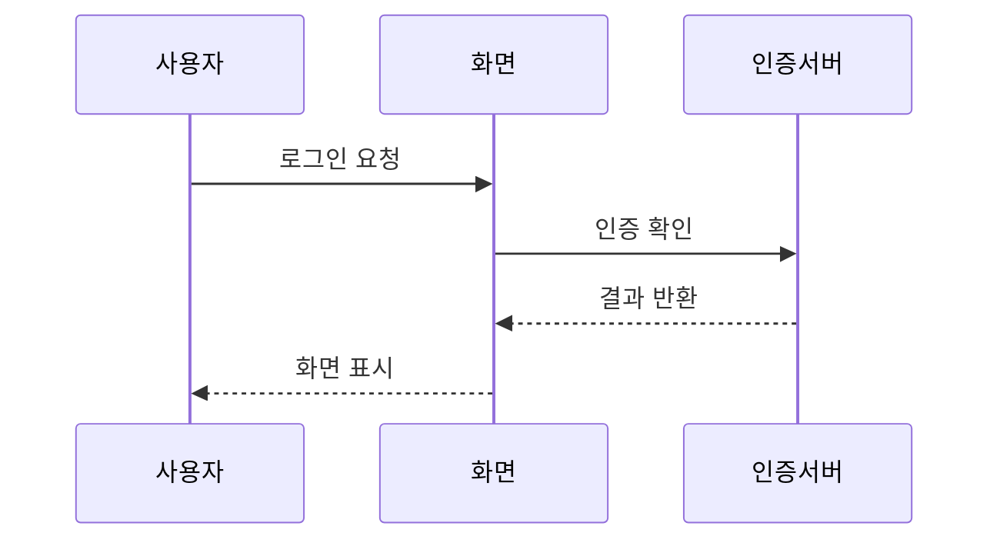

# UML 순차 다이어그램(Sequence Diagram)

## 1. 개요

### 가. 목적과 개념
> **순차 다이어그램**은 객체(Object) 간에 주고받는 **메시지를 시간 순서에 따라 표현**하는 UML 동적 다이어그램으로, 특정 시나리오에서 객체들이 어떻게 상호작용하며 협력하는지를 나타낸다.

순차 다이어그램의 핵심은 '**누가 누구에게 언제 무엇을 요청하는가를 시간 흐름으로 그린다**'는 데 있다. 클래스 다이어그램이 시스템의 정적 구조(무엇이 있는가)를 보여준다면, 순차 다이어그램은 동적 행위(어떻게 동작하는가)를 보여준다. 예를 들어 "회원이 로그인한다"는 시나리오에서, 사용자→화면→인증서버→DB로 메시지가 순차적으로 흐르고 응답이 돌아오는 과정을 위에서 아래로 시간 축을 따라 그린다. 이렇게 하면 유스케이스의 내부 처리 흐름, 객체 간 책임 분배, 메서드 호출 순서가 한눈에 드러나 설계 검증과 의사소통에 유용하다. 특히 하나의 유스케이스가 실제로 어떤 객체 협력으로 실현되는지 구체화하는 데 쓰인다.

### 나. 협력 다이어그램과의 관계
순차 다이어그램과 협력(커뮤니케이션) 다이어그램은 같은 상호작용을 다른 관점에서 표현한다. 순차 다이어그램은 **시간 순서**를 강조(세로 시간축)하고, 협력 다이어그램은 객체 간 **연결 관계**를 강조한다. 둘은 상호 변환이 가능하다.

## 2. 구성요소

| 구성요소 | 내용 |
|---|---|
| **객체(Object)** | 상호작용에 참여하는 개체(상단 사각형) |
| **생명선(Lifeline)** | 객체의 존재 기간(세로 점선) |
| **활성 박스(Activation)** | 객체가 활동(처리)하는 구간(생명선 위 사각형) |
| **메시지(Message)** | 객체 간 요청(실선 화살표)·응답(점선 화살표) |
| **프레임(Frame)** | 다이어그램 경계·조건(loop·alt·opt) |
| **가드(Guard)** | 메시지 실행 조건([조건]) |

메시지에는 **동기 메시지**(응답을 기다림, 실선 화살표)와 **비동기 메시지**(응답을 안 기다림), **반환 메시지**(점선 화살표)가 있다. 반복(loop)·조건 분기(alt/opt)는 프레임으로 묶어 표현한다.

## 3. 작성 순서

| 순서 | 내용 |
|---|---|
| **① 시나리오 선정** | 표현할 유스케이스·시나리오 결정 |
| **② 객체 식별** | 참여 객체를 상단에 배치, 생명선 그리기 |
| **③ 메시지 배열** | 시간 순서로 메시지를 위→아래 배치 |
| **④ 활성 구간 표시** | 객체 처리 구간에 활성 박스 |
| **⑤ 조건·반복 추가** | alt·loop·opt 프레임으로 제어 흐름 |

## 4. 고려사항 및 시사점

1. **동적 설계 검증 도구**로 유용하다. 유스케이스의 내부 처리 흐름과 객체 간 책임 분배를 구체화해, 설계의 완결성·타당성을 조기에 검증할 수 있다.
2. **적정 추상화 수준**이 중요하다. 모든 메시지를 다 그리면 복잡해지므로, 핵심 시나리오·주요 상호작용 위주로 그려 가독성과 의사소통 가치를 유지한다.
3. **다른 UML 다이어그램과 연계**된다. 유스케이스(무엇을)→순차(어떻게 흐르는가)→클래스(어떤 구조로)로 이어지며, 상호 정합성을 맞춰 일관된 설계를 완성한다.

---

> **한 줄 요약**: 순차 다이어그램은 *객체 간 메시지를 시간 순서로 표현* 하는 UML 동적 다이어그램으로, 객체·생명선·활성박스·메시지·프레임·가드로 구성되며, 유스케이스의 내부 협력 흐름을 구체화해 동적 설계를 검증한다.
