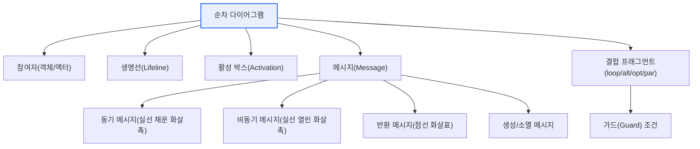
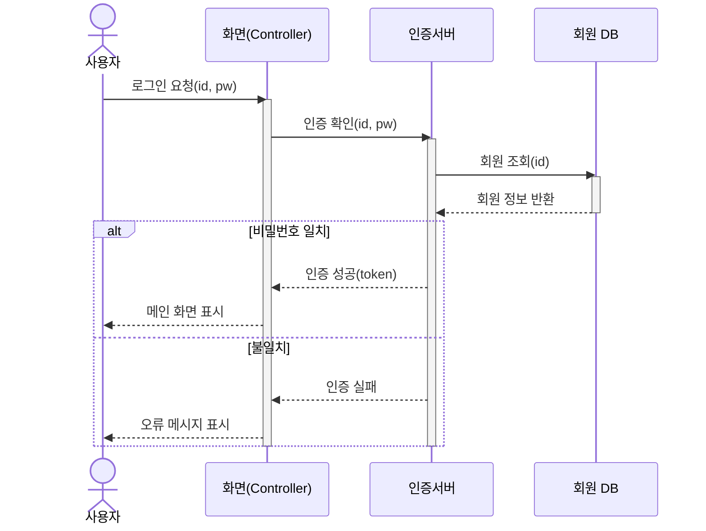

# UML 순차 다이어그램(Sequence Diagram)

## 1. 개요

### 가. 목적과 개념
> **순차 다이어그램(Sequence Diagram)** 은 객체(Object) 간에 주고받는 **메시지를 시간 순서에 따라 표현**하는 UML 동적(behavioral) 다이어그램으로, 특정 시나리오에서 객체들이 어떻게 상호작용하며 협력하는지를 나타낸다. UML 2.x에서는 상호작용(Interaction)을 표현하는 대표 다이어그램으로 분류된다.

순차 다이어그램의 핵심은 '**누가 누구에게 언제 무엇을 요청하는가를 시간 흐름으로 그린다**'는 데 있다. 클래스 다이어그램이 시스템의 정적 구조(무엇이 있는가, structural)를 보여준다면, 순차 다이어그램은 동적 행위(어떻게 동작하는가, behavioral)를 보여준다. 예를 들어 "회원이 로그인한다"는 시나리오에서, 사용자→화면→인증서버→DB로 메시지가 순차적으로 흐르고 응답이 돌아오는 과정을 위에서 아래로 시간 축을 따라 그린다. 이렇게 하면 유스케이스의 내부 처리 흐름, 객체 간 책임 분배, 메서드 호출 순서가 한눈에 드러나 설계 검증과 의사소통에 유용하다.

특히 순차 다이어그램은 하나의 유스케이스가 실제로 어떤 객체 협력으로 실현되는지를 구체화하는 다리 역할을 한다. 유스케이스 다이어그램이 "무엇을 하는가(what)"라는 시스템의 외부 관점 요구를 기술한다면, 순차 다이어그램은 그 유스케이스가 "어떻게 처리되는가(how)"를 객체 협력으로 풀어낸다. 이 과정에서 각 객체가 어떤 책임(메서드)을 가져야 하는지가 자연스럽게 도출되므로, 순차 다이어그램은 클래스 다이어그램의 오퍼레이션(연산)을 발견·검증하는 설계 도구로도 쓰인다.

### 나. 등장 배경과 필요성
객체지향 설계에서 정적 구조(클래스)만으로는 시스템이 실제로 "동작"하는 모습을 검증하기 어렵다. 클래스 다이어그램은 "이런 클래스와 메서드가 있다"고 말할 뿐, 그 메서드들이 어떤 순서로 협력해 하나의 기능을 완성하는지는 보여주지 못한다. 여기서 생기는 공백이 설계 오류의 온상이 된다. 어떤 객체가 정보를 전혀 갖고 있지 않은데도 호출되거나, 응답을 기다려야 할 자리에서 비동기로 던져지거나, 특정 객체에 책임이 과도하게 몰리는 문제(God Object)는 정적 구조만 봐서는 드러나지 않는다.

순차 다이어그램은 이러한 동적 흐름을 시간 축 위에 명시적으로 펼쳐 보임으로써, 설계자가 협력의 타당성을 착수 전에 검증하도록 돕는다. 또한 개발자·기획자·QA가 하나의 시나리오를 같은 그림으로 이해하게 하여 의사소통 비용을 낮춘다. 결함이 요구·설계 단계에서 발견될수록 수정 비용이 기하급수적으로 낮아진다는 점(결함 조기 발견의 경제성)에서, 순차 다이어그램은 비용 효율적인 설계 검증 수단이다.

### 다. 협력(커뮤니케이션) 다이어그램과의 관계
순차 다이어그램과 **협력(커뮤니케이션) 다이어그램**은 같은 상호작용을 서로 다른 관점에서 표현하는 쌍둥이다. 순차 다이어그램은 **시간 순서**를 강조(세로 시간축)하여 "언제"에 초점을 맞추고, 협력 다이어그램은 객체 간 **연결 관계(링크)** 를 강조하여 "어떻게 연결되어 있는가"에 초점을 맞춘다. 두 다이어그램은 담고 있는 정보가 본질적으로 동일해 상호 변환이 가능하다. 시간 흐름이 중요한 시나리오(트랜잭션 처리 순서 등)에는 순차 다이어그램이, 객체 간 구조적 연결이 중요한 경우에는 협력 다이어그램이 더 적합하다.

## 2. 전체 구조와 구성요소

아래 구조도는 순차 다이어그램을 이루는 요소들이 서로 어떻게 관계 맺는지를 개념적으로 정리한 것이다.

```mermaid
flowchart TB
  SD["순차 다이어그램"] --> P["참여자(객체/액터)"]
  SD --> L["생명선(Lifeline)"]
  SD --> AC["활성 박스(Activation)"]
  SD --> M["메시지(Message)"]
  SD --> CF["결합 프래그먼트(loop/alt/opt/par)"]
  M --> M1["동기 메시지(실선 채운 화살촉)"]
  M --> M2["비동기 메시지(실선 열린 화살촉)"]
  M --> M3["반환 메시지(점선 화살표)"]
  M --> M4["생성/소멸 메시지"]
  CF --> G["가드(Guard) 조건"]
  style SD fill:#e8f0fe,stroke:#2f6fed,stroke-width:2px
```

다음은 실제 로그인 시나리오를 순차 다이어그램 문법으로 표현한 예다. 동기 요청은 실선 화살표(`->>`), 반환은 점선 화살표(`-->>`)로 그리며, 활성 구간과 조건 분기(alt)를 함께 표현했다.

```mermaid
sequenceDiagram
  actor U as 사용자
  participant S as 화면(Controller)
  participant A as 인증서버
  participant DB as 회원 DB
  U->>S: 로그인 요청(id, pw)
  activate S
  S->>A: 인증 확인(id, pw)
  activate A
  A->>DB: 회원 조회(id)
  activate DB
  DB-->>A: 회원 정보 반환
  deactivate DB
  alt 비밀번호 일치
    A-->>S: 인증 성공(token)
    S-->>U: 메인 화면 표시
  else 불일치
    A-->>S: 인증 실패
    S-->>U: 오류 메시지 표시
  end
  deactivate A
  deactivate S
```

### 가. 참여자와 생명선(Lifeline)
상호작용에 참여하는 개체는 상단에 사각형(객체) 또는 액터 기호로 배치되고, 각 참여자로부터 아래로 뻗는 **세로 점선**이 생명선이다. 생명선은 시간의 흐름(위→아래)을 나타내는 축인 동시에, 해당 객체가 상호작용 동안 존재함을 의미한다. 객체 표기는 통상 `객체명:클래스명` 형식(밑줄)으로 쓰며, 특정 인스턴스가 아니라 역할만 강조할 때는 객체명이나 클래스명만 적기도 한다. 생명선을 어떻게 나열하느냐(참여자 선정과 배치)가 다이어그램의 가독성을 크게 좌우하므로, 협력의 핵심 객체만 골라 흐름 방향(왼쪽→오른쪽)이 자연스럽도록 배치하는 것이 좋다.

### 나. 활성 박스(Activation Bar)
생명선 위에 겹쳐 그리는 가느다란 세로 사각형이 활성 박스(실행 사양, execution specification)로, **해당 객체가 실제로 처리(연산)를 수행하는 구간**을 나타낸다. 활성 박스가 있으면 어느 객체가 언제부터 언제까지 제어를 쥐고 있는지, 호출이 중첩(nested)되어 있는지가 드러난다. 예컨대 위 예시에서 화면(S)의 활성 박스는 인증서버(A) 호출을 감싸고, A의 활성 박스는 다시 DB 호출을 감싸는 중첩 구조를 보인다. 이 중첩 깊이가 지나치게 깊으면 특정 흐름에 제어가 과하게 묶여 있다는 신호일 수 있어, 설계 리팩터링의 단서가 된다.

### 다. 메시지(Message)의 종류
메시지는 순차 다이어그램의 실질적 내용으로, 화살표의 모양과 선 종류가 의미를 구분한다. **동기 메시지**(실선+채운 삼각 화살촉)는 호출자가 응답을 받을 때까지 대기하는 요청으로, 일반적인 메서드 호출에 해당한다. **비동기 메시지**(실선+열린 화살촉)는 응답을 기다리지 않고 제어를 넘기는 요청으로, 메시지 큐 발행이나 이벤트 전송처럼 호출 즉시 다음 작업을 진행하는 경우에 쓴다. **반환 메시지**(점선 화살표)는 호출에 대한 응답으로, 생략 가능하지만 결과값의 흐름을 명확히 하려면 표기하는 것이 좋다. 이 밖에 객체를 새로 만드는 **생성 메시지**(대상 객체를 그 시점에 배치), 객체를 없애는 **소멸 메시지**(생명선 끝에 X 표시), 자기 자신을 호출하는 **자기 메시지**(self message, 되돌아오는 화살표)가 있다.

동기와 비동기의 구분은 단순한 표기 문제가 아니라 시스템 특성을 결정한다. 예를 들어 결제 승인처럼 결과를 반드시 확인해야 하는 흐름은 동기로, 알림 발송이나 로그 적재처럼 결과를 기다릴 필요가 없는 흐름은 비동기로 설계하는 것이 성능·응답성 측면에서 유리하다. 순차 다이어그램은 이 결정을 화살표 모양으로 명시하게 하여 설계 의도를 문서에 각인시킨다.

### 라. 결합 프래그먼트(Combined Fragment)와 가드
단순한 순차 흐름만으로는 조건 분기·반복 같은 제어 구조를 표현할 수 없다. UML 2.0은 이를 위해 **결합 프래그먼트**를 도입했다. 대표 연산자로는 조건 분기 **alt**(여러 대안 중 하나), 선택 실행 **opt**(조건 충족 시에만), 반복 **loop**, 병렬 실행 **par**, 임계 영역 **critical** 등이 있다. 각 프래그먼트는 사각 프레임으로 묶고 좌상단에 연산자를, 각 분기에는 **가드(Guard) 조건** `[조건]`을 적는다. 위 로그인 예시의 `alt [비밀번호 일치] / else`가 대표적인 조건 분기 표현이다. 프래그먼트를 적절히 사용하면 하나의 다이어그램으로 정상 흐름과 예외 흐름을 함께 담을 수 있어, 별도의 시나리오별 다이어그램을 여러 장 그리는 것보다 응집도 있게 표현할 수 있다.

| 구성요소 | 내용 | 표기 |
|---|---|---|
| **객체/액터** | 상호작용 참여 개체 | 상단 사각형·액터 기호 |
| **생명선(Lifeline)** | 객체 존재 기간·시간축 | 세로 점선 |
| **활성 박스(Activation)** | 처리(연산) 수행 구간 | 생명선 위 가는 사각형 |
| **동기 메시지** | 응답 대기 호출 | 실선·채운 화살촉 |
| **비동기 메시지** | 응답 미대기 호출 | 실선·열린 화살촉 |
| **반환 메시지** | 호출에 대한 응답 | 점선 화살표 |
| **결합 프래그먼트** | 조건·반복·병렬 제어 | 프레임(alt/opt/loop/par) |
| **가드(Guard)** | 메시지 실행 조건 | `[조건]` |

## 3. 작성 순서

순차 다이어그램은 다음 순서로 작성하면 누락 없이 그릴 수 있다. 각 단계는 앞 단계의 산출물을 입력으로 삼아 점진적으로 상세화된다.

| 순서 | 내용 | 착안점 |
|---|---|---|
| **① 시나리오 선정** | 표현할 유스케이스·시나리오 결정 | 정상·주요 예외 흐름 우선 |
| **② 객체 식별** | 참여 객체를 상단 배치, 생명선 | 핵심 협력 객체만 선별 |
| **③ 메시지 배열** | 시간 순서로 메시지 위→아래 배치 | 요청·응답 짝 명확히 |
| **④ 활성 구간 표시** | 처리 구간에 활성 박스 | 중첩 깊이 점검 |
| **⑤ 조건·반복 추가** | alt·loop·opt·par 프래그먼트 | 예외·분기 흐름 포함 |
| **⑥ 검토·정합성 확인** | 클래스·유스케이스와 대조 | 메서드 존재·책임 타당성 |

특히 ②단계의 객체 식별과 ⑥단계의 정합성 확인이 품질을 좌우한다. 메시지의 수신 객체는 반드시 그 메시지를 처리할 책임(메서드)과 필요한 정보를 가진 객체여야 하며(정보 전문가 패턴, Information Expert), 이 점검을 통해 클래스 다이어그램에 어떤 오퍼레이션을 추가해야 할지가 확정된다.

## 4. 비교 — 순차 vs 협력 vs 상태 vs 활동 다이어그램

동적 다이어그램은 여러 종류가 있어 목적에 맞게 선택해야 한다. 흔한 실수는 어떤 흐름이든 순차 다이어그램 하나로 밀어붙이는 것인데, 이는 표현력의 미스매치를 낳는다. 순차 다이어그램은 **객체 간 상호작용의 시간 순서**에 강하지만, 하나의 객체가 이벤트에 따라 상태를 바꿔가는 모습(상태 다이어그램)이나 조건·병렬을 포함한 업무 절차 전체의 흐름(활동 다이어그램)을 표현하는 데는 부적합하다.

| 구분 | 강조점 | 적합한 상황 | 한계 |
|---|---|---|---|
| **순차** | 객체 간 메시지의 시간 순서 | 유스케이스 내부 협력, 호출 순서 | 객체 多·흐름 복잡 시 난독 |
| **협력(커뮤니케이션)** | 객체 간 연결 관계 | 구조적 연결 강조 | 시간 순서 파악 어려움 |
| **상태** | 한 객체의 상태 전이 | 이벤트 기반 상태 변화 | 다객체 협력 표현 부적합 |
| **활동** | 처리 흐름·분기·병렬 | 업무 프로세스·워크플로 | 객체별 책임 표현 약함 |

차이가 생기는 근본 이유는 각 다이어그램이 잡아내려는 "축"이 다르기 때문이다. 순차는 시간을, 상태는 하나의 객체가 겪는 생애를, 활동은 제어 흐름을 각각 1차원으로 삼는다. 실무에서는 하나의 기능을 이해할 때 유스케이스(요구)→활동(업무 절차)→순차(객체 협력)→상태(핵심 객체 생애)를 상보적으로 함께 그려 다각도로 검증한다.

## 5. 심화 — 실무 활용과 예상 출제 방향

실무에서 순차 다이어그램은 설계 문서화를 넘어 여러 국면에서 활용된다. 첫째, **API·마이크로서비스 상호작용 설계**다. 서비스 A가 B를 동기로 호출하고 B가 다시 메시지 큐로 C에 비동기 이벤트를 발행하는 흐름을 순차 다이어그램으로 그리면, 동기/비동기 경계와 장애 전파 지점(예: B 응답 지연 시 A의 타임아웃)이 명확해져 회복탄력성(서킷 브레이커, 타임아웃) 설계로 이어진다. 둘째, **인증·보안 프로토콜 설명**이다. OAuth 2.0 인가 코드 흐름이나 SAML 기반 SSO처럼 다자간 메시지 교환이 핵심인 프로토콜은 순차 다이어그램이 사실상 표준 설명 수단이다. 셋째, **결함 분석·리뷰**다. 실제 로그(호출 트레이스)를 순차 다이어그램으로 복원하면 어느 구간에서 예상과 다른 호출이 일어났는지 시각적으로 짚어낼 수 있다.

도구 측면에서도 순차 다이어그램은 접근성이 높다. PlantUML·Mermaid 같은 텍스트 기반 도구를 쓰면 다이어그램을 코드로 관리(diagram-as-code)해 버전 관리·리뷰가 가능하고, 이 학습 노트 사이트도 Mermaid의 `sequenceDiagram` 문법으로 다이어그램을 렌더링한다. 이는 요구·설계가 자주 바뀌는 애자일 환경에서 다이어그램을 최신 상태로 유지하는 데 유리하다.

기술사 시험 관점에서 순차 다이어그램은 "UML 동적 다이어그램의 종류와 비교", "유스케이스 실현(realization)", "객체지향 설계 절차"와 함께 자주 출제된다. 답안 작성 전략은 ① 정적 vs 동적 다이어그램 구도에서 순차 다이어그램의 위치를 잡고 ② 구성요소를 예시 다이어그램과 함께 제시하며 ③ 협력·상태·활동 다이어그램과의 비교로 "언제 무엇을 쓰는가"를 논한 뒤 ④ API·보안 프로토콜 등 실무 활용으로 마무리하면 깊이를 확보할 수 있다.

## 6. 고려사항 및 시사점

1. **동적 설계 검증 도구로서의 가치를 살려야 한다.** 순차 다이어그램은 유스케이스의 내부 처리 흐름과 객체 간 책임 분배를 구체화해, 설계의 완결성·타당성을 조기에 검증하고 클래스의 오퍼레이션을 발견하는 데 쓰인다. 문서 장식이 아니라 설계 사고의 도구로 활용할 때 효용이 크다.
2. **적정 추상화 수준이 가독성을 좌우한다.** 모든 메시지를 다 그리면 다이어그램이 복잡해져 오히려 이해를 방해한다. 핵심 시나리오·주요 상호작용 위주로 그리고, 세부는 별도 다이어그램으로 분리하거나 참조(ref) 프래그먼트로 위임해 한 장의 정보 밀도를 관리해야 한다.
3. **다른 UML 다이어그램과의 정합성을 유지해야 한다.** 유스케이스(무엇을)→순차(어떻게 흐르는가)→클래스(어떤 구조로)로 이어지는 사슬에서, 순차 다이어그램의 메시지는 클래스의 메서드와 1:1로 대응해야 한다. 정합성이 깨지면 설계 문서 전체의 신뢰가 무너진다.
4. **동기/비동기 선택은 아키텍처 결정임을 인식해야 한다.** 화살표 모양 하나가 응답성·결합도·장애 전파에 영향을 준다. 순차 다이어그램은 이 결정을 명시화하므로, 성능·회복탄력성 요구를 고려해 신중히 선택하고 그 근거를 문서에 남겨야 한다.
5. **살아있는 문서(diagram-as-code)로 유지해야 한다.** 코드가 바뀌면 다이어그램도 갱신되어야 가치가 유지된다. Mermaid·PlantUML로 다이어그램을 코드화해 버전 관리에 포함시키면 최신성을 유지하기 쉽고, 리뷰·협업에도 유리하다.

## 참고자료
- OMG, Unified Modeling Language(UML) Specification: https://www.omg.org/spec/UML/
- Mermaid Sequence Diagram 문서: https://mermaid.js.org/syntax/sequenceDiagram.html

---

> **한 줄 요약**: 순차 다이어그램은 *객체 간 메시지를 시간 순서로 표현*하는 UML 동적 다이어그램으로, 객체·생명선·활성박스·메시지(동기/비동기/반환)·결합 프래그먼트(alt/loop/opt/par)·가드로 구성되며, 유스케이스의 내부 협력 흐름을 구체화해 객체의 책임과 동기/비동기 경계를 조기에 검증하는 동적 설계 도구다.
