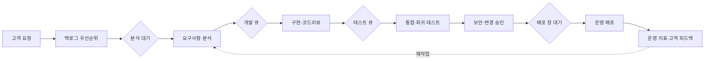
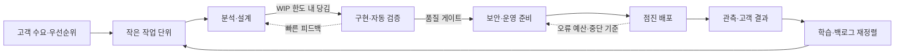

# 가치 흐름 매핑(VSM, Value Stream Mapping) 기반 린·DevOps 프로세스 개선

## 1. 개요

### 가. 정의

> **가치 흐름 매핑(Value Stream Mapping, VSM)**은 고객 요구가 입력된 뒤 가치가 전달될 때까지의 전체 흐름을 업무·정보·대기·품질 데이터와 함께 시각화하고, 낭비와 병목을 제거하여 리드타임과 전달 성과를 개선하는 린(Lean) 기반 분석 기법이다.

VSM은 단순한 업무 흐름도나 조직도와 다르다.
업무 흐름도는 어떤 활동이 어떤 순서로 실행되는지 표현하는 데 집중하지만, VSM은 활동 사이의 대기시간, 재작업, 큐, 승인 지연, 배치 크기, 결함률을 함께 본다.
따라서 실제로 고객에게 가치를 만드는 시간과 가치를 만들지 않는 시간을 분리하여, 전체 리드타임이 왜 길어지는지를 설명할 수 있다.

VSM에서 말하는 가치 흐름은 특정 팀의 내부 절차가 아니라 고객의 요구가 결과물로 전환되는 종단 간 경로다.
소프트웨어 서비스라면 아이디어·요청 접수에서 요구사항 분석, 개발, 테스트, 보안 검토, 배포, 운영 피드백까지가 하나의 흐름이 될 수 있다.
제조라면 주문, 자재 조달, 생산, 검사, 출하, 고객 인도까지를 연결한다.
범위를 너무 좁게 잡으면 앞뒤 병목을 놓치고, 너무 넓게 잡으면 데이터 수집과 개선 우선순위 설정이 어려워진다.

### 나. 등장 배경과 필요성

첫째, 기능별 최적화가 전체 성과를 보장하지 않기 때문이다.
개발팀이 높은 개발 생산성을 달성해도 테스트팀의 대기열이 커지면 고객이 기능을 받는 시점은 빨라지지 않는다.
구매부서가 대량 구매로 단가를 낮추어도 재고와 검수 지연이 증가하면 주문부터 인도까지의 총 리드타임은 오히려 길어질 수 있다.
VSM은 팀별 효율이 아니라 흐름 전체를 개선 대상으로 삼는다.

둘째, 지식 노동의 흐름은 눈에 잘 보이지 않는다.
소프트웨어의 요구사항, 코드 리뷰, 승인, 배포 권한, 테스트 환경은 물리적 재공품처럼 쌓이지 않지만, 티켓·브랜치·승인 대기·릴리스 큐의 형태로 정체된다.
VSM은 이러한 대기와 핸드오프를 업무 데이터로 표현하여 보이지 않는 재공(Work in Process, WIP)을 드러낸다.

셋째, 디지털 전환과 DevOps에서는 자동화만으로 병목이 사라지지 않는다.
빌드와 배포를 자동화해도 요구사항 승인, 환경 접근 신청, 수동 회귀 테스트, 변경심의위원회가 주간 단위로만 열리면 전체 전달 속도는 제한된다.
흐름의 제약을 먼저 확인하지 않고 도구만 도입하면 자동화된 대기열이 만들어질 뿐이다.

넷째, 고객 가치와 내부 활동을 같은 기준으로 연결할 필요가 있다.
작업량, 코드 줄 수, 회의 횟수처럼 활동량만 측정하면 고객이 실제로 얻는 결과를 놓칠 수 있다.
VSM은 고객 요구의 도착률, 처리율, 리드타임, 품질, 피드백 주기를 함께 살펴 서비스 성과와 운영 지표를 연결한다.

### 다. 핵심 목적과 적용 범위

VSM의 첫 번째 목적은 현재 상태(Current State)를 사실에 근거하여 그리는 것이다.
현재 상태 지도는 이상적인 절차가 아니라 최근의 대표적인 업무가 실제로 통과한 경로를 표시한다.
정상 경로뿐 아니라 반려, 재작업, 예외 승인, 긴급 요청과 같은 우회 흐름도 포함해야 병목의 원인을 찾을 수 있다.

두 번째 목적은 미래 상태(Future State)의 설계다.
미래 상태는 모든 대기를 없애겠다는 선언이 아니라, 고객 가치에 기여하지 않는 대기를 줄이고 흐름을 안정화하는 운영 가설이다.
각 개선 과제에는 책임자, 측정 지표, 실험 기간, 중단 기준을 붙여 실행 가능한 백로그로 전환한다.

세 번째 목적은 지속적인 개선 루프의 정착이다.
한 번 만든 지도를 문서 저장소에 보관하는 것만으로는 성과가 생기지 않는다.
변경 전후의 리드타임, 처리율, 결함 유출, 재작업 비율을 비교하고, 결과에 따라 정책과 자동화를 조정해야 한다.

적용 범위는 단일 제품의 기능 개발, 고객지원 티켓, 데이터 파이프라인, 인프라 변경, 보안 취약점 처리, 제조·물류 흐름 등으로 확장할 수 있다.
다만 비상 대응이나 창의적 연구처럼 업무 결과와 경로가 크게 변하는 영역은 반복 가능한 부분을 먼저 선택해야 한다.
한 번에 전사 전체를 그리기보다 고객 결과가 분명하고 개선 필요성이 높은 흐름에서 시작하는 것이 효과적이다.

## 2. VSM의 구성 개념과 측정 지표

### 가. 흐름의 기본 요소

VSM은 고객과 공급자, 프로세스 상자, 프로세스 사이의 재공, 정보 흐름, 자재 또는 작업 흐름, 데이터 상자로 구성된다.
소프트웨어에서는 고객을 내부 사용자나 API 소비자로 보고, 자재 흐름을 티켓·커밋·빌드·릴리스와 같은 디지털 작업물의 흐름으로 해석할 수 있다.
표기 기호 자체보다 중요한 것은 시작점과 종료점, 단위 작업, 흐름의 경계를 참여자들이 같은 의미로 합의하는 것이다.

고객 요구의 도착률은 일정 기간에 유입되는 작업의 수를 뜻한다.
처리율은 같은 기간에 완료되어 고객에게 전달된 작업의 수다.
도착률이 처리율보다 지속적으로 크면 WIP와 대기시간이 증가하며, 처리율이 더 크더라도 수요 변동이 크면 유휴와 과부하가 번갈아 나타날 수 있다.

프로세스 박스에는 담당 역할, 작업 시간, 대기시간, 배치 크기, 가동률, 최초 통과 수율(First Pass Yield, FPY), 재작업률을 기록한다.
작업 시간은 실제로 손을 움직여 처리한 시간이고, 대기시간은 다음 단계나 승인·환경·정보를 기다린 시간이다.
두 시간을 혼합하면 자동화해야 할 작업과 정책적으로 제거해야 할 대기를 구분하기 어렵다.

정보 흐름은 요구 우선순위, 승인 기준, 테스트 결과, 변경 정책, 운영 피드백이 어떤 방식으로 전달되는지 표시한다.
정보가 구두 회의나 개인 메신저에만 존재하면 흐름의 재현성이 떨어지고 담당자 부재 시 정체된다.
따라서 VSM에서는 정보의 출처, 전달 주기, 품질, 의사결정 권한도 함께 기록한다.

### 나. 리드타임과 프로세스 타임

전체 리드타임(Lead Time)은 고객이 요청한 시점부터 고객이 결과를 받는 시점까지의 경과시간이다.
프로세스 타임(Process Time)은 각 단계에서 실제 작업에 투입된 시간을 합한 값이다.
두 값의 차이가 크다는 것은 작업 자체가 느리기보다 대기, 핸드오프, 승인, 재작업이 흐름을 지배한다는 뜻일 수 있다.

예를 들어 기능 요청이 10일 뒤 개발에 착수하고, 개발 2일 후 5일 동안 테스트 큐에서 대기하며, 보안 검토를 1일 수행한 뒤 다음 배포 창까지 7일을 기다린다고 하자.
실제 작업시간은 3일이지만 고객 리드타임은 25일이 된다.
이 경우 개발자의 코딩 속도만 높이는 것은 전체 개선 효과가 작고, 테스트 큐와 배포 정책의 대기를 줄이는 것이 우선이다.

리틀의 법칙 \(L = \lambda W\)는 안정적인 시스템에서 평균 시스템 내 작업량 \(L\)이 평균 처리율 \(\lambda\)와 평균 체류시간 \(W\)의 곱이라는 관계를 제시한다.
같은 처리율에서 WIP를 줄이면 평균 체류시간을 낮출 여지가 생기며, 같은 WIP에서 처리율을 높이면 체류시간이 줄어들 수 있다.
그러나 변동성이 큰 환경에서는 단순히 WIP를 늘려 처리율을 유지하려 하기보다, 큐의 변동과 병목의 보호 용량을 함께 관리해야 한다.

### 다. 핵심 지표 표

| 지표 | 의미 | 해석 시 주의점 |
|---|---|---|
| 리드타임 | 요청부터 고객 전달까지의 시간 | 평균만 보지 말고 P85·P95와 분포를 함께 확인 |
| 프로세스 타임 | 실제 처리에 투입된 시간 | 회의·재작업을 포함할지 측정 규칙을 명확히 정의 |
| WIP | 시작했지만 완료되지 않은 작업량 | 팀별 합계가 아니라 흐름 전체에서 추적 |
| 처리율 | 단위 시간당 완료된 작업 수 | 작업 크기와 완료 정의가 일관되어야 함 |
| FPY | 재작업 없이 다음 단계로 통과한 비율 | 품질 게이트의 엄격도 변화에 영향을 받음 |
| 대기 비율 | 대기시간/전체 리드타임 | 대기를 무조건 제거하기보다 통제·가치 여부를 판단 |
| 배포 빈도 | 일정 기간의 운영 반영 횟수 | 빈도만 높이고 실패율이 증가하지 않는지 확인 |

표의 지표는 서로 독립적인 목표가 아니다.
배포 빈도만 높이기 위해 검증을 생략하면 변경 실패율과 복구시간이 악화될 수 있다.
반대로 품질을 이유로 모든 변경을 대규모 배치로 묶으면 대기시간과 변경 위험이 커진다.
따라서 흐름 지표와 품질·안전 지표를 함께 보고, 특정 지표의 개선이 다른 지표를 훼손하지 않는지 확인한다.

## 3. VSM 작성 절차와 개념도

### 가. 준비와 범위 설정

첫 단계는 개선할 고객 결과를 명확히 정하는 것이다.
“개발 프로세스 개선”처럼 넓은 표현보다 “결제 오류 수정 요청이 접수된 뒤 검증된 수정본이 운영에 반영되는 시간 단축”처럼 시작·종료 이벤트를 정의한다.
고객, 제품 책임자, 개발, 테스트, 보안, 운영, 지원 등 실제 흐름을 만드는 역할을 참여시켜야 한다.

단위 작업의 크기도 고정해야 한다.
하나의 에픽과 하나의 결함 수정은 처리시간과 승인 경로가 다르므로 한 지도에서 섞으면 평균값이 의미를 잃는다.
처음에는 기능·결함·운영변경 중 하나를 선택하고, 공통 완료 조건과 기간 범위를 정한다.

관찰 기간에는 시스템 기록과 인터뷰를 함께 사용한다.
티켓의 생성·상태변경 시각, 코드 리뷰 시각, CI 실행 결과, 배포 승인, 모니터링 경보를 추출하되, 기록되지 않는 구두 대기와 업무 전환도 인터뷰로 보완한다.
서로 다른 출처의 시각이 맞지 않으면 어느 기록을 기준으로 삼을지 먼저 합의해야 한다.

### 나. 현재 상태 지도 작성

현재 상태는 이상적인 순서를 예쁘게 그리는 일이 아니다.
대표 작업을 선정하고 실제로 통과한 경로를 따라가며 각 단계의 작업시간, 대기시간, WIP, 품질과 예외를 표시한다.
현장 담당자에게 “왜 여기서 기다리는가”를 질문하고, 개인의 태도보다 정책·권한·의존성·용량을 원인으로 탐색한다.

아래 흐름은 소프트웨어 변경의 전형적인 현재 상태를 단순화한 것이다.
다이어그램에서 화살표의 개수보다 중요한 것은 각 큐가 어느 단계 앞에 존재하는지와 정보가 어디에서 지연되는지다.

현재 상태 지도에는 단계별 평균만 쓰지 말고 관측된 범위와 분산을 남긴다.
예를 들어 코드 리뷰의 평균 대기시간이 1일이어도 긴급 변경은 20분, 금요일 오후 변경은 4일일 수 있다.
P95가 급격히 높다면 용량 부족, 우선순위 충돌, 특정 담당자 의존과 같은 꼬리 지연을 별도로 분석해야 한다.

### 다. 미래 상태 설계

미래 상태는 고객 수요를 한 번에 밀어 넣는 푸시 방식에서, 처리 가능한 용량에 맞춰 당기는 풀(Pull) 방식으로 전환하는 방향을 포함한다.
단계별 WIP 제한을 설정하고, 작업이 완료되어 다음 단계에 공간이 생길 때만 새로운 작업을 당긴다.
이 방식은 바쁜 것처럼 보이는 작업을 늘리기보다 막힌 작업을 먼저 끝내도록 유도한다.

미래 상태에서는 완료의 정의를 흐름 전체로 확장한다.
개발 완료가 코드 병합을 뜻하고 운영 배포가 별도 팀의 목표가 되면, 기능은 실제 고객 가치가 발생하기 전까지 WIP로 남는다.
검증·보안·문서·운영 모니터링까지 포함한 완료 조건을 정의하면 부분 완료의 착시를 줄일 수 있다.

개선 항목은 한꺼번에 많이 실행하지 않는다.
가장 긴 대기 또는 가장 큰 변동을 만드는 제약을 하나 선택하고, 작은 실험으로 원인 가설을 검증한다.
예를 들어 테스트 큐의 WIP를 줄이기 위해 위험 기반 회귀 테스트와 자동 병렬 실행을 도입하고, 전후의 P85 리드타임과 결함 유출률을 비교한다.

### 라. 실행과 학습

실행 단계에서는 지도에 표시한 병목을 개선 백로그로 변환한다.
각 항목에는 문제 진술, 원인 가설, 예상 효과, 책임자, 선행조건, 측정 지표, 실험 기간을 기록한다.
“자동화한다”는 해결책보다 “수동 승인으로 평균 3일 대기하는 변경 중 저위험 변경의 60%를 자동 검증 후 승인”처럼 범위를 측정 가능하게 써야 한다.

실험이 성공해도 표준화하지 않으면 이전 방식으로 돌아간다.
파이프라인 설정, 권한, 런북, 작업 템플릿, 교육 자료, 대시보드에 변경 내용을 반영하고, 일정 기간 후 지도와 지표를 다시 갱신한다.
실패한 실험도 원인과 학습을 기록하면 다음 개선의 탐색 범위를 줄이는 자산이 된다.

## 4. 린·DevOps·애자일과의 연계

### 가. 린 원칙과의 관계

VSM은 린의 가치, 가치 흐름, 흐름, 당김, 지속적 개선이라는 관점을 시각적 분석 절차로 구체화한다.
고객이 비용을 지불할 이유가 없는 승인 대기, 중복 입력, 불필요한 이송, 과잉 기능, 결함 수정은 낭비 후보가 된다.
하지만 규제 증적이나 안전 검증처럼 고객과 조직이 위험을 줄이기 위해 반드시 필요한 활동은 단순히 비가치 활동으로 삭제해서는 안 된다.

린 관점은 낭비를 줄이는 동시에 품질을 프로세스 안에 내재화한다.
후단 검사를 강화하여 결함을 잡는 것보다 앞단의 명확한 완료 조건, 자동 테스트, 작은 배치, 빠른 피드백으로 결함 유입을 줄이는 편이 흐름 안정성에 유리하다.
VSM은 이 원칙을 어느 단계에서 적용해야 효과가 큰지 보여준다.

### 나. 애자일과의 관계

애자일은 짧은 반복과 고객 피드백을 강조하고, VSM은 반복이 실제 고객 전달로 이어지는 종단 간 흐름을 측정한다.
스프린트 안에서 많은 스토리를 개발 완료해도 테스트와 운영 배포가 다음 스프린트로 밀리면 고객 가치는 아직 발생하지 않은 것이다.
따라서 스프린트 속도는 VSM의 처리율이나 고객 리드타임을 대체할 수 없다.

애자일 팀은 VSM을 이용해 스프린트 경계를 넘어서는 대기와 핸드오프를 확인할 수 있다.
제품 백로그의 우선순위 결정, UX·보안 검토, 운영 준비, 고객 피드백의 지연을 함께 보면 팀 내부 회고에서 보이지 않던 시스템 제약이 드러난다.
다만 팀 간 비교용 순위표로 사용하면 데이터 은폐와 작업 분할을 유발하므로 흐름 개선용으로 사용해야 한다.

### 다. DevOps와의 관계

DevOps의 자동화·협업·지속적 전달은 VSM의 미래 상태를 구현하는 핵심 수단이다.
CI는 통합 피드백을 앞당기고, 자동 테스트는 수동 대기를 줄이며, 지속적 배포와 점진 배포는 배포 배치와 위험을 낮춘다.
관측성은 배포 후 고객 결과를 빠르게 확인하게 하므로 흐름의 종료점을 운영 데이터까지 확장한다.

그러나 도구의 연결만으로 가치 흐름이 만들어지지는 않는다.
각 팀이 서로 다른 완료 정의와 우선순위를 유지하거나, 파이프라인은 자동화되었지만 운영 권한 승인이 수동이면 병목은 다음 단계로 이동한다.
VSM은 도구 도입 전후의 전체 리드타임과 대기 분포를 비교하여 자동화가 실제로 고객 결과를 개선했는지 검증하게 한다.

## 5. 비교와 사례

### 가. 프로세스 흐름도·SIPOC·VSM 비교

프로세스 흐름도는 활동과 분기 구조를 이해하기 쉽고, 표준 업무절차를 교육하거나 통제할 때 유용하다.
SIPOC는 공급자, 입력, 프로세스, 출력, 고객을 높은 수준에서 정렬하여 범위를 빠르게 합의한다.
VSM은 여기에 시간, WIP, 품질, 정보와 자재의 흐름을 결합하여 개선 우선순위를 정한다.

세 기법은 대체 관계보다 계층적 보완 관계로 보는 편이 적절하다.
먼저 SIPOC로 고객 결과와 경계를 합의하고, 흐름도로 정상·예외 절차를 상세화한 뒤, VSM으로 실제 대기와 성과를 계량한다.
반대로 처음부터 VSM을 거대한 전사 지도처럼 만들면 범위 논쟁과 데이터 부족으로 실행력이 떨어진다.

| 구분 | 프로세스 흐름도 | SIPOC | VSM |
|---|---|---|---|
| 핵심 질문 | 어떤 순서로 처리되는가 | 누가 무엇을 주고받는가 | 어디서 가치가 지연되는가 |
| 주 관심사 | 활동·분기·책임 | 경계·입출력·고객 | 시간·WIP·품질·흐름 |
| 시간 데이터 | 선택적 | 거의 없음 | 핵심 |
| 개선 용도 | 절차 표준화 | 범위·이해관계자 정렬 | 병목 제거·리드타임 단축 |
| 적합 시점 | 운영 절차 설계 | 초기 문제 정의 | 현황 진단과 지속 개선 |

### 나. 소프트웨어 배포 사례

한 금융 서비스 조직이 모바일 결제 오류 수정의 리드타임을 줄이기 위해 VSM을 수행했다고 가정한다.
요청 접수부터 운영 반영까지의 평균은 18일이었지만 실제 개발·테스트 작업은 4일뿐이었고, 나머지는 우선순위 대기, 보안 검토 큐, 주 1회 배포 창에서 발생했다.
특히 긴급도가 낮은 결함은 담당자 확인이 늦어 평균보다 긴 꼬리 지연이 나타났다.

첫 번째 개선은 결함 유형과 위험도를 분류하여 소규모 변경의 자동 검증 경로를 만든 것이다.
두 번째 개선은 보안팀을 마지막 승인자로만 두지 않고 위협 모델 템플릿과 파이프라인 검사 규칙을 앞단에 제공한 것이다.
세 번째 개선은 배포 창을 없애는 대신 점진 배포와 자동 롤백 기준을 마련하여 저위험 변경의 대기일을 줄이는 것이었다.

성과는 평균 하나로 판단하지 않았다.
P85 리드타임, 배포 실패율, 평균 복구시간, 결함의 운영 유출, 보안 예외 건수를 함께 보아 속도 개선이 통제 약화로 이어지지 않는지 확인했다.
이 사례의 핵심은 개발자를 더 빨리 일하게 만든 것이 아니라, 고객 가치와 직접 연결되지 않은 대기와 큰 배치를 줄인 데 있다.

### 다. 제조·데이터 파이프라인 사례

제조 현장에서는 주문 변경이 생산계획, 자재 준비, 가공, 검사, 출하로 전달되는 동안 승인과 재계획이 반복될 수 있다.
VSM으로 공정별 사이클타임과 대기 재고를 표시하면 병목 설비의 가동률만 높이는 것이 아니라 앞뒤 공정의 배치 크기와 전달 규칙을 조정할 수 있다.
검사 불합격을 후단에서만 처리하면 재작업과 납기 지연이 누적되므로 원인 공정의 피드백을 앞당기는 개선이 필요하다.

데이터 파이프라인에서는 데이터 요청, 스키마 검토, 수집, 변환, 품질 검증, 카탈로그 등록, 모델·리포트 제공까지를 흐름으로 볼 수 있다.
변환 작업을 자동화해도 스키마 변경 승인과 개인정보 검토가 이메일 큐에 쌓이면 데이터 제품의 리드타임은 줄지 않는다.
계약 기반 스키마, 자동 품질 검증, 민감정보 정책 검사를 파이프라인에 통합하면 대기를 줄이면서 통제 증적을 남길 수 있다.

## 6. 심화: 디지털 VSM과 흐름 기반 운영

### 가. 도구 데이터의 연결

디지털 VSM은 티켓 시스템, Git, CI/CD, 테스트 관리, 변경관리, 관측성 시스템의 이벤트를 공통 작업 식별자로 연결한다.
각 도구의 상태명이 다르므로 “시작”, “대기”, “처리”, “검증”, “배포”, “완료”의 정규화 규칙을 먼저 정의해야 한다.
식별자가 끊기거나 작업을 여러 티켓으로 임의 분할하면 리드타임과 처리율이 왜곡된다.

자동 수집은 편리하지만 데이터가 곧 현실이라는 뜻은 아니다.
상태를 바꾸지 않고 메신저에서 처리한 작업, 긴급 우회 배포, 수동 승인, 실패 후 재시도는 시스템 로그에 부분적으로만 남을 수 있다.
대시보드는 이상치를 숨기기보다 수동 보정의 근거와 데이터 품질 상태를 함께 보여주어야 한다.

### 나. 가치 흐름 관리와 제품 중심 운영

조직이 제품·플랫폼 팀 중심으로 전환할 때 VSM의 경계도 프로젝트 완료가 아니라 지속적인 제품 결과로 재설정할 수 있다.
요청을 접수해 한 번 납품하는 것이 아니라, 사용량·장애·고객 만족·비용을 관찰하며 다음 개선으로 연결하는 순환 흐름을 관리한다.
이때 운영 피드백이 백로그와 우선순위에 실제로 반영되는지가 핵심이다.

흐름 기반 운영은 팀의 업무량을 최대화하는 것이 아니라 고객 가치의 안정적인 전달을 목표로 한다.
따라서 유휴 용량은 낭비가 아니라 긴급 작업과 변동을 흡수하는 완충 용량일 수 있다.
계획 대비 100% 가동을 강요하면 작은 변동에도 큐가 폭발하고, 품질·학습·개선 활동이 먼저 희생된다.

## 7. 고려사항 및 시사점

### 가. 범위와 고객 가치의 통제

VSM의 시작점과 종료점을 조직 편의가 아니라 고객 결과로 정의해야 한다.
부서 내부 처리량만 개선하면 병목이 다른 부서나 고객 접점으로 이동할 수 있다.
처음에는 대표 고객 여정 하나를 선택하고, 개선 후 주변 흐름을 확장하는 단계적 접근이 바람직하다.

### 나. 측정 체계와 데이터 품질

리드타임·처리율·WIP의 정의와 타임스탬프 기준을 문서화해야 한다.
평균값만 보고하면 긴 지연과 변동성을 놓치므로 중앙값, P85·P95, 분포, 계층별 분석을 병행한다.
자동 수집 데이터는 누락·중복·상태 변경 오류를 점검하고, 개인정보나 성과평가로 오용되지 않도록 접근권한과 보존정책을 둔다.

### 다. 속도와 통제의 균형

승인 단계를 무조건 삭제하는 것은 개선이 아니다.
규제·안전·보안 위험을 분류하고, 저위험 변경에는 자동화된 검증과 사후 모니터링을 적용하며, 고위험 변경에는 사람의 판단과 증적을 유지한다.
통제의 목적을 유지하면서 대기와 반복 입력을 줄이는 위험 기반 설계가 필요하다.

### 라. 조직과 행동 변화

VSM을 팀별 생산성 평가나 순위 경쟁에 사용하면 작업을 잘게 쪼개거나 상태를 조작하는 부작용이 생긴다.
지표의 주체는 개인이 아니라 시스템이며, 지연 원인을 비난보다 학습과 구조 개선의 대상으로 다뤄야 한다.
제품·개발·운영·보안·품질이 공통 지표와 개선 백로그를 함께 소유할 때 사일로를 줄일 수 있다.

### 마. 지속 가능성과 거버넌스

미래 상태 지도는 한 번 완성하는 설계서가 아니라 운영 환경과 수요 변화에 따라 갱신하는 관리 산출물이다.
분기별 또는 중요한 조직·도구·규제 변경 후에 흐름을 재검토하고, 개선 과제의 효과가 유지되는지 확인한다.
아키텍처 의사결정, 서비스 수준 목표, 변경 정책, 감사 증적을 VSM과 연결하면 속도 개선과 거버넌스를 함께 관리할 수 있다.

### 바. 기술사 관점의 시사점

기술사는 VSM을 단순한 현장 도식화가 아니라 비즈니스 전략, 프로세스, 애플리케이션, 데이터, 인프라를 잇는 엔터프라이즈 개선 프레임으로 활용해야 한다.
고객 가치의 흐름과 시스템 아키텍처의 의존성을 함께 분석하면 병목이 조직 규정인지, 용량인지, 기술 부채인지 구분할 수 있다.
개선안은 예상 효과뿐 아니라 투자비, 운영 위험, 전환 순서, 되돌리기 조건까지 포함해야 경영진 의사결정에 사용할 수 있다.

## 8. 한 줄 요약

---

> **한 줄 요약**: 가치 흐름 매핑은 고객 요구부터 결과 전달까지의 시간·대기·WIP·품질을 함께 가시화하여, 팀별 최적화가 아닌 종단 간 흐름의 병목을 위험 기반으로 개선하는 린·DevOps 핵심 기법이다.
