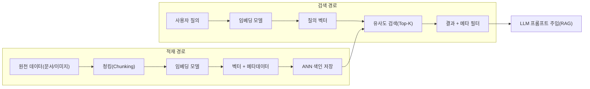
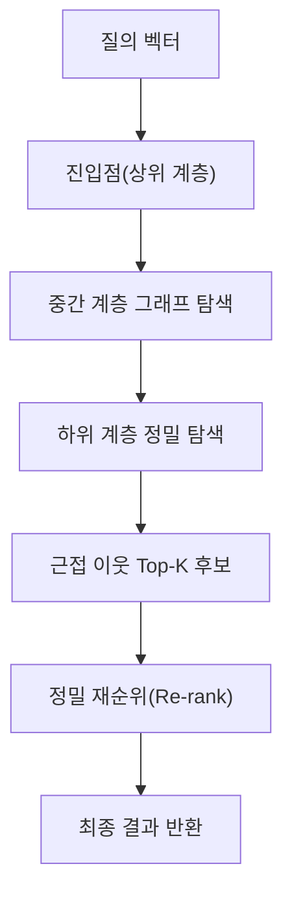

# 벡터 데이터베이스(Vector Database)

## 1. 개요

> **벡터 데이터베이스**란 텍스트·이미지·음성 등 비정형 데이터를 임베딩(Embedding) 모델로 변환한 고차원 벡터를 저장하고, 질의 벡터와의 **의미적 유사도(Similarity)** 를 근사최근접이웃(ANN, Approximate Nearest Neighbor) 탐색으로 빠르게 찾아 반환하는 데이터 관리 시스템이다.

전통적 관계형 데이터베이스는 값의 **정확 일치(Exact Match)** 와 범위 조건에 최적화되어 있어 "이 문장과 의미가 비슷한 문서를 찾아라"와 같은 질의를 처리할 수 없다. 그러나 생성형 AI와 검색증강생성(RAG)이 확산되면서, 자연어 질문의 *의미*에 가까운 지식을 실시간으로 검색해 LLM의 프롬프트에 주입해야 하는 요구가 폭증하였다. 이때 문서·이미지를 수백~수천 차원의 벡터로 표현하면 "의미가 가까운 것"이 곧 "벡터 공간에서 거리가 가까운 것"이 되므로, 대규모 벡터에 대한 고속 유사도 검색 엔진이 필요해졌다. 벡터 데이터베이스는 바로 이 공백을 메우기 위해 등장하였다.

벡터 데이터베이스의 핵심 가치는 세 가지다. 첫째, **의미 기반 검색**으로 키워드가 정확히 일치하지 않아도 문맥적으로 관련된 결과를 찾는다. 둘째, 수억 건 규모의 벡터에서도 밀리초 단위로 응답하도록 **ANN 색인**으로 정확도와 지연시간을 균형 있게 조율한다. 셋째, RAG·추천·이상탐지·중복제거 등 다양한 AI 파이프라인의 **지식 저장소(Knowledge Store)** 역할을 수행한다.

## 2. 동작 원리 및 전체 구조

벡터 데이터베이스는 원천 데이터를 임베딩으로 바꾸는 **적재(Ingestion)** 경로와, 질의를 벡터화해 유사 벡터를 찾는 **검색(Query)** 경로로 나뉜다. 적재 단계에서는 문서를 적절한 크기로 분할(Chunking)한 뒤 임베딩 모델로 벡터화하고, 벡터와 원문·메타데이터를 함께 색인에 저장한다. 검색 단계에서는 사용자 질의를 동일한 임베딩 모델로 벡터화하고 ANN 색인을 탐색해 상위 K개(Top-K) 유사 벡터를 회수한다.

여기서 중요한 원리는 **적재와 검색에서 동일한 임베딩 모델을 사용**해야 한다는 점이다. 서로 다른 모델로 만든 벡터는 좌표계가 달라 거리 비교가 무의미해지기 때문이다. 따라서 임베딩 모델을 교체하면 저장된 벡터 전체를 재계산(Re-indexing)해야 하며, 이는 운영상 큰 비용 요소가 된다.

### 가. 유사도 측정 방식

유사도는 벡터 간 거리로 정의된다. 대표적으로 두 벡터가 이루는 각도의 코사인을 보는 **코사인 유사도**, 벡터 내적을 그대로 쓰는 **내적(Dot Product)**, 좌표 간 직선거리를 보는 **유클리드 거리(L2)** 가 있다. 문서 검색처럼 벡터의 방향(의미)이 중요하고 크기(문서 길이)의 영향을 줄이고 싶을 때는 코사인 유사도가 널리 쓰인다. 임베딩을 정규화하면 코사인 유사도와 내적이 사실상 동일해지므로, 대규모 서비스에서는 계산이 단순한 내적을 선호하기도 한다.

| 측정 방식 | 계산 개념 | 주 사용처 | 특징 |
|---|---|---|---|
| 코사인 유사도 | 벡터 방향 각도 | 문서/문장 검색 | 크기 영향 배제, 방향 중시 |
| 내적(Dot) | 벡터 내적 | 추천, 정규화 임베딩 | 계산 단순, 크기 반영 |
| 유클리드(L2) | 직선거리 | 이미지/좌표 | 절대 거리 민감 |

### 나. ANN 색인 알고리즘

수억 개 벡터를 모두 비교하는 완전탐색(Brute-force)은 정확하지만 느리다. 그래서 약간의 정확도를 희생하는 대신 속도를 극적으로 끌어올리는 ANN 색인을 사용한다. 대표 알고리즘은 그래프 기반의 **HNSW(Hierarchical Navigable Small World)**, 클러스터 분할 기반의 **IVF(Inverted File)**, 벡터를 압축해 메모리를 절약하는 **PQ(Product Quantization)** 이다. HNSW는 계층적 그래프를 따라 이웃을 탐색하여 높은 재현율과 낮은 지연을 동시에 달성해 사실상 업계 표준이 되었으나, 메모리 사용량이 크다는 단점이 있다. IVF는 벡터 공간을 여러 셀로 나눠 질의와 가까운 일부 셀만 탐색하므로 대용량에 유리하고, PQ와 결합(IVF-PQ)하면 메모리를 크게 절감할 수 있어 초대규모 서비스에서 선호된다.

이때 정확도(재현율)와 속도·메모리는 트레이드오프 관계다. HNSW의 `ef_search`(탐색 폭)를 키우면 재현율은 오르지만 지연이 늘고, IVF의 탐색 셀 수(`nprobe`)를 늘려도 마찬가지다. 실무에서는 목표 SLA(예: p99 50ms, 재현율 95%)를 정해 두고 파라미터를 튜닝한다.

### 다. 메타데이터 필터링과 하이브리드 검색

실제 서비스에서는 "2024년 이후 작성된, 보안 카테고리 문서 중 의미가 유사한 것"처럼 벡터 유사도와 정형 조건을 함께 걸어야 한다. 이를 위해 벡터와 함께 저장한 메타데이터로 **사전/사후 필터링(Pre/Post-filtering)** 을 수행한다. 나아가 키워드 정확 일치에 강한 **희소 검색(BM25 등)** 과 의미 검색에 강한 **밀집 벡터 검색**을 결합한 **하이브리드 검색**이 최근 표준으로 자리 잡고 있는데, 고유명사·코드·숫자처럼 임베딩이 취약한 부분을 키워드 검색이 보완하기 때문이다.

## 3. 구축 유형 비교

벡터 검색은 별도의 전용 엔진으로 구축하거나, 기존 데이터베이스의 확장 기능으로 구현할 수 있다. 전용 벡터 DB(예: Pinecone, Milvus, Weaviate, Qdrant)는 대규모 처리와 다양한 색인·필터 기능에 강점이 있으나 시스템이 하나 더 늘어나 운영 복잡도가 커진다. 반대로 관계형 DB의 확장(PostgreSQL의 pgvector 등)은 기존 데이터와 트랜잭션·조인을 함께 쓸 수 있어 도입 장벽이 낮지만, 초대규모·초저지연 요구에서는 전용 엔진에 뒤질 수 있다. 따라서 데이터 규모, 기존 스택, 팀 역량을 함께 고려해 선택해야 한다.

| 구분 | 전용 벡터 DB | RDB 확장(pgvector 등) | 검색엔진 통합(Elasticsearch 등) |
|---|---|---|---|
| 강점 | 초대규모·다양한 ANN | 기존 데이터와 통합·조인 | 키워드+벡터 하이브리드 |
| 약점 | 별도 운영 부담 | 초대규모 성능 한계 | 벡터 기능 상대적 후발 |
| 적합 상황 | 수억 벡터 AI 서비스 | 중소규모·트랜잭션 병행 | 기존 검색 자산 재활용 |

예를 들어 사내 규정 문서 수만 건을 대상으로 하는 RAG 챗봇이라면 pgvector로 시작해 운영을 단순화하는 편이 합리적이지만, 수억 건의 상품·리뷰를 다루는 커머스 추천이라면 IVF-PQ 기반 전용 엔진으로 메모리와 지연을 통제하는 편이 낫다.

## 4. 심화 — RAG 품질과 최신 동향

벡터 데이터베이스의 성패는 곧 RAG 답변 품질로 직결된다. 검색이 부실하면 LLM이 근거 없는 답을 생성(할루시네이션)하므로, 청킹 전략(문단·의미 단위 분할), 임베딩 모델 선택(도메인 적합성), Top-K 개수, 그리고 회수된 후보를 다시 정렬하는 **재순위(Re-ranking)** 모델의 조합이 중요하다. 최근에는 여러 문장을 압축한 단일 벡터가 정보를 잃는 문제를 보완하기 위해, 토큰 단위 다중 벡터로 정밀도를 높이는 **ColBERT형 후기 상호작용(Late Interaction)** 기법과, 요약본으로 검색하고 원문을 반환하는 다단계 검색 전략이 주목받는다. 또한 임베딩 차원을 상황에 따라 잘라 쓰는 **Matryoshka 임베딩**은 저장 비용과 정확도를 유연하게 조절하는 수단으로 확산되고 있다. 표준화 측면에서는 pgvector가 사실상의 오픈 표준으로 자리 잡으며 주요 클라우드 관리형 DB에 폭넓게 탑재되는 흐름이 뚜렷하다.

## 5. 고려사항 및 시사점

기술사 관점에서 벡터 데이터베이스 도입은 단순한 저장소 선택이 아니라 AI 서비스 아키텍처 전반의 트레이드오프를 조율하는 의사결정이다.

- **정확도-성능-비용 삼각 트레이드오프**: HNSW/IVF 파라미터, 벡터 차원, 양자화 수준은 재현율·지연·메모리를 동시에 좌우한다. 목표 SLA와 예산을 먼저 정의하고 벤치마크로 역산하는 것이 바람직하다.
- **임베딩 모델 종속성과 재색인 전략**: 모델 교체는 전체 벡터 재계산을 유발하므로, 무중단 재색인(Blue-Green Index)과 버전 관리 체계를 사전에 설계해야 한다.
- **데이터 거버넌스·보안**: 원문과 임베딩에 개인정보가 포함될 수 있고, 임베딩 역추론(Embedding Inversion)으로 원문이 일부 복원될 위험이 있으므로 접근통제·암호화·마스킹을 벡터 계층까지 확장해야 한다.
- **하이브리드·재순위 병행**: 순수 벡터 검색만으로는 고유명사·수치에 약하므로 키워드 검색과 재순위 모델을 결합해 RAG 품질을 확보한다.
- **운영 관측성**: 재현율·지연·색인 신선도(Freshness)를 지표화해 옵저버빌리티 체계로 상시 모니터링하고, 데이터 증가에 대비한 샤딩·수평 확장 전략을 함께 마련해야 한다.

향후 벡터 검색은 RDB·검색엔진에 기본 기능으로 흡수되어 "특수 시스템"에서 "보편 기능"으로 성숙할 전망이며, 멀티모달 임베딩과 에이전트형 검색의 확산으로 그 중요성은 더욱 커질 것이다.

## 참고자료
- pgvector 프로젝트, https://github.com/pgvector/pgvector
- Malkov & Yashunin, "Efficient and robust approximate nearest neighbor search using HNSW", https://arxiv.org/abs/1603.09320

---
> **한 줄 요약**: 벡터 데이터베이스는 임베딩된 고차원 벡터를 ANN 색인으로 고속 유사도 검색하여, RAG·추천·이상탐지의 의미 기반 지식 저장소 역할을 수행하며 정확도·성능·비용의 트레이드오프 조율이 핵심이다.
