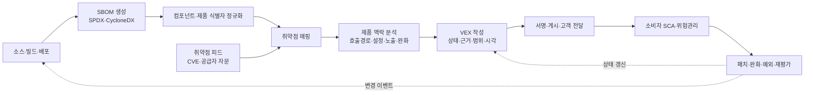
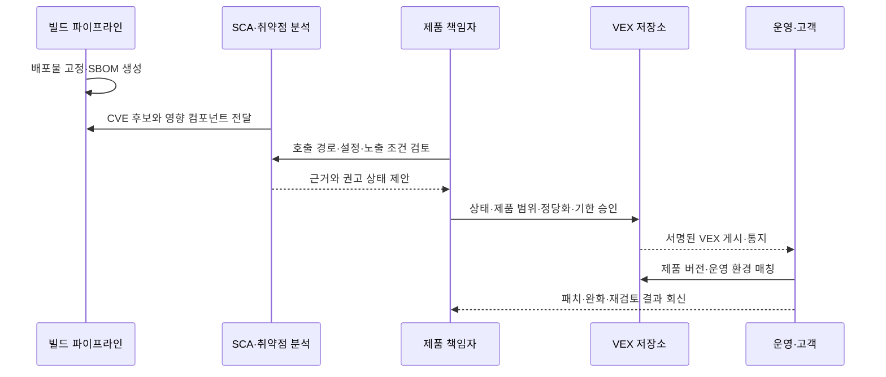

# VEX(Vulnerability Exploitability eXchange) 기반 SBOM 취약점 영향분석과 공급망 대응

## 1. 개요

### 가. 정의

> VEX(Vulnerability Exploitability eXchange)는 특정 소프트웨어 제품과 취약점의 관계를 공급자가 기계 판독 가능한 상태값과 근거로 선언하여, 해당 취약점이 제품에 영향을 주는지와 어떤 조치가 필요한지를 전달하는 보안 자문(advisory) 형식이다.

현대 소프트웨어는 직접 작성한 코드보다 운영체제, 오픈소스 라이브러리, 컨테이너 이미지, 빌드 플러그인, 모델 런타임과 같은 외부 구성요소의 비중이 큰 경우가 많다. 새로운 CVE가 공개되면 SCA 도구는 SBOM과 취약점 데이터베이스를 대조하여 잠재적인 경보를 만든다. 그러나 구성요소가 존재한다는 사실은 취약한 코드 경로가 실제 제품에서 실행된다는 사실과 다르다.

예를 들어 제품에 이미지 변환 라이브러리가 포함되어 있어도 취약한 파서가 비활성화되어 있거나, 공격자가 도달할 수 없는 서버 측 기능에만 사용될 수 있다. 반대로 런타임 설정 때문에 평소에는 보이지 않던 플러그인이 외부 입력을 처리한다면 버전 숫자만으로는 충분한 판단을 내릴 수 없다. VEX는 이 간극을 “구성요소가 있는가”에서 “이 제품 맥락에서 취약점이 어떤 상태인가”로 확장한다.

CISA는 VEX를 제품이 알려진 취약점의 영향을 받는지 표시하는 보안 자문으로 설명하고, SBOM과 함께 사용하면 취약점의 실제 영향을 더 빠르게 평가할 수 있다고 제시한다([CISA SBOM](https://www.cisa.gov/sbom)). 따라서 VEX는 SBOM을 대체하는 목록이 아니라, SBOM·취약점 정보·제품 분석 결과를 연결하는 영향 판단 계층이다.

### 나. 등장 배경과 필요성

첫째, 취약점 경보의 규모가 수동 검토 능력을 넘어섰다. 하나의 제품이 수백 개의 전이 의존성을 가지면 공개 취약점 하나가 여러 버전과 배포판에 걸쳐 반복 경보로 나타난다. 모든 경보를 동일한 긴급도로 처리하면 보안팀은 실제 인터넷 노출 취약점보다 악용 불가능한 경보에 시간을 더 쓰게 된다.

둘째, 소프트웨어 공급망은 한 조직의 경계를 넘어간다. 오픈소스 프로젝트는 라이브러리의 취약점을 알고 있어도 그 라이브러리를 포함한 최종 제품의 실제 호출 경로를 알기 어렵다. 제품 공급자는 자신의 빌드·설정·호출 구조를 분석할 수 있으므로, 하위 컴포넌트의 취약점이 완성품에 미치는 영향을 제품 단위로 설명해야 한다.

셋째, 고객은 “CVE가 있다”라는 목록보다 “우리 제품을 지금 어떻게 운영해야 하는가”를 필요로 한다. 영향을 받으면 패치나 완화책이 필요하고, 영향을 받지 않으면 그 판단 근거와 재검토 조건이 필요하다. VEX는 이 결정을 사람에게 읽히는 설명과 도구가 처리하는 상태값으로 동시에 전달한다.

### 다. 목표와 비목표

VEX의 목표는 취약점별 제품 영향 상태를 신뢰 가능한 식별자와 근거로 표현하고, 공급자·운영자·감사자가 같은 사실을 재사용하도록 만드는 것이다. 이 목표를 달성하려면 제품 버전 범위, 취약점 식별자, 상태 변경 시각, 작성 주체, 조사 근거가 서로 추적 가능해야 한다.

반면 VEX는 취약점의 존재를 숨기기 위한 면죄부가 아니다. “NOT AFFECTED”라고 표시하려면 제품 구성, 호출 가능성, 완화 통제와 같은 근거가 있어야 하며, 그 근거가 바뀌면 상태를 다시 평가해야 한다. 또한 VEX는 패치 관리 시스템이나 위험 수용 결재를 자동으로 대신하지 않는다.

## 2. 핵심 개념과 전체 구조

### 가. SBOM·취약점 정보·VEX의 관계

SBOM은 제품을 구성하는 컴포넌트와 의존관계를 설명한다. 취약점 데이터는 특정 컴포넌트나 코드에 알려진 결함이 있다는 사실, 심각도, 영향을 받는 버전과 수정 버전을 설명한다. VEX는 그 두 정보를 제품의 실제 빌드·설정·실행 맥락에 대입한 뒤, 제품 수준의 영향 상태를 선언한다.

이 세 계층을 분리해야 책임이 명확해진다. SBOM이 누락되면 무엇을 평가해야 하는지 알 수 없고, 취약점 정보가 낡으면 위험 신호가 늦어진다. VEX 분석이 없으면 모든 잠재 경보가 동일하게 보이며, VEX의 근거가 없으면 소비자는 공급자의 선언을 검증할 수 없다.

| 계층 | 핵심 질문 | 대표 산출물 | 주된 책임 |
|---|---|---|---|
| 구성 투명성 | 제품에 무엇이 들어 있는가? | SBOM, 의존관계, 해시 | 빌드·제품 공급자 |
| 취약점 지식 | 어떤 결함이 어떤 버전에 존재하는가? | CVE, CWE, CVSS, 수정 버전 | 취약점 기관·공급자 |
| 영향 판단 | 이 제품에서 실제로 영향을 받는가? | VEX statement, 상태 근거 | 제품 공급자·운영자 |
| 대응 실행 | 무엇을 언제 조치할 것인가? | 티켓, 패치, 완화, 예외 승인 | 서비스 운영·위험 소유자 |

이 관계에서 VEX를 단순히 “취약점 목록의 필터”로 보면 안 된다. 필터는 경보를 지울 수 있지만, VEX는 왜 그 경보를 줄였는지와 어떤 제품 범위에 적용되는지를 남긴다. 따라서 VEX는 취약점 관리의 증적이자 공급망 커뮤니케이션 계약으로 기능한다.

### 나. VEX 참조 아키텍처

위 구조의 중심은 제품 맥락 분석이다. SBOM과 취약점 데이터의 단순 조인은 “가능한 후보”를 만들 뿐이며, 실제 VEX 상태는 제품의 코드 경로와 배포 조건을 확인한 뒤 결정해야 한다. 같은 라이브러리 버전이라도 기능 플래그, 컴파일 옵션, 운영체제 패치, 네트워크 노출에 따라 영향이 달라질 수 있다.

### 다. 제품과 취약점의 관계를 표현하는 statement

VEX의 기본 단위는 특정 제품, 특정 취약점, 상태, 그리고 그 판단을 만든 주체와 시점의 결합이다. 제품은 이름만 쓰는 것이 아니라 버전, 패키지 URL(PURL), 해시, 공급자 식별자 등 소비자가 동일 대상을 찾을 수 있는 식별자를 사용해야 한다. 취약점도 CVE에만 의존하지 않고 공급자 자문 ID나 다른 표준 식별자를 함께 사용할 수 있다.

하나의 문서가 여러 statement를 포함할 수 있지만, 각 statement의 적용 범위는 모호하지 않아야 한다. “제품 전체가 안전하다”처럼 범위가 넓은 문장보다 “제품 4.2.1의 특정 구성에서 CVE-XXXX가 NOT AFFECTED”처럼 제품·버전·취약점의 교차점을 명시하는 편이 검증과 자동화에 유리하다.

statement에는 상태만큼이나 시간성이 중요하다. 제품이 재빌드되거나 설정이 바뀌면 이전의 NOT AFFECTED 판단이 더 이상 맞지 않을 수 있다. 그러므로 문서 발행일, 수정일, 상태의 유효 범위, 다음 재검토 조건을 관리하고, 동일 제품에 대한 최신 문서가 무엇인지 소비자가 판단할 수 있게 해야 한다.

## 3. 상태 의미와 데이터 모델

### 가. 네 가지 핵심 상태

CISA가 정리한 대표 상태는 NOT AFFECTED, AFFECTED, FIXED, UNDER INVESTIGATION이다([CISA VEX Use Cases](https://www.cisa.gov/sites/default/files/publications/VEX_Use_Cases_Document_508c.pdf)). 상태 이름의 철자를 그대로 저장하는 것보다, 조직의 도구가 그 상태를 어떤 조치로 연결할지까지 정의해야 한다.

| 상태 | 의미 | 기본 조치 | 잘못된 사용 |
|---|---|---|---|
| NOT AFFECTED | 제품 맥락에서 취약점의 영향을 받지 않음 | 경보를 종결하되 근거·재평가 조건 보존 | 근거 없이 경보를 삭제 |
| AFFECTED | 취약점이 제품에 영향을 주며 조치가 필요함 | 패치·업그레이드·완화·노출 차단 | CVSS만 보고 제품 영향 단정 |
| FIXED | 해당 제품 버전 또는 빌드에 수정이 반영됨 | 수정 버전으로 배포하고 이전 버전 종료 | 소스 수정만 하고 배포물 미검증 |
| UNDER INVESTIGATION | 영향 여부를 아직 확정하지 못함 | 조사 기한·임시 완화·추적 티켓 설정 | 조사 중 상태를 장기 종결로 사용 |

NOT AFFECTED는 “취약점이 존재하지 않는다”와 다르다. 취약한 컴포넌트가 SBOM에 존재하더라도 제품이 해당 함수나 취약 경로를 사용하지 않는다는 의미일 수 있다. 반대로 AFFECTED는 반드시 원격 코드 실행이 확인되었다는 뜻이 아니라, 제품 조건에서 영향 가능성이 있고 대응이 필요하다는 판단이다.

FIXED도 제품이 영원히 안전하다는 보증이 아니다. 수정 버전이 새로운 취약점을 포함할 수 있고, 고객이 취약한 이전 이미지나 캐시를 계속 배포할 수 있다. 따라서 수정 상태는 제품 릴리스 식별자와 배포 검증 결과에 연결해야 한다.

UNDER INVESTIGATION은 위험을 숨기는 상태가 아니라 불확실성을 명시하는 상태다. 소비자는 이 상태를 만나면 심각도, 외부 노출, 악용 정황을 기준으로 임시 완화나 격리를 적용해야 한다. 공급자는 조사 완료 목표일과 후속 문서 발행 조건을 제시해야 한다.

### 나. NOT AFFECTED의 정당화

NOT AFFECTED의 품질은 상태명보다 정당화 사유에 달려 있다. 취약한 코드를 제품에 포함하지 않았거나, 영향을 받지 않는 버전으로만 빌드하거나, 취약한 기능을 컴파일·설정에서 제외했거나, 해당 코드에 도달할 수 없는 구조라면 서로 다른 통제와 재검토 조건이 필요하다.

대표적인 정당화 관점은 다음과 같다.

1. **구성요소 부재**: 제품 SBOM의 실제 배포 산출물에 취약 컴포넌트가 없다.
2. **취약 기능 미사용**: 컴포넌트는 존재하지만 취약한 함수·모듈·프로토콜이 빌드나 런타임에서 사용되지 않는다.
3. **도달 불가**: 공격자가 취약 코드 경로에 입력을 전달할 수 없도록 권한·네트워크·호출 구조가 제한된다.
4. **완화 적용**: 패치가 아니더라도 설정, 샌드박스, 입력 검증, 격리와 같은 통제가 취약점의 영향을 제거하거나 허용 가능한 수준으로 낮춘다.
5. **영향 범위 불일치**: 취약점이 요구하는 운영체제·아키텍처·빌드 옵션이 제품 환경과 다르다.

정당화는 “개발자가 확인했다” 정도로 끝내지 말고, 분석 도구 버전, 테스트 결과, 코드 경로, 설정 파일, 제품 버전과 같은 증거를 참조해야 한다. 또한 완화에 의존하는 NOT AFFECTED는 완화 통제가 제거되거나 설정이 바뀔 때 자동으로 재검토되도록 이벤트를 연결해야 한다.

### 다. 최소 데이터 요소

CISA의 2023년 최소 요구사항 문서는 VEX 형식과 구현에 독립적으로 문서 메타데이터, 제품 정보, 취약점 정보, 제품 상태를 정의한다([CISA Minimum Requirements for VEX](https://www.cisa.gov/sites/default/files/2023-04/minimum-requirements-for-vex-508c.pdf)). 조직은 이 최소 요소에 내부 통제·서명·근거 필드를 추가하되, 상호운용성을 위해 핵심 의미를 임의로 바꾸지 않아야 한다.

문서 메타데이터에는 형식 식별자, 문서 식별자, 작성자와 역할, 타임스탬프, 문서 버전이 들어간다. 제품 정보에는 공급자·제품명·버전뿐 아니라 가능하면 PURL, CPE, 해시, 제품군과 하위 구성요소 식별자를 넣어 대상의 모호성을 줄인다.

취약점 정보에는 CVE 또는 공급자 취약점 ID, 취약점 설명, 관련 참고자료가 들어간다. 제품 상태에는 네 가지 상태 중 하나와 상태가 적용되는 제품 범위가 들어가며, 상태를 결정한 근거와 권고 조치가 함께 있어야 소비자가 자동화와 사람 검토를 모두 수행할 수 있다.

| 데이터 영역 | 필수적으로 답해야 할 질문 | 운영상 보강할 정보 |
|---|---|---|
| 문서 메타데이터 | 누가 언제 어떤 문서를 만들었는가? | 서명, 도구 버전, 문서 폐기·대체 관계 |
| 제품 | 어느 제품·버전·빌드에 적용되는가? | PURL, 해시, 배포 채널, 환경 프로파일 |
| 취약점 | 어떤 결함을 평가했는가? | CVE·공급자 ID·CVSS·악용 정보 |
| 상태 | 영향을 받는가, 수정되었는가? | 정당화, 완화, SLA, 재검토 조건 |
| 추적성 | 어떤 근거로 판단했는가? | 테스트·코드 분석·승인 티켓·감사 로그 |

## 4. 포맷·표준·상호운용성

### 가. 포맷은 표현 방식이고 의미는 분리해야 한다

VEX는 하나의 파일 포맷만을 뜻하지 않는다. 같은 제품 영향 상태를 CSAF VEX 프로파일, OpenVEX, CycloneDX, SPDX Security Profile 등으로 표현할 수 있다. 따라서 특정 도구의 JSON 스키마에 종속되기 전에 제품·취약점·상태·근거라는 의미 모델을 조직 내부에 정의해야 한다.

OpenVEX는 VEX 최소 요구사항을 충족하도록 설계된 가볍고 임베드 가능한 구현이며, statement를 제품·취약점·상태의 결합으로 다룬다([OpenVEX specification](https://github.com/openvex/spec/blob/main/OPENVEX-SPEC.md)). 다만 공식 저장소가 명시하는 것처럼 사양의 성숙도와 도구 지원 범위를 확인한 뒤 운영 표준으로 채택해야 한다.

CycloneDX는 SBOM과 공급망 정보를 함께 표현하는 확장 가능한 모델에서 VEX 기능을 제공하고, 취약점이 특정 제품 맥락에서 실제로 악용 가능한지를 전달하는 데 초점을 둔다([CycloneDX VEX](https://cyclonedx.org/capabilities/vex/)). SPDX 3 계열은 Security Profile에서 취약점과 제품의 영향·수정 관계를 표현할 수 있으므로, 기존 SPDX 자산과 VEX를 통합하려는 조직이 검토할 수 있다([SPDX Security](https://spdx.dev/learn/areas-of-interest/security/)).

CSAF는 보안 자문을 교환하기 위한 표준화된 문서 구조와 프로파일을 제공하며, 공급자가 취약점 공지와 제품 상태를 기업 간에 배포할 때 적합하다. 어떤 포맷을 고르든 공급자·소비자 도구가 동일한 제품 식별자와 상태 의미를 사용하고, 변환 과정에서 정당화나 시간 정보를 잃지 않는지가 핵심이다.

### 나. VEX 생성·소비 파이프라인

생성 단계에서는 빌드 산출물의 해시와 SBOM을 함께 고정해야 한다. 소스 저장소의 의존성 선언만 보고 VEX를 작성하면 패키지 매니저의 해석 결과, 빌드 플래그, 컨테이너 레이어, 운영체제 패키지가 빠질 수 있다. 소비 단계에서는 VEX가 적용되는 제품 식별자와 현재 배포 버전을 먼저 매칭하고, 매칭되지 않는 문서를 임의로 적용하지 않아야 한다.

서명은 문서가 특정 공급자로부터 발행되었고 전송 중 변조되지 않았음을 확인하는 데 도움을 준다. 그러나 서명은 상태 판단의 정확성까지 보증하지 않는다. 소비자는 서명 검증과 함께 발행 주체의 신뢰 정책, 문서 최신성, 근거의 충분성, 제품 버전 범위를 평가해야 한다.

### 다. 충돌과 우선순위

한 제품에 대해 오픈소스 프로젝트, 운영체제 공급자, 애플리케이션 공급자가 서로 다른 VEX를 발행할 수 있다. 이때 가장 넓은 범위의 “NOT AFFECTED”를 무조건 우선하면 위험하다. 제품 공급자가 최종 빌드·설정까지 알고 있다면 최종 제품 자문을 우선하되, 하위 공급자의 근거와 상태 변경 이력도 보존해야 한다.

조직은 문서 우선순위, 제품 식별자 일치 조건, 최신성 판단, 충돌 발생 시 수동 검토 절차를 정책으로 정해야 한다. 예를 들어 제품 해시가 일치하는 공급자 서명을 가장 높은 신뢰도로 보고, 버전 문자열만 일치하는 외부 선언은 후보 정보로 취급할 수 있다.

## 5. 운영 프로세스와 구현 전략

### 가. 탐지에서 상태 결정까지

1. **자산 기준선 확정**: 현재 운영 중인 제품·버전·배포 이미지·설정 프로파일을 식별한다.
2. **SBOM 확보**: 빌드 시 생성한 SBOM을 배포물 해시와 연결하고, 전이 의존성과 운영체제 패키지를 포함한다.
3. **취약점 후보 생성**: CVE, 공급자 자문, 악용 정황, 내부 테스트 결과를 후보로 수집한다.
4. **영향 범위 매핑**: 취약 컴포넌트의 실제 제품 포함 여부와 버전 범위를 확인한다.
5. **제품 맥락 분석**: 취약 함수 호출, 입력 도달성, 권한, 네트워크 노출, 완화 통제를 검토한다.
6. **상태와 조치 결정**: 네 가지 상태 중 하나를 선택하고 패치·완화·조사 기한을 결정한다.
7. **승인과 발행**: 제품 보안 책임자가 근거를 검토하고 서명 가능한 VEX를 발행한다.
8. **소비자 통지와 재평가**: 고객·운영 시스템에 전달하고 새 빌드·설정·취약점 정보가 오면 다시 평가한다.

각 단계의 산출물을 연결해야 감사에서 “왜 이 취약점을 닫았는가”를 설명할 수 있다. 특히 상태 결정 전에 제품의 배포 버전을 고정하지 않으면 테스트한 코드와 고객이 실행한 코드가 달라질 수 있다. 기술사 관점에서는 VEX를 문서 작성 업무가 아니라 DevSecOps의 의사결정 흐름으로 설계하는 것이 핵심이다.

### 나. 자동화와 사람 검토의 분담

자동화하기 좋은 영역은 SBOM 생성, PURL 정규화, 취약점 후보 매칭, 동일 문서의 배포, 서명 검증, 상태 변경 통지다. 반면 호출 경로의 실질적 도달성, 업무 영향, 보상 통제, 위험 수용은 정적 분석 결과만으로 확정하기 어려워 사람의 검토가 필요하다.

도구가 “사용되지 않는 코드”라고 표시했다고 즉시 NOT AFFECTED로 결정하지 말고, 런타임 플러그인·리플렉션·동적 로딩·스크립트 확장과 같은 우회 경로를 확인해야 한다. 자동화는 판단자를 제거하는 것이 아니라 반복 작업을 줄이고, 판단자가 근거가 필요한 부분에 집중하도록 만드는 방식이어야 한다.

운영 플랫폼에는 VEX 상태를 취약점 티켓의 증거로 표시하되, 원본 문서와 서명 검증 결과를 함께 보관한다. 상태가 FIXED로 바뀌면 패치 티켓이 자동 생성되고, NOT AFFECTED의 근거가 만료되면 UNDER INVESTIGATION으로 되돌리는 정책도 설계할 수 있다.

### 다. 지표와 서비스 수준

VEX 도입 성과를 발행 문서 수로만 평가하면 형식만 늘어날 수 있다. 다음과 같은 지표를 제품 위험과 함께 관리하는 것이 적절하다.

| 지표 | 의미 | 해석 시 주의점 |
|---|---|---|
| 경보에서 상태 결정까지 시간 | 조사·판단의 신속성 | 모든 경보를 빠르게 닫는 것이 목표는 아님 |
| 근거 포함 상태 비율 | 선언의 설명 가능성 | 템플릿 복사보다 증거 링크의 유효성을 점검 |
| 적용 제품 식별 성공률 | 소비자가 문서를 자동 매칭하는 정도 | 버전명만으로 매칭하면 오탐 가능 |
| AFFECTED 조치 완료율 | 실제 위험 감소 | 완화만 하고 패치가 지연되는지 확인 |
| 오래된 UNDER INVESTIGATION 비율 | 불확실성의 누적 | 기한·소유자·임시 통제를 연결해야 함 |
| VEX 갱신 누락률 | 변경 이벤트 대응 수준 | 릴리스·설정·새 CVE 이벤트와 대조 |

서비스 수준은 취약점 심각도와 외부 노출을 기준으로 차등화한다. 인터넷 노출 인증 우회 취약점은 짧은 조사·완화 목표를 부여하고, 내부 배치 작업에서만 접근 가능한 저위험 항목은 분석 근거를 남기되 일정 수준의 처리 시간을 허용할 수 있다. 중요한 것은 상태값이 대응 우선순위와 실제 티켓으로 이어지는 것이다.

## 6. 비교와 적용 사례

### 가. SBOM·VEX·SCA·CSAF 비교

SBOM은 구성 투명성, SCA는 구성요소와 취약점의 자동 대조, VEX는 제품 맥락의 영향 상태, CSAF는 보안 자문 교환의 구조를 중심으로 한다. 서로 대체 관계로 배치하면 어느 한 계층의 부족을 다른 계층이 메우지 못한다.

| 구분 | SBOM | SCA | VEX | CSAF |
|---|---|---|---|---|
| 주된 목적 | 구성요소와 관계 공개 | 후보 취약점 탐지·우선순위 | 제품 영향 상태와 근거 전달 | 자문 문서 교환 표준 |
| 질문 | 무엇이 들어 있는가? | 어떤 취약점과 매칭되는가? | 실제 제품에 영향을 주는가? | 자문을 어떻게 배포·해석할까? |
| 주요 산출물 | SPDX·CycloneDX 문서 | 경보·티켓·리포트 | 상태 statement | CSAF 문서·프로파일 |
| 한계 | 영향 여부를 단정하지 못함 | 코드 도달성과 업무 맥락 부족 | 정확한 SBOM·근거가 필요 | 제품 분석 자체를 수행하지 않음 |

예를 들어 SCA가 Log4j의 CVE를 발견하면 경보를 만들지만, VEX는 제품이 해당 JNDI 기능을 사용하지 않는지 또는 패치된 배포판인지 설명한다. 반대로 VEX가 AFFECTED를 발행하면 SCA 경보의 우선순위와 패치 티켓이 실제 조치로 연결되어야 한다.

### 나. 사례 1: 상용 SaaS 공급자

상용 SaaS 공급자가 매주 컨테이너 이미지를 빌드한다고 가정한다. 빌드마다 이미지 다이제스트와 SBOM을 저장하고, 새 CVE가 나오면 SCA가 영향을 받을 수 있는 이미지와 패키지를 찾는다. 제품 보안팀은 운영 설정, 네트워크 경로, 호출 테스트를 확인하여 VEX를 작성하고 고객 포털에 최신 문서를 게시한다.

이때 고객은 이미지 태그가 아니라 다이제스트와 제품 릴리스 식별자를 기준으로 VEX를 매칭해야 한다. 이미지 태그가 재사용되면 “FIXED” 문서가 이전 이미지에 잘못 적용될 수 있다. 공급자는 새 이미지가 배포되면 이전 VEX의 적용 범위를 종료하고, 고객에게 교체 대상과 마감일을 통지해야 한다.

### 다. 사례 2: 금융기관의 내부 오픈소스 플랫폼

금융기관이 공통 Java 플랫폼을 여러 계열사 서비스에 배포한다고 하자. 동일한 라이브러리를 사용하더라도 서비스마다 공개 API, 네트워크 경로, 활성화 모듈이 다르다. 중앙 보안팀이 하나의 VEX를 모든 서비스에 강제하면 특정 서비스의 실제 노출을 놓칠 수 있다.

따라서 중앙 플랫폼은 공통 컴포넌트·패치 정보와 기본 분석을 제공하고, 각 서비스 소유자는 자신의 실행 프로파일에 대한 추가 statement를 작성하는 계층형 모델이 적절하다. “도달 불가” 정당화는 서비스별 API 명세와 방화벽·권한 설정이 바뀔 때 자동 재평가해야 한다.

### 라. 사례 3: 임베디드·의료기기 제품

임베디드 제품은 현장에 설치된 버전이 오래 유지되고, 업데이트가 규제 승인이나 안전성 시험과 연결될 수 있다. 이 경우 AFFECTED 취약점을 발견해도 즉시 전체 펌웨어를 교체하기 어렵다. VEX는 영향받는 모델과 펌웨어 버전을 구분하고, 패치 전까지 비활성화·네트워크 격리·사용자 안내 같은 완화책을 전달하는 수단이 된다.

의료기기와 산업장비에서는 NOT AFFECTED 판단도 안전 기능과 상호작용할 수 있으므로, 보안팀 단독 판단보다 제품 안전·품질·규제 담당자의 승인을 포함해야 한다. 상태 문서는 제품 수명주기 동안 유지되어야 하며, 단종 모델이라고 해서 고객에게 필요한 보안 정보를 삭제해서는 안 된다.

## 7. 심화: 최신 동향과 출제 연계

### 가. SBOM 소비 중심에서 증거 기반 위험관리로

CISA의 SBOM 자료는 SBOM이 구성요소 목록을 제공하고 VEX가 그 목록에 대한 취약점 영향 맥락을 보완한다고 설명한다([CISA SBOM FAQ](https://www.cisa.gov/sites/default/files/2024-07/SBOM%20FAQ%202024.pdf)). 최근 실무의 방향은 SBOM을 제출하는 데서 끝나지 않고, 공급자와 소비자가 동일한 식별자·상태·근거를 자동 교환하는 쪽으로 이동하고 있다.

NIST의 소프트웨어 공급망 지침도 공급자가 취약점 영향 정보를 자동화되고 기계 판독 가능한 자문 형식으로 제공할 수 있어야 한다는 방향을 제시한다([NIST Software Security in Supply Chains](https://www.nist.gov/itl/executive-order-14028-improving-nations-cybersecurity/software-supply-chain-security-guidance-23)). 따라서 기술사는 VEX를 도구 하나의 기능이 아니라 조달 요구사항, 제품 보안 정책, 사고 대응, 공급자 계약을 잇는 거버넌스 요소로 서술할 수 있다.

### 나. 예상 답안 구성과 연계 주제

시험 답안에서는 “SBOM은 목록, VEX는 영향 상태”라는 대비만 쓰면 얕다. 좋은 답안은 구성 투명성의 한계, 제품 맥락 분석, 상태 정당화, 포맷 상호운용성, 서명·감사, 자동화와 사람 검토의 경계를 순서대로 제시한다. 마지막에는 VEX가 잘못되거나 늦게 갱신될 때의 공급망 위험과 이를 줄이는 실행 전략을 기술사 관점에서 연결해야 한다.

연계 가능한 주제는 SBOM·SCA·DevSecOps·CSAF·제로 트러스트·소프트웨어 공급망 보안·취약점 관리·조달 보안이다. 특히 VEX는 SBOM과 중복되는 것이 아니라 SBOM의 “구성 사실”을 제품의 “영향 판단”으로 변환하는 층이라는 점을 강조하면 개념 간 관계가 선명해진다.

## 8. 고려사항 및 시사점

### 가. 식별자 정합성

제품명과 버전 문자열은 조직마다 다르게 표기될 수 있으므로 PURL, 해시, CPE, 공급자 식별자를 함께 관리한다. 식별자가 어긋나면 올바른 VEX도 소비자의 SCA와 매칭되지 않아 경보가 남거나 잘못 닫힌다. 식별자 표준화는 기술 문제가 아니라 공급자 계약과 릴리스 관리 정책의 일부다.

### 나. 근거와 설명 가능성

NOT AFFECTED와 FIXED는 특히 근거가 중요하다. 코드 분석 결과, 테스트 케이스, 설정, 패치 커밋, 배포 이미지 다이제스트를 감사 가능한 링크로 남기고, 근거가 사라지지 않도록 보존 정책을 둔다. 근거가 없는 상태 자동 닫기는 단기 지표를 개선하지만 장기 신뢰를 훼손한다.

### 다. 최신성·수명주기

VEX는 발행 후에도 제품 릴리스, 설정, 신규 악용 정보, 취약점 정정에 따라 바뀔 수 있다. 문서의 발행일과 수정일뿐 아니라 적용 제품 범위, 대체 문서, 만료 조건을 관리하고, 오래된 UNDER INVESTIGATION을 자동 경보한다. 단종 제품도 지원 계약과 규제 요구에 맞춰 문서 보존과 통지를 설계해야 한다.

### 라. 공급자와 소비자의 책임 분리

공급자는 제품 맥락의 분석과 정확한 상태 선언을 책임지고, 소비자는 자신의 배포 설정과 노출 조건을 책임진다. 공급자 VEX가 NOT AFFECTED라고 해도 소비자가 취약한 다른 패키지나 커스텀 설정을 추가했다면 그 판단을 그대로 확장할 수 없다. 계약서에 문서 형식·제출 시점·상태 변경 통지·사고 시 협력 범위를 명시한다.

### 마. 보안성과 신뢰

VEX 저장소는 공급망 보안의 핵심 자산이므로 문서 변조·재생 공격·권한 오남용을 방어해야 한다. 서명, 전송 암호화, 접근통제, 문서 버전, 폐기·대체 이력, 감사 로그를 적용하되, 공개 VEX에는 불필요한 내부 경로와 민감한 운영정보를 노출하지 않는다.

### 바. 자동화의 한계

정적 분석이 통과했다고 해서 동적 로딩·리플렉션·플러그인·운영자 설정까지 안전하다고 단정할 수 없다. 자동화는 후보 생성과 반복 매칭에 우선 사용하고, 제품의 업무 맥락과 공격 도달성은 보안·개발·운영 담당자의 검토로 보완한다. 자동으로 상태를 닫는 정책에는 예외 조건과 주기적 샘플 감사를 둔다.

### 사. 위험 기반 우선순위

CVSS 점수만으로 대응 순서를 정하면 자산 중요도와 실제 노출을 놓칠 수 있다. 인터넷 노출, 인증 필요 여부, 악용 코드 공개, 데이터 민감도, 완화 가능성, 복구 비용을 함께 평가하고 VEX 상태를 티켓 우선순위와 연결한다. VEX는 위험을 없애는 문서가 아니라 제한된 대응 자원을 더 정확히 배분하게 하는 판단 자료다.

### 아. 전환 전략

처음부터 모든 제품에 완벽한 VEX를 요구하기보다 인터넷 노출 제품과 핵심 공급망부터 기준선을 만든다. 빌드 파이프라인에서 SBOM을 자동 생성하고, 상위 심각도 경보에 대해 근거가 있는 VEX를 시범 발행한 뒤, 포맷·식별자·승인·SLA를 표준화한다. 이후 조달과 고객 포털, 사고 대응에 연계하면 문서가 실제 운영 가치로 전환된다.

## 참고자료

1. [CISA Software Bill of Materials (SBOM)](https://www.cisa.gov/sbom)
2. [CISA Minimum Requirements for Vulnerability Exploitability eXchange (VEX)](https://www.cisa.gov/sites/default/files/2023-04/minimum-requirements-for-vex-508c.pdf)
3. [CISA Vulnerability Exploitability eXchange (VEX) – Use Cases](https://www.cisa.gov/sites/default/files/publications/VEX_Use_Cases_Document_508c.pdf)
4. [CISA SBOM FAQ 2024](https://www.cisa.gov/sites/default/files/2024-07/SBOM%20FAQ%202024.pdf)
5. [NIST Software Security in Supply Chains](https://www.nist.gov/itl/executive-order-14028-improving-nations-cybersecurity/software-supply-chain-security-guidance-23)
6. [OpenVEX Specification](https://github.com/openvex/spec/blob/main/OPENVEX-SPEC.md)
7. [CycloneDX VEX Capabilities](https://cyclonedx.org/capabilities/vex/)
8. [SPDX Security Profile](https://spdx.dev/learn/areas-of-interest/security/)

---

> **한 줄 요약**: VEX는 SBOM이 발견한 취약점 후보를 제품·버전·실행 맥락에 대입해 NOT AFFECTED·AFFECTED·FIXED·UNDER INVESTIGATION 상태와 근거로 전달하고, 공급망의 탐지·판단·대응·재평가를 연결하는 기계 판독형 보안 자문이다.
