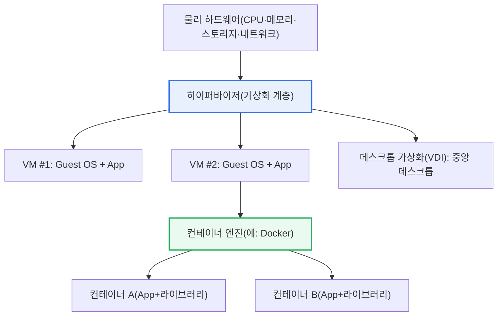
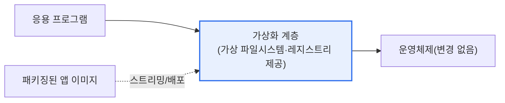

# 가상화(Virtualization)

## 1. 개요

### 가. 정의

> **가상화**란 물리적 자원(CPU·메모리·스토리지·네트워크·OS·애플리케이션)을 **논리적으로 추상화하여, 하나의 물리 자원을 여럿처럼 나눠 쓰거나 여러 물리 자원을 하나처럼 묶어 쓰게** 하는 기술이다. 자원 활용률(utilization)을 높이고, 자원을 필요에 따라 즉시 늘리거나 옮길 수 있는 유연한 운영을 가능케 한다.

가상화의 본질은 '**물리적 실체와 논리적 사용을 분리(decoupling)하는 것**'이다. 전통적 환경에서는 애플리케이션이 특정 서버·OS에 강하게 묶여 있어, 서버 한 대에 서비스 하나를 올리는 방식이 일반적이었다. 이 경우 대부분의 서버가 평상시 자원의 10~20% 남짓만 쓰고 나머지는 놀리는 낭비가 발생했고, 장애 시 다른 서버로 옮기기도 어려웠다. 가상화는 이 물리적 종속을 끊어, 한 대의 물리 서버 위에 여러 개의 가상 서버(VM)를 올려 놀던 자원을 알뜰히 나눠 쓰고, 필요에 따라 자원을 즉시 재배분하거나 다른 물리 서버로 이동(live migration)할 수 있게 한다.

이 추상화는 서버에만 국한되지 않는다. 애플리케이션·데스크톱·네트워크·스토리지 등 IT 스택의 여러 계층에서 각기 다른 방식으로 이뤄진다. 예컨대 응용 프로그램 가상화는 프로그램을 OS에 직접 설치하지 않고 격리된 실행 환경에서 구동해 설치 충돌 없이 어디서나 실행되게 하고, 네트워크 가상화(SDN·NFV)는 물리 네트워크 위에 소프트웨어로 정의된 논리 네트워크를 얹는다. 가상화가 중요한 이유는 그것이 **클라우드 컴퓨팅의 근간 기술**이기 때문이다. "필요한 만큼 나눠 쓰고, 부하에 따라 유연하게 늘리고 옮긴다"는 클라우드의 탄력성(elasticity)은 근본적으로 가상화의 자원 분할·이동 능력에서 출발한다.

### 나. 등장 배경과 필요성

가상화가 부상한 배경에는 몇 가지 구조적 요인이 있다. 첫째, **자원 낭비의 문제**다. 서버당 서비스 하나 방식은 안정성은 있으나 자원 활용률이 극히 낮아, 데이터센터 규모가 커질수록 전력·공간·관리 비용이 기하급수적으로 늘었다. 가상화는 여러 워크로드를 한 물리 서버에 밀도 있게 통합(consolidation)해 이 낭비를 줄인다.

둘째, **민첩성(agility)에 대한 요구**다. 사업 환경이 빠르게 변하면서 새로운 서버·환경을 몇 주가 아니라 몇 분 안에 준비해야 할 필요가 커졌다. 물리 서버는 조달·설치에 시간이 걸리지만, 가상 서버는 이미지 복제로 즉시 생성·삭제할 수 있어 프로비저닝 속도를 획기적으로 높였다.

셋째, **환경 종속과 설치 충돌 문제**다. 프로그램이 특정 OS 환경에 강하게 묶이면 "내 PC에서는 되는데 저 PC에서는 안 된다"는 이식성 문제가 끊임없이 발생한다. 응용 프로그램 가상화와 컨테이너는 실행 환경 자체를 함께 패키징함으로써 이 문제를 해결하며, 이는 DevOps·클라우드 네이티브 흐름의 기반이 되었다.

### 다. 일반적인 운영체제의 프로그램 동작 방식

가상화의 장점을 이해하려면 먼저 일반 OS에서 프로그램이 어떻게 동작하는지 대비해 볼 필요가 있다. 일반 OS에서 프로그램은 설치 과정에서 OS가 관리하는 자원(CPU·메모리·파일시스템·레지스트리·라이브러리)에 직접 연결되고, 설정 파일과 공유 라이브러리를 시스템 곳곳에 심는다. 이 방식은 성능 측면에서 직접적이지만, 프로그램이 OS 환경에 강하게 결합된다는 근본적 한계를 낳는다.

그 결과 여러 문제가 발생한다. 서로 다른 프로그램이 같은 공유 라이브러리의 다른 버전을 요구하면 충돌이 생기고(이른바 'DLL 지옥'), 한 프로그램의 설치·삭제가 다른 프로그램의 동작에 영향을 주며, 특정 OS 버전·설정에서만 동작하도록 환경에 종속되어 이식이 어렵다. 또한 삭제 후에도 레지스트리·설정 잔재가 남아 시스템이 점점 지저분해진다. 가상화 계열 기술은 바로 이 '강한 결합'을 끊어 격리·이식성·무충돌을 제공하는 방향으로 발전했다.

## 2. 가상화 계층 구조와 유형

가상화를 이해하는 가장 좋은 틀은 '어느 계층을 추상화하는가'다. 아래 전체 구조도는 물리 하드웨어 위에 가상화가 적용되는 대표적 계층(서버·데스크톱·애플리케이션·컨테이너)을 한눈에 보여준다.

위 구조에서 하이퍼바이저는 물리 하드웨어를 여러 VM에 나눠 주는 핵심 계층이고, 각 VM은 독립된 게스트 OS를 갖는다. 컨테이너는 그보다 위, OS 커널을 공유하는 더 가벼운 격리 단위다. 이처럼 가상화는 '어느 층까지 추상화하느냐'에 따라 격리 강도와 무게가 달라진다. 아래 표는 대표 유형을 정리한 것이다.

| 유형 | 추상화 대상 | 내용 | 대표 사례 |
|---|---|---|---|
| **서버 가상화** | 하드웨어/OS | 하이퍼바이저로 물리 서버에 다수 VM 구동 | VMware ESXi, KVM, Hyper-V |
| **데스크톱 가상화(VDI)** | 데스크톱 환경 | 중앙 서버에서 데스크톱을 생성해 단말로 제공 | Citrix, VMware Horizon |
| **애플리케이션 가상화** | 애플리케이션 | 프로그램을 격리 환경에서 무설치 실행 | App-V, ThinApp |
| **컨테이너** | OS 사용자 공간 | OS 커널 공유, 경량 격리로 앱 패키징 | Docker, containerd |

### 가. 서버 가상화와 하이퍼바이저

서버 가상화는 가상화의 원형이자 가장 널리 쓰이는 형태다. 핵심 요소인 **하이퍼바이저(VMM, Virtual Machine Monitor)** 는 물리 하드웨어와 게스트 OS 사이에 위치해 CPU·메모리·I/O를 여러 VM에 분배하고 격리한다. 하이퍼바이저는 크게 두 가지로 나뉜다. 하드웨어 위에서 직접 동작하는 **Type-1(베어메탈)** 은 성능·안정성이 우수해 서버·데이터센터에서 쓰이고(예: ESXi, Xen, KVM), 기존 OS 위에서 응용처럼 동작하는 **Type-2(호스티드)** 는 개발·테스트용 데스크톱 환경에서 편의성 위주로 쓰인다(예: VirtualBox, VMware Workstation).

서버 가상화의 실무적 가치는 '통합에 의한 효율화'다. 여러 저부하 서버를 소수의 고성능 물리 서버에 VM으로 통합하면, 물리 서버 수가 줄어 전력·공간·냉각·관리 비용이 크게 절감된다. 실제로 데이터센터 통합 프로젝트에서 물리 서버 대비 VM 통합 비율이 수 배에서 십수 배에 이르는 경우가 흔하며, 이는 자원 활용률을 평시 10~20%대에서 훨씬 높은 수준으로 끌어올린 결과다.

또한 서버 가상화는 운영의 유연성을 크게 높인다. VM은 파일(이미지)로 존재하므로 스냅샷으로 특정 시점 상태를 저장·복원하고, 라이브 마이그레이션으로 서비스 중단 없이 다른 물리 서버로 옮기며, 장애 시 자동으로 다른 노드에서 재기동(HA)할 수 있다. 이런 능력이 곧 클라우드의 자동 확장·자가 치유 기능의 토대가 된다.

### 나. 응용 프로그램 가상화

응용 프로그램 가상화는 프로그램과 OS 사이에 **가상화 계층(격리된 실행 환경)** 을 두어, 프로그램이 OS에 직접 설치되지 않고 이 계층 안에서 실행되게 한다. 아래 프로세스 세부도는 그 동작 원리를 보여준다.

동작의 핵심은 '가상 계층이 OS를 대신한다'는 데 있다. 프로그램이 요구하는 파일·레지스트리·설정을 가상화 계층이 가상으로 제공하므로, 실제 OS는 전혀 변경되지 않는다. 그 결과 다른 프로그램과의 설치 충돌이 없고, 하나의 패키지를 여러 PC에서 설치 없이 실행할 수 있으며, 프로그램을 삭제해도 OS에 잔재가 남지 않는다. 필요한 부분만 내려받아 실행하는 스트리밍 방식으로 배포하면, 대규모 조직에서 소프트웨어 배포·업데이트를 중앙에서 일괄 관리하기도 쉬워진다.

이 기술의 실무적 함의는 '관리 비용 절감'과 '표준화'다. 수천 대의 업무 PC를 운영하는 기업에서 애플리케이션마다 개별 설치·패치를 하는 것은 막대한 비용이 든다. 응용 프로그램 가상화를 쓰면 표준화된 패키지를 중앙에서 배포·회수할 수 있어 관리가 단순해지고, 서로 다른 버전의 프로그램을 충돌 없이 한 PC에서 동시에 운용할 수도 있다. 아래 표는 일반 방식과의 차이를 비교한 것이다.

| 구분 | 일반 방식 | 응용 프로그램 가상화 |
|---|---|---|
| **설치** | OS에 직접 설치 | 격리 환경에서 실행(무설치) |
| **충돌** | 라이브러리·설정 충돌(DLL 지옥) | 격리로 충돌 없음 |
| **이식성** | 환경 종속 | 어디서나 실행 |
| **관리** | 개별 설치·패치 | 중앙 배포·회수, 표준화 |

### 다. 데스크톱 가상화(VDI)와 원격 데스크톱 프로토콜

데스크톱 가상화(VDI, Virtual Desktop Infrastructure)는 사용자의 데스크톱 환경을 개인 PC가 아니라 중앙 데이터센터의 서버에서 생성해, 그 화면을 사용자 단말로 전송하는 방식이다. 실제 연산·데이터는 모두 중앙에 있고 단말은 화면 입출력만 담당하므로, 단말이 분실·도난되어도 데이터가 유출되지 않고, OS·보안 패치를 중앙에서 일괄 적용할 수 있어 보안·관리 측면의 이점이 크다. 재택·원격 근무가 확산되면서 VDI의 활용도가 크게 높아졌다.

VDI의 사용자 경험을 좌우하는 것이 **원격 데스크톱 프로토콜**이다. 중앙 서버의 화면을 얼마나 효율적으로 압축·전송하느냐에 따라 반응성과 화질이 달라지므로, 용도(사무·그래픽 작업)와 대역폭 상황에 맞는 프로토콜 선택이 중요하다. 예컨대 저대역폭 원격지에서는 대역폭 최적화가 강한 프로토콜이, 고화질 그래픽 작업에는 픽셀 단위 전송에 강한 프로토콜이 유리하다.

| 프로토콜 | 특징 |
|---|---|
| **RDP** | 마이크로소프트 표준, 윈도우 환경에 널리 사용 |
| **PCoIP** | 픽셀 단위 전송, 고화질·그래픽 작업에 강함 |
| **HDX / ICA** | 시트릭스 기반, 대역폭 최적화에 강점 |
| **SPICE** | 오픈소스(KVM 계열), 리눅스 가상화 환경 |

## 3. 비교 — VM과 컨테이너

가상화를 논할 때 가장 자주 나오는 비교가 VM과 컨테이너다. 둘 다 '격리된 실행 환경'을 제공하지만, 격리의 층위가 달라 성격이 크게 갈린다. **VM은 하이퍼바이저로 하드웨어를 가상화해 각 VM이 독립된 게스트 OS를 갖는** 반면, **컨테이너는 하나의 호스트 OS 커널을 공유하면서 사용자 공간만 격리**한다. 이 구조적 차이가 무게·기동 속도·격리 강도·이식성의 모든 차이를 만든다.

| 구분 | 가상머신(VM) | 컨테이너 |
|---|---|---|
| **격리 단위** | 게스트 OS 포함(하이퍼바이저) | 프로세스 수준(커널 공유) |
| **무게·기동** | 무겁고 기동 수십 초 이상 | 가볍고 기동 수 초 이내 |
| **격리 강도** | 강함(OS 단위 완전 격리) | 상대적으로 약함(커널 공유) |
| **밀도** | 물리 서버당 수십 대 | 물리 서버당 수백~수천 개 |
| **이식성** | 이미지 크고 무거움 | 이미지 작고 이식 용이 |

이 차이가 생기는 이유는 '무엇까지 복제하느냐'에 있다. VM은 OS 전체를 함께 담기 때문에 무겁지만 커널까지 분리되어 격리가 강하고, 서로 다른 OS(리눅스·윈도우)를 한 물리 서버에서 동시에 돌릴 수 있다. 컨테이너는 커널을 공유해 OS를 중복 탑재하지 않으므로 가볍고 빠르지만, 커널을 공유하는 만큼 격리 강도는 VM보다 약하고 호스트와 같은 계열의 커널을 써야 한다.

실무적 함의는 '용도에 따라 선택하거나 함께 쓴다'는 것이다. 강한 격리와 이종 OS가 필요하면 VM이, 높은 밀도와 빠른 배포·확장이 필요한 마이크로서비스에는 컨테이너가 적합하다. 실제 클라우드에서는 보안 격리를 위해 VM 위에 컨테이너를 얹는 하이브리드 구성이 널리 쓰이며(예: 관리형 쿠버네티스가 VM 노드 위에서 컨테이너를 운영), 최근에는 컨테이너의 편의성과 VM의 격리를 결합한 경량 마이크로 VM(예: Firecracker 계열) 기술도 서버리스 인프라에서 활용된다.

### 라. 전가상화와 반가상화

서버 가상화를 좀 더 깊이 들여다보면 게스트 OS가 하드웨어에 접근하는 방식에 따라 전가상화(Full Virtualization)와 반가상화(Para-Virtualization)로 나뉜다. 이 구분은 '성능과 호환성 중 무엇을 우선하느냐'라는 트레이드오프를 이해하는 데 유용하다.

전가상화는 하이퍼바이저가 하드웨어를 완전히 흉내 내므로 게스트 OS를 수정하지 않고 그대로 올릴 수 있어 호환성이 뛰어나다. 다만 특권 명령을 하이퍼바이저가 가로채 처리(트랩·에뮬레이션)하는 과정에서 오버헤드가 생길 수 있다. 반가상화는 게스트 OS가 자신이 가상 환경임을 인지하도록 일부 수정되어, 하이퍼바이저에 직접 요청(하이퍼콜)함으로써 오버헤드를 줄이지만 게스트 OS 수정이 필요하다는 제약이 있다.

오늘날에는 인텔 VT-x·AMD-V 같은 **하드웨어 지원 가상화**가 보편화되어, CPU가 가상화를 직접 보조함으로써 전가상화의 오버헤드를 크게 줄였다. 그 결과 게스트 OS 수정 없이도 높은 성능을 얻을 수 있게 되어, 전가상화와 반가상화의 실무적 경계는 상당히 옅어졌다. 이는 '소프트웨어적 흉내내기'에서 '하드웨어 차원의 지원'으로 무게중심이 옮겨간 대표적 사례로, 가상화 성능 향상의 핵심 동력이 되었다.

## 4. 심화 — 클라우드·컨테이너 시대의 가상화 발전

가상화는 그 자체가 목적이라기보다 '더 상위의 운영 모델'을 떠받치는 토대로 발전해 왔다. 첫 번째 흐름은 **클라우드 컴퓨팅**이다. 서버 가상화가 자원의 분할·이동·자동화를 가능케 하면서, 사용자는 물리 서버를 소유하지 않고도 필요한 만큼 컴퓨팅을 빌려 쓰고(IaaS), 부하에 따라 자동으로 늘리고 줄이는(auto scaling) 탄력적 운영을 하게 되었다. 클라우드의 종량제·자가 서비스·탄력성은 모두 가상화의 자원 추상화 능력 위에 세워진 것이다.

두 번째 흐름은 **컨테이너와 오케스트레이션**이다. 컨테이너가 애플리케이션을 실행 환경과 함께 표준 이미지로 패키징하면서 '개발–테스트–운영' 환경 간의 불일치 문제가 해소되었고, 이를 대규모로 배포·확장·복구하기 위한 오케스트레이터(쿠버네티스)가 사실상 표준이 되었다. 이 조합이 마이크로서비스 아키텍처와 DevOps·CI/CD를 실질적으로 가능하게 만들었다. 즉 가상화 → 클라우드 → 컨테이너 → 클라우드 네이티브로 이어지는 진화의 사슬을 이해하는 것이 핵심이다.

세 번째 흐름은 **가상화의 확장(계층의 확대)** 이다. 초기의 서버 가상화를 넘어, 네트워크를 소프트웨어로 정의하는 SDN·NFV, 스토리지를 추상화하는 소프트웨어 정의 스토리지(SDS)로 확대되어, 데이터센터 전체를 소프트웨어로 정의·자동화하는 SDDC(Software-Defined Data Center) 개념으로 발전했다. 여기에 격리와 편의를 절충한 경량 마이크로 VM, 서버 관리 자체를 추상화하는 서버리스(FaaS)까지 더해지면서, '무엇을 어디까지 추상화할 것인가'의 스펙트럼은 계속 넓어지고 있다. 시험 답안에서는 이 진화 맥락과 함께 'VM·컨테이너·서버리스의 트레이드오프(격리·밀도·운영 부담)'를 대비해 서술하면 깊이가 드러난다.

## 5. 고려사항 및 시사점 (기술사 관점)

1. **격리 수준과 밀도의 트레이드오프를 기준으로 선택한다.** VM은 강한 격리를 주지만 무겁고, 컨테이너는 가볍고 밀도가 높지만 격리가 약하다. 규제·보안 요구가 높은 워크로드는 VM(또는 마이크로 VM)으로, 빠른 확장이 필요한 무상태 서비스는 컨테이너로 배치하는 등 요구사항에 맞춘 혼합 전략이 현실적이다.

2. **클라우드·DevOps의 기반 기술로서 통합적으로 접근한다.** 가상화는 단독 기술이 아니라 클라우드 탄력성, 컨테이너 기반 배포(쿠버네티스), CI/CD 자동화를 관통하는 토대다. 도입 시 개별 기술이 아니라 '자동화된 운영 파이프라인' 전체 관점에서 설계해야 효과가 극대화된다.

3. **성능 오버헤드와 자원 경합을 관리한다.** 가상화 계층은 관리 편의를 주는 대신 성능 오버헤드를 유발하고, 한 물리 서버에 워크로드를 과밀 통합하면 자원 경합(noisy neighbor)으로 성능이 불안정해질 수 있다. 오버커밋 비율 설정, 성능 모니터링, 리소스 격리 정책으로 균형을 잡아야 한다.

4. **새로운 공격 표면과 보안 격리를 고려한다.** 하이퍼바이저 탈출(VM escape), 컨테이너 커널 공유로 인한 격리 취약, 이미지 공급망 취약점 등 가상화 고유의 위협이 존재한다. 최소 권한, 이미지 스캐닝, 망분리·마이크로세그먼테이션, 커널 강화 등 다층 보안을 병행해야 한다.

5. **라이선스·비용·종속성(lock-in)을 전략적으로 관리한다.** 상용 하이퍼바이저·VDI의 라이선스 비용과 특정 벤더 종속 위험을 고려해, 오픈소스(KVM·컨테이너 표준)와 상용 솔루션을 균형 있게 조합하고, 이식성 높은 컨테이너 표준을 채택해 벤더 종속을 완화하는 것이 장기적으로 유리하다.

## 참고자료

- Red Hat, "What is virtualization?": https://www.redhat.com/en/topics/virtualization/what-is-virtualization
- VMware Glossary, "Hypervisor": https://www.vmware.com/topics/glossary/content/hypervisor.html
- Docker, "Docker overview": https://docs.docker.com/get-started/docker-overview/
- Kubernetes Documentation, "Concepts": https://kubernetes.io/docs/concepts/

---

> **한 줄 요약**: 가상화는 *물리 자원을 논리적으로 추상화* 해 자원 활용과 유연성을 높이는 기술로, 서버 가상화(하이퍼바이저)·응용 프로그램 가상화(무설치·무충돌)·데스크톱 가상화(VDI)·컨테이너로 계층이 확장되며, VM과 컨테이너의 격리·밀도 트레이드오프를 중심으로 클라우드·DevOps·클라우드 네이티브의 근간을 이룬다.
