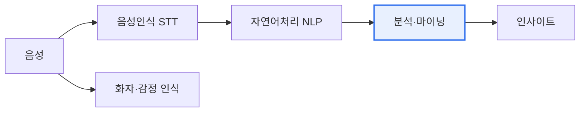

# 음성 데이터 마이닝(Voice/Speech Data Mining)

## 1. 개요

### 가. 정의
> 음성 데이터로부터 **텍스트·감정·화자·의도 등 유용한 정보와 패턴을 추출**하는 데이터 마이닝 기법. 음성 인식(STT)을 기반으로 자연어 처리·분석을 결합한다.

음성 데이터 마이닝이 부상한 배경은, 콜센터·음성비서·회의 등에서 **방대한 음성 데이터가 축적**되었으나 분석되지 못하고 사장되었기 때문이다. 음성을 텍스트로 바꾸고(STT) 그 안의 의미·감정·주제를 분석하면, 고객 불만·트렌드·리스크를 자동으로 포착하는 강력한 인사이트 도구가 된다.

### 나. 목적
- 고객 경험 분석(VOC), 상담 품질 관리, 리스크·컴플라이언스 모니터링, 서비스 자동화

## 2. 주요 기술

| 기술 | 내용 |
|---|---|
| **음성 인식(STT)** | 음성을 텍스트로 변환 |
| **화자 분리·인식** | 누가 말했는지 구분·식별 |
| **감정 분석** | 어조·단어로 감정 파악 |
| **자연어 처리(NLP)** | 키워드·주제·의도 추출 |
| **패턴 분석** | 군집·분류·이상 탐지 |

## 3. 활용 분야

| 분야 | 활용 |
|---|---|
| **콜센터·CS** | 상담 품질·VOC 분석, 실시간 코칭 |
| **금융·컴플라이언스** | 불완전판매·리스크 감지 |
| **의료** | 음성 진료 기록·질환 스크리닝 |
| **음성비서·IoT** | 의도 파악·서비스 자동화 |

## 4. 발전 방향
- **대규모 음성 파운데이션 모델**(Whisper 등)로 정확도·다국어 향상
- 실시간·엣지 처리, 멀티모달(음성+텍스트+영상) 융합
- 감정·맥락 이해 고도화, 프라이버시(음성 개인정보) 보호 강화

## 5. 시사점
- STT 정확도가 전체 품질 좌우 — 잡음·방언·전문용어 대응
- 음성은 민감 개인정보(생체) → 비식별·동의·보안 필수
- 생성형 AI로 요약·분석 자동화 가속

---

> **한 줄 요약**: 음성 데이터 마이닝은 *STT·화자/감정 인식·NLP* 로 음성에서 정보·패턴을 추출해 콜센터·금융·의료에 활용하며, 음성 파운데이션 모델·멀티모달로 발전하되 음성 개인정보 보호가 과제다.
