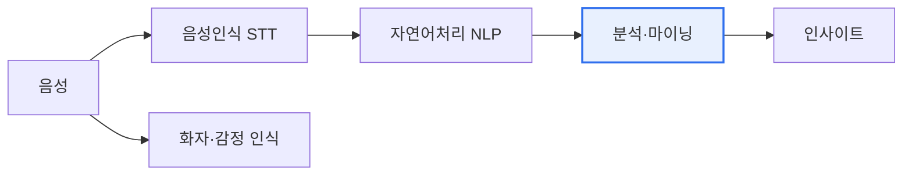

# 음성 데이터 마이닝(Voice/Speech Data Mining)

## 1. 개요

### 가. 정의
> 음성 데이터로부터 **텍스트·감정·화자·의도 등 유용한 정보와 패턴을 추출**하는 데이터 마이닝 기법. 음성 인식(STT)을 기반으로 자연어 처리·분석을 결합한다.

음성 데이터 마이닝이 부상한 배경은, 콜센터·음성비서·회의·상담 등에서 **방대한 음성 데이터가 매일 쌓이지만 분석되지 못한 채 사장**되어 왔기 때문이다. 텍스트 데이터는 검색·분석이 쉽지만, 음성은 듣기 전에는 내용을 알 수 없어 활용이 어려웠다. 음성 데이터 마이닝은 음성을 텍스트로 변환하고(STT) 그 안에 담긴 의미·감정·주제·화자를 자동으로 분석함으로써, 잠자던 음성 자산을 강력한 인사이트 도구로 바꾼다. 예컨대 하루 수만 건의 상담 통화를 모두 분석해 반복되는 불만, 이탈 징후, 상담 품질 문제를 자동으로 포착할 수 있다. 사람이 일일이 들을 수 없는 규모의 음성을 기계가 이해·분석한다는 점이 핵심 가치다.

### 나. 목적
고객의 소리(VOC) 분석, 상담 품질 관리, 금융 리스크·컴플라이언스 모니터링, 서비스 자동화가 주된 목적이다. 음성 속 숨은 정보를 정량화해 의사결정과 업무 개선에 활용한다.

## 2. 주요 기술

음성 데이터 마이닝은 여러 기술의 파이프라인이다. **음성 인식(STT)** 이 음성을 텍스트로 바꾸고, **화자 분리·인식** 이 누가 말했는지 구분하며, **감정 분석** 이 어조·단어로 화자의 감정을 파악한다. 변환된 텍스트에는 **자연어 처리(NLP)** 로 키워드·주제·의도를 추출하고, **패턴 분석**(군집·분류·이상 탐지)으로 통찰을 도출한다. 이 흐름에서 STT의 정확도가 전체 품질을 좌우하는 첫 관문이 된다.

| 기술 | 내용 |
|---|---|
| **음성 인식(STT)** | 음성을 텍스트로 변환 |
| **화자 분리·인식** | 누가 말했는지 구분·식별 |
| **감정 분석** | 어조·단어로 감정 파악 |
| **자연어 처리(NLP)** | 키워드·주제·의도 추출 |
| **패턴 분석** | 군집·분류·이상 탐지 |

## 3. 활용 분야

| 분야 | 활용 |
|---|---|
| **콜센터·CS** | 상담 품질·VOC 분석, 실시간 코칭 |
| **금융·컴플라이언스** | 불완전판매·리스크 감지 |
| **의료** | 음성 진료 기록·질환 스크리닝 |
| **음성비서·IoT** | 의도 파악·서비스 자동화 |

콜센터에서는 상담 내용을 자동 분석해 품질을 관리하고 실시간으로 상담원을 지원하며, 금융에서는 불완전판매나 리스크 발언을 감지한다. 의료에서는 진료 대화를 자동 기록하고 음성 특징으로 질환을 스크리닝하기도 한다.

## 4. 발전 방향

음성 데이터 마이닝은 대규모 음성 파운데이션 모델의 등장으로 크게 도약하고 있다. 방대한 음성으로 사전학습된 모델(예: Whisper류)이 정확도와 다국어 지원을 높였고, 실시간·엣지 처리로 즉시 분석이 가능해졌으며, 음성·텍스트·영상을 함께 다루는 멀티모달로 확장되고 있다. 감정·맥락 이해도 정교해지고 있다.

## 5. 고려사항 및 시사점

1. **STT 정확도가 전체 품질을 좌우**한다. 잡음·방언·전문용어·화자 중첩 환경에서 인식 정확도를 높이는 것이 음성 데이터 마이닝의 첫 과제다.
2. **음성은 민감한 생체 개인정보**다. 음성에는 화자를 식별할 수 있는 생체 정보와 사적 대화가 담기므로, 비식별 처리·동의·보안이 반드시 병행되어야 한다.
3. **생성형 AI로 분석·요약이 가속**된다. 대화를 자동 요약하고 인사이트를 생성하는 LLM 결합으로, 음성 데이터의 활용 범위와 속도가 크게 확대되고 있다.

---

> **한 줄 요약**: 음성 데이터 마이닝은 *STT·화자/감정 인식·NLP·패턴 분석* 으로 음성에서 정보·패턴을 추출해 콜센터·금융·의료에 활용하며, 음성 파운데이션 모델·멀티모달로 발전하되 STT 정확도와 음성 개인정보 보호가 핵심 과제다.
