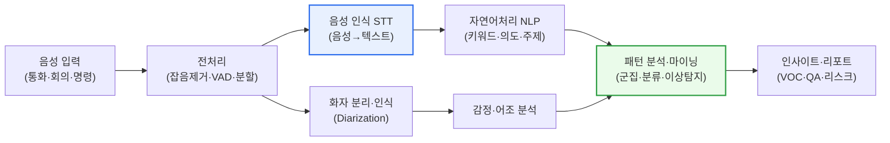
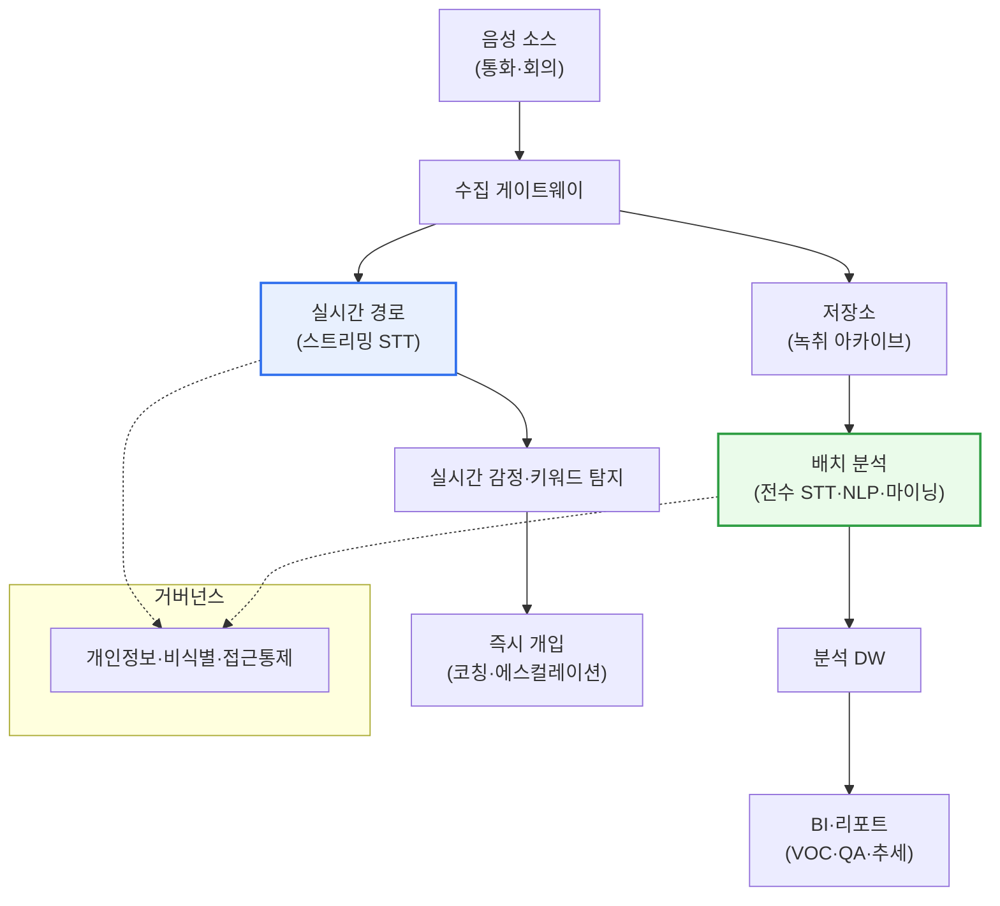

# 음성 데이터 마이닝(Voice/Speech Data Mining)

## 1. 개요

### 가. 정의
> **음성 데이터 마이닝**은 통화·상담·회의·음성명령 등 **비정형 음성 데이터로부터 텍스트·감정·화자·의도·주제 등 유용한 정보와 패턴을 자동으로 추출**하는 데이터 마이닝 기법이다. 음성 인식(STT, Speech-to-Text)을 기반으로 자연어 처리(NLP)와 통계·기계학습 기반 패턴 분석을 결합한 **다단계 파이프라인**이라는 점이 특징이다.

음성 데이터 마이닝이 부상한 배경은, 콜센터·음성비서·회의·상담·현장 무전 등에서 **방대한 음성 데이터가 매일 쌓이지만 대부분 분석되지 못한 채 사장(死藏)** 되어 왔기 때문이다. 텍스트 데이터는 검색·집계·분석이 쉽지만, 음성은 '재생해서 끝까지 들어보기 전에는' 내용을 알 수 없는 **순차적·비정형 매체**라 활용이 근본적으로 어려웠다. 예컨대 하루 수만 건이 유입되는 콜센터에서 사람이 모든 통화를 청취해 품질을 평가하는 것은 물리적으로 불가능해, 실제로는 1~3% 남짓만 표본 청취(QA)하는 데 그쳐 왔다. 음성 데이터 마이닝은 이 한계를 정면으로 돌파한다. 음성을 텍스트로 변환하고(STT) 그 안에 담긴 의미·감정·주제·화자를 자동 분석함으로써, **잠자던 음성 자산을 정량화 가능한 인사이트 도구로 전환**한다.

핵심 가치는 '**규모(scale)의 전환**'에 있다. 사람이 표본만 들을 수 있던 것을, 기계는 전수(100%)로 분석한다. 그 결과 반복되는 고객 불만, 이탈 징후, 상담 품질 저하, 규정 위반 발언처럼 **표본 청취로는 놓치던 신호를 통계적으로 포착**할 수 있다. 즉 음성 데이터 마이닝은 단순 녹취를 넘어, 음성이라는 매체를 '검색·집계·예측이 가능한 정형 데이터처럼' 다루게 해 주는 기술이다.

여기서 텍스트 마이닝과의 관계도 분명해진다. 음성 데이터 마이닝은 STT라는 관문을 통과한 뒤에는 상당 부분 텍스트 마이닝·NLP의 방법론을 재사용하되, **화자·어조·억양·묵음 등 '텍스트에는 없는 음향 정보'까지 함께 다룬다**는 점에서 한층 넓다. 또한 입력이 항상 완벽한 텍스트가 아니라 STT가 만든 '오류를 포함할 수 있는 텍스트'라는 점에서, 잡음에 견디는(robust) 분석 설계가 요구된다는 차이도 있다.

### 나. 특징
음성 데이터 마이닝의 성격은 다음으로 요약된다.

- **다단계 파이프라인:** 전처리→STT→화자/감정 인식→NLP→패턴 분석의 직렬 구조로, 앞 단계 오류가 뒤로 전파된다.
- **음향+언어 결합:** 텍스트 의미뿐 아니라 피치·강도·말속도 같은 음향 특징을 함께 활용한다.
- **전수(全數) 분석:** 표본 청취의 한계를 넘어 100% 통화를 자동 분석해 통계적 신호를 포착한다.
- **비정형→정형 전환:** 순차적·비정형 음성을 검색·집계 가능한 정형 데이터로 바꾼다.
- **생체정보 취급:** 성문·사적 대화 등 민감정보를 다루므로 개인정보·윤리 통제가 필수다.

### 나. 목적
주된 목적은 **고객의 소리(VOC) 분석, 상담 품질 관리(QA), 금융 리스크·컴플라이언스 모니터링, 서비스 자동화**다. 통화 속에 흩어진 비정형 정보를 정량화해 의사결정과 업무 개선의 근거로 삼는 것이다. 예를 들어 "요금이 왜 이렇게 나왔냐"는 표현의 빈도가 특정 요금제 출시 직후 급증했다면, 이는 상품 설계나 안내 프로세스의 결함을 시사하는 **선행 신호(early signal)** 로 활용된다.

## 2. 주요 기술과 파이프라인 구조

음성 데이터 마이닝은 단일 알고리즘이 아니라 **여러 신호처리·AI 기술이 직렬로 연결된 파이프라인**이다. 앞 단계의 출력이 뒤 단계의 입력이 되므로, 어느 한 단계의 오류가 뒤로 전파(error propagation)된다. 특히 **첫 관문인 STT의 정확도가 전체 결과의 품질을 좌우**한다. STT가 "환불"을 "한불"로 잘못 옮기면, 뒤의 감정 분석·의도 분류·집계가 모두 틀어지기 때문이다.

```mermaid
flowchart LR
  V["음성 입력<br/>(통화·회의·명령)"] --> PRE["전처리<br/>(잡음제거·VAD·분할)"]
  PRE --> S["음성 인식 STT<br/>(음성→텍스트)"]
  PRE --> SP["화자 분리·인식<br/>(Diarization)"]
  S --> N["자연어처리 NLP<br/>(키워드·의도·주제)"]
  SP --> EMO["감정·어조 분석"]
  N --> A["패턴 분석·마이닝<br/>(군집·분류·이상탐지)"]
  EMO --> A
  A --> I["인사이트·리포트<br/>(VOC·QA·리스크)"]
  style S fill:#e8f0fe,stroke:#2f6fed,stroke-width:2px
  style A fill:#eafbea,stroke:#2f9e44,stroke-width:2px
```

**가. 전처리와 음성 인식(STT).** 파이프라인의 출발점이다. 먼저 잡음 제거, 묵음 구간을 걸러내는 음성구간검출(VAD, Voice Activity Detection), 발화 단위 분할 같은 전처리가 이뤄진다. 이어 음향모델·언어모델(또는 종단간 신경망)을 통해 음성을 텍스트로 변환한다. STT의 난점은 **실제 환경의 다양성**이다. 배경 잡음, 사투리·억양, 도메인 전문용어(의료 약품명·금융 상품명), 두 사람이 겹쳐 말하는 중첩 발화 등이 정확도를 떨어뜨린다. 그래서 도메인별 어휘 사전과 맞춤 학습이 정확도 확보의 관건이 된다.

**나. 화자 분리·인식(Diarization & Recognition).** '**누가**(who) 언제 말했는가'를 가르는 단계다. 화자 분리(diarization)는 통화 안에서 상담원과 고객의 발화를 구분해 대화 구조를 복원하고, 화자 인식(recognition)은 음성의 성문(voiceprint) 특징으로 특정 개인을 식별한다. 이 정보가 있어야 "고객이 화를 낸 뒤 상담원이 어떻게 응대했는가"처럼 **역할·순서에 기반한 분석**이 가능해진다. 화자 인식은 금융권 성문 인증에도 쓰이지만, 동시에 강력한 생체정보라 개인정보 이슈를 함께 부른다.

**다. 감정·어조 분석(Emotion/Sentiment).** 텍스트의 단어뿐 아니라 **음성 고유의 음향 특징(피치·강도·말속도·떨림)** 까지 활용해 화자의 감정 상태를 추정한다. 같은 "괜찮습니다"라도 억양에 따라 만족과 냉소가 갈리므로, 텍스트만 보는 감성분석보다 음성 기반 감정분석이 더 풍부한 신호를 준다. 콜센터에서는 고객의 분노가 임계치를 넘으면 실시간으로 관리자에게 에스컬레이션하는 데 쓰인다.

**라. NLP와 패턴 분석·마이닝.** 변환된 텍스트에서 자연어 처리로 키워드·주제(topic)·의도(intent)·개체명을 추출하고, 그 위에 데이터 마이닝의 정통 기법(군집화·분류·연관규칙·이상탐지)을 적용해 통찰을 도출한다. 예컨대 통화 사유를 자동 분류해 유형별 볼륨을 집계하고, 평소와 다른 급증 패턴을 이상탐지로 잡아내는 식이다. 이 단계가 '녹취'와 '마이닝'을 가르는 본질로, **개별 통화의 이해를 넘어 전체 집단의 패턴·추세를 발견**한다.

| 기술 | 역할 | 실무 난점 |
|---|---|---|
| **전처리·STT** | 음성→텍스트 변환 | 잡음·사투리·전문용어·중첩발화 |
| **화자 분리·인식** | 발화자 구분·식별 | 짧은 발화·유사 음색 |
| **감정·어조 분석** | 음향+텍스트로 감정 추정 | 반어·맥락 의존 |
| **NLP** | 키워드·의도·주제 추출 | 구어체·비문·도메인 어휘 |
| **패턴 분석** | 군집·분류·이상탐지 | 라벨 부족·클래스 불균형 |

## 3. 처리 방식: 배치 분석과 실시간 분석

음성 데이터 마이닝은 '언제 분석하는가'에 따라 배치(사후) 분석과 실시간(통화 중) 분석으로 나뉘며, 목적이 서로 다르다. 배치 분석은 종료된 통화를 모아 야간 등에 일괄 처리해 **추세·패턴·품질 통계**를 뽑는 데 강점이 있다. 반면 실시간 분석은 통화가 진행되는 동안 감정·키워드를 즉시 감지해 **상담원 지원·에스컬레이션 같은 즉각 개입**을 가능하게 한다.

두 방식은 요구 조건이 다르다. 배치는 정확도와 심층 분석을 우선하므로 무거운 모델을 써도 되지만, 실시간은 수백 밀리초 내 응답이 필요해 지연(latency)과 정확도의 트레이드오프를 감수한다. 실무에서는 보통 **실시간으로 즉시 대응하고, 배치로 전수 품질·추세를 집계**하는 하이브리드 구성을 택한다. 아래는 두 경로를 하나의 아키텍처로 묶은 세부 구조도다.

```mermaid
flowchart TB
  SRC["음성 소스<br/>(통화·회의)"] --> GW["수집 게이트웨이"]
  GW --> RT["실시간 경로<br/>(스트리밍 STT)"]
  GW --> ST["저장소<br/>(녹취 아카이브)"]
  RT --> EMO2["실시간 감정·키워드 탐지"]
  EMO2 --> ACT["즉시 개입<br/>(코칭·에스컬레이션)"]
  ST --> BAT["배치 분석<br/>(전수 STT·NLP·마이닝)"]
  BAT --> DW["분석 DW"]
  DW --> BI["BI·리포트<br/>(VOC·QA·추세)"]
  subgraph GOV["거버넌스"]
    PII["개인정보·비식별·접근통제"]
  end
  RT -.-> PII
  BAT -.-> PII
  style RT fill:#e8f0fe,stroke:#2f6fed,stroke-width:2px
  style BAT fill:#eafbea,stroke:#2f9e44,stroke-width:2px
```

| 구분 | 배치(사후) 분석 | 실시간(통화 중) 분석 |
|---|---|---|
| **목적** | 추세·품질·VOC 통계 | 즉시 개입·상담원 지원 |
| **우선 조건** | 정확도·심층성 | 저지연(수백 ms) |
| **대표 용도** | 전수 QA, 이탈 예측 | 감정 에스컬레이션, 실시간 코칭 |

이 구분은 인프라 설계에도 직접 영향을 준다. 실시간 파이프라인은 스트리밍 STT와 저지연 메시징이 필요하고, 배치 파이프라인은 대용량 저장·분산 처리가 관건이 되므로, 두 경로를 하나의 아키텍처로 묶되 자원과 모델을 분리해 운영하는 설계가 일반적이다.

## 4. 활용 분야와 사례

음성 데이터 마이닝의 가치는 산업별 문제와 결합할 때 구체화된다. 아래 표의 각 분야는 '전수 분석'이라는 공통 이점을 서로 다른 목적에 응용한다.

| 분야 | 활용 | 핵심 효과 |
|---|---|---|
| **콜센터·CS** | 상담 품질(QA)·VOC 분석, 실시간 코칭 | 표본→전수 품질관리, 이탈 예측 |
| **금융·컴플라이언스** | 불완전판매·리스크 발언 감지, 성문 인증 | 규정 위반 자동 적발 |
| **의료** | 진료 대화 자동 기록, 음성 특징 질환 스크리닝 | 기록 부담 경감 |
| **음성비서·IoT** | 의도 파악·서비스 자동화 | 무인 응대 |

**가. 콜센터·고객서비스.** 가장 성숙한 영역이다. 전 통화를 자동 분석해 상담 품질을 전수 평가하고, 특정 키워드(해지·불만·경쟁사명) 출현 시 실시간으로 상담원을 지원하거나 관리자에게 알린다. 표본 1~3%만 듣던 기존 QA를 100%로 끌어올린다는 점에서 '규모의 전환'이 가장 뚜렷하다. 나아가 반복 문의 유형을 집계해 FAQ·자동응답(IVR)을 개선하거나, 통화 사유·감정 추세로 **고객 이탈을 사전 예측**하는 데도 활용된다.

**나. 금융·컴플라이언스.** 규제가 강한 산업이라 활용 가치가 크다. 판매 과정에서 위험 고지 누락 같은 **불완전판매를 자동 탐지**해 컴플라이언스 리스크를 낮추고, 녹취 의무가 있는 통화에 성문 인증을 결합하기도 한다. 특정 금지 표현이나 과장 광고성 발언을 규칙·모델로 상시 모니터링해, 사후 분쟁이나 제재 리스크를 선제적으로 관리한다.

**다. 의료.** 의사–환자 대화를 자동으로 진료기록으로 정리(ambient clinical documentation)해 의료진의 문서 작성 부담을 줄인다. 또한 목소리의 미세한 음향 특징으로 특정 질환의 조기 신호를 탐색하는 연구도 진행된다. 다만 이 분야의 임상적 정확도는 아직 검증 단계이므로, 진단 대체가 아니라 **보조 지표로 신중히 활용**해야 하며 의료정보 보호 규정을 엄격히 지켜야 한다.

**라. 음성비서·IoT.** 스마트 스피커·차량·가전에서 사용자의 발화 의도를 파악해 서비스를 무인 자동화한다. 여기서는 실시간성과 짧은 명령어에 대한 정확한 의도 분류가 관건이며, 축적된 음성명령 로그를 마이닝해 자주 쓰이는 기능·실패 패턴을 분석하고 제품을 개선하는 선순환이 이뤄진다.

## 5. 심화: 파운데이션 모델과 생성형 AI로의 도약

음성 데이터 마이닝은 최근 **대규모 음성 파운데이션 모델**과 **생성형 AI(LLM)** 의 결합으로 질적 도약을 겪고 있다. 과거에는 STT·감정·의도 분석을 각각 별도 모델로 구축·튜닝해야 했지만, 방대한 음성으로 사전학습된 범용 STT 모델(예: Whisper 계열)이 등장하면서 **다국어·잡음 환경에서의 인식 정확도와 적용 편의성이 크게 향상**되었다.

여기에 LLM을 결합하면, 단순 키워드 추출을 넘어 **통화 요약·핵심 쟁점 도출·후속조치 자동 생성·통화 분류**를 자연어 지시만으로 수행할 수 있어 분석의 유연성과 속도가 비약적으로 커진다. 예컨대 과거에는 '통화 사유 분류'를 위해 수천 건의 라벨링 데이터로 전용 분류기를 학습해야 했지만, 이제는 LLM에 분류 기준을 프롬프트로 제시하는 것만으로 유사한 결과를 얻어, 신규 유형 추가나 기준 변경에 드는 리드타임이 크게 단축된다.

기술 흐름은 세 방향으로 요약된다.

- **실시간·엣지 처리:** 통화가 끝난 뒤 배치로 분석하던 방식에서, 통화 중 실시간으로 감정·이탈 위험을 감지해 즉시 개입하는 방향으로 이동하고 있다.
- **멀티모달 확장:** 음성만이 아니라 텍스트 상담·영상·화면 공유를 함께 분석해 고객 경험을 통합적으로 이해한다.
- **분석에서 행동으로:** 통찰 도출에 그치지 않고, 요약·응대 초안·지식베이스 갱신까지 자동화하는 'agentic' 방향으로 진화하고 있다.

다만 이러한 자동화가 커질수록 생성 결과의 사실 오류(환각)와 개인정보 노출을 통제하는 거버넌스가 함께 요구된다. 편의와 통제의 균형을 어떻게 설계하느냐가 성숙한 도입의 관건이다.

## 6. 고려사항 및 시사점

1. **STT 정확도가 전체 품질의 상한을 결정한다.** 파이프라인 첫 단계의 오류가 뒤로 전파되므로, 잡음·방언·전문용어·화자 중첩 환경에서 인식률을 끌어올리는 도메인 맞춤화가 사업 성패의 첫 관문이다. 정확도 지표(WER, 단어오류율)를 지속 관리해야 한다.
2. **음성은 그 자체가 민감한 생체 개인정보다.** 음성에는 화자를 식별할 수 있는 성문과 사적 대화가 담기므로, 수집·이용 동의, 목적 제한, 비식별·가명처리, 보관기간·접근통제가 반드시 병행되어야 한다. 특히 화자 인식(성문)은 변경 불가능한 생체정보라 유출 시 피해가 영구적이다.
3. **생성형 AI 결합이 활용 범위와 속도를 확장하되, 신뢰성 관리가 전제다.** LLM 기반 자동 요약·인사이트 생성은 강력하지만, 사실 오류·편향·환각 위험이 있어 중요한 의사결정에는 근거(원문 발화) 추적성과 검증 절차를 함께 설계해야 한다.
4. **평가 편향과 노동·윤리 이슈를 고려해야 한다.** 전수 감정·품질 분석은 상담원에 대한 과잉 감시(surveillance)로 흐를 수 있고, 감정 인식 모델은 문화·개인차에 따른 편향을 내포한다. 지표를 '감시'가 아닌 '코칭·개선'의 도구로 설계하고, 투명성과 이의제기 절차를 갖추는 것이 지속가능성의 조건이다.
5. **기술사 관점의 도입 전략.** 파일럿은 STT 정확도 검증 → 소수 유즈케이스(예: 해지 방어, 불완전판매 탐지) 성과 입증 → 실시간·멀티모달 확장의 단계적 접근이 바람직하며, 데이터 거버넌스·개인정보보호를 초기 아키텍처에 내재화(privacy by design)해야 사후 리스크를 줄일 수 있다.

## 참고자료
- OpenAI, "Introducing Whisper"(대규모 음성 인식 모델): https://openai.com/index/whisper/
- 개인정보보호위원회, 개인정보 보호법(생체정보 등 민감정보 처리 근거): https://www.pipc.go.kr

---

> **한 줄 요약**: 음성 데이터 마이닝은 *전처리·STT·화자/감정 인식·NLP·패턴 분석* 으로 이어지는 파이프라인으로 비정형 음성에서 정보·패턴을 전수 추출해 콜센터·금융·의료에 활용하며, 음성 파운데이션 모델·생성형 AI로 도약하되 STT 정확도와 음성 생체 개인정보 보호가 핵심 과제다.
