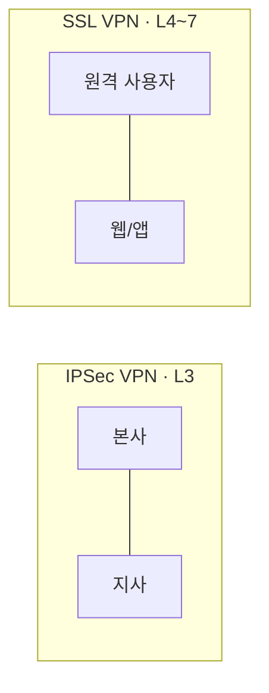

# VPN(Virtual Private Network)

## 1. 개요

### 가. 개념
> 공용 네트워크(인터넷) 위에 **암호화된 가상의 전용 통신로(터널)** 를 구성해, 원격지·지사 간 데이터를 안전하게 송수신하는 기술.

### 나. 특징
- **터널링**으로 사설망 확장, 전용선 대비 **저비용**
- **기밀성·무결성·인증** 제공, 원격근무·지사 연결에 활용

## 2. IPSec VPN vs SSL VPN

| 구분 | IPSec VPN | SSL VPN |
|---|---|---|
| **동작 계층** | 네트워크(L3) | 전송~응용(L4~7) |
| **접속 방식** | 전용 클라이언트 필요 | 웹 브라우저(무설치) |
| **주 용도** | 지사간 상시 연결(Site-to-Site) | 원격 사용자 접속(Remote Access) |
| **접근 범위** | 네트워크 전체 | 특정 애플리케이션 단위 |
| **보안 프로토콜** | ESP/AH, IKE | TLS/SSL |
| **장점** | 광범위·투명한 연결 | 세밀한 접근제어·편의성 |

## 3. VPN 기술 요소

| 요소 | 설명 |
|---|---|
| **터널링(Tunneling)** | 원 패킷을 캡슐화 — L2TP·PPTP·**IPSec(ESP/AH)**·SSL/TLS |
| **암호화(Confidentiality)** | 대칭키(AES 등)로 데이터 기밀성 |
| **인증(Authentication)** | **IKE**·전자서명·인증서로 상호 인증 |
| **무결성(Integrity)** | HMAC·해시로 위·변조 탐지 |
| **키 관리** | **IKE(Internet Key Exchange)** 로 세션키 교환·갱신 |

- **IPSec 모드**: 전송(Transport, 페이로드 암호)·터널(Tunnel, 전체 패킷 암호)

## 4. 고려사항 및 시사점
- **성능(암복호 오버헤드)** vs 보안 균형, 스플릿 터널링 정책
- 원격근무 확산 → **SSL VPN** 및 경계 기반 한계 → **ZTNA(제로트러스트)** 로 진화
- VPN은 "연결하면 신뢰"의 한계 → **최소권한·지속 검증** 모델과 병행 필요

---

> **한 줄 요약**: VPN은 *공용망 위에 암호화 터널로 가상 전용망을 구성* 하는 기술로, 네트워크 계층의 IPSec(지사간)과 응용 계층의 SSL(원격접속)이 있으며, 터널링·암호화·인증·무결성·키관리를 핵심 요소로 하고 ZTNA로 진화한다.
