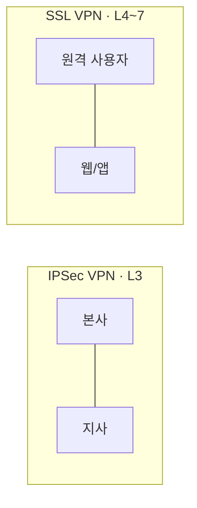

# VPN(Virtual Private Network)

## 1. 개요

### 가. 정의
> 공용 네트워크(인터넷) 위에 **암호화된 가상의 전용 통신로(터널)** 를 구성해, 물리적으로는 공용망을 지나가지만 논리적으로는 전용망처럼 안전하게 데이터를 송수신하는 기술.

### 나. 등장 배경 및 필요성
지사 간 통신이나 재택근무자의 사내 접속을 위해 물리 **전용선(Leased Line)** 을 까는 방식은 안전하지만 비용이 지역·거리에 비례해 폭증한다. 인터넷은 이미 전 세계로 깔려 있어 비용이 저렴하지만, 누구나 패킷을 엿볼 수 있는 개방망이라 그대로 쓰면 도청·변조·위장 위험이 크다. VPN은 이 둘의 장점만 취해, **저렴한 인터넷 위에 암호화·인증·무결성을 입힌 터널**을 얹음으로써 전용선 수준의 보안을 훨씬 낮은 비용으로 구현한다. 원격근무 확산과 클라우드 이용 증가로 "언제 어디서나 안전한 접속" 수요가 커지면서 VPN은 기업 네트워크의 기본 구성요소가 되었다.

## 2. IPSec VPN vs SSL VPN

두 방식의 차이는 **터널을 네트워크 스택의 어느 계층에 뚫느냐**에서 비롯되고, 그 선택이 용도를 가른다. **IPSec VPN**은 네트워크 계층(L3)에서 IP 패킷 자체를 암호화하므로, 일단 터널이 서면 그 위의 모든 애플리케이션 트래픽이 투명하게 보호된다. 사용자가 의식하지 않아도 네트워크 전체가 연결되므로 **지사-본사 상시 연결(Site-to-Site)** 에 적합하지만, 전용 클라이언트 설치와 설정이 필요하다. 반면 **SSL VPN**은 전송~응용 계층(L4~7)에서 TLS로 보호하며 웹 브라우저만으로 접속할 수 있어 무설치·편의성이 크다. 대신 특정 애플리케이션 단위로 접근을 여는 방식이라 세밀한 접근제어가 쉬워, 불특정 장소에서 접속하는 **원격 사용자(Remote Access)** 에 적합하다. 요컨대 "네트워크 전체를 붙일 것인가(IPSec), 필요한 앱만 열 것인가(SSL)"가 선택 기준이다.

| 구분 | IPSec VPN | SSL VPN |
|---|---|---|
| **동작 계층** | 네트워크(L3) | 전송~응용(L4~7) |
| **접속 방식** | 전용 클라이언트 필요 | 웹 브라우저(무설치) |
| **주 용도** | 지사간 상시 연결(Site-to-Site) | 원격 사용자 접속(Remote Access) |
| **접근 범위** | 네트워크 전체 | 특정 애플리케이션 단위 |
| **보안 프로토콜** | ESP/AH, IKE | TLS/SSL |
| **장점** | 광범위·투명한 연결 | 세밀한 접근제어·편의성 |

## 3. VPN 기술 요소

VPN의 안전성은 다섯 요소가 사슬처럼 맞물릴 때 성립한다. **터널링**은 원래의 패킷을 새 헤더로 감싸(캡슐화) 공용망을 통과시키는 뼈대로, L2TP·PPTP나 IPSec의 ESP/AH, SSL/TLS가 쓰인다. 캡슐화만으로는 내용이 보이므로 **암호화**가 데이터 기밀성을 담당해 AES 같은 대칭키로 페이로드를 가린다. 그러나 상대가 위장한 공격자면 암호화도 무의미하므로 **인증**이 IKE·전자서명·인증서로 통신 양단을 검증한다. 전송 중 비트가 조작됐는지는 **무결성**이 HMAC·해시로 탐지한다. 마지막으로 대칭키를 안전하게 나눠 갖고 주기적으로 바꾸는 **키 관리**가 없으면 앞의 모든 것이 무너지므로, IKE(Internet Key Exchange)가 세션키를 안전하게 교환·갱신한다.

| 요소 | 설명 | 대표 기술 |
|---|---|---|
| **터널링(Tunneling)** | 원 패킷 캡슐화 | L2TP·PPTP·IPSec(ESP/AH)·SSL/TLS |
| **암호화(Confidentiality)** | 데이터 기밀성 | 대칭키(AES 등) |
| **인증(Authentication)** | 양단 신원 검증 | IKE·전자서명·인증서 |
| **무결성(Integrity)** | 위·변조 탐지 | HMAC·해시 |
| **키 관리** | 세션키 교환·갱신 | IKE |

IPSec에는 두 가지 캡슐화 **모드**가 있다. **전송(Transport) 모드**는 페이로드만 암호화하고 원래 IP 헤더는 유지해 종단 간 통신에 쓰이고, **터널(Tunnel) 모드**는 원래 IP 헤더까지 포함한 전체 패킷을 암호화해 새 헤더로 감싸므로 게이트웨이 간 Site-to-Site 연결에 쓰인다.

## 4. 고려사항 및 시사점
- **성능과 보안의 균형**: 암·복호화는 CPU 오버헤드를 유발하므로, 모든 트래픽을 터널로 보내는 대신 사내 목적지만 터널링하고 일반 인터넷은 직접 나가게 하는 **스플릿 터널링** 정책으로 성능과 보안을 절충한다.
- **경계 기반 신뢰의 한계**: 전통 VPN은 "터널에 들어오면 내부자로 신뢰"하는 모델이라, 한 계정이 탈취되면 내부망 전체가 노출된다. 이 한계 때문에 자원마다 접근 시점에 지속 검증하는 **ZTNA(Zero Trust Network Access)** 로 진화하고 있다.
- **최소권한·지속 검증 병행**: VPN을 유지하더라도 사용자·기기·상황을 매 접근마다 평가하는 제로트러스트 원칙과 결합해, 접속=신뢰의 등식을 깨는 방향으로 운영해야 한다.

---

> **한 줄 요약**: VPN은 *공용망 위에 암호화 터널로 가상 전용망을 구성* 하는 저비용 보안 기술로, 네트워크 계층의 IPSec(지사간)과 응용 계층의 SSL(원격접속)로 나뉘며 터널링·암호화·인증·무결성·키관리를 핵심 요소로 하고 경계 신뢰의 한계를 넘어 ZTNA로 진화한다.
