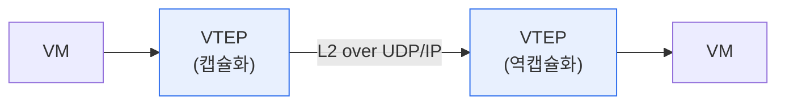

# VXLAN(Virtual eXtensible LAN)

## 1. 개요

### 가. 정의
> 물리 네트워크(L3) 위에 **가상의 L2 오버레이 네트워크**를 구성하는 터널링 기술. 24비트 VNI로 최대 약 1,600만 개의 논리 네트워크를 제공해 VLAN의 한계를 극복한다.

VXLAN이 등장한 배경은 '**VLAN의 4,094개 한계**'와 대규모 멀티테넌트 클라우드·데이터센터의 확장성 요구다. 수많은 테넌트를 격리하려면 VLAN ID(12비트)가 턱없이 부족하고, L2 도메인이 물리 위치에 묶여 VM 이동이 제약된다. VXLAN은 L2 프레임을 L3(UDP) 패킷에 캡슐화해 이 문제를 푼다.

## 2. 동작 구조

| 요소 | 역할 |
|---|---|
| **VTEP** | 캡슐화·역캡슐화 종단점(터널 끝점) |
| **VNI** | 24비트 가상 네트워크 식별자(약 1,600만) |
| **오버레이/언더레이** | 가상망(오버레이) / 물리망(언더레이) |

## 3. VLAN과 비교

| 구분 | VLAN | VXLAN |
|---|---|---|
| **식별자** | 12비트(4,094개) | 24비트(약 1,600만) |
| **범위** | L2 로컬 | L3 위 오버레이(위치 무관) |
| **캡슐화** | 태그(802.1Q) | MAC-in-UDP |
| **적합** | 소규모 | 대규모 클라우드·데이터센터 |

## 4. 시사점
- **멀티테넌시·VM 이동성**의 기반 — SDN·클라우드 데이터센터 핵심
- 오버레이로 물리망과 논리망 분리(네트워크 가상화)
- 캡슐화 오버헤드·MTU, 컨트롤 플레인(EVPN) 관리 고려

---

> **한 줄 요약**: VXLAN은 *L3 위에 24비트 VNI 기반 L2 오버레이* 를 만드는 MAC-in-UDP 터널링으로, VLAN의 4,094개 한계를 극복해 대규모 클라우드·데이터센터의 멀티테넌시와 VM 이동성을 실현한다.
