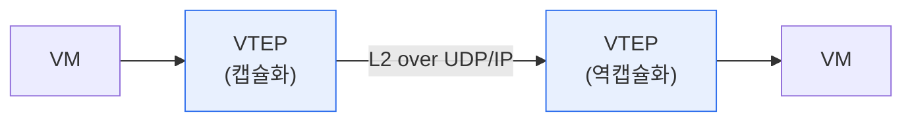

# VXLAN(Virtual eXtensible LAN)

## 1. 개요

### 가. 정의
> 물리 네트워크(L3) 위에 **가상의 L2 오버레이 네트워크**를 구성하는 터널링 기술. 24비트 VNI(가상 네트워크 식별자)로 약 1,600만 개의 논리 네트워크를 제공해 VLAN의 확장성 한계를 극복한다.

VXLAN이 등장한 근본 배경은 '**VLAN의 4,094개 한계와 물리적 제약**'이다. 기존 VLAN은 식별자(VLAN ID)가 12비트라 최대 4,094개밖에 만들 수 없는데, 수만 개의 테넌트를 격리해야 하는 대규모 클라우드·데이터센터에서는 턱없이 부족하다. 게다가 VLAN은 L2 도메인이라 물리적 위치에 묶여, 가상머신(VM)을 다른 서버·데이터센터로 옮기면 같은 네트워크를 유지하기 어렵다. VXLAN은 이 문제를 'L2 프레임을 L3(UDP) 패킷 안에 캡슐화'하는 방식으로 해결한다. 즉 논리적 네트워크를 물리적 네트워크에서 분리(가상화)함으로써, 위치에 상관없이 대규모 격리 네트워크를 만들고 VM을 자유롭게 이동시킬 수 있게 한다.

### 나. 필요성
클라우드는 다수 고객(테넌트)의 네트워크를 안전하게 격리하고, 워크로드를 데이터센터 전역에 유연하게 배치해야 한다. VXLAN은 이 멀티테넌시와 이동성을 물리망 제약 없이 실현하는 네트워크 가상화의 핵심이다.

## 2. 동작 구조

VXLAN의 핵심 부품은 **VTEP(VXLAN Tunnel End Point)** 이다. 출발지 VTEP은 VM이 보낸 L2 프레임을 VXLAN 헤더와 UDP/IP 헤더로 감싸(캡슐화) 물리망으로 보내고, 도착지 VTEP은 이를 풀어(역캡슐화) 목적지 VM에 전달한다. 이때 **VNI**(24비트)가 어느 가상 네트워크에 속하는지를 식별하며, 물리망(언더레이) 위에 가상망(오버레이)이 얹히는 구조가 된다.

| 요소 | 역할 |
|---|---|
| **VTEP** | 캡슐화·역캡슐화 종단점(터널 끝점) |
| **VNI** | 24비트 가상 네트워크 식별자(약 1,600만) |
| **오버레이/언더레이** | 가상망(오버레이) / 물리망(언더레이) |

## 3. VLAN과 비교

| 구분 | VLAN | VXLAN |
|---|---|---|
| **식별자** | 12비트(4,094개) | 24비트(약 1,600만) |
| **범위** | L2 로컬 | L3 위 오버레이(위치 무관) |
| **캡슐화** | 태그(802.1Q) | MAC-in-UDP |
| **이동성** | 물리 위치 제약 | VM 자유 이동 |
| **적합** | 소규모 | 대규모 클라우드·데이터센터 |

## 4. 고려사항 및 시사점

1. **멀티테넌시·VM 이동성의 기반 기술**로, SDN·클라우드 데이터센터의 네트워크 가상화 핵심이다. 물리망과 논리망을 분리해 유연성을 극대화한다.
2. **캡슐화 오버헤드와 MTU에 유의**해야 한다. VXLAN 헤더가 추가되므로 패킷 크기가 커져, 물리망의 MTU를 늘리거나 조각화를 관리해야 성능 저하를 막는다.
3. **컨트롤 플레인(EVPN)과 결합**해 확장성을 높인다. 초기 VXLAN은 목적지 학습에 브로드캐스트를 썼으나, BGP EVPN으로 MAC·IP 정보를 효율적으로 배포해 대규모 운영을 최적화한다.

---

> **한 줄 요약**: VXLAN은 *L3 위에 24비트 VNI 기반 L2 오버레이* 를 만드는 MAC-in-UDP 터널링으로, VLAN의 4,094개 한계를 극복해 대규모 클라우드·데이터센터의 멀티테넌시와 VM 이동성을 실현하며 EVPN 컨트롤 플레인으로 확장한다.
