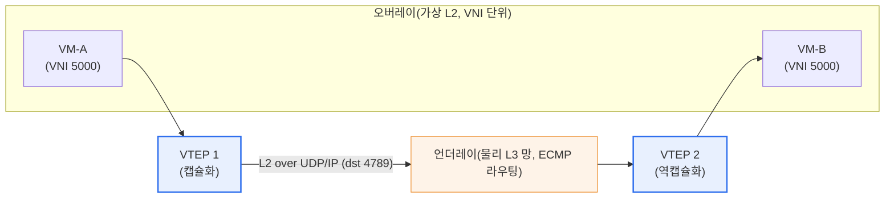
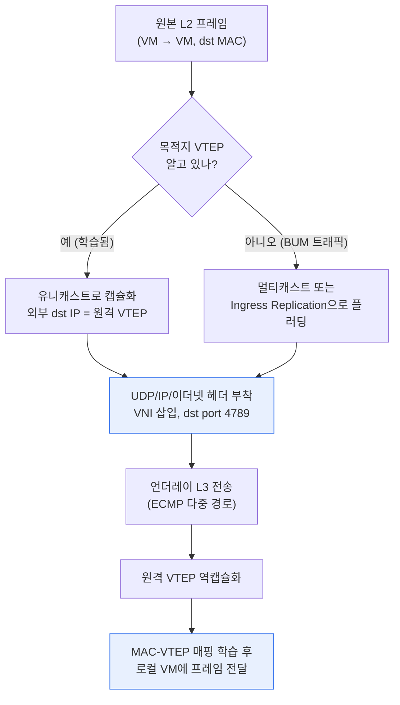

# VXLAN(Virtual eXtensible LAN)

## 1. 개요

### 가. 정의
> **VXLAN(Virtual eXtensible LAN)** 은 물리 네트워크(L3) 위에 **가상의 L2 오버레이 네트워크**를 구성하는 MAC-in-UDP 터널링 기술이다. L2 이더넷 프레임을 UDP/IP 패킷 안에 캡슐화해 라우팅 가능한 L3 망을 가로질러 전달하며, 24비트 **VNI(VXLAN Network Identifier)** 로 약 1,600만(2²⁴) 개의 논리 네트워크를 제공해 VLAN의 확장성 한계를 극복한다. 표준은 IETF **RFC 7348**(2014)에 정의되어 있다.

VXLAN이 등장한 근본 배경은 '**VLAN의 4,094개 한계와 물리적 위치 제약**'이다. 전통적인 VLAN은 IEEE 802.1Q 태그의 VLAN ID가 12비트여서 이론상 4,096개(예약분 제외 시 실사용 4,094개)밖에 만들 수 없다. 이 숫자는 소규모 캠퍼스망에서는 충분하지만, 수만~수십만 고객(테넌트)의 네트워크를 서로 격리해야 하는 퍼블릭 클라우드·대규모 데이터센터에서는 턱없이 부족하다. 하나의 데이터센터 안에서 여러 사업자가 각자 수백 개의 세그먼트를 요구하면 12비트 공간은 금방 고갈된다.

또 다른 배경은 **서버 가상화의 폭발적 확산**이다. 하나의 물리 서버에 수십 개의 가상머신(VM)이 올라가면서, 네트워크가 관리해야 할 MAC 주소 수와 세그먼트 수가 급증했다. 특히 VM을 다른 랙·다른 데이터센터로 **라이브 마이그레이션**하려면 원래의 L2 도메인(같은 브로드캐스트 도메인)이 목적지까지 늘어나 있어야 하는데, 순수 L2 망을 지리적으로 확장하는 것은 스패닝 트리(STP)로 인한 대역폭 낭비와 대규모 장애 전파 위험을 낳는다. VXLAN은 이 문제를 'L2 프레임을 L3(UDP) 패킷 안에 캡슐화'해 **언더레이(물리망)와 오버레이(논리망)를 분리**함으로써 해결한다. 논리 네트워크를 물리 토폴로지에서 떼어내므로, 물리적 위치와 무관하게 대규모 격리 네트워크를 만들고 VM을 자유롭게 이동시킬 수 있다.

### 나. 필요성과 특징
클라우드 인프라는 다수 테넌트의 네트워크를 안전하게 격리하면서, 워크로드를 데이터센터 전역에 유연하게 배치·이동할 수 있어야 한다. VXLAN은 이 **멀티테넌시**와 **워크로드 이동성**을 물리망 제약 없이 실현하는 네트워크 가상화의 사실상 표준이다. 언더레이는 검증된 L3 라우팅(ECMP 기반 다중 경로)으로 대역폭을 최대한 활용하고, 오버레이는 그 위에서 논리적 L2 서비스를 제공하므로 STP 없이도 대규모 확장이 가능하다.

특징을 요약하면 다음과 같다. 첫째, **확장성**: 24비트 VNI로 세그먼트 수를 4천여 개에서 1,600만 개로 확장한다. 둘째, **위치 독립성**: L3 위 오버레이이므로 서브넷 경계를 넘어 같은 L2 도메인을 유지한다. 셋째, **언더레이 활용도**: L3 ECMP로 여러 경로에 트래픽을 분산해, STP가 절반의 링크를 차단하던 순수 L2 망보다 효율적이다. 넷째, **하드웨어/소프트웨어 유연성**: VTEP을 하이퍼바이저(소프트웨어)나 ToR 스위치(하드웨어)에 둘 수 있다.

## 2. 전체 구조 — 오버레이/언더레이와 VTEP

```mermaid
flowchart LR
  subgraph OV["오버레이(가상 L2, VNI 단위)"]
    V1["VM-A<br/>(VNI 5000)"]
    V2["VM-B<br/>(VNI 5000)"]
  end
  V1 --> T1["VTEP 1<br/>(캡슐화)"]
  T1 -->|"L2 over UDP/IP (dst 4789)"| UND["언더레이(물리 L3 망, ECMP 라우팅)"]
  UND --> T2["VTEP 2<br/>(역캡슐화)"]
  T2 --> V2
  style T1 fill:#e8f0fe,stroke:#2f6fed,stroke-width:2px
  style T2 fill:#e8f0fe,stroke:#2f6fed,stroke-width:2px
  style UND fill:#fef3e8,stroke:#ed8f2f
```

VXLAN의 핵심 부품은 **VTEP(VXLAN Tunnel End Point)** 이다. VTEP은 오버레이와 언더레이의 경계에 서서 캡슐화·역캡슐화를 담당하는 터널 종단점이다. 출발지 VTEP은 로컬 VM이 보낸 원본 L2 이더넷 프레임을 받아 그 앞에 8바이트 **VXLAN 헤더**(VNI 포함)를 붙이고, 다시 그 앞에 **UDP 헤더**(목적지 포트 4789), **외부 IP 헤더**(출발·도착 VTEP의 IP), **외부 이더넷 헤더**를 차례로 씌운다. 이렇게 만들어진 UDP 패킷은 언더레이에서 평범한 IP 트래픽처럼 라우팅되고, 도착지 VTEP이 헤더를 벗겨(역캡슐화) 원본 프레임을 목적지 VM에 전달한다. VM 입장에서는 자신이 같은 스위치에 붙은 것처럼 보이지만, 실제로는 L3 망을 가로질러 통신한 것이다.

**VNI(24비트)** 는 이 프레임이 어느 가상 네트워크에 속하는지를 식별한다. 서로 다른 테넌트가 우연히 같은 사설 IP·같은 VLAN ID를 써도, VNI가 다르면 완전히 격리된다. 이것이 멀티테넌시 격리의 기반이다.

**언더레이와 오버레이의 분리**가 VXLAN 사고의 핵심이다. 언더레이는 오직 VTEP IP 간의 패킷을 빠르고 안정적으로 나르기만 하면 되고(오버레이의 존재를 알 필요가 없다), 오버레이는 언더레이의 물리 토폴로지를 신경 쓰지 않고 논리적 L2 서비스를 제공한다. 이 관심사 분리 덕분에 물리망은 단순한 라우티드 리프-스파인 팹으로 표준화하고, 서비스 다양성은 전부 오버레이 계층에서 소프트웨어적으로 처리하는 현대 데이터센터 설계가 가능해졌다.

주요 구성요소를 정리하면 다음과 같다.

| 요소 | 역할 | 비고 |
|---|---|---|
| **VTEP** | 캡슐화·역캡슐화 종단점(터널 끝점) | 하이퍼바이저(소프트웨어) 또는 ToR 스위치(하드웨어) |
| **VNI** | 24비트 가상 네트워크 식별자 | 약 1,600만 개, 테넌트/세그먼트 격리 |
| **VXLAN 헤더** | 8바이트, VNI·플래그 포함 | RFC 7348 |
| **UDP** | 목적지 포트 **4789**(IANA 할당) | 출발지 포트는 내부 플로 해시 → ECMP 분산 |
| **오버레이** | 가상 L2 네트워크 | VM/컨테이너가 인식하는 세그먼트 |
| **언더레이** | 물리 L3 라우팅 망 | ECMP·리프-스파인 팹 |

## 3. 캡슐화 과정과 데이터 플레인 상세

```mermaid
flowchart TB
  A["원본 L2 프레임<br/>(VM → VM, dst MAC)"] --> B{"목적지 VTEP<br/>알고 있나?"}
  B -->|"예 (학습됨)"| C["유니캐스트로 캡슐화<br/>외부 dst IP = 원격 VTEP"]
  B -->|"아니오 (BUM 트래픽)"| D["멀티캐스트 또는<br/>Ingress Replication으로 플러딩"]
  C --> E["UDP/IP/이더넷 헤더 부착<br/>VNI 삽입, dst port 4789"]
  D --> E
  E --> F["언더레이 L3 전송<br/>(ECMP 다중 경로)"]
  F --> G["원격 VTEP 역캡슐화"]
  G --> H["MAC-VTEP 매핑 학습 후<br/>로컬 VM에 프레임 전달"]
  style E fill:#e8f0fe,stroke:#2f6fed
  style H fill:#e8f0fe,stroke:#2f6fed
```

VXLAN이 실제 패킷을 처리하는 과정을 소문항별로 깊이 살펴보면 다음과 같다.

**가. 캡슐화 오버헤드와 MTU.** VXLAN은 원본 프레임 앞에 외부 이더넷(14) + 외부 IP(20) + UDP(8) + VXLAN(8) = 총 **50바이트**의 헤더를 더한다(IPv4·태그 없는 경우 기준). 따라서 언더레이가 기본 MTU 1,500바이트라면, 오버레이에서 1,500바이트 프레임을 보내는 순간 총 1,550바이트가 되어 조각화(fragmentation)나 드롭이 발생한다. 실무에서는 언더레이 MTU를 **9,000바이트(점보 프레임)** 로 상향하거나 최소 1,550바이트 이상으로 설정해 이 문제를 예방한다. MTU 불일치는 VXLAN 도입 초기 현장에서 가장 흔한 성능·연결 장애 원인이므로, 팹 전 구간에서 MTU를 일관되게 맞추는 것이 사실상 필수 사전 작업이다.

**나. 출발지 UDP 포트와 ECMP.** VXLAN은 외부 UDP의 목적지 포트는 4789로 고정하되, **출발지 포트는 내부(원본) 프레임의 헤더를 해시해서 만든다.** 이렇게 하면 서로 다른 내부 플로가 서로 다른 출발지 포트를 갖게 되고, 언더레이의 ECMP 라우터가 5-튜플 해시로 경로를 고를 때 오버레이 플로들이 여러 물리 경로에 골고루 분산된다. 언더레이 입장에서는 VXLAN 내부를 들여다보지 않고도 UDP 5-튜플만으로 부하를 분산할 수 있어, 리프-스파인 팹의 대역폭을 최대한 활용하게 된다.

**다. BUM 트래픽과 MAC 학습.** 초기 VXLAN(RFC 7348의 데이터 플레인 학습 방식)은 목적지 MAC을 모를 때의 **BUM(Broadcast·Unknown unicast·Multicast)** 트래픽을 언더레이 **멀티캐스트 그룹**(VNI마다 그룹 매핑)으로 플러딩해서 처리했다. 원격 VTEP들은 이 플러딩을 받아 원본 프레임의 출발지 MAC과 외부 IP의 출발지(원격 VTEP)를 짝지어 'MAC ↔ VTEP' 매핑을 학습한다. 그러나 언더레이 멀티캐스트를 대규모로 운영·관리하기가 까다로워, 멀티캐스트 대신 각 원격 VTEP에 개별 유니캐스트로 복제해 보내는 **Ingress Replication(Head-End Replication)** 방식이나, 아예 컨트롤 플레인으로 MAC 정보를 배포하는 방식(4장 EVPN)이 널리 쓰이게 되었다.

예를 들어 어느 통신사 클라우드에서 VNI 5000에 속한 VM-A(서버 랙1)가 같은 VNI의 VM-B(서버 랙20)와 처음 통신할 때, VTEP1은 VM-B의 위치를 모르므로 BUM으로 플러딩하고, VM-B가 응답하는 순간 VTEP1은 'VM-B의 MAC은 VTEP2에 있다'를 학습해 이후에는 유니캐스트로 직접 캡슐화한다. 이 학습·플러딩 부하가 규모에 비례해 커지는 것이 데이터 플레인 학습 방식의 근본 한계다.

## 4. VLAN·기타 오버레이와의 비교

VXLAN과 VLAN은 둘 다 네트워크 세그먼트를 격리한다는 목적은 같지만, **어디에서·어떻게 격리하는가**가 근본적으로 다르다. VLAN은 하나의 L2 브로드캐스트 도메인 안에서 태그로 프레임을 구분하므로, 격리 범위가 물리 L2 도메인에 갇힌다. 반면 VXLAN은 L2 프레임을 L3 패킷에 감싸 라우팅 가능한 망 어디로든 보낼 수 있어, 격리 범위가 물리 위치와 무관해진다. 이 차이 때문에 VLAN은 소규모·고정 배치 환경에, VXLAN은 대규모·동적 클라우드 환경에 적합하다.

| 구분 | VLAN | VXLAN |
|---|---|---|
| **식별자** | 12비트(4,094개) | 24비트(약 1,600만) |
| **캡슐화** | 802.1Q 태그(4바이트) | MAC-in-UDP(약 50바이트 오버헤드) |
| **전송 계층** | L2 로컬 | L3 위 오버레이(위치 무관) |
| **다중 경로** | STP로 링크 절반 차단 | 언더레이 ECMP로 전 경로 활용 |
| **이동성** | 물리 위치 제약 | VM/컨테이너 자유 이동 |
| **적합 규모** | 소규모 캠퍼스 | 대규모 클라우드·데이터센터 |

표만으로는 '왜 차이가 나는가'가 드러나지 않으므로 실무적 함의를 덧붙인다. VLAN이 STP로 링크의 절반을 놀리는 이유는 L2에 루프 방지 메커니즘이 없으면 브로드캐스트 폭풍이 발생하기 때문이다. VXLAN은 언더레이를 L3로 두어 이 문제를 IP 라우팅(TTL·ECMP)으로 넘기므로, 물리 링크를 모두 활용하면서도 루프가 없다. 다만 그 대가로 캡슐화 오버헤드(50바이트)와 VTEP의 처리 부담이 생긴다. 즉 VXLAN은 '확장성·이동성·대역폭 활용'을 얻는 대신 '오버헤드·복잡성'을 지불하는 트레이드오프다.

유사 오버레이 기술과도 비교된다. **NVGRE**(마이크로소프트 주도, GRE 기반)와 **STT**는 VXLAN과 경쟁했으나, VXLAN이 UDP 기반이어서 기존 ECMP·로드밸런서 인프라와 잘 맞고 폭넓은 벤더 지원을 얻어 사실상 시장 표준이 되었다. 최근에는 서비스 메타데이터를 담을 수 있는 **Geneve**(RFC 8926)가 차세대 범용 오버레이로 부상하고 있으며, VMware NSX-T 등이 이를 기본 캡슐화로 채택했다.

## 5. 심화 — BGP EVPN 컨트롤 플레인과 실무 적용

VXLAN의 진화에서 가장 중요한 변화는 **컨트롤 플레인의 도입**이다. RFC 7348의 순수 데이터 플레인 학습(플러드-앤-런) 방식은 규모가 커질수록 BUM 트래픽과 멀티캐스트 운영 부담이 급증하는 한계가 있었다. 이를 해결하기 위해 **BGP EVPN(Ethernet VPN, RFC 7432 / VXLAN 데이터 플레인은 RFC 8365)** 이 표준 컨트롤 플레인으로 자리 잡았다.

EVPN의 핵심 아이디어는 'MAC·IP 정보를 플러딩으로 학습하지 말고, **MP-BGP로 명시적으로 광고**하자'는 것이다. 각 VTEP은 자신이 학습한 로컬 VM의 MAC/IP를 BGP EVPN 경로(Type-2 등)로 다른 VTEP에 배포한다. 그러면 원격 VTEP은 처음부터 'MAC ↔ VTEP' 매핑을 알고 있으므로 알 수 없는 유니캐스트 플러딩이 거의 사라지고, ARP도 프록시 응답으로 억제할 수 있다. 또한 EVPN은 **분산 애니캐스트 게이트웨이**를 지원해, 모든 리프 스위치가 동일한 게이트웨이 IP/MAC을 공유하므로 VM이 어느 랙으로 이동해도 최적 경로로 라우팅된다. 이는 VM 이동성의 실질적 완성이다.

실무 적용 사례는 광범위하다. 대형 클라우드·통신사 데이터센터는 대부분 **VXLAN-EVPN 리프-스파인 팹**으로 설계되며, Cisco(ACI·NX-OS), Arista(EOS), Juniper(QFX) 등 주요 벤더가 이를 표준 아키텍처로 제공한다. 서버 가상화 진영에서는 **VMware NSX**가 오버레이(NSX-V는 VXLAN, NSX-T는 Geneve)로 네트워크 가상화를 구현하고, 컨테이너/쿠버네티스 진영에서는 **Flannel의 vxlan 백엔드**나 **Calico의 VXLAN 모드**가 노드 간 파드 네트워크를 오버레이로 연결한다. 예컨대 쿠버네티스 클러스터에서 Flannel VXLAN을 쓰면, 서로 다른 노드의 파드가 물리 서브넷이 달라도 동일한 클러스터 네트워크에 속한 것처럼 통신한다. 이처럼 VXLAN은 하드웨어 스위치부터 소프트웨어 CNI까지 계층을 가로질러 사용되는 범용 오버레이가 되었다.

## 6. 고려사항 및 시사점(기술사 관점)

1. **멀티테넌시·워크로드 이동성의 기반 인프라.** VXLAN은 SDN·클라우드 데이터센터에서 물리망과 논리망을 분리해 유연성을 극대화하는 핵심이다. 도입 시 오버레이(서비스)와 언더레이(전송)의 역할을 명확히 분리 설계하고, 언더레이는 단순·고신뢰 L3 팹으로 표준화하는 전략이 유효하다.

2. **MTU·오버헤드에 대한 사전 설계가 필수.** 50바이트 캡슐화 오버헤드로 인해 언더레이 MTU를 점보 프레임(9000B) 등으로 상향해야 하며, 이를 놓치면 간헐적 대용량 전송 실패라는 재현 난도가 높은 장애로 이어진다. 성능 관점에서는 VTEP의 하드웨어 오프로드(NIC의 VXLAN offload) 지원 여부가 처리량을 좌우하므로 장비 선정 시 확인해야 한다.

3. **컨트롤 플레인(EVPN) 채택으로 확장성·운영성 확보.** 소규모 PoC는 멀티캐스트 학습으로도 되지만, 프로덕션 규모에서는 BGP EVPN을 도입해 BUM 트래픽을 억제하고 분산 애니캐스트 게이트웨이로 이동성을 완성하는 것이 정석이다. 이는 '데이터 플레인 단독 → 컨트롤/데이터 플레인 분리'라는 네트워크 설계 트렌드와 일치한다.

4. **보안·가시성의 트레이드오프.** 오버레이는 트래픽을 캡슐화해 숨기므로, 기존 방화벽·IDS가 내부 프레임을 보지 못하는 가시성 저하가 생긴다. 마이크로세그멘테이션(NSX 분산 방화벽 등)과 오버레이 인지형 텔레메트리를 함께 도입해야 하며, VXLAN 자체는 암호화를 제공하지 않으므로 데이터센터 간 구간에는 IPsec/MACsec을 병행하는 것이 바람직하다.

5. **차세대 오버레이(Geneve)와 연계 전망.** 서비스 체이닝·메타데이터 전달 요구가 커지면서 확장 가능한 Geneve로의 이행이 진행 중이다. 신규 설계 시 벤더 로드맵과 표준(RFC 8926) 동향을 고려해 오버레이 캡슐화를 선택하는 것이 장기적 트레이드오프에서 유리하다.

## 참고자료
- RFC 7348, "Virtual eXtensible Local Area Network (VXLAN)": https://datatracker.ietf.org/doc/html/rfc7348
- RFC 8365, "A Network Virtualization Overlay Solution Using EVPN": https://datatracker.ietf.org/doc/html/rfc8365
- RFC 8926, "Geneve: Generic Network Virtualization Encapsulation": https://datatracker.ietf.org/doc/html/rfc8926

---

> **한 줄 요약**: VXLAN은 *L3 위에 24비트 VNI 기반 L2 오버레이* 를 만드는 MAC-in-UDP(포트 4789) 터널링으로, VLAN의 4,094개 한계를 극복해 대규모 클라우드·데이터센터의 멀티테넌시와 VM 이동성을 실현하며, BGP EVPN 컨트롤 플레인·분산 애니캐스트 게이트웨이로 확장성과 운영성을 완성한다.
