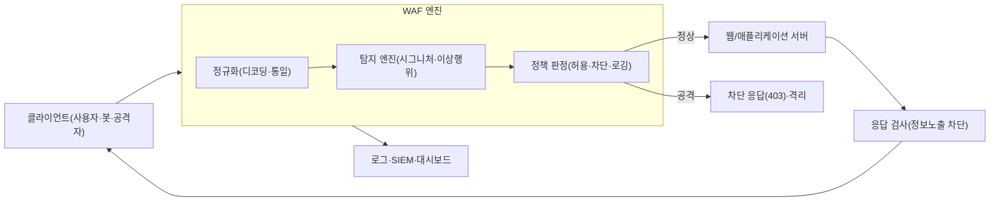
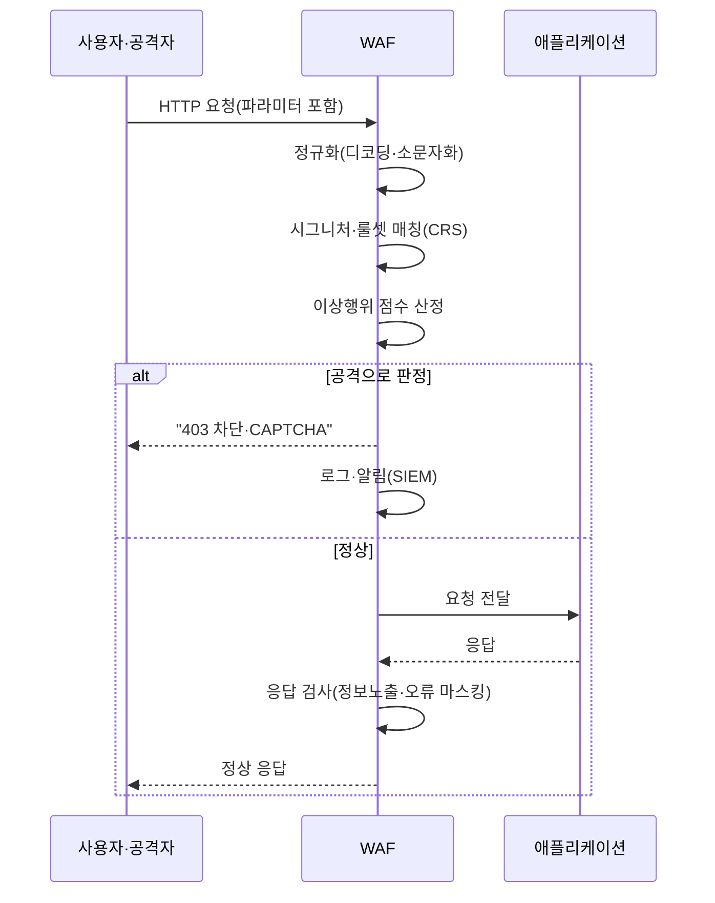

# WAF(Web Application Firewall, 웹 애플리케이션 방화벽)

## 1. 개요

### 가. 정의 및 등장 배경
> **WAF**는 HTTP/HTTPS 트래픽을 **애플리케이션 계층(L7)에서 해석**하여, SQL 인젝션·크로스사이트 스크립팅(XSS) 등 **웹 애플리케이션을 겨냥한 공격 패턴을 탐지·차단**하는 보안 장비 또는 서비스이다. 네트워크 방화벽이 포트·IP 수준에서 통로를 여닫는다면, WAF는 그 통로를 통과한 **요청의 내용(payload)과 문맥**을 이해하여 정상 요청과 공격 요청을 구별한다.

WAF가 등장한 근본 배경은 '**방어의 무게중심이 네트워크에서 애플리케이션으로 옮겨갔다**'는 인식의 전환에 있다. 전통적 네트워크 방화벽은 3·4계층에서 출발지 IP·목적지 포트를 기준으로 접근을 통제한다. 그러나 웹 서비스는 그 정의상 80/443 포트를 누구에게나 열어두어야 하고, 공격자는 정상 사용자와 똑같이 그 열린 문으로 들어온다. 즉 방화벽 관점에서 SQL 인젝션 요청과 로그인 요청은 **완전히 동일한 정상 HTTP 트래픽**으로 보인다. 공격이 페이로드 안에 숨어 있기 때문에, 그것을 걸러내려면 요청 본문을 파싱하여 `' OR 1=1--` 같은 악성 문자열이나 `<script>` 태그의 삽입을 이해해야 한다. 바로 이 '**내용을 이해해야만 판단할 수 있는 영역**'을 담당하기 위해 WAF가 태어났다.

또 하나의 배경은 **공격 표면의 이동을 보여준 통계**다. 오랜 기간 침해사고 분석에서 웹 애플리케이션 취약점은 외부 침해의 가장 흔한 진입 경로로 지목되어 왔으며, OWASP는 3~4년 주기로 `OWASP Top 10`을 통해 인젝션·인증 취약점·접근통제 미흡 등 웹 취약점을 표준화해 발표한다. 애플리케이션 코드를 완벽히 안전하게 짜는 것이 이상적이지만, 수백만 줄의 레거시 코드와 서드파티 라이브러리가 얽힌 현실에서 모든 취약점을 소스 수준에서 제거하기는 어렵다. WAF는 **취약점이 남아 있더라도 그것을 노리는 공격을 앞단에서 차단**함으로써, 근본 조치가 배포되기 전까지의 시간을 벌어주는 '**가상 패치(Virtual Patching)**' 수단으로 자리 잡았다.

### 나. 필요성
웹은 조직의 외부 노출 창구 중 가장 넓은 면적을 차지하며, 그만큼 공격이 집중된다. 규제 측면에서도 PCI-DSS는 카드정보를 다루는 웹 애플리케이션에 대해 **WAF 도입 또는 정기 코드 리뷰 중 하나를 의무화**하고, 국내 전자금융감독규정·정보보호 관리체계(ISMS-P)도 웹 보안 통제를 요구한다. 자체 코드 수정이 즉각 불가능한 취약점에 대해 신속히 대응할 수 있고, 알려지지 않은 봇·자동화 공격까지 완충한다는 점에서 WAF는 웹 서비스의 필수 방어 계층이 되었다.

### 다. WAF의 핵심 특징
WAF의 특징은 세 가지로 압축된다. 첫째는 **애플리케이션 문맥 인식(Context-aware)**으로, 단순 패킷이 아니라 HTTP 메서드·URL·헤더·쿠키·바디·파라미터의 의미를 해석해 판단한다. 둘째는 **양방향 검사(Bidirectional)**로, 들어오는 공격 요청뿐 아니라 나가는 응답에서 서버 오류·개인정보·소스코드가 노출되는 것까지 차단한다. 셋째는 **가상 패치를 통한 시간 확보(Shielding)**로, 취약점을 코드에서 제거하기 전이라도 그 취약점을 노리는 공격을 앞단에서 무력화하여 대응 시간을 벌어준다. 이 세 특징이 결합해, WAF는 '취약할 수밖에 없는 웹을 취약한 상태 그대로 운영하면서도 방어할 수 있게 하는' 현실적 보안 계층으로 기능한다.

## 2. WAF의 전체 구조와 배치 방식

WAF는 특정 알고리즘 하나가 아니라, **클라이언트와 웹 서버 사이에 위치하여 요청·응답을 양방향으로 검사**하는 프록시형 아키텍처로 이해해야 한다. 아래는 요청이 WAF를 통과하며 판정되는 전체 구조도이다.



WAF 처리의 출발점은 항상 '**정규화(Normalization)**'이다. 공격자는 탐지를 우회하기 위해 URL 인코딩·유니코드·이중 인코딩·대소문자 변형·주석 삽입 등으로 페이로드를 위장한다. 예를 들어 `SELECT`를 `SEL%45CT`나 `SeLeCt/**/`로 바꾸면 단순 문자열 비교는 이를 놓친다. 따라서 WAF는 검사에 앞서 요청을 디코딩·소문자화·공백 정리하여 **하나의 표준형으로 통일**한 뒤에야 탐지 엔진에 넘긴다. 정규화가 부실하면 그 위의 어떤 정교한 탐지 규칙도 우회당하므로, 정규화는 WAF 성능의 숨은 토대다. 이어 탐지 엔진이 요청을 검사하고, 정책 엔진이 허용·차단·로깅 중 하나로 판정하며, 응답 방향으로도 서버가 흘리는 오류 메시지·주민번호·카드번호 노출을 걸러낸다.

### 가. 세 가지 배치(Deployment) 방식
WAF를 관통하는 첫 번째 설계 결정은 '**트래픽 경로 어디에, 어떻게 끼워 넣을 것인가**'이다. **인라인 리버스 프록시(Reverse Proxy)** 방식은 WAF가 웹 서버 앞단에서 모든 트래픽을 종단(terminate)하고 대신 받아 검사한 뒤 서버로 전달한다. 요청·응답을 완전히 통제할 수 있어 차단·재작성·SSL 종료가 자유롭지만, WAF가 곧 단일 장애점(SPOF)이 되고 지연(latency)이 더해진다는 대가가 있다. 대부분의 상용 WAF와 클라우드 WAF가 이 방식을 취한다.

**투명 브리지/인라인(Transparent Bridge)** 방식은 WAF가 IP를 갖지 않고 네트워크 구간에 다리처럼 끼어 트래픽을 스니핑·차단한다. 기존 네트워크 구성을 바꾸지 않아 도입이 간편하지만 응답 재작성 같은 능동적 조작에는 제약이 있다. **아웃오브밴드(Out-of-Band)·미러링** 방식은 트래픽 복사본만 받아 탐지·로깅만 하고 실제 차단은 하지 않거나 TCP 리셋으로 사후 대응한다. 성능 영향이 없어 모니터링 목적에는 좋으나 실시간 차단력이 약하다.

실무에서는 서비스 중요도와 지연 허용치에 따라 이 세 방식을 조합한다. 예컨대 결제·로그인처럼 반드시 실시간 차단이 필요한 경로는 인라인 리버스 프록시로 종단하고, 지연에 민감한 대용량 콘텐츠 전송 구간은 미러링으로 탐지만 수행하는 식이다. 최근에는 애플리케이션 서버 내부에 모듈로 심는 **임베디드형**(예: 아파치의 `mod_security`, 엔진엑스 모듈)과, DNS만 서비스 제공자로 바꾸면 되는 **클라우드형 SaaS WAF**가 널리 쓰인다. 임베디드형은 서버 자원을 공유해 별도 장비가 없다는 장점이 있으나 서버 대수만큼 룰을 배포·관리해야 하고, 클라우드형은 전 세계 엣지에서 처리해 확장성이 뛰어나지만 트래픽이 외부를 경유한다는 특성이 있어, 배치 방식 선택 자체가 성능·비용·데이터 통제권을 가르는 아키텍처 의사결정이 된다.

### 나. 탐지 방식 — 네거티브·포지티브 보안 모델
WAF의 두 번째 핵심 원리는 '**무엇을 기준으로 정상과 공격을 가를 것인가**'이다. **네거티브 보안 모델(Blacklist)**은 '**알려진 나쁜 것을 막는다**'는 접근으로, SQL 인젝션·XSS 등의 공격 시그니처(패턴)를 등록해 두고 일치하는 요청을 차단한다. 도입이 쉽고 오탐(false positive)이 적지만, 시그니처에 없는 신종·변형 공격은 놓칠 수 있다(미탐, false negative). 오픈소스 룰셋인 `OWASP Core Rule Set(CRS)`이 대표적이며, ModSecurity 같은 엔진과 결합해 사용된다.

**포지티브 보안 모델(Whitelist)**은 정반대로 '**허용된 정상 요청만 통과시키고 나머지는 모두 막는다**'는 접근이다. 각 URL·파라미터가 받을 수 있는 자료형·길이·형식(예: 이메일 필드는 이메일 정규식만 허용)을 학습하거나 정의해 두고, 이 프로파일을 벗어나면 차단한다. 이론적으로 제로데이 공격까지 막을 수 있어 방어력이 가장 강하지만, 애플리케이션의 정상 동작을 빠짐없이 정의·학습해야 하므로 구축·유지 비용이 크고 오탐이 많아지기 쉽다. 실무 WAF는 두 모델을 병행하여, 공통 위협은 네거티브(CRS)로 폭넓게 막고 민감 URL은 포지티브로 촘촘히 조인다.

### 다. 이상행위·머신러닝 기반 탐지
세 번째 축은 '**패턴이 아니라 행위로 판단하는**' 이상행위(Anomaly) 탐지다. 시그니처 방식만으로는 정상 문법을 그대로 사용하는 크리덴셜 스터핑·스크래핑·비정상적 요청 폭주(L7 DDoS)를 구별하기 어렵다. 이에 현대 WAF는 세션당 요청 빈도, User-Agent 분포, 파라미터 값의 통계적 이탈, 요청 순서 등을 학습하여 '**평소와 다른 행동**'에 점수를 매기고 임계치를 넘으면 차단·챌린지(CAPTCHA·JS 검증)한다. 특히 사람과 봇을 구분하는 **봇 관리(Bot Management)**, 그리고 지능형 공격의 패턴 변화를 따라가는 ML 기반 적응형 룰이 최근 WAF의 차별화 지점으로 부상했다. 다만 학습 데이터가 편향되거나 정상 트래픽이 급변하면 오탐이 폭증하므로, 초기 일정 기간은 차단 없이 탐지·로깅만 하는 '**학습 모드**' 운영이 정석이다.

### 라. WAF 도입·튜닝 라이프사이클
WAF는 도입 시점보다 도입 이후의 운영이 성패를 가른다. 실무의 정착 절차는 대체로 다음 흐름을 따른다.

1. **자산·트래픽 식별**: 보호 대상 웹/API 엔드포인트를 목록화하고 정상 트래픽의 특성(파라미터·자료형·요청량)을 파악한다.
2. **탐지 전용(모니터링) 모드 운영**: 룰을 차단이 아닌 로깅만으로 일정 기간 가동해, 실제 트래픽에서 어떤 정상 요청이 룰에 걸리는지(오탐 후보) 관측한다.
3. **오탐 튜닝·예외 정의**: 관측된 오탐을 분석해 룰을 완화하거나 특정 URL·파라미터를 예외 처리하여 정상 업무를 방해하지 않도록 조정한다.
4. **차단 모드 전환**: 신뢰 수준이 확보된 룰부터 순차적으로 차단으로 전환하고, 위험도가 높은 공격군은 강하게 차단하되 애매한 룰은 보수적으로 적용한다.
5. **지속 갱신·관측**: 신규 CVE·공격 트렌드에 맞춰 룰셋을 갱신하고, SIEM 연계 대시보드로 공격 추세와 오탐률을 상시 모니터링하며 룰을 재조정한다.

이 순환에서 핵심은 '**차단을 서두르지 않는 것**'이다. 검증 없이 전면 차단부터 걸면 정상 거래가 막혀 서비스 신뢰가 무너지고, 운영팀은 룰을 통째로 꺼버리는 최악의 선택으로 내몰린다. 따라서 WAF는 SW 배포처럼 점진적·반복적으로 성숙시키는 **운영 프로세스 그 자체**로 다루어야 한다.

## 3. 주요 방어 대상 공격과 처리 흐름

WAF가 실제로 어떤 공격을 어떻게 막는지, OWASP Top 10을 중심으로 살펴본다. 아래는 요청 하나가 탐지·판정되는 프로세스 세부도이다.



대표적 방어 대상은 다음과 같다. **SQL 인젝션(SQLi)**은 입력값에 SQL 구문을 삽입해 DB를 조작·탈취하는 공격으로, WAF는 `UNION SELECT`, `' OR '1'='1`, 인라인 주석 등의 패턴과 문법 이탈을 탐지한다. **크로스사이트 스크립팅(XSS)**은 `<script>`·이벤트 핸들러·자바스크립트 URI를 응답에 심어 다른 사용자의 세션을 탈취하는 공격으로, 입력·출력 양방향에서 태그·인코딩을 검사한다. **경로 조작·파일 인클루전(LFI/RFI)**, **명령어 삽입(Command Injection)**, **XML 외부 개체(XXE)**, **서버측 요청 위조(SSRF)** 등도 각기 특징적 시그니처로 차단한다.

특히 실전에서 WAF의 가치를 입증한 사례가 **가상 패치**다. 2021년 말 전 세계를 강타한 `Log4Shell`(Apache Log4j의 원격코드실행, CVE-2021-44228) 사태에서, 수많은 조직이 라이브러리를 즉시 교체할 수 없는 상황에 놓였다. 이때 다수 기업은 `${jndi:ldap://` 형태의 악성 문자열을 탐지·차단하는 WAF 룰을 몇 시간 내 배포하여, 근본 패치가 적용되기 전까지 공격을 막아냈다. 이는 '코드를 고치지 못해도 공격은 막는다'는 WAF의 존재 이유를 상징적으로 보여준 사건이다. 동시에 이 사례는 한계도 드러냈는데, 공격자들이 `${${lower:j}ndi:` 처럼 문자열을 잘게 쪼개 룰을 우회하는 변종을 빠르게 만들어냈고, 방어 측은 정규화와 룰을 수차례 갱신해야 했다. 이는 뒤에서 다룰 '가상 패치는 임시방편'이라는 명제를 실증한다.

또 하나 실무에서 자주 인용되는 것이 **크리덴셜 스터핑·스크래핑 방어**다. 유출된 계정 목록을 대입하는 자동 로그인 시도는 문법상 완벽히 정상인 요청이라 시그니처로는 잡히지 않는다. 이때 WAF의 이상행위·봇 관리 기능이 IP·세션당 로그인 실패율, 단시간 요청 폭주, 헤더 지문(fingerprint)의 이상을 근거로 봇을 식별해 CAPTCHA·차단으로 대응한다. 특히 항공·이커머스에서 재고·가격을 긁어가는 스크래핑 봇, 티켓 매크로 등은 매출·서비스 품질에 직접 영향을 주므로, 최근 WAF 도입의 실질적 동기가 전통적 인젝션 방어에서 **봇·자동화 트래픽 관리**로 무게중심이 옮겨가고 있다.

한 가지 요청을 예로 처리 과정을 구체화하면 이해가 분명해진다. 공격자가 로그인 폼의 `id` 파라미터에 다음과 같은 값을 넣었다고 하자.

```
id=admin'%20OR%20'1'%3D'1&pw=x
```

WAF는 먼저 URL 인코딩된 `%20`(공백)과 `%3D`(=)를 디코딩하여 `admin' OR '1'='1`로 정규화한다. 이어 CRS의 SQLi 룰이 `' OR '1'='1` 이라는 항상 참(tautology)이 되는 전형적 인젝션 패턴과, 인용부호·논리연산자가 파라미터 값에 나타난 문법 이탈을 탐지한다. 이상행위 점수까지 합산해 임계치를 넘으면 요청은 애플리케이션(DB)에 닿기 전에 `403`으로 차단되고, 원본 페이로드·출발지 IP·매칭 룰 ID가 로그로 남아 SIEM 상관분석에 활용된다. 이처럼 WAF는 '**서버가 위험한 쿼리를 실행하기 전 단계에서 요청 자체를 무력화**'한다는 점에서 사후 탐지 도구와 근본적으로 다르다.

### 가. WAF와 유사·연계 기술 비교
WAF는 단독으로 완결되지 않으며 인접 보안 기술과의 역할 구분이 중요하다. 아래 표는 비교 정리이되, 그 차이가 생기는 이유를 함께 이해해야 한다.

| 구분 | 동작 계층 | 검사 대상 | 주 방어 목적 | WAF와의 관계 |
|------|-----------|-----------|--------------|--------------|
| 네트워크 방화벽 | L3/L4 | IP·포트·세션 | 통로 개폐 | WAF의 하위 계층, 상호 보완 |
| IPS(침입방지) | L3~L7 | 광범위 네트워크 공격 | 알려진 공격 시그니처 차단 | 웹 특화 깊이는 WAF가 우위 |
| WAF | L7(HTTP) | 요청/응답 페이로드·문맥 | 웹 앱 공격 차단 | 웹 애플리케이션 전담 |
| RASP | 앱 런타임 내부 | 실행 컨텍스트·데이터 흐름 | 실행 시점 공격 차단 | 문맥 정확도 높음, WAF와 병행 |
| API Gateway | L7(API) | API 스키마·인증·쿼터 | API 접근통제 | WAF 기능 일부 내장 추세 |

IPS와 WAF의 결정적 차이는 '**웹의 문맥을 이해하는가**'에 있다. IPS도 L7 시그니처를 갖지만 네트워크 전체를 넓게 훑는 데 초점이 있어, 세션·파라미터·인코딩이 얽힌 웹 공격의 미묘한 변형을 깊이 있게 해석하지 못한다.

반면 **RASP(Runtime Application Self-Protection)**는 애플리케이션 내부에서 실제 실행 경로와 데이터 흐름을 보므로 오탐이 적고 정확하지만, 언어·프레임워크에 종속되고 성능 부담이 있다. WAF가 애플리케이션 '바깥'에서 요청을 보고 추정한다면 RASP는 '안'에서 실제 실행 결과를 보고 판단하는 셈이어서, 둘은 경쟁 관계가 아니라 서로의 사각지대를 메우는 보완 관계다. 실무에서는 WAF로 앞단을 넓게 막고 RASP로 핵심 트랜잭션을 정밀 보강하는 **다층 방어(Defense in Depth)**가 권장되며, 여기에 시큐어 코딩·SAST/DAST 같은 개발 단계 통제까지 더해질 때 비로소 웹 보안이 완결된다.

## 4. 심화 — 클라우드 WAF와 WAAP로의 진화

최근 WAF 시장의 가장 큰 흐름은 **온프레미스 장비형에서 클라우드 기반 서비스형(SaaS WAF)으로의 전환**이다. AWS WAF, Azure WAF, Cloudflare, Akamai 등은 DNS를 서비스 제공자로 향하게만 하면 전 세계 엣지에서 트래픽을 검사·차단하며, CDN·L7 DDoS 방어와 결합해 대용량 공격도 흡수한다. 장비 도입·유지 부담이 없고 룰셋이 자동 업데이트된다는 장점 때문에 신규 서비스는 클라우드 WAF를 기본 선택으로 삼는 경우가 늘고 있다. 다만 트래픽이 제3자 인프라를 경유하므로 **SSL 복호화 지점의 신뢰 문제와 데이터 주권(Data Sovereignty)** 이슈, 그리고 벤더 종속(lock-in)이 새로운 고려사항으로 떠오른다.

또 하나의 진화는 개별 기능의 통합, 즉 **WAAP(Web Application and API Protection)**로의 확장이다. 가트너는 전통 WAF에 **봇 관리·L7 DDoS 방어·API 보안**을 통합한 개념으로 WAAP를 정의한다. API 우선(API-First) 아키텍처와 마이크로서비스가 보편화되면서, 사람이 보는 웹 페이지뿐 아니라 기계가 호출하는 API 엔드포인트가 새로운 공격 표면이 되었기 때문이다. API는 스키마(OpenAPI 명세)가 명확해 포지티브 모델을 적용하기 좋은 대상이며, WAAP는 스키마 검증·인증 토큰 검사·비정상 호출 탐지를 함께 수행한다. 이 관점에서 WAF는 독립 제품에서 **API 게이트웨이·CDN·제로 트러스트 접근제어와 융합하는 통합 엣지 보안 플랫폼**의 한 축으로 재편되고 있다.

예상 출제 방향으로는 ▲WAF의 탐지 모델(네거티브 vs 포지티브)의 트레이드오프를 서술하고 특정 상황에서의 선택을 논하라 ▲Log4Shell 등 실제 사례를 들어 가상 패치의 의미와 한계를 논하라 ▲클라우드 WAF 도입 시 SSL 복호화·데이터 주권 관점의 고려사항을 제시하라 ▲WAF·IPS·RASP를 비교하고 다층 방어 설계 방안을 제시하라 등이 유력하다.

## 5. 고려사항 및 시사점(기술사 관점)

WAF를 성공적으로 정착시키려면 '장비 도입'이 아니라 '운영 역량과 프로세스'의 관점에서 접근해야 한다. 기술사 답안에서는 다음의 트레이드오프와 전략을 함께 논해야 한다.

- **오탐과 미탐의 균형(정확도-가용성 트레이드오프)**: WAF의 최대 난제는 정상 사용자를 막는 오탐이다. 차단 룰을 강하게 걸수록 미탐은 줄지만 정상 거래가 막혀 매출·평판 손실로 이어진다. 따라서 신규 룰은 반드시 '탐지 전용 모드'에서 충분히 관측한 뒤 차단으로 전환하고, 예외(whitelist)를 세밀히 튜닝하는 **점진적 적용 전략**이 필요하다. WAF는 '설치하면 끝'이 아니라 **지속 튜닝이 전제된 운영형 통제**임을 인식해야 한다.

- **암호화 트래픽과 SSL/TLS 복호화**: 오늘날 트래픽의 대부분이 HTTPS이므로, WAF가 페이로드를 검사하려면 SSL을 복호화해야 한다. 이는 성능 부담과 함께 **복호화 지점에 평문 민감정보가 노출되는 새로운 위험**을 낳는다. 복호화 키 관리(HSM 연계), 검사 후 재암호화, PFS(Perfect Forward Secrecy) 환경에서의 검사 방식을 함께 설계해야 한다.

- **가상 패치는 임시방편이라는 한계 인식**: WAF의 룰 기반 차단은 근본 조치가 아니다. 공격자는 룰을 우회하는 변형을 끊임없이 시도하므로, 가상 패치로 시간을 번 뒤에는 반드시 **소스코드 수정·시큐어 코딩·SAST/DAST**로 취약점을 제거해야 한다. WAF를 이유로 코드 보안을 소홀히 하면 오히려 위험이 누적된다.

- **DevSecOps·관측가능성과의 통합**: WAF 룰도 코드처럼 버전관리·테스트·자동배포(Policy as Code) 대상으로 다루어야 배포 속도를 따라갈 수 있다. WAF 로그를 SIEM·SOAR와 연계하면 공격 탐지에서 대응·차단까지 자동화(플레이북)가 가능하고, 대시보드로 공격 추세를 관측해 룰을 선제적으로 조정할 수 있다.

- **성능·확장성과 SPOF 대응**: 인라인 WAF는 지연과 단일 장애점을 유발하므로, 이중화·오토스케일링·페일오픈/페일클로즈 정책을 명확히 정의해야 한다. 특히 페일오픈(장애 시 트래픽 통과)과 페일클로즈(장애 시 차단) 중 무엇을 택할지는 가용성과 보안 중 조직의 우선순위에 대한 경영적 판단이며, 서비스 특성에 따라 달라져야 한다.

- **규제·인증 준수와 책임 소명**: WAF는 PCI-DSS의 웹 보안 요건, ISMS-P의 웹 취약점 통제, 전자금융감독규정 등 컴플라이언스 대응 수단으로도 기능한다. 다만 감사 국면에서 의미를 가지려면 '차단했다'는 결과뿐 아니라 룰 변경 이력·차단 로그·예외 승인 기록이 함께 보존되어야 하므로, WAF 정책을 변경관리(형상관리) 체계 안에 편입해 누가·언제·왜 룰을 바꿨는지 추적 가능하게 유지해야 한다.

- **연계 기술 및 전망**: WAF는 제로 트러스트·CDN·API 게이트웨이·클라우드 네이티브 보안과 융합하며 WAAP·엣지 보안으로 수렴하고 있다. 생성형 AI를 활용한 공격 페이로드 자동 변형이 늘면서, 방어 측도 ML 기반 적응형 탐지와 위협 인텔리전스 연계를 강화하는 방향으로 진화할 전망이다. 다만 AI 기반 탐지는 판단 근거를 설명하기 어려운 블랙박스 문제를 안고 있어, 오탐 발생 시 원인 규명과 감사 대응을 위한 설명가능성(XAI) 확보가 향후 과제로 남는다.

## 참고자료
- OWASP, "Web Application Firewall" 및 "OWASP Top 10", https://owasp.org/www-project-top-ten/
- OWASP, "Core Rule Set (CRS)", https://coreruleset.org/
- OWASP, "Virtual Patching Best Practices", https://owasp.org/www-community/Virtual_Patching_Best_Practices
- Gartner, "Web Application and API Protection (WAAP)", https://www.gartner.com/en/information-technology/glossary/web-application-firewall-waf
- MITRE, "CVE-2021-44228 (Log4Shell)", https://nvd.nist.gov/vuln/detail/CVE-2021-44228

---
> **한 줄 요약**: WAF는 HTTP 트래픽을 L7에서 해석해 SQLi·XSS 등 웹 애플리케이션 공격을 정규화→시그니처(네거티브)·프로파일(포지티브)·이상행위 탐지로 차단하는 방어 계층으로, 가상 패치로 취약점 대응 시간을 벌어주며 클라우드 WAF·WAAP로 진화하되 오탐 튜닝·SSL 복호화·SPOF·코드 보안 병행이 핵심 과제다.
