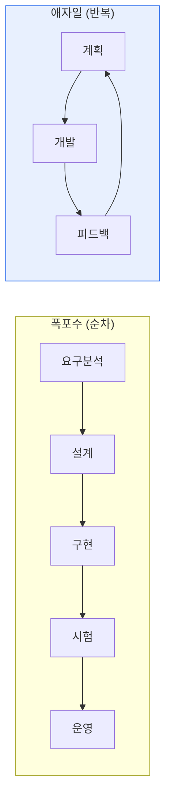

# 폭포수(Waterfall)와 애자일(Agile) 개발 방법론 비교

## 1. 개요

### 가. 정의
> **폭포수**는 요구분석→설계→구현→시험→운영을 순차적으로 진행하는 전통적 방법론이고, **애자일**은 짧은 반복(Iteration)으로 점진적으로 개발하며 변화에 유연하게 대응하는 방법론이다.

두 방법론의 근본 차이는 '**변화를 어떻게 다루는가**'에 있다. 폭포수는 앞 단계에서 요구를 확정하고 변화를 최소화해 예측가능성을 확보하는 반면, 애자일은 변화를 자연스러운 것으로 받아들여 반복마다 고객 피드백으로 방향을 수정한다.

## 2. 프로세스 비교

## 3. 특징 및 장단점 비교

| 구분 | 폭포수 | 애자일 |
|---|---|---|
| **진행** | 순차적·단계적 | 반복·점진적 |
| **요구변경** | 어려움(초기 확정) | 유연하게 수용 |
| **문서화** | 상세·중시 | 최소·동작 SW 중시 |
| **고객참여** | 초기·종료 중심 | 전 과정 지속 |
| **가시성** | 후반에 결과 확인 | 반복마다 결과 확인 |
| **장점** | 명확한 계획·관리 용이, 대규모·안정 요구 적합 | 변화 대응·빠른 가치 전달, 리스크 조기 발견 |
| **단점** | 변경 취약, 후반 결함 발견 시 비용 큼 | 대규모·계약형 부적합, 숙련도 의존 |

## 4. 선택 기준 및 시사점
- **폭포수**: 요구 명확·안정, 규제·안전(임베디드·공공) 프로젝트
- **애자일**: 요구 불확실·변화 빈번, 빠른 시장 대응(웹·서비스)
- 실무는 **하이브리드**(Water-Scrum-Fall), SAFe 등 대규모 애자일로 절충
- 방법론보다 **팀 역량·조직문화**가 성공을 좌우

---

> **한 줄 요약**: 폭포수는 *순차·계획 중심으로 예측가능성*, 애자일은 *반복·변화 대응 중심으로 유연성* 을 제공하며, 요구 안정성과 프로젝트 특성에 따라 선택하거나 하이브리드로 절충한다.
