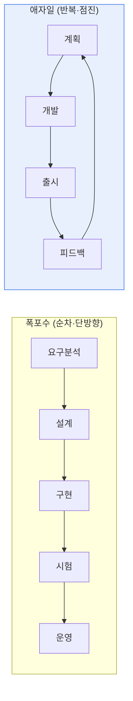

# 폭포수(Waterfall)와 애자일(Agile) 개발 방법론 비교

## 1. 개요

### 가. 정의
> **폭포수 모델**은 요구분석→설계→구현→시험→운영을 폭포가 떨어지듯 순차적·단방향으로 진행하는 전통적 방법론이고, **애자일**은 2~4주의 짧은 반복(Iteration/Sprint)으로 동작하는 소프트웨어를 점진적으로 만들며 변화에 유연하게 대응하는 방법론이다.

두 방법론의 대립은 결국 '**변화(Change)를 어떻게 바라보는가**'라는 철학의 차이로 귀결된다. 폭포수는 변화를 **비용과 위험**으로 간주하여, 앞 단계에서 요구를 완전히 확정하고 이후 변경을 통제·최소화함으로써 예측가능성을 확보하려 한다. 반면 애자일은 변화를 **피할 수 없고 오히려 가치 있는 것**으로 받아들여, 매 반복마다 실제 동작하는 결과물을 고객에게 보여주고 피드백으로 방향을 수정한다. 이 근본 관점의 차이가 문서화·고객 참여·리스크 관리 등 모든 실천 방식의 차이를 만든다.

### 나. 등장 배경
폭포수는 1970년대 대형·안정적 시스템(국방·제조) 개발에서 체계적 관리를 위해 정착했다. 그러나 요구가 자주 바뀌고 시장 출시 속도가 중요한 웹·모바일 시대가 오면서, "완벽한 계획은 불가능하다"는 인식에서 2001년 **애자일 선언(Agile Manifesto)** 이 등장했다. "계획을 따르기보다 변화에 대응하기, 문서보다 동작하는 소프트웨어를 중시한다"는 가치가 그 핵심이다.

## 2. 프로세스 구조 비교

폭포수에서는 각 단계가 완료되어야 다음으로 넘어가므로, 프로젝트 후반에야 완성품을 볼 수 있다. 이 구조의 치명적 약점은 **결함이나 요구 오해가 후반에 발견될수록 수정 비용이 기하급수적으로 커진다**는 점이다(요구단계 결함이 운영단계에서 수정될 때 비용이 수십~수백 배). 반면 애자일은 매 반복마다 작동하는 산출물이 나오므로, 문제와 오해를 **초기에·자주 발견**해 수정 비용을 낮춘다.

## 3. 특징 및 장단점 비교

폭포수의 장점은 계획·일정·산출물이 명확해 **관리와 감리가 쉽고**, 요구가 안정적인 대규모 프로젝트에서 예측가능성이 높다는 것이다. 단점은 변경에 취약하고 고객이 후반에야 결과를 확인해 방향 착오의 위험이 크다는 점이다. 애자일의 장점은 **변화 대응력과 빠른 가치 전달**, 리스크의 조기 발견이지만, 단점은 산출물·범위가 유동적이어서 대규모·계약형 사업에 적용이 어렵고 팀의 숙련도와 자율성에 성과가 크게 좌우된다는 점이다.

| 구분 | 폭포수 | 애자일 |
|---|---|---|
| **진행 방식** | 순차적·단계 완결형 | 반복·점진적 |
| **요구 변경** | 어려움(초기 확정·통제) | 유연하게 수용 |
| **문서화** | 상세·중시 | 최소화(동작 SW 우선) |
| **고객 참여** | 초기·종료 중심 | 전 과정 지속 참여 |
| **결과 확인** | 후반 일괄 | 반복마다 확인 |
| **장점** | 관리·감리 용이, 예측가능성 | 변화 대응, 빠른 가치·리스크 조기발견 |
| **단점** | 변경 취약, 후반 결함 고비용 | 범위 관리 난이도, 숙련도 의존 |

## 4. 선택 기준과 하이브리드

방법론에는 정답이 없고 **프로젝트 특성에 대한 적합성**이 있을 뿐이다. 요구가 명확하고 규제·안전성이 중요한 임베디드·공공·금융 코어 시스템은 폭포수(또는 V모델)가 적합하고, 요구가 불확실하고 시장 대응 속도가 중요한 웹·모바일 서비스는 애자일이 유리하다. 현실의 대규모 프로젝트는 상위 계획은 폭포수처럼, 개발은 애자일처럼 운영하는 **하이브리드(Water-Scrum-Fall)** 나 SAFe·LeSS 같은 **대규모 애자일 프레임워크**로 절충한다.

## 5. 고려사항 및 시사점

1. **방법론보다 팀 역량·조직문화가 성공을 좌우**한다. 애자일은 자율적·협력적 팀 문화가 전제되지 않으면 '이름만 애자일'이 되어 실패한다.
2. **문서화의 균형**이 필요하다. 애자일이 문서를 최소화한다고 해서 추적성·유지보수에 필요한 최소 문서까지 없애면 안 된다.
3. DevOps·CI/CD와 결합할 때 애자일의 '빠른 가치 전달'이 실제로 실현되며, 최근에는 이 결합이 표준이 되고 있다.

---

> **한 줄 요약**: 폭포수는 변화를 통제해 *예측가능성* 을, 애자일은 변화를 수용해 *유연성과 빠른 가치 전달* 을 추구하며, 요구 안정성·규제·시장속도 등 프로젝트 특성에 따라 선택하거나 하이브리드로 절충하되 성공의 관건은 팀 역량과 문화다.
