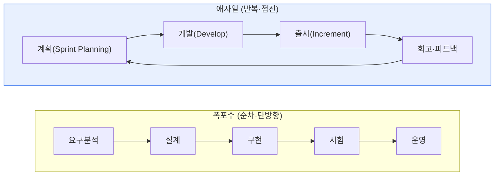
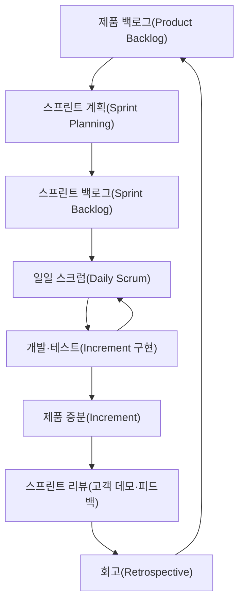

# 폭포수(Waterfall)와 애자일(Agile) 개발 방법론 비교

## 1. 개요

### 가. 정의

> **폭포수(Waterfall) 모델**은 요구분석→설계→구현→시험→운영의 단계를 폭포가 위에서 아래로 떨어지듯 순차적·단방향으로 진행하며, 각 단계가 완료·승인되어야 다음 단계로 이행하는 계획 주도(Plan-driven)·문서 중심의 전통적 개발 방법론이다.
>
> **애자일(Agile)**은 2~4주 단위의 짧은 반복(Iteration/Sprint)으로 '동작하는 소프트웨어(Working Software)'를 점진적으로 인도하고, 매 반복마다 고객 피드백을 받아 방향을 수정하는 변화 적응(Change-adaptive)·경험 주도(Empirical) 방법론이다.

두 방법론의 대립은 표면적으로는 '순차 대 반복'의 프로세스 차이처럼 보이지만, 그 뿌리는 **'변화(Change)를 어떻게 바라보는가'라는 철학의 차이**에 있다. 폭포수는 변화를 **비용과 위험의 원천**으로 간주한다. 따라서 앞 단계에서 요구사항을 최대한 완전하게 확정하고, 이후 발생하는 변경은 형상관리(Configuration Management)와 변경통제위원회(CCB)를 통해 통제·최소화함으로써 예측가능성(Predictability)을 확보하려 한다. 이 관점에서 좋은 프로젝트란 '계획대로 흘러가는 프로젝트'다.

반면 애자일은 변화를 **피할 수 없으며 오히려 경쟁 우위를 만드는 가치**로 받아들인다. 시장·기술·고객 요구가 프로젝트 기간 내에 반드시 바뀐다는 전제 위에서, 매 반복마다 실제 동작하는 결과물을 고객에게 보여주고 그 피드백으로 다음 계획을 재조정한다. 이 관점에서 좋은 프로젝트란 '계획을 잘 지킨 프로젝트'가 아니라 '가장 가치 있는 것을 가장 빨리 인도한 프로젝트'다. 이 근본 관점의 차이가 문서화 수준, 고객 참여 시점, 리스크 관리 방식, 품질 확보 전략 등 이후의 모든 실천(Practice) 차이를 파생시킨다는 점을 이해하는 것이 두 방법론 비교의 핵심이다.

### 나. 등장 배경과 필요성

폭포수 모델은 1970년 Winston Royce가 논문에서 제시한 순차 모델에서 유래했다. 흥미롭게도 Royce는 이 단선적 모델의 위험성을 경고하며 피드백 루프를 강조했으나, 실무에서는 관리·계약이 용이한 단방향 형태만 널리 채택되었다. 1970~80년대의 대형·안정적 시스템(국방, 항공, 제조 제어)에서는 요구가 비교적 명확하고 변경이 드물었기에, 단계별 산출물과 승인 게이트로 진척을 관리하는 폭포수가 잘 들어맞았다. 미국 국방부 표준(DoD-STD-2167A) 등이 이 방식을 제도화하면서 폭포수는 사실상 산업 표준이 되었다.

그러나 1990년대 후반 웹·인터넷의 확산으로 상황이 바뀌었다. 요구는 개발 도중에도 수시로 바뀌고, 시장 출시 속도(Time-to-Market)가 품질만큼 중요해졌으며, '완벽한 사전 계획은 불가능하다'는 인식이 퍼졌다. 이런 배경에서 2001년 17명의 소프트웨어 전문가가 모여 **애자일 선언(Agile Manifesto)**을 발표했다. 그 4대 가치는 ① 프로세스·도구보다 **개인과 상호작용**, ② 포괄적 문서보다 **동작하는 소프트웨어**, ③ 계약 협상보다 **고객과의 협력**, ④ 계획을 따르기보다 **변화에 대응하기**이다. 이 선언은 특정 기법이 아니라 XP·스크럼·칸반·FDD 등 여러 경량(Lightweight) 방법론을 아우르는 공통 가치 체계로서, 오늘날 소프트웨어 개발의 주류 패러다임이 되었다.

## 2. 프로세스 구조 비교

폭포수와 애자일의 가장 눈에 띄는 차이는 '완성품을 언제 볼 수 있는가'다. 아래 다이어그램은 두 방법론의 전체 흐름을 대비한 구조도다.

```mermaid
flowchart LR
  subgraph W["폭포수 (순차·단방향)"]
    direction LR
    W1["요구분석"] --> W2["설계"] --> W3["구현"] --> W4["시험"] --> W5["운영"]
  end
  subgraph A["애자일 (반복·점진)"]
    direction LR
    A1["계획(Sprint Planning)"] --> A2["개발(Develop)"] --> A3["출시(Increment)"] --> A4["회고·피드백"] --> A1
  end
  style A fill:#e8f0fe,stroke:#2f6fed
```

폭포수에서는 각 단계가 완료되어야 다음으로 넘어가므로, 실행 가능한 완성품은 프로젝트 **후반(시험 단계 이후)**에야 등장한다. 이 구조의 치명적 약점은 **결함이나 요구 오해가 후반에 발견될수록 수정 비용이 기하급수적으로 커진다**는 점이다. Barry Boehm의 비용 상승 곡선 연구에 따르면, 요구 단계에서 발견하면 1의 비용으로 고칠 결함이 설계 단계에서는 수 배, 운영 단계에서는 수십~수백 배의 비용을 요구한다. 요구를 잘못 이해한 채 6개월을 개발한 뒤에야 고객이 "이게 아니다"라고 말하는 상황이 폭포수의 전형적 실패 시나리오다.

반면 애자일은 매 스프린트가 끝날 때마다 '잠재적으로 출시 가능한 제품 증분(Potentially Shippable Increment)'을 산출한다. 따라서 문제·요구 오해를 **초기에, 그리고 자주** 발견하여 수정 비용을 낮춘다. 다만 이는 공짜가 아니다. 매 반복마다 계획·개발·통합·시험을 반복하므로 회의·조율 오버헤드가 발생하며, 누적된 증분이 일관된 아키텍처를 유지하도록 지속적인 리팩터링과 기술 부채 관리가 필요하다.

구체적 대비를 위해 12개월·10인 규모의 고객 포털 구축을 가정해 보자. 폭포수라면 처음 4개월을 요구·설계에 쓰고 5~10개월에 구현, 11~12개월에 통합시험을 수행하므로, 고객은 11개월째에야 실제 화면을 처음 마주한다. 이때 "검색이 이렇게 동작할 줄 몰랐다"는 피드백이 나오면 설계로 되돌아가야 하고, 남은 1개월로는 감당이 안 되어 일정·예산이 초과된다. 같은 프로젝트를 2주 스프린트 24회로 나눈 애자일이라면, 첫 달 안에 로그인·검색의 초기 버전을 시연하고 피드백을 받아 두 번째 스프린트에서 방향을 바로잡는다. 동일한 오해라도 발견 시점이 11개월째냐 1개월째냐에 따라 수정 비용이 수십 배 차이 난다는 점이 두 구조의 본질적 차이를 압축해 보여준다.

### 가. 애자일 반복(Sprint) 내부 흐름

애자일이 실제로 어떻게 동작하는지를 이해하려면 반복 하나의 내부를 들여다보아야 한다. 아래는 스크럼(Scrum)을 기준으로 한 스프린트 내부의 이벤트·산출물 흐름이다.

```mermaid
flowchart TD
  PB["제품 백로그(Product Backlog)"] --> SP["스프린트 계획(Sprint Planning)"]
  SP --> SB["스프린트 백로그(Sprint Backlog)"]
  SB --> DS["일일 스크럼(Daily Scrum)"]
  DS --> DEV["개발·테스트(Increment 구현)"]
  DEV --> DS
  DEV --> INC["제품 증분(Increment)"]
  INC --> REV["스프린트 리뷰(고객 데모·피드백)"]
  REV --> RETRO["회고(Retrospective)"]
  RETRO --> PB
```

이 흐름에서 각 요소는 고유한 역할을 한다. **제품 백로그**는 우선순위가 매겨진 요구 목록으로, 폭포수의 '요구명세서'와 달리 고정되지 않고 계속 다듬어진다(Grooming). **스프린트 계획**에서 팀은 이번 반복에 담을 항목을 스스로 선택(Pull)하는데, 이 자율적 선택이 팀의 몰입(Commitment)을 만든다. **일일 스크럼**은 15분 내외의 짧은 동기화 회의로, 진척과 장애물(Impediment)을 매일 공유해 문제를 하루 단위로 조기 노출한다. **스프린트 리뷰**에서 실제 동작하는 증분을 고객에게 시연하여 피드백을 받고, **회고**에서는 제품이 아니라 '팀의 일하는 방식'을 개선한다. 이처럼 애자일은 '검사와 적응(Inspect & Adapt)'이라는 경험적 프로세스 제어를 촘촘한 피드백 루프로 구현한 것이다.

## 3. 특징 및 장단점 비교

### 가. 폭포수의 강점과 약점

폭포수의 핵심 강점은 **관리·감리의 용이성과 예측가능성**이다. 단계별로 명확한 산출물(요구명세서, 설계서, 시험계획서)과 완료 기준이 정의되므로, 진척을 객관적으로 측정하고 외부 감리·감사에 대응하기 쉽다. 고정가(Fixed-price) 계약이나 공공 조달처럼 '무엇을, 언제까지, 얼마에'를 사전에 확정해야 하는 상황에서 이 예측가능성은 결정적 이점이 된다. 요구가 안정적인 대규모 시스템에서는 이 방식이 여전히 합리적이다.

약점은 이 강점의 이면이다. 요구를 초기에 확정한다는 전제가 현실에서 자주 깨지며, 변경이 들어오면 앞 단계로 거슬러 올라가야 하므로 비용이 크다. 무엇보다 고객이 **프로젝트 후반에야 결과물을 처음 본다**는 점이 방향 착오의 위험을 키운다. '문서상으로는 완벽했으나 막상 만들어보니 쓸모없는 시스템'이 폭포수의 대표적 실패 유형이다.

### 나. 애자일의 강점과 약점

애자일의 강점은 **변화 대응력과 빠른 가치 전달, 리스크의 조기 발견**이다. 우선순위가 높은 기능부터 인도하므로 고객은 프로젝트 초기부터 가치를 체감하고, 방향이 틀렸다면 큰 손실 전에 교정할 수 있다. 실패하더라도 '빨리, 싸게 실패(Fail Fast)'하여 학습으로 전환한다.

약점은 산출물·범위가 유동적이라는 데서 온다. 전체 범위와 종료 시점을 사전에 확정하기 어려워 고정가 계약·대규모 조달에 적용이 까다롭고, 문서 최소화 원칙이 오용되면 추적성·유지보수성이 훼손된다. 또한 성과가 **팀의 숙련도·자율성·협업 문화에 크게 좌우**되어, 지시·통제형 조직에 그대로 이식하면 '이름만 애자일(Fake Agile)'로 전락하기 쉽다.

품질 확보 방식의 차이도 짚을 만하다. 폭포수는 시험을 별도 단계로 분리해 완성 후 검증하는 '사후 품질(Quality Control)'에 가깝다면, 애자일은 테스트 주도 개발(TDD)·지속적 통합(CI)·페어 프로그래밍처럼 개발과 품질활동을 융합한 '내재 품질(Built-in Quality)'을 지향한다. 예컨대 매 커밋마다 자동화 테스트가 실행되는 CI 환경에서는 결함이 도입된 당일에 발견되어 수정 비용이 최소화된다. 이는 애자일이 '빠른 반복'을 유지할 수 있는 기술적 토대이자, 자동화 테스트 없이 애자일을 흉내 낼 때 품질이 급격히 무너지는 이유이기도 하다.

| 구분 | 폭포수 | 애자일 |
|---|---|---|
| **진행 방식** | 순차적·단계 완결형 | 반복·점진적 |
| **요구 변경** | 어려움(초기 확정·통제) | 유연하게 수용 |
| **문서화** | 상세·중시 | 최소화(동작 SW 우선) |
| **고객 참여** | 초기·종료 중심 | 전 과정 지속 참여 |
| **결과 확인** | 후반 일괄 | 반복마다 확인 |
| **계약 형태** | 고정가(Fixed-price) 적합 | 시간·재료(T&M)·점진 계약 적합 |
| **리스크 노출** | 후반 집중 | 초기·분산 |
| **성공 핵심** | 계획·문서 완성도 | 팀 역량·협업 문화 |
| **장점** | 관리·감리 용이, 예측가능성 | 변화 대응, 빠른 가치·리스크 조기발견 |
| **단점** | 변경 취약, 후반 결함 고비용 | 범위 관리 난이도, 숙련도 의존 |

### 다. V모델·나선형 모델과의 관계

폭포수는 고립된 하나의 모델이 아니라 여러 파생 모델의 원형이다. **V모델**은 폭포수의 각 개발 단계(요구·기본설계·상세설계)에 대응하는 시험 단계(인수시험·통합시험·단위시험)를 좌우 대칭으로 배치하여, 개발 초기부터 검증 계획을 함께 수립하도록 강제한 변형이다. 이는 폭포수의 '시험이 후반에 몰린다'는 약점을 보완하려는 시도로, 임베디드·의료·국방처럼 검증 추적성이 중요한 분야에서 널리 쓰인다. **나선형(Spiral) 모델**은 위험 분석을 매 주기의 중심에 두고 프로토타이핑을 반복하는 모델로, 폭포수의 계획성과 반복의 위험 관리를 결합한 애자일의 이론적 선구로 볼 수 있다.

이 계보를 이해하면 '폭포수 대 애자일'이 흑백 대립이 아니라 하나의 스펙트럼임을 알 수 있다. 순수 폭포수 → V모델 → 나선형 → 반복점진(RUP) → 애자일로 이어지는 흐름은 '계획의 완결성'에서 '위험의 조기 해소와 적응'으로 무게중심이 점진적으로 옮겨온 역사다. 따라서 실무의 선택은 이 스펙트럼 위 어느 지점을 취할 것인가의 문제이지, 둘 중 하나를 배타적으로 고르는 문제가 아니다.

표만으로는 '왜' 이런 차이가 생기는지 알 수 없다. 예컨대 '문서화' 항목의 차이는 단순한 취향이 아니라, 폭포수가 '단계 간 지식 전달을 문서로 한다'는 전제에, 애자일이 '동일 팀의 대면 대화로 지식을 전달한다'는 전제에 서 있기 때문이다. 문서화 수준의 차이는 곧 지식 전달 메커니즘의 차이에서 비롯된 필연적 귀결이다.

## 4. 선택 기준과 하이브리드 전략

### 가. 상황별 선택 기준

방법론에는 우열이 아니라 **프로젝트 특성에 대한 적합성(Fit)**이 있을 뿐이다. 선택의 핵심 변수는 ① 요구의 불확실성, ② 규제·안전성 수준, ③ 시장 대응 속도, ④ 계약 형태, ⑤ 팀의 성숙도다. 요구가 명확하고 규제·인증(예: 의료기기 IEC 62304, 항공 DO-178C, 금융 코어)이 중요한 임베디드·공공·안전필수 시스템은 폭포수(또는 검증을 강화한 V모델)가 적합하다. 반대로 요구가 불확실하고 빠른 실험·출시가 중요한 웹·모바일·스타트업 서비스는 애자일이 유리하다.

여기서 가장 결정적인 단일 변수를 꼽자면 **요구의 불확실성**이다. 요구가 안정적이면 사전 계획의 정확도가 높아 폭포수의 예측가능성이 그대로 이점이 되지만, 요구가 불확실하면 아무리 정교한 계획도 곧 무효가 되어 계획 수립에 들인 노력이 매몰비용이 된다. 이 때문에 '요구가 얼마나 확정적인가'를 착수 전에 냉정하게 진단하는 것이 방법론 선택의 출발점이며, 불확실성이 높은데도 관리 편의를 이유로 폭포수를 택하는 것이 현장에서 가장 빈번한 오판이다.

### 나. 하이브리드와 대규모 애자일

현실의 대규모 프로젝트는 양극단 사이의 절충을 택한다. 상위 거버넌스·예산·마일스톤은 폭포수처럼 계획하고, 실제 개발은 애자일처럼 반복하는 **워터-스크럼-폴(Water-Scrum-Fall)**이 대표적이다. 조직 전체로 애자일을 확장할 때는 **SAFe(Scaled Agile Framework)**, **LeSS(Large-Scale Scrum)**, **Spotify 모델(Squad·Tribe·Chapter·Guild)** 같은 대규모 프레임워크가 사용된다. 예를 들어 SAFe는 여러 팀을 하나의 '애자일 릴리스 트레인(ART)'으로 묶고 8~12주 단위의 'PI(Program Increment) 플래닝'으로 다수 팀의 계획을 동기화하여, 애자일의 유연성과 대규모 조직의 정렬(Alignment)을 동시에 추구한다. 다만 프레임워크 도입 자체가 애자일을 보장하지 않으며, 오히려 절차가 무거워지는 역설을 경계해야 한다.

### 다. 잘못된 적용의 안티패턴

방법론 선택보다 더 흔한 실패는 '선택은 맞았으나 적용이 틀린' 경우다. 폭포수 쪽의 대표적 안티패턴은 **문서를 위한 문서**로, 아무도 읽지 않는 산출물을 형식적으로 채우느라 정작 설계·검증에 쓸 시간을 소모하는 것이다. 요구를 초기에 '완전히' 확정하려는 강박이 분석 마비(Analysis Paralysis)를 낳아 착수가 지연되는 것도 같은 뿌리의 문제다.

애자일 쪽의 대표적 안티패턴은 **'이름만 애자일(Fake Agile)'**이다. 일일 스크럼이 진척 보고·질책의 자리로 변질되거나, 자율적 팀이 아니라 위에서 스프린트 범위를 강제 할당하거나, 회고에서 나온 개선안이 실행되지 않고 반복되는 경우가 그렇다. 또 하나는 **문서 최소화의 오용**으로, 유지보수·인수인계에 필요한 최소한의 아키텍처 결정 기록(ADR)조차 남기지 않아 기술 부채가 누적되는 것이다. 이런 안티패턴은 방법론 자체의 결함이 아니라 문화·리더십의 문제이므로, 방법론 전환 시 조직의 일하는 방식과 평가·보상 체계를 함께 바꾸어야 한다는 점을 일깨운다.

## 5. 심화: 최신 동향과 실무 적용 사례

방법론 논쟁은 2010년대 이후 **DevOps·CI/CD와의 결합**으로 새로운 국면에 접어들었다. 애자일이 '무엇을, 왜, 어떤 순서로 만들 것인가'를 다룬다면, DevOps는 '만든 것을 어떻게 안정적으로·자주 배포할 것인가'를 다룬다. 이 둘이 결합되어야 애자일의 '빠른 가치 전달'이 데모 단계가 아니라 실제 운영 환경으로 이어진다. 구글의 DORA(DevOps Research and Assessment) 연구는 배포 빈도, 변경 리드타임, 변경 실패율, 평균 복구시간(MTTR)이라는 네 가지 지표로 소프트웨어 전달 성과를 측정하며, 고성과 조직은 하루에도 여러 번 배포하면서 낮은 실패율을 유지함을 보였다. 이는 '자주 배포하면 불안정하다'는 통념과 반대로, 작게·자주 배포할수록 오히려 안정적이라는 애자일·DevOps의 핵심 통찰을 데이터로 뒷받침한다.

실무 사례를 보면 방법론 선택의 논리가 분명해진다. 넷플릭스·아마존 같은 기업은 마이크로서비스와 CI/CD 파이프라인 위에서 하루 수천 회 배포하는 극단적 애자일·DevOps를 실천하는데, 이는 서비스 요구가 빠르게 변하고 실패 비용이 국지적이기 때문이다. 반대로 항공기 비행제어 소프트웨어(DO-178C 인증 대상)나 원자력 제어 시스템은 변경 하나가 인명과 직결되므로, 광범위한 사전 검증과 추적성을 요구하는 계획 주도 방식을 유지한다. 최근에는 규제 산업에서도 문서·검증은 엄격히 하되 개발은 반복적으로 진행하는 '규율 있는 애자일(Disciplined Agile, DA)'이 확산되고 있어, 두 방법론은 대립이 아니라 스펙트럼 위에서 상황에 맞게 조합되는 방향으로 수렴하고 있다.

전환의 교훈을 보여주는 사례도 있다. 초기 애자일 확산기에 건강보험 포털처럼 대규모·다조직·엄격한 마감을 가진 공공 시스템이 준비 없이 애자일을 표방했다가, 통합·거버넌스 부재로 초기 가동에 실패한 사례들이 보고되었다. 이런 경험은 '애자일이 만능'이라는 순진한 기대를 걷어내고, 대규모에서는 팀 간 통합·아키텍처 정렬·릴리스 조율 같은 규율이 반드시 병행되어야 함을 일깨웠다. 반대로 요구가 빠르게 변하는 소비자 서비스에 폭포수를 고집하다 출시 시점에 이미 시장이 바뀌어 있는 실패도 흔하다. 두 실패 모두 '방법론 자체'가 아니라 '특성에 맞지 않는 선택'에서 비롯된다는 공통점을 갖는다.

또한 최근에는 AI 코딩 어시스턴트와 생성형 AI의 확산으로 개발 반복 주기가 더욱 짧아지면서, 요구·설계 단계에서도 프로토타입을 빠르게 만들어 검증하는 '애자일적 탐색'의 비중이 커지고 있다. 이는 방법론의 무게중심이 '계획의 완성도'에서 '학습과 적응의 속도'로 더욱 이동하고 있음을 시사한다(단, 산업·조직별 편차가 크므로 일반화에는 주의가 필요하다).

## 6. 고려사항 및 시사점 (기술사 관점)

1. **방법론보다 팀 역량·조직문화가 성공을 좌우한다.** 애자일은 자율적·협력적 팀 문화, 실패를 학습으로 받아들이는 심리적 안전감이 전제되지 않으면 '이름만 애자일'로 실패한다. 도구·프로세스 도입에 앞서 조직의 성숙도를 진단하고 점진적으로 전환하는 변화관리(Change Management)가 선행되어야 한다.

2. **문서화의 균형을 설계해야 한다.** 애자일의 문서 최소화는 '불필요한 문서를 없애자'는 것이지 '문서를 없애자'는 것이 아니다. 추적성·유지보수·감사 대응에 필요한 '충분히 좋은(Barely Sufficient)' 문서 수준을 프로젝트 특성에 맞게 정의하는 것이 기술사의 판단 영역이다.

3. **계약·거버넌스와의 정합성을 확보해야 한다.** 고정가·확정범위 계약에 애자일을 그대로 적용하면 범위 통제와 정산에서 충돌이 발생한다. 점진 인도에 맞는 계약 모델(단계별 정산, 백로그 기반 T&M, 성과 기반 계약)과 예산·감리 체계를 함께 설계해야 방법론이 작동한다.

4. **DevOps·CI/CD·자동화 테스트와의 결합이 필수다.** 애자일의 빠른 반복은 수작업 배포·테스트로는 지속 불가능하다. 지속적 통합·배포 파이프라인, 자동화 테스트, 인프라 코드화(IaC), 관측성(Observability)을 함께 구축해야 '빠른 가치 전달'이 실제 운영으로 이어진다.

5. **하이브리드는 '절충'이 아니라 '설계' 대상이다.** 단순히 상위는 폭포수·하위는 애자일로 나누는 것을 넘어, 어느 계층에서 계획을 고정하고 어느 계층에서 적응을 허용할지를 리스크·규제·시장속도에 근거해 의도적으로 설계해야 한다. 무원칙한 혼용은 두 방법론의 단점만 결합한 결과를 낳는다.

## 참고자료
- Agile Manifesto, https://agilemanifesto.org/
- Scrum Guide (2020), https://scrumguide.org/
- Scaled Agile Framework (SAFe), https://scaledagileframework.com/
- Google Cloud DORA / DevOps 연구, https://dora.dev/

---

> **한 줄 요약**: 폭포수는 변화를 통제해 *예측가능성* 을, 애자일은 변화를 수용해 *유연성과 빠른 가치 전달* 을 추구하는 상반된 철학의 방법론으로, 요구 안정성·규제·시장속도·계약형태에 따라 선택하거나 Water-Scrum-Fall·SAFe 등으로 절충하며, DevOps·CI/CD와의 결합과 팀 역량·조직문화가 궁극적 성공을 좌우한다.
