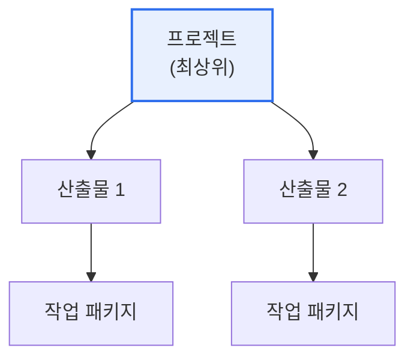

# 작업분류체계(WBS, Work Breakdown Structure)

## 1. 개요

### 가. 정의
> 프로젝트의 **전체 범위(산출물)를 관리 가능한 작은 작업 단위로 계층적으로 분해**한 구조. 범위·일정·비용·자원 관리의 기준선(Baseline)이 되는 프로젝트 관리의 핵심 도구다.

WBS의 본질은 '**거대하고 막연한 프로젝트를 다룰 수 있는 크기로 잘게 쪼개는 것**'이다. "정보시스템을 구축한다"는 큰 목표는 그 자체로는 일정도 비용도 산정할 수 없다. WBS는 이를 최상위 산출물에서 시작해 하위 산출물, 그리고 실제 수행 가능한 최소 단위인 **작업 패키지(Work Package)** 까지 나무 형태로 분해한다. 이렇게 잘게 나누면 각 작업의 기간·비용·담당자를 구체적으로 산정할 수 있고, 진척을 측정하며, 누락 없이 전체를 통제할 수 있다. 중요한 것은 WBS가 '할 일(활동)'이 아니라 '**만들 것(산출물·결과물)**' 중심으로 분해된다는 점으로, 이 산출물 지향이 범위를 명확히 하고 누락을 방지한다.

### 나. 필요성
프로젝트가 크고 복잡할수록 무엇을 얼마나 해야 하는지 파악이 어렵고 범위가 흐트러진다. WBS는 범위를 가시화·구조화해 계획·통제의 기준선을 제공하고, 이해관계자 간 공통 이해를 만든다.

## 2. WBS 작성 원칙

WBS 작성에는 지켜야 할 원칙이 있다. 가장 중요한 것은 **100% 규칙** 으로, 하위 요소의 합이 상위 요소를 100% 완전히 표현해야 하며 빠짐도 중복도 없어야 한다. 또한 각 요소는 **상호 배타적(중복 없음)** 이어야 하고, 활동이 아닌 **산출물(결과물) 중심** 으로 분해하며, 진척 측정이 가능한 수준까지 나눈다.

| 원칙 | 내용 |
|---|---|
| **100% 규칙** | 하위 합 = 상위 100%(누락·초과 없음) |
| **상호 배타성** | 요소 간 중복 없음(MECE) |
| **산출물 중심** | 활동이 아닌 결과물로 분해 |
| **적정 분해 수준** | 진척·비용 측정 가능한 작업 패키지까지 |

## 3. WBS 작성 장점과 고려사항

| 구분 | 내용 |
|---|---|
| **장점** | 범위 명확화·누락 방지, 일정·비용 산정 기준, 진척·통제 용이, 책임(RAM) 배정 |
| **고려사항** | 과도·과소 분해 지양, 이해관계자 참여, 변경관리 반영, WBS 사전(Dictionary) 병행 |

WBS의 장점은 프로젝트 관리 전반의 기준선을 제공한다는 데 있다. 범위가 명확해져 누락을 막고, 각 작업 패키지 단위로 일정·비용을 산정하며, 진척을 측정하고, 책임을 배정(RAM·RACI)할 수 있다. 다만 너무 잘게 쪼개면 관리 부담이 커지고 너무 크게 두면 통제가 안 되므로 적정 수준을 찾아야 한다.

## 4. 일정 지연 시 만회대책 및 사례

WBS 기반으로 일정 지연이 감지되면 대책을 강구한다. 대표적으로 **공정 압축(Crashing)** 은 자원을 추가 투입해 기간을 단축하는 것(비용 증가)이고, **공정 중첩(Fast Tracking)** 은 순차 작업을 병렬로 진행하는 것(리스크 증가)이다. 예를 들어 설계가 지연되면, 인력을 추가해 설계를 서두르거나(Crashing), 설계 완료 전에 개발을 일부 착수(Fast Tracking)해 만회한다.

| 만회대책 | 내용 | 대가 |
|---|---|---|
| **공정 압축(Crashing)** | 자원 추가로 기간 단축 | 비용 증가 |
| **공정 중첩(Fast Tracking)** | 순차 작업 병렬화 | 리스크 증가 |
| **범위 조정** | 우선순위 낮은 범위 축소·연기 | 산출물 감소 |

## 5. 고려사항 및 시사점

1. **모든 계획의 기준선**이다. WBS 없이는 일정(간트·CPM)·비용·자원 계획이 불가능하므로, 정확한 WBS 작성이 프로젝트 성공의 출발점이다.
2. **WBS 사전(Dictionary)을 병행**한다. 각 작업 패키지의 상세(내용·산출물·담당·기간)를 기술한 사전을 함께 관리해야 실행 가능한 계획이 된다.
3. **애자일에서의 변형**을 이해한다. 애자일은 WBS 대신 제품 백로그·스토리 분해를 쓰지만, 범위를 관리 가능한 단위로 나눈다는 원리는 동일하다.

---

> **한 줄 요약**: WBS는 *프로젝트 범위를 산출물 중심으로 작업 패키지까지 계층 분해* 한 구조로, 100% 규칙·상호배타성을 지켜 일정·비용·진척 관리의 기준선을 제공하며, 지연 시 공정 압축·중첩으로 만회한다.
