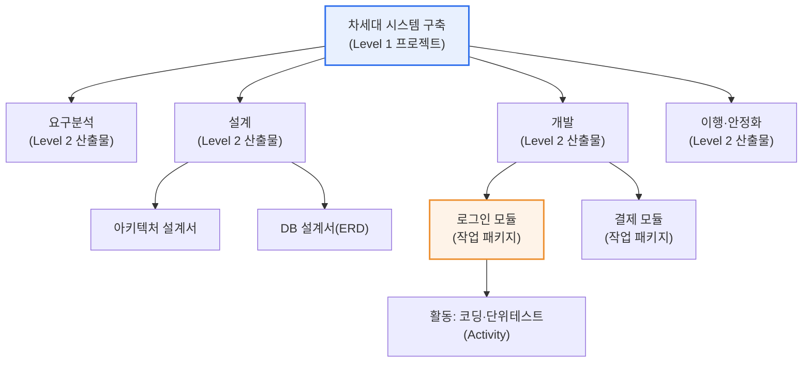

# 작업분류체계(WBS, Work Breakdown Structure)

## 1. 개요

### 가. 정의
> 프로젝트의 **전체 범위(산출물)를 관리 가능한 작은 작업 단위로 계층적으로 분해**한 결과물 지향(Deliverable-oriented)의 계층 구조. 범위·일정·비용·자원·품질·리스크 관리의 기준선(Baseline)이 되는 프로젝트 관리의 핵심 도구다.

WBS의 본질은 '**거대하고 막연한 프로젝트를 다룰 수 있는 크기로 잘게 쪼개는 것**'이다. "차세대 정보시스템을 구축한다"는 큰 목표는 그 자체로는 일정도 비용도 산정할 수 없다. 범위가 추상적으로 남아 있는 한 담당자를 지정할 수도, 진척률을 계산할 수도 없기 때문이다. WBS는 이를 최상위 산출물에서 시작해 하위 산출물, 그리고 실제 수행 가능한 최소 단위인 **작업 패키지(Work Package)** 까지 나무(tree) 형태로 분해한다. 이렇게 잘게 나누면 각 작업의 기간·비용·담당자를 구체적으로 산정할 수 있고, 진척을 객관적으로 측정하며, 누락 없이 전체를 통제할 수 있다.

여기서 가장 중요한 원리는 WBS가 '**할 일(활동, activity)**'이 아니라 '**만들 것(산출물·결과물, deliverable)**' 중심으로 분해된다는 점이다. 예컨대 "코딩한다"가 아니라 "로그인 모듈", "결제 모듈"과 같이 결과물로 나눈다. 이 산출물 지향은 두 가지 실무적 효과를 낳는다. 첫째, 완성 여부를 눈으로 확인할 수 있는 명확한 완료 기준(Definition of Done)을 준다. 활동은 "얼마나 했는가"가 모호하지만 산출물은 "만들어졌는가"로 판정된다. 둘째, "무엇을 빠뜨렸는가"를 산출물 목록으로 대조할 수 있어 범위 누락을 구조적으로 방지한다. 활동 중심으로 쪼개면 쉽게 중복·누락이 발생하지만, 산출물 중심으로 쪼개면 상위-하위의 포함 관계가 명확해진다.

### 나. 등장 배경 및 필요성
프로젝트가 크고 복잡할수록 무엇을 얼마나 해야 하는지 파악이 어렵고 범위가 흐트러진다. 특히 SI·SM처럼 산출물이 무형(無形)의 소프트웨어인 IT 프로젝트에서는 진척을 눈으로 확인하기 어려워, 명확한 분해 기준이 없으면 "90%는 다 됐다"는 보고가 프로젝트 끝까지 반복되는 이른바 **90% 신드롬**에 빠지기 쉽다. WBS는 이러한 모호함을 제거하기 위해 등장했다. 범위를 가시화·구조화해 계획·통제의 기준선을 제공하고, 발주자·PM·개발자 등 이해관계자 간에 "이 프로젝트가 무엇을 만드는가"에 대한 **공통의 언어와 합의**를 만든다.

또한 WBS는 프로젝트 관리 지식체계에서 다른 모든 계획의 입력물(input) 역할을 한다. 일정(간트 차트·CPM), 비용(원가 기준선), 자원(RAM), 리스크, 품질 계획은 모두 WBS의 작업 패키지를 출발점으로 삼는다. 따라서 WBS가 부실하면 이후의 모든 계획이 부실해지는 연쇄 효과가 발생하며, 반대로 견고한 WBS는 프로젝트 통제 전반의 토대가 된다.

## 2. WBS의 계층 구조와 구성 요소

프로젝트 전체를 뿌리(root)로 두고, 아래로 내려갈수록 구체적인 산출물로 분해되며, 최하단에 실제 관리 단위인 작업 패키지가 놓인다. 각 레벨은 상위의 산출물을 100% 온전히 표현하도록 구성된다.

```mermaid
flowchart TB
  P["차세대 시스템 구축<br/>(Level 1 프로젝트)"]
  P --> A["요구분석<br/>(Level 2 산출물)"]
  P --> B["설계<br/>(Level 2 산출물)"]
  P --> C["개발<br/>(Level 2 산출물)"]
  P --> D["이행·안정화<br/>(Level 2 산출물)"]
  B --> B1["아키텍처 설계서"]
  B --> B2["DB 설계서(ERD)"]
  C --> C1["로그인 모듈<br/>(작업 패키지)"]
  C --> C2["결제 모듈<br/>(작업 패키지)"]
  C1 --> C1a["활동: 코딩·단위테스트(Activity)"]
  style P fill:#e8f0fe,stroke:#2f6fed,stroke-width:2px
  style C1 fill:#fef3e8,stroke:#ed8f2f,stroke-width:2px
```

WBS는 여러 구성 요소가 맞물려 하나의 관리 체계를 이룬다. 각 요소는 단순한 명칭이 아니라 관리상 서로 다른 역할을 담당하므로, 그 의미를 구분해 이해하는 것이 중요하다.

**작업 패키지(Work Package)** 는 WBS의 최하위 요소로, 일정·비용을 산정하고 진척을 측정하며 책임을 배정하는 **관리의 기본 단위**다. 작업 패키지보다 더 아래로 내려가면 그것은 WBS가 아니라 일정 계획 영역의 활동(activity)이 된다. 즉 WBS는 '무엇을 만드는가(산출물)'에서 멈추고, '그것을 어떻게 만드는가(활동·순서)'는 후속 일정 계획이 담당한다는 경계가 존재한다. 실무에서는 하나의 작업 패키지가 통상 한 명(또는 한 팀)에게 배정되고, 명확한 완료 기준과 예산을 갖도록 설계한다.

**통제 계정(Control Account)** 은 여러 작업 패키지를 묶어 성과를 측정·통제하는 상위 관리 지점이다. 획득가치관리(EVM)에서 계획가치(PV)·획득가치(EV)·실제원가(AC)를 집계하는 단위가 바로 이 통제 계정이며, 원가·일정 성과를 이 수준에서 통합해 본다. 작업 패키지가 실행의 단위라면 통제 계정은 성과 측정의 단위인 셈이다.

**WBS 사전(WBS Dictionary)** 은 각 작업 패키지의 상세 정보를 담은 문서다. 작업 내용, 산출물, 담당자, 예상 기간·원가, 선행 작업, 인수 기준(acceptance criteria), 관련 계약 정보 등을 기술한다. WBS 그림만으로는 이름표에 불과하므로, WBS 사전이 병행되어야 비로소 실행 가능한 계획이 된다. 현장에서 WBS를 그렸는데도 계획이 겉도는 흔한 원인이 바로 이 사전의 부재다.

**WBS 코드(Code of Accounts)** 는 각 요소에 부여하는 계층적 식별번호(예: 1.3.2)로, 산출물과 원가·일정 정보를 시스템적으로 연결하고 상위-하위 관계를 추적하는 열쇠가 된다.

| 구성 요소 | 역할 | 관리상 의미 |
|---|---|---|
| **작업 패키지** | 최하위 산출물 단위 | 일정·비용 산정, 진척 측정, 책임 배정의 기본 단위 |
| **통제 계정** | 작업 패키지의 묶음 | EVM 성과(PV·EV·AC) 측정·통합 지점 |
| **WBS 사전** | 작업 패키지 상세 명세 | 실행 가능성 확보(내용·기준·담당·기간) |
| **WBS 코드** | 계층적 식별번호 | 산출물-원가-일정 연계 및 추적 |

## 3. WBS 작성 원칙과 절차

### 가. 작성 원칙
WBS는 임의로 그리는 그림이 아니라 지켜야 할 규칙이 있다. 가장 근본적인 것은 **100% 규칙(100% Rule)** 으로, 하위 요소의 합이 상위 요소를 100% 완전하게 표현해야 하며 빠짐도 초과도 없어야 한다는 원칙이다. 이는 상향(더 이상 필요 없는 작업을 넣지 않음)과 하향(빠뜨린 작업이 없음) 양방향으로 적용된다. 100% 규칙이 지켜지지 않으면 범위 기준선 자체가 어긋나 이후의 모든 통제가 무의미해진다.

두 번째 원칙은 요소 간 **상호 배타성(Mutually Exclusive)** 으로, 같은 작업이 두 산출물에 중복 포함되지 않아야 한다. 중복이 있으면 원가·공수가 이중 계상되고 책임 경계가 흐려진다. 이는 논리적 분류의 MECE(Mutually Exclusive, Collectively Exhaustive) 원칙과 정확히 대응한다.

세 번째는 앞서 강조한 **산출물(결과물) 중심 분해**이며, 네 번째는 **적정 분해 수준(적정 입도)** 이다. 너무 잘게 쪼개면(과대 분해) 관리 오버헤드가 폭증하고, 너무 크게 두면(과소 분해) 진척과 원가를 통제할 수 없다. 실무에서는 흔히 **8/80 규칙**(하나의 작업 패키지가 약 8시간~80시간, 즉 1일~2주 분량)을 경험적 기준으로 삼거나, "한 번의 보고 주기 안에 완료 여부를 판정할 수 있는가"를 잣대로 삼는다. 예를 들어 2주 단위로 진척을 보고하는 프로젝트라면, 작업 패키지도 2주 안에 끝나는 크기로 맞추는 것이 통제에 유리하다.

| 원칙 | 내용 | 위반 시 문제 |
|---|---|---|
| **100% 규칙** | 하위 합 = 상위 100%(누락·초과 없음) | 범위 기준선 붕괴, 통제 불가 |
| **상호 배타성(MECE)** | 요소 간 중복 없음 | 원가·공수 이중 계상, 책임 모호 |
| **산출물 중심** | 활동이 아닌 결과물로 분해 | 완료 판정·누락 점검 곤란 |
| **적정 분해 수준(8/80)** | 진척·비용 측정 가능한 크기 | 과대: 오버헤드 / 과소: 통제 불가 |

### 나. 작성 절차와 접근 방식
WBS 작성은 크게 **하향식(Top-down)** 과 **상향식(Bottom-up)** 으로 접근한다. 하향식은 프로젝트 전체에서 시작해 점차 세부 산출물로 쪼개 내려가는 방식으로, 범위가 비교적 명확한 프로젝트에 적합하다. 상향식은 팀원이 떠올린 상세 작업을 브레인스토밍으로 모아 상위 범주로 묶어 올라가는 방식으로, 신규·불확실 영역에서 누락을 줄이는 데 유리하다. 실무에서는 두 방식을 병행해, 하향식으로 뼈대를 세우고 상향식으로 세부를 보강하는 경우가 많다.

분해의 '**기준(축)**'도 선택해야 한다. **산출물 기준**(제품·모듈별), **단계 기준**(생명주기 phase별: 분석-설계-개발-시험), **조직 기준**(수행 조직별) 등이 있으며, 상위 레벨과 하위 레벨에서 서로 다른 축을 혼용하기도 한다. 예컨대 상위는 단계 기준으로 나누고, 개발 단계 내부는 산출물(모듈) 기준으로 나누는 식이다. 다음은 작성의 전형적 프로세스를 나타낸 것이다.

```mermaid
flowchart LR
  S1["범위기술서·<br/>요구사항 수집"] --> S2["최상위<br/>산출물 식별"]
  S2 --> S3["분해 기준(축)<br/>선정: 단계/산출물"]
  S3 --> S4["작업 패키지까지<br/>계층 분해"]
  S4 --> S5["100%규칙·MECE<br/>검증"]
  S5 --> S6["WBS 사전 작성·<br/>코드 부여"]
  S6 --> S7["범위 기준선<br/>확정(Baseline)"]
  S5 -->|보완 필요| S3
  style S7 fill:#e8f5e9,stroke:#34a853,stroke-width:2px
```

### 다. 표현 형식과 작성 예시
WBS는 목적과 청중에 따라 여러 형식으로 표현된다. **트리형(조직도형)** 은 계층 관계를 한눈에 보여 발주자 보고·공유에 좋고, **계층 목록형(아웃라인형)** 은 코드와 함께 텍스트로 나열해 도구·문서 관리에 유리하며, **표(테이블)형** 은 담당·기간·원가를 함께 담아 실행 관리에 적합하다. 형식은 달라도 담는 내용(계층·산출물·코드)은 동일하다.

아래는 소규모 SI 프로젝트를 계층 목록형으로 표현한 예시다. 각 최하위 항목이 작업 패키지이며, 여기에 WBS 사전이 붙어 담당·기간·원가를 갖는다.

| WBS 코드 | 산출물(작업 패키지) | 예상 공수 |
|---|---|---|
| 1. 차세대 포털 구축 | (프로젝트) | — |
| 1.1 요구분석 | 요구정의서 | 60 M/D |
| 1.2 설계 | — | — |
| 1.2.1 화면설계서 | UI 설계 산출물 | 40 M/D |
| 1.2.2 DB설계서(ERD) | 논리·물리 모델 | 30 M/D |
| 1.3 개발 | — | — |
| 1.3.1 로그인 모듈 | 인증 기능 | 20 M/D |
| 1.3.2 결제 모듈 | 결제 기능 | 45 M/D |
| 1.4 시험·이행 | 통합시험 결과서 | 35 M/D |

이 예시에서 '1.3 개발'은 '1.3.1 로그인 모듈 + 1.3.2 결제 모듈'의 합이 100%를 이루어야 하며(100% 규칙), 두 모듈은 서로 겹치지 않아야 한다(MECE). 만약 여기에 "관리자 모듈"이 빠져 있다면 하위 합이 상위를 100% 표현하지 못하므로 범위 누락이다. 또한 각 작업 패키지의 공수(M/D)를 합산하면 프로젝트 총 공수와 원가 기준선이 산출되고, 이 값이 이후 EVM의 계획가치(PV) 산정 기반이 된다.

## 4. 다른 계획과의 연계 및 활용

WBS의 진짜 가치는 그 자체가 아니라 다른 관리 도구와 맞물릴 때 드러난다. 첫째, WBS의 작업 패키지는 하위의 **활동(activity) 목록**으로 분해되어 선후행 관계(PDM)를 부여받고, 임계경로법(CPM)·간트 차트로 일정이 계산된다. 둘째, 각 작업 패키지의 원가를 합산해 **원가 기준선(Cost Baseline)** 이 만들어지고, 여기에 상향식 산정(Bottom-up Estimating)이 적용된다. 셋째, WBS를 조직분류체계(OBS)와 교차시키면 **책임배정매트릭스(RAM/RACI)** 가 되어 "누가 어떤 산출물을 책임지는가"가 확정된다.

넷째, 진척 통제 국면에서 WBS는 **획득가치관리(EVM)** 의 뼈대가 된다. 예를 들어 전체 예산 10억 원, 100개 작업 패키지의 프로젝트에서 계획상 40개를 완료했어야 하는 시점에 실제로는 30개만 완료했다면, 계획가치(PV) 대비 획득가치(EV)의 차이로 일정 지연을 정량화할 수 있다. 이처럼 WBS가 없으면 EVM의 PV·EV를 집계할 단위 자체가 존재하지 않는다.

**일정 지연 시 만회대책**도 WBS·CPM을 토대로 수립한다. 대표적으로 **공정 압축(Crashing)** 은 임계경로상의 작업에 자원을 추가 투입해 기간을 단축하는 것으로 비용이 증가하고, **공정 중첩(Fast Tracking)** 은 순차 작업을 병렬로 진행하는 것으로 재작업 리스크가 증가한다. 예를 들어 설계가 2주 지연되면, 인력을 추가해 설계를 서두르거나(Crashing), 설계 완료 전에 개발을 일부 착수(Fast Tracking)해 만회하되, 어느 쪽이든 대가(비용 또는 리스크)를 감수한다.

| 만회대책 | 내용 | 대가 |
|---|---|---|
| **공정 압축(Crashing)** | 임계경로에 자원 추가로 기간 단축 | 비용 증가 |
| **공정 중첩(Fast Tracking)** | 순차 작업 병렬화 | 재작업 리스크 증가 |
| **범위 조정** | 우선순위 낮은 범위 축소·연기 | 산출물 감소 |

## 5. 심화: 애자일 환경에서의 WBS와 최신 흐름

전통적 예측형(Predictive) 프로젝트에서 WBS는 착수 초기에 범위 전체를 확정하는 것을 전제로 한다. 그러나 요구가 계속 변하는 애자일(적응형, Adaptive) 환경에서는 초기에 범위 전체를 100% 규칙으로 못 박는 것이 오히려 현실과 어긋난다. 그래서 애자일은 WBS를 **제품 백로그(Product Backlog)** 와 **스토리 분해(Epic → Feature → User Story → Task)** 로 대체한다. 흥미로운 점은, 명칭과 시점은 달라도 "거대한 범위를 관리 가능한 작은 단위로, 중복·누락 없이 나눈다"는 **분해의 원리는 동일**하다는 것이다. 다만 애자일은 이 분해를 한 번에 완성하지 않고 스프린트마다 점진적으로 상세화(Progressive Elaboration)한다는 차이가 있다.

최신 프로젝트 관리 지식체계의 흐름도 주목할 만하다. PMBOK 6판까지는 WBS가 '범위관리'의 핵심 산출물로 명시적으로 규정되었으나, 2021년 PMBOK 7판은 프로세스 중심에서 **원칙·성과영역(Principle/Domain) 중심**으로 개편되면서 특정 도구를 강제하지 않는 방향으로 바뀌었다. 그럼에도 WBS는 여전히 가장 널리 쓰이는 범위 분해 기법으로 남아 있으며, 하이브리드(예측+적응) 프로젝트에서는 상위 범위는 WBS로, 세부 실행은 백로그로 관리하는 절충 방식이 확산되고 있다. 요컨대 WBS는 '고정된 양식'이 아니라 '분해라는 사고방식'으로 이해하는 것이 시험과 실무 양면에서 정확하다.

## 6. 고려사항 및 시사점

1. **모든 계획의 기준선(Baseline)이다.** WBS 없이는 일정(간트·CPM)·비용(원가 기준선)·자원(RAM)·리스크 계획이 성립하지 않는다. 따라서 정확한 WBS 작성이 프로젝트 성공의 출발점이며, 부실한 WBS는 이후 모든 계획으로 오차가 전파된다.
2. **WBS 사전과 반드시 병행한다.** 그림만으로는 이름표에 불과하다. 각 작업 패키지의 내용·산출물·담당·기간·인수 기준을 담은 WBS 사전이 함께 관리되어야 실행 가능한 계획이 되며, 변경 요청이 들어올 때도 사전이 있어야 영향 범위를 정확히 추적할 수 있다.
3. **변경관리·형상관리와 연동한다.** 범위 기준선으로 확정된 WBS는 통합변경통제(ICC) 절차를 거쳐야만 바뀔 수 있다. WBS를 통제 없이 수정하면 범위 크리프(Scope Creep)의 통로가 되므로, 변경은 반드시 승인·이력화한다.
4. **적정 입도와 이해관계자 참여가 관건이다.** 과대·과소 분해를 피하기 위해 8/80 규칙 등 기준을 세우고, 실제 작업을 수행할 팀과 발주자를 작성에 참여시켜야 현실적이고 합의된 WBS가 나온다. 전문가 판단(Expert Judgment)과 유사 프로젝트의 템플릿 재사용도 품질을 높인다.
5. **방법론에 맞춰 유연하게 적용한다.** 예측형은 초기 확정형 WBS를, 애자일은 백로그 기반 점진 분해를, 하이브리드는 둘의 절충을 택한다. WBS를 절대 양식이 아니라 '분해의 원리'로 이해할 때 다양한 프로젝트 유형에 일관되게 적용할 수 있다.

## 참고자료
- PMI, "A Guide to the Project Management Body of Knowledge (PMBOK Guide) – Seventh Edition", 2021, https://www.pmi.org/pmbok-guide-standards
- PMI, "Practice Standard for Work Breakdown Structures", https://www.pmi.org/

---

> **한 줄 요약**: WBS는 *프로젝트 범위를 산출물 중심으로 작업 패키지까지 계층 분해*한 결과물 지향 구조로, 100% 규칙·MECE·8/80 규칙을 지켜 일정·비용·진척·책임(EVM·RAM) 관리의 기준선을 제공하며, 애자일에서는 제품 백로그로 형태를 바꾸되 '분해의 원리'는 동일하게 유지된다.
